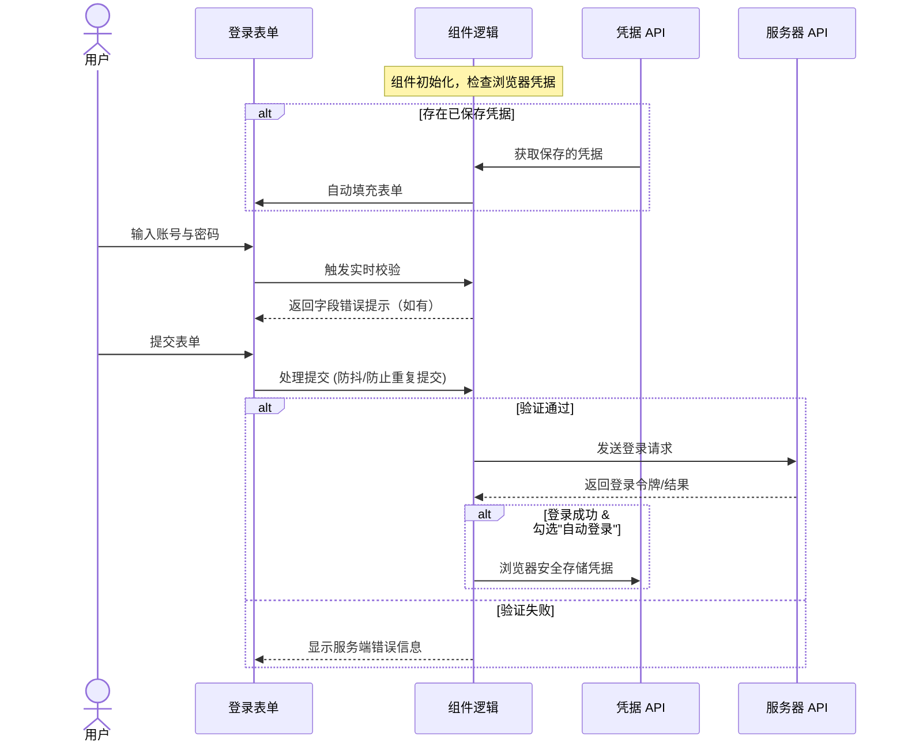

# 用户名/密码登录

用户名/密码登录作为**传统的身份验证方式**，为需要明确密码管理的用户提供了完整的登录体验。该模块集成了现代 Web 应用所需的所有关键功能，包括灵活的账号识别、安全的凭据管理以及无障碍设计。

## 适用群体与场景

### 🔐 适用用户群体

- **习惯密码管理：** 习惯使用浏览器或第三方密码管理器的用户。 
- **企业与组织：** 有统一密码策略和合规要求的企业环境。 
- **传统偏好：** 更信任或偏好传统密码登录方式的群体。

### 💼 特定应用场景

- **多账户切换：** 需要频繁切换和管理多个不同账户的环境。 
- **离线与兼容：** 希望在本地保存凭据，或需要兼容不支持新式免密登录的老旧系统。

## 推荐使用优先级

- 首选：[手机验证码登录](/docs/features/authentication/smscode/)——最便捷安全 
- 次选：[微信登录](/docs/features/authentication/wechat/)——移动端友好 
- 备选：用户名/密码登录——传统可靠，作为基础托底方案

## 交互流程



## 代码实现

```tsx
import { useEffect, useState } from 'react';
import { useForm } from 'react-hook-form';
import { zodResolver } from '@hookform/resolvers/zod';
import { z } from 'zod';
import { Eye, EyeOff } from 'lucide-react';

import {
  Form,
  FormControl,
  FormField,
  FormItem,
  FormLabel,
  FormMessage,
} from '@/components/ui/form';
import { Input } from '@/components/ui/input';
import { Button } from '@/components/ui/button';
import { Checkbox } from '@/components/ui/checkbox';

const loginSchema = z.object({
  username: z.string()
    .min(1, { message: '请输入邮箱或手机号' })
    .refine((value) => {
      const isEmail = /^[^\s@]+@[^\s@]+\.[^\s@]+$/.test(value);
      const isPhone = /^1[3-9]\d{9}$/.test(value);
      return isEmail || isPhone;
    }, { message: '请输入有效的邮箱或手机号' }),
  password: z.string()
    .min(6, { message: '密码至少 6 位' })
    .max(32, { message: '密码最多 32 位' }),
  remember: z.boolean().default(false),
});

type LoginFormData = z.infer<typeof loginSchema>;

function LoginForm() {
  const [showPassword, setShowPassword] = useState(false);

  const form = useForm<LoginFormData>({
    resolver: zodResolver(loginSchema),
    defaultValues: {
      username: '',
      password: '',
      remember: false,
    },
    mode: 'onTouched',
  });

  const {
    handleSubmit,
    control,
    setValue,
    formState: { isSubmitting },
  } = form;

  useEffect(() => {
    if ('credentials' in navigator) {
      navigator.credentials.get({ password: true, mediation: 'optional' })
        .then((cred) => {
          if (cred && 'password' in cred) {
            setValue('username', cred.id, { shouldValidate: true });
            setValue('password', cred.password, { shouldValidate: true });
            setValue('remember', true);
          }
        })
        .catch((err) => {
          console.error('自动读取凭据失败:', err);
        });
    }
  }, [setValue]);

  const onSubmit = async (values: LoginFormData) => {
    try {
      console.log('正在提交登录信息:', values);

      if (values.remember && 'credentials' in navigator) {
        const cred = new PasswordCredential({
          id: values.username,
          password: values.password,
        });
        await navigator.credentials.store(cred);
      }
    } catch (error) {
      console.error('登录失败:', error);
    }
  };

  const togglePasswordVisibility = () => {
    setShowPassword((prev) => !prev);
  };

  return (
    <div className="w-full max-w-md p-6 bg-white rounded-lg shadow-md">
      <h2 className="mb-6 text-2xl font-bold text-center">用户登录</h2>

      <Form {...form}>
        <form onSubmit={handleSubmit(onSubmit)} className="space-y-6">
          <FormField
            control={control}
            name="username"
            render={({ field }) => (
              <FormItem>
                <FormLabel>邮箱/手机号</FormLabel>
                <FormControl>
                  <Input
                    placeholder="请输入邮箱或手机号"
                    inputMode="email"
                    autoComplete="username"
                    {...field}
                  />
                </FormControl>
                <FormMessage />
              </FormItem>
            )}
          />

          <FormField
            control={control}
            name="password"
            render={({ field }) => (
              <FormItem>
                <FormLabel>密码</FormLabel>
                <FormControl>
                  <div className="relative">
                    <Input
                      type={showPassword ? 'text' : 'password'}
                      placeholder="请输入密码"
                      autoComplete="current-password"
                      {...field}
                    />
                    <button
                      type="button"
                      className="absolute inset-y-0 right-0 flex items-center pr-3 text-gray-500 hover:text-gray-700"
                      onClick={togglePasswordVisibility}
                      aria-label={showPassword ? '隐藏密码' : '显示密码'}
                    >
                      {showPassword ? <EyeOff size={16} /> : <Eye size={16} />}
                    </button>
                  </div>
                </FormControl>
                <FormMessage />
              </FormItem>
            )}
          />

          <FormField
            control={control}
            name="remember"
            render={({ field }) => (
              <FormItem className="flex flex-row items-start space-x-2 space-y-0">
                <FormControl>
                  <Checkbox
                    checked={field.value}
                    onCheckedChange={field.onChange}
                  />
                </FormControl>
                <div className="space-y-1 leading-none">
                  <FormLabel className="font-normal cursor-pointer">
                    自动登录
                  </FormLabel>
                </div>
              </FormItem>
            )}
          />

          <Button type="submit" className="w-full" disabled={isSubmitting}>
            {isSubmitting ? '登录中...' : '登录'}
          </Button>
        </form>
      </Form>
    </div>
  );
}

export default LoginForm;
```

## 体验与安全特性

为了提供企业级的产品体验，该模块在交互、安全和无障碍设计上进行了深度优化：

### 🎯 交互与表单校验

- **智能账号识别：** 单个输入框支持邮箱与手机号混输，底层通过正则自动判断格式并给出精准的错误提示。
- **实时且友好的反馈：** 采用“失去焦点校验 + 输入时消除错误”的策略，既防止打断用户输入，又能及时纠正错误。
- **密码可见性控制：** 提供一键明/暗文切换功能，切换后自动保持输入框焦点，操作连贯。

### 🛡️ 凭据管理与安全 (Credential API)

- **原生安全存储：** 利用浏览器的 `Credential Management API`（需 HTTPS 环境），在获取用户授权（勾选记住密码）后，安全地将凭据交由系统底层管理。
- **智能填充降级：** 页面初始化时自动检测已保存凭据。若浏览器不支持该 API，组件会优雅降级，依然可以依赖浏览器原生的 `<form>` 自动完成机制。
- **防重复提交：** 登录按钮在请求期间处于 `disabled` 状态，防止网络延迟导致的多重提交。

### ♿ 无障碍与移动端优化 (a11y)

- **移动端键盘适配：** 为用户名输入框指定 `inputMode="email"`，为密码框提供正确的 `autoComplete` 属性，直接唤起移动端最适合的虚拟键盘。
- **屏幕阅读器友好：** 全面支持 ARIA 属性（如 `aria-invalid`、`aria-label`、`role="alert"`），确保视障用户能准确获取表单状态和错误信息。
- **全键盘操作：** 所有交互元素（包括密码显示切换按钮）均可通过 Tab 键聚焦并使用键盘回车触发。
