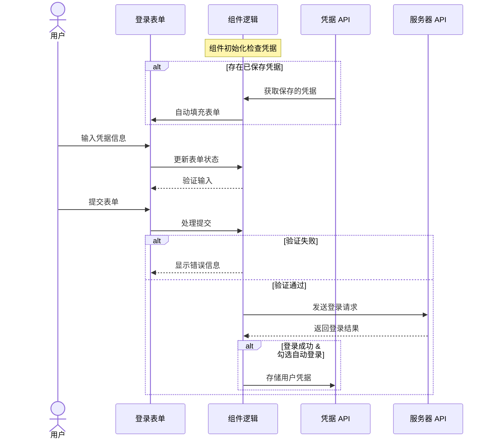

# 用户名/密码登录

用户名/密码登录实现，集成了现代 Web 应用所需的所有关键功能：

- 灵活的身份验证（支持邮箱和手机号）
- 增强的密码安全性与用户体验
- 智能的凭据管理与自动登录功能
- 完整的表单验证与错误处理
- 无障碍设计与移动设备优化

## 代码实现

```tsx
import React, { useState, useEffect, useRef } from 'react';
import { z } from 'zod';

// 定义验证规则
const loginSchema = z.object({
  username: z.string()
    .required('请输入邮箱或手机号')
    .refine(value => {
      const isEmail = /^[^\s@]+@[^\s@]+\.[^\s@]+$/.test(value);
      const isPhone = /^1[3-9]\d{9}$/.test(value);
      return isEmail || isPhone;
    }, {
      message: '请输入有效的邮箱或手机号'
    }),
  password: z.string()
    .required('请输入密码')
    .min(6, '密码至少 6 位')
    .max(32, '密码最多 32 位'),
  remember: z.boolean()
});

type LoginFormData = z.infer<typeof loginSchema>;

const LoginForm: React.FC = () => {
  const [formData, setFormData] = useState<LoginFormData>({
    username: '',
    password: '',
    remember: false
  });
  const [errors, setErrors] = useState<Partial<LoginFormData>>({});
  const [showPassword, setShowPassword] = useState(false);
  const [isSubmitting, setIsSubmitting] = useState(false);

  const passwordRef = useRef<HTMLInputElement>(null);

  const validateField = <K extends keyof LoginFormData>(
    field: K,
    value: LoginFormData[K]
  ) => {
    try {
      loginSchema.pick({ [field]: true }).parse({ [field]: value });
      setErrors(prev => ({ ...prev, [field]: '' }));
      return true;
    } catch (error) {
      if (error instanceof z.ZodError) {
        setErrors(prev => ({
          ...prev,
          [field]: error.errors[0].message
        }));
      }
      return false;
    }
  };

  const handleSubmit = async (e: React.FormEvent) => {
    e.preventDefault();

    try {
      loginSchema.parse(formData);
      setErrors({});
      setIsSubmitting(true);

      // 实际登录逻辑
      console.log('登录信息:', formData);

      // 使用 Credential Management API
      if (formData.remember && 'credentials' in navigator) {
        try {
          const cred = new PasswordCredential({
            id: formData.username,
            password: formData.password,
          });
          await navigator.credentials.store(cred);
        } catch (err) {
          console.error('保存凭据失败:', err);
        }
      }
    } catch (error) {
      if (error instanceof z.ZodError) {
        const newErrors: Partial<LoginFormData> = {};
        error.errors.forEach(err => {
          const field = err.path[0] as keyof LoginFormData;
          newErrors[field] = err.message;
        });
        setErrors(newErrors);
      }
    } finally {
      setIsSubmitting(false);
    }
  };

  const handleChange = (e: React.ChangeEvent<HTMLInputElement>) => {
    const { name, value, type, checked } = e.target;
    const fieldValue = type === 'checkbox' ? checked : value;

    setFormData(prev => ({
      ...prev,
      [name]: fieldValue
    }));

    // 清除当前字段的错误
    if (errors[name as keyof LoginFormData]) {
      validateField(name as keyof LoginFormData, fieldValue);
    }
  };

  const handleBlur = (e: React.FocusEvent<HTMLInputElement>) => {
    const { name, value, type, checked } = e.target;
    const fieldValue = type === 'checkbox' ? checked : value;
    validateField(name as keyof LoginFormData, fieldValue);
  };

  const togglePasswordVisibility = () => {
    setShowPassword(!showPassword);
    passwordRef.current?.focus();
  };

  // 自动登录尝试
  useEffect(() => {
    if (formData.remember && 'credentials' in navigator) {
      navigator.credentials.get({ password: true, mediation: 'optional' })
        .then(cred => {
          if (cred && 'password' in cred) {
            const autoLoginData = {
              username: cred.id,
              password: cred.password,
              remember: true
            };
            setFormData(autoLoginData);
            loginSchema.parseAsync(autoLoginData).catch(() => {});
          }
        })
        .catch(err => console.error('自动登录失败:', err));
    }
  }, [formData.remember]);

  return (
    <div className="login-container">
      <h2>用户登录</h2>
      <form onSubmit={handleSubmit}>
        <div className="form-group">
          <label htmlFor="username">邮箱/手机号</label>
          <input
            id="username"
            name="username"
            type="text"
            inputMode="email"
            autoComplete="username"
            value={formData.username}
            onChange={handleChange}
            onBlur={handleBlur}
            aria-invalid={!!errors.username}
          />
          {errors.username && <p className="error-message">{errors.username}</p>}
        </div>

        <div className="form-group">
          <label htmlFor="password">密码</label>
          <div className="password-input-wrapper">
            <input
              id="password"
              name="password"
              type={showPassword ? 'text' : 'password'}
              autoComplete="current-password"
              value={formData.password}
              onChange={handleChange}
              onBlur={handleBlur}
              ref={passwordRef}
              aria-invalid={!!errors.password}
            />
            <button
              type="button"
              onClick={togglePasswordVisibility}
              aria-label={showPassword ? '隐藏密码' : '显示密码'}
            >
              {showPassword ? '🙈' : '👁️'}
            </button>
          </div>
          {errors.password && <p className="error-message">{errors.password}</p>}
        </div>

        <div className="form-group">
          <label>
            <input
              type="checkbox"
              name="remember"
              checked={formData.remember}
              onChange={handleChange}
              onBlur={handleBlur}
            />
            自动登录
          </label>
        </div>

        <button type="submit" disabled={isSubmitting}>
          {isSubmitting ? '登录中...' : '登录'}
        </button>
      </form>
    </div>
  );
};

export default LoginForm;
```

## 交互流程



## 用户体验

### 核心特性详解

1. **多格式账号验证** - 智能识别并验证邮箱或手机号格式，提供精确的错误提示
2. **增强型密码字段** - 提供密码可见性切换，兼顾安全性与便捷性
3. **凭据管理集成** - 利用浏览器的 Credential Management API 安全存储用户凭据
4. **智能自动登录** - 检测到已保存凭据时自动填充并提交表单（可选）
5. **移动体验优化** - 针对触摸设备优化的输入控件和自适应布局

### 界面设计与交互

1. **实时反馈机制** - 字段验证在用户输入过程和失去焦点时触发，及时提供反馈而不打断用户体验
2. **状态可视化** - 登录按钮状态变化反映表单提交过程，防止重复提交
3. **密码可见性切换** - 允许用户在输入时查看密码，减少输入错误，同时保持安全性
4. **焦点管理** - 切换密码可见性后保持输入焦点，提供流畅的键盘操作体验

### 错误处理与用户反馈

1. **精确的错误提示** - 错误消息直接附加在相关字段下方，清晰指出问题所在
2. **智能验证策略** - 用户名字段既支持邮箱也支持手机号，错误消息根据实际情况调整
3. **防御性设计** - 处理 API 不可用或浏览器兼容性问题时优雅降级，确保核心功能可用
4. **表单状态保持** - 验证失败后保留用户输入，减少重新填写的麻烦
5. **安全考量** - 错误消息设计平衡了信息详尽性和安全性，避免泄露系统信息

### 可访问性与包容性设计

1. **ARIA 属性支持** - 使用 `aria-invalid` 和 `aria-label` 标记表单控件状态，优化屏幕阅读器体验
2. **键盘可访问性** - 所有交互元素可通过键盘完全操作，包括密码可见性切换
3. **标签关联** - 每个输入字段都有明确关联的标签，提高表单清晰度
4. **颜色对比度** - 错误信息和交互元素使用符合 WCAG 标准的颜色对比度
5. **响应式文本** - 允许文本缩放而不破坏布局，适应视力障碍用户需求

### 移动设备优化

1. **触摸友好设计** - 输入控件和按钮尺寸适合触摸操作，减少误触机会
2. **适当的输入类型** - 为用户名字段指定 `inputMode="email"` 优化虚拟键盘布局
3. **自动完成支持** - 使用适当的 `autoComplete` 属性便于移动设备填充凭据
4. **响应式布局** - 表单元素在小屏幕上自动调整布局，保持可用性
5. **减少重定向** - 结合凭据管理 API 减少移动设备上的重复登录，提升体验

### 性能与安全考量

1. **轻量级验证** - 客户端验证即时响应，减少服务器往返
2. **节流与防抖** - 优化实时验证触发频率，避免性能问题
3. **渐进式增强** - 凭据管理 API 作为增强功能提供，不影响核心登录功能
4. **状态管理优化** - 使用精确的状态更新减少不必要的渲染
5. **隐私保护** - "记住我" 功能默认关闭，明确获得用户授权后再存储凭据

## 凭据 API 集成说明

本组件利用了浏览器的 Credential Management API 进行安全的用户凭据管理：

- **自动填充** - 组件初始化时检测并获取已保存的凭据
- **安全存储** - 成功登录后，根据用户选择安全保存凭据
- **隐私控制** - 用户可通过自动登录复选框控制凭据管理行为
- **兼容性处理** - 包含 API 可用性检测，在不支持的浏览器中优雅降级

### 实施注意事项

- Credential Management API 仅在 HTTPS 环境下可用
- 确保在生产环境中实现真实的后端认证逻辑
- 可根据项目 UI 规范调整组件样式
- 考虑添加更多安全措施如限制登录尝试次数、双因素认证等
