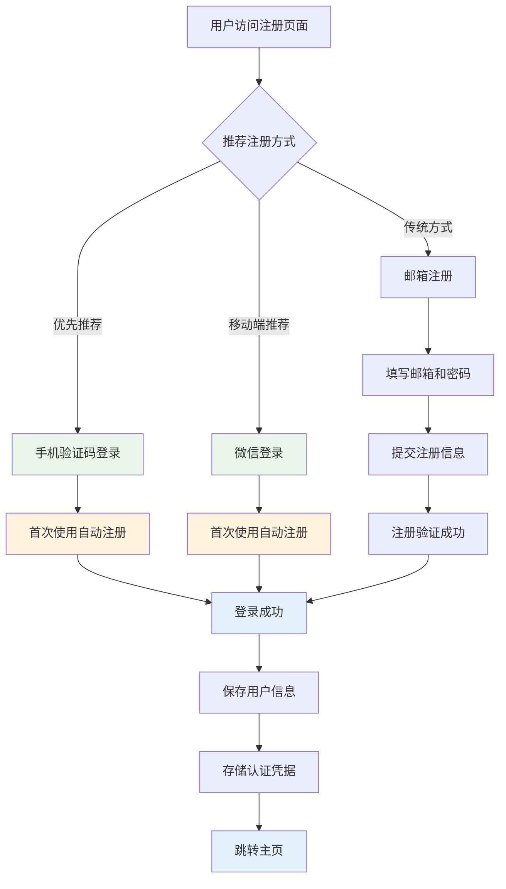
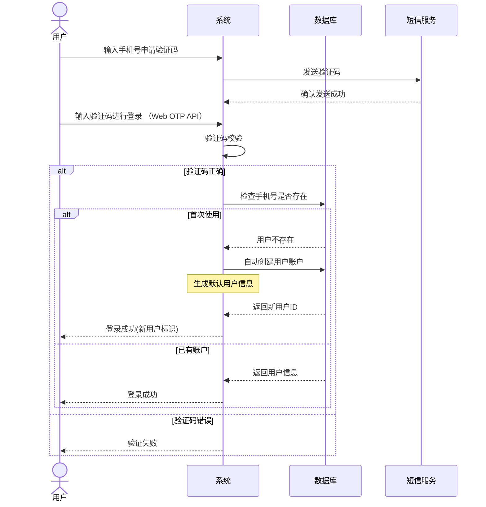
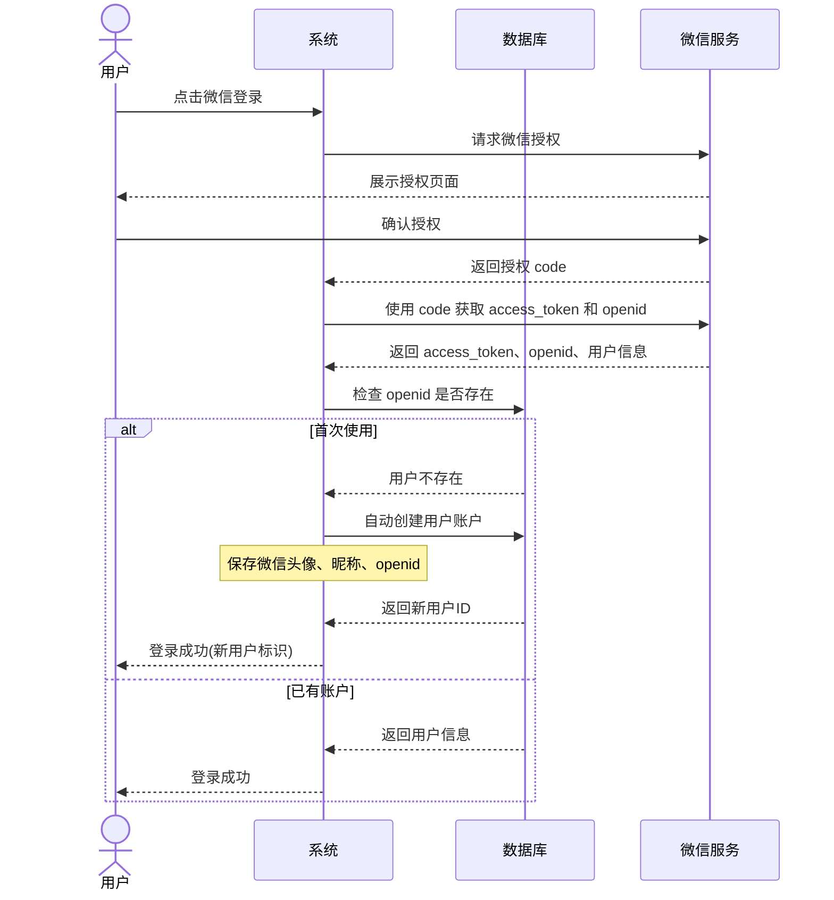
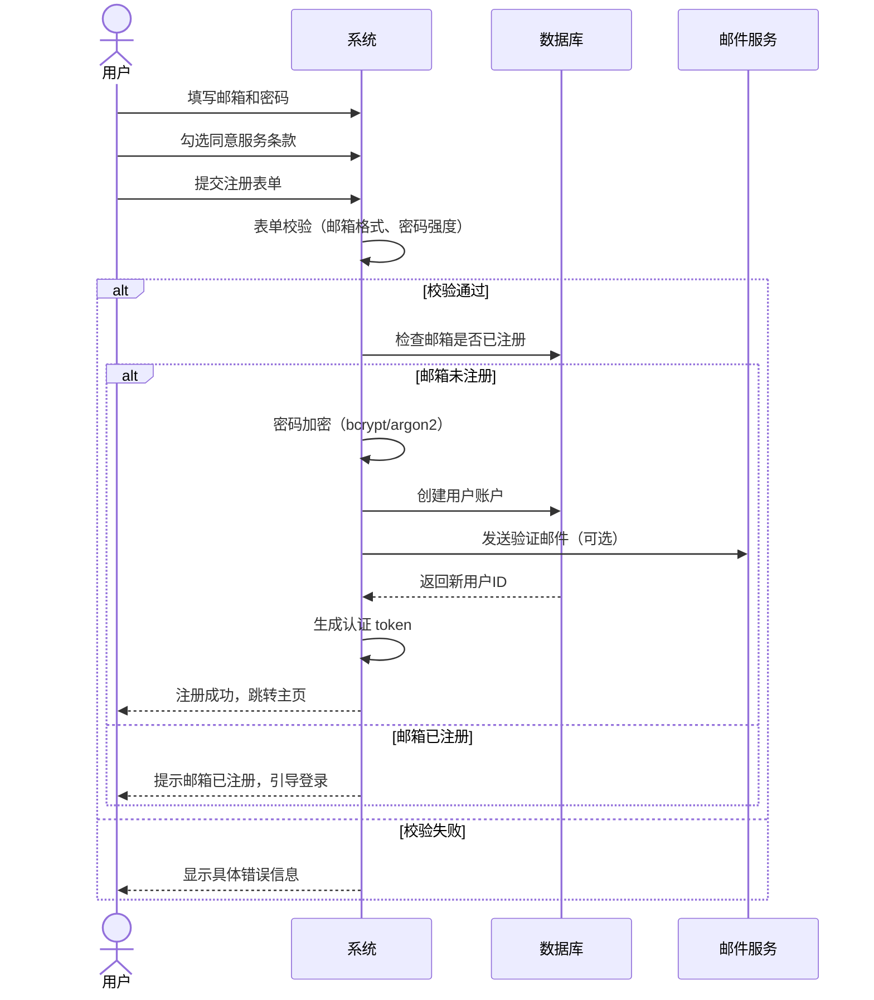

# 用户注册

用户注册系统采用**自动注册优先**的策略，提供最便捷的注册体验。系统支持手机验证码登录和微信登录时的自动账户创建，同时保留传统邮箱注册作为备选方案。

## 核心策略

### 🎯 自动注册（优先）

- **手机验证码登录**：首次使用自动创建账户，无需额外注册步骤
- **微信登录**：一键登录并自动创建账户，获取微信头像和昵称
- **无缝体验**：无需区分登录和注册，系统智能处理

### 📧 邮箱注册（备选）

- **传统方式**：为需要明确密码管理的用户提供邮箱注册选项
- **极简表单**：遵循 Web 最佳实践，摒弃冗余的确认密码字段
- **完整功能**：支持智能表单验证、密码强度实时检测、凭据自动保存等完整功能

## 推荐注册流程

### 1. 手机验证码登录（推荐）

- ✅ 无需记忆密码
- ✅ 验证码直接登录（支持 `autocomplete="one-time-code"` 自动读取） 
- ✅ 首次使用自动创建账户
- ✅ 快速便捷，适合所有用户

### 2. 微信登录（移动端推荐）

- ✅ 一键授权登录
- ✅ 自动获取头像昵称
- ✅ 首次使用自动创建账户
- ✅ 适合微信生态用户

### 3. 邮箱注册（传统方式）

- 📝 需要设置和记忆密码
- 📝 适合需要明确账户管理的用户
- 📝 遵循最佳实践的高转化率表单设计

## 交互流程设计



## 自动注册数据流程

### 手机验证码登录自动注册



### 微信登录自动注册



### 邮箱注册流程（备选）



## 邮箱注册代码实现

```tsx
import { useMemo, useState } from 'react';
import { useForm } from 'react-hook-form';
import { zodResolver } from '@hookform/resolvers/zod';
import { z } from 'zod';
import PasswordStrength from 'tai-password-strength';
import { cva, type VariantProps } from 'class-variance-authority';
import { Eye, EyeOff } from 'lucide-react';

import { Button } from '@/components/ui/button';
import { Checkbox } from '@/components/ui/checkbox';
import {
  Form,
  FormControl,
  FormField,
  FormItem,
  FormLabel,
  FormMessage,
} from '@/components/ui/form';
import { Input } from '@/components/ui/input';
import { cn } from '@/lib/utils';

// 优化：移除了冗余的 confirmPassword 字段验证
const registrationSchema = z.object({
  email: z.string().email('请输入有效的邮箱地址'),
  password: z
    .string()
    .min(6, '密码至少 6 位')
    .max(32, '密码最多 32 位')
    .refine(
      (password) => {
        const passwordStrength = new PasswordStrength();
        const result = passwordStrength.check(password);

        return (
          result.strengthCode !== 'WEAK' && result.strengthCode !== 'VERY_WEAK'
        );
      },
      { message: '密码强度过弱，请增加大小写字母、数字或符号' },
    ),

  agreeTerms: z.boolean().refine((val) => val === true, {
    message: '请同意服务条款和隐私政策',
  }),
});

type RegistrationData = z.infer<typeof registrationSchema>;

const strengthBarVariants = cva(
  'h-full transition-all duration-300 ease-in-out',
  {
    variants: {
      strength: {
        none: 'w-0 bg-gray-200',
        weak: 'w-1/3 bg-red-500',
        medium: 'w-2/3 bg-amber-500',
        strong: 'w-full bg-emerald-500',
      },
    },
    defaultVariants: {
      strength: 'none',
    },
  },
);

const strengthTextVariants = cva('text-xs font-medium', {
  variants: {
    strength: {
      none: 'text-gray-400',
      weak: 'text-red-500',
      medium: 'text-amber-500',
      strong: 'text-emerald-500',
    },
  },
  defaultVariants: {
    strength: 'none',
  },
});

type StrengthKey = VariantProps<typeof strengthBarVariants>['strength'];

const STRENGTH_LABELS: Record<Exclude<StrengthKey, null>, string> = {
  none: '',
  weak: '弱',
  medium: '中',
  strong: '强',
};

const getPasswordStrengthKey = (password: string): StrengthKey => {
  if (!password) return 'none';

  const tester = new PasswordStrength();
  const result = tester.check(password);

  switch (result.strengthCode) {
    case 'VERY_STRONG':
    case 'STRONG':
      return 'strong';
    case 'REASONABLE':
      return 'medium';
    case 'WEAK':
    case 'VERY_WEAK':
    default:
      return 'weak';
  }
};

function RegistrationForm() {
  const [showPassword, setShowPassword] = useState(false);
  const [isSubmitting, setIsSubmitting] = useState(false);

  const form = useForm<RegistrationData>({
    resolver: zodResolver(registrationSchema),
    defaultValues: {
      email: '',
      password: '',
      agreeTerms: false,
    },
  });

  const watchPassword = form.watch('password');
  const strengthKey = useMemo(
    () => getPasswordStrengthKey(watchPassword),
    [watchPassword],
  );

  const handleSubmitSuccess = async (data: RegistrationData) => {
    // 最佳实践：利用 Credential Management API 自动保存凭据
    if ('credentials' in navigator) {
      try {
        const cred = new PasswordCredential({
          id: data.email,
          password: data.password,
        });
        await navigator.credentials.store(cred);
      } catch (err) {
        console.error('保存凭据失败:', err);
      }
    }
  };

  const onSubmit = async (data: RegistrationData) => {
    setIsSubmitting(true);
    try {
      const response = await fetch('/api/auth/register', {
        method: 'POST',
        headers: { 'Content-Type': 'application/json' },
        body: JSON.stringify({
          method: 'email',
          source: 'web',
          ...data,
        }),
      });

      if (!response.ok) {
        throw new Error('注册失败');
      }

      const result = await response.json();

      if (result.success) {
        await handleSubmitSuccess(data);
        localStorage.setItem('auth_token', result.token);
        window.location.href = '/dashboard?welcome=true';
      } else {
        throw new Error(result.message || '注册失败');
      }
    } catch (error: any) {
      console.error('注册错误:', error);
      form.setError('root', {
        message: error.message || '注册失败，请重试',
      });
    } finally {
      setIsSubmitting(false);
    }
  };

  return (
    <div className="w-full max-w-md mx-auto p-6 space-y-8 bg-white rounded-xl shadow-md">
      <div className="text-center">
        <h2 className="text-2xl font-bold tracking-tight text-gray-900">邮箱注册</h2>
        <p className="mt-2 text-sm text-gray-600">创建账户</p>
      </div>

      <Form {...form}>
        <form onSubmit={form.handleSubmit(onSubmit)} className="space-y-6">
          <FormField
            control={form.control}
            name="email"
            render={({ field }) => (
              <FormItem>
                <FormLabel>邮箱地址</FormLabel>
                <FormControl>
                  <Input
                    placeholder="请输入邮箱地址"
                    type="email"
                    autoComplete="username email" // 最佳实践：明确 username 和 email
                    {...field}
                  />
                </FormControl>
                <FormMessage />
              </FormItem>
            )}
          />

          <FormField
            control={form.control}
            name="password"
            render={({ field }) => (
              <FormItem>
                <FormLabel>登录密码</FormLabel>
                <FormControl>
                  <div className="relative">
                    <Input
                      type={showPassword ? 'text' : 'password'}
                      placeholder="请设置登录密码"
                      autoComplete="new-password" // 最佳实践：通知浏览器这是新密码，触发强密码生成
                      className="pr-10"
                      {...field}
                    />
                    <button
                      type="button"
                      className="absolute inset-y-0 right-0 px-3 flex items-center text-gray-500 hover:text-gray-700"
                      onClick={() => setShowPassword(!showPassword)}
                      aria-label={showPassword ? '隐藏密码' : '显示密码'}
                    >
                      {showPassword ? (
                        <EyeOff className="h-4 w-4" />
                      ) : (
                        <Eye className="h-4 w-4" />
                      )}
                    </button>
                  </div>
                </FormControl>

                {/* 最佳实践：前置显示密码规则，而不是等用户提交才报错 */}
                {!watchPassword && (
                  <p className="text-xs text-gray-500 mt-2">
                    密码需至少 6 位，建议混合使用字母、数字和符号。
                  </p>
                )}

                {watchPassword && (
                  <div className="mt-2 flex items-center gap-2">
                    <div className="h-1.5 flex-1 bg-gray-200 rounded-full overflow-hidden">
                      <div
                        className={cn(
                          strengthBarVariants({ strength: strengthKey }),
                        )}
                      />
                    </div>
                    <span
                      className={cn(strengthTextVariants({ strength: strengthKey }))}
                    >
                      {strengthKey ? STRENGTH_LABELS[strengthKey] : ''}
                    </span>
                  </div>
                )}
                <FormMessage />
              </FormItem>
            )}
          />

          {/* 移除确认密码字段，通过"显示密码"功能替代，减少用户摩擦 */}

          <FormField
            control={form.control}
            name="agreeTerms"
            render={({ field }) => (
              <FormItem className="flex flex-row items-start space-x-3 space-y-0 rounded-md border p-4 shadow-sm">
                <FormControl>
                  <Checkbox
                    checked={field.value}
                    onCheckedChange={field.onChange}
                  />
                </FormControl>
                <div className="space-y-1 leading-none">
                  <FormLabel className="font-normal text-sm text-gray-600">
                    已阅读并同意{' '}
                    <a href="/terms" className="text-blue-600 hover:underline">
                      服务条款
                    </a>{' '}
                    和{' '}
                    <a href="/privacy" className="text-blue-600 hover:underline">
                      隐私政策
                    </a>
                  </FormLabel>
                  <FormMessage />
                </div>
              </FormItem>
            )}
          />

          {form.formState.errors.root && (
            <div className="text-sm font-medium text-red-500 text-center">
              {form.formState.errors.root.message}
            </div>
          )}

          <Button
            type="submit"
            className="w-full"
            disabled={isSubmitting}
          >
            {isSubmitting ? '注册中...' : '立即注册'}
          </Button>
        </form>
      </Form>

      <div className="text-center text-sm text-gray-600 mt-6">
        已有账户？{' '}
        <a href="/auth/login" className="font-medium text-blue-600 hover:underline">
          立即登录
        </a>
      </div>
    </div>
  );
}

export default RegistrationForm;
```

## 落地指南与综合策略

为确保系统高效、安全且用户友好，在实施过程中请遵循以下综合策略：

### 1. 核心交互策略

- **优先级原则**：首屏优先推荐手机/微信自动注册，大幅降低门槛。
- **渐进式引导**：遵循"最小化起步"策略，初始只获取必要信息，利用价值驱动适时引导完善资料。
- **一致性体验**：无论采用哪种注册方式，后续的登录、主页跳转和用户画像逻辑需完全统一。

### 2. 前端表单最佳实践（基于 Web.dev 规范）

- **移除"确认密码"**：摒弃传统的确认密码输入框，通过提供"显示密码（Show password）"切换按钮，在保障正确率的同时减少 50% 的输入负担。
- **前置规则提示**：不要等到点击"提交"才提示错误，应在密码输入框下方提前写明密码规则（如长度、字符要求）。
- **完善的 Autocomplete 支持**：
  - 邮箱使用 `autocomplete="username email"`
  - 新密码使用 `autocomplete="new-password"` 以唤起内置密码生成器
  - 手机验证码输入框使用 `autocomplete="one-time-code" inputmode="numeric"`，支持 iOS/Android 自动提取短信验证码
- **身份凭证 API**：通过集成 Credential Management API，在注册成功后自动提示浏览器保存密码，为下次顺滑登录铺路。

### 3. 技术与安全性指南

- **密码安全管理**：集成 `tai-password-strength`，通过进度条和颜色实现实时反馈，弱密码严禁提交。支持客户端预校验与服务端逻辑校验，双重保障。
- **数据合规与合规性**：遵循最小化收集原则，确保隐私政策透明。提供完整的用户信息删除、绑定管理与撤销授权接口。
- **性能监控**：实时追踪各注册方式的转化漏斗，分析用户偏好。监控接口响应时间与自动注册成功率，异常情况自动触发邮箱注册降级。

### 4. 持续优化建议

- **场景智能化**：根据设备（移动端/PC端）智能切换推荐的注册方式。
- **数据驱动改进**：定期分析转化率，识别注册流失点（如表单填写耗时、验证码失败率等），持续迭代 UI 交互。
- **用户信任构建**：在自动注册环节做好充分的权限说明，明确信息的使用范围与安全保障措施。
