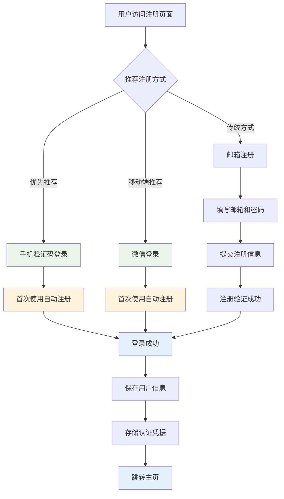
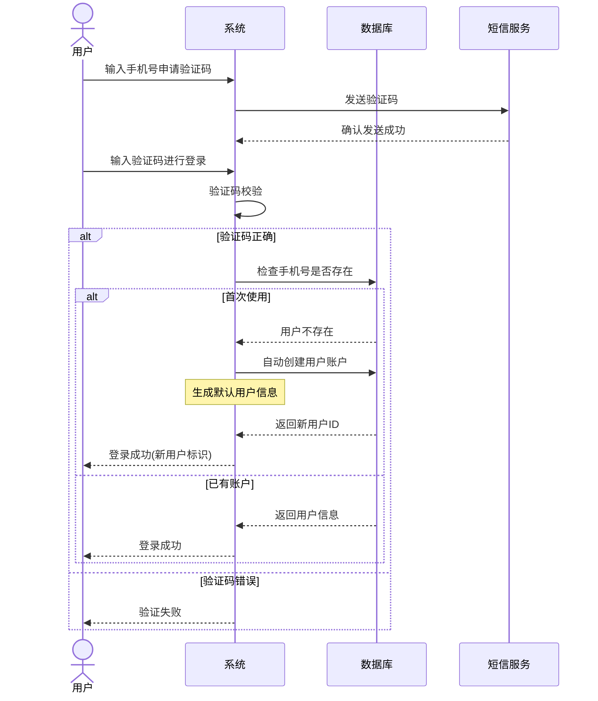
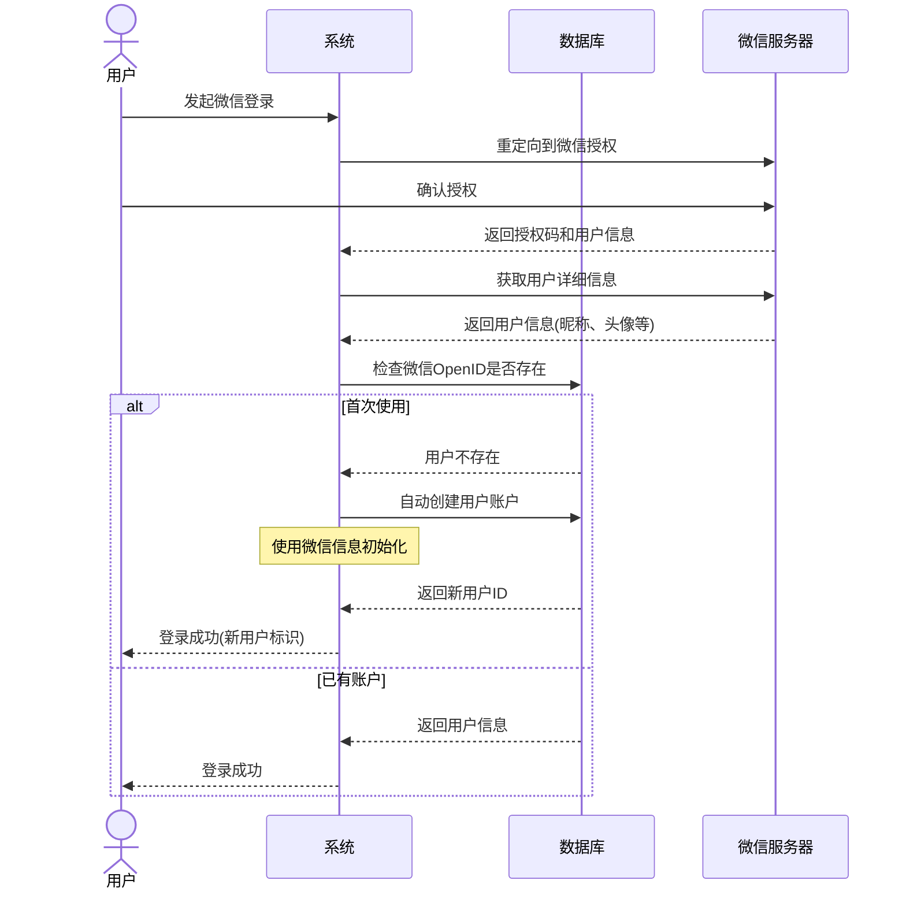
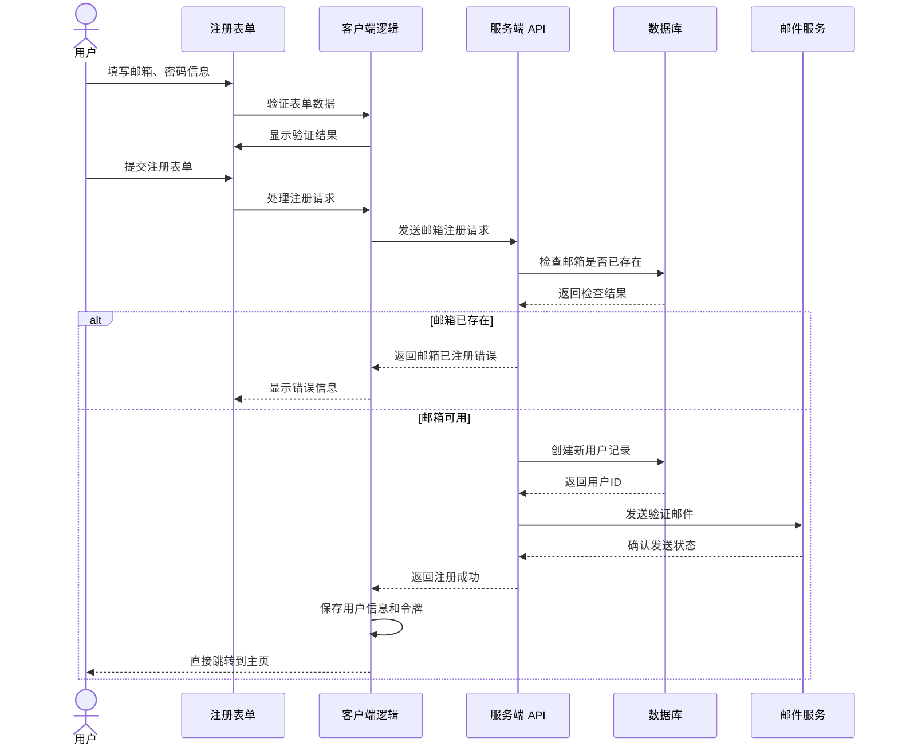

# 用户注册

用户注册系统采用**自动注册优先**的策略，为用户提供最便捷的注册体验。系统支持手机验证码登录和微信登录时的自动账户创建，同时保留传统邮箱注册作为备选方案。

## 核心策略

### 🎯 自动注册（优先）

- **手机验证码登录** - 首次使用自动创建账户，无需额外注册步骤
- **微信登录** - 一键登录并自动创建账户，获取微信头像和昵称
- **无缝体验** - 用户无需区分登录和注册，系统智能处理

### 📧 邮箱注册（备选）

- **传统方式** - 为需要明确密码管理的用户提供邮箱注册选项
- **完整功能** - 支持智能表单验证、密码强度检测等完整功能

## 推荐注册流程

### 1. 手机验证码登录（推荐）

- ✅ 无需记忆密码
- ✅ 验证码直接登录
- ✅ 首次使用自动创建账户
- ✅ 快速便捷，适合所有用户

### 2. 微信登录（移动端推荐）

- ✅ 一键授权登录
- ✅ 自动获取头像昵称
- ✅ 首次使用自动创建账户
- ✅ 适合微信生态用户

### 3. 邮箱注册（传统方式）

- 📝 需要设置和记忆密码
- 📝 适合需要明确账户管理的用户
- 📝 提供完整的表单验证体验

## 交互流程设计



## 自动注册数据流程

### 手机验证码登录自动注册



### 微信登录自动注册



### 邮箱注册流程（备选）



## 邮箱注册代码实现

```tsx
import React, { useState, useRef } from 'react';
import { z } from 'zod';
import PasswordStrength from 'tai-password-strength';

// 密码强度类型定义
type PasswordStrength = 'weak' | 'medium' | 'strong';

interface PasswordStrengthResult {
  strength: PasswordStrength;
  score: number;
  feedback: string[];
  isValid: boolean;
}

// 定义验证规则
const registrationSchema = z.object({
  email: z.string().email('请输入有效的邮箱地址'),
  password: z.string()
    .min(6, '密码至少 6 位')
    .max(32, '密码最多 32 位')
    .refine((password) => {
      const passwordStrength = new PasswordStrength();
      const result = passwordStrength.check(password);
      return result.strengthCode !== 'WEAK' && result.strengthCode !== 'VERY_WEAK';
    }, {
      message: '密码强度过弱，请设置更复杂的密码'
    }),
  confirmPassword: z.string(),
  nickname: z.string().min(2, '昵称至少 2 位').max(20, '昵称最多 20 位').optional(),
  agreeTerms: z.boolean().refine(val => val === true, {
    message: '请同意服务条款和隐私政策'
  })
}).refine(data => {
  return data.password === data.confirmPassword;
}, {
  message: '两次输入的密码不一致',
  path: ['confirmPassword']
});

type RegistrationData = z.infer<typeof registrationSchema>;

const RegistrationForm: React.FC = () => {
  const [formData, setFormData] = useState<RegistrationData>({
    email: '',
    password: '',
    confirmPassword: '',
    nickname: '',
    agreeTerms: false
  });
  
  const [errors, setErrors] = useState<Partial<Record<keyof RegistrationData, string>>>({});
  const [showPassword, setShowPassword] = useState(false);
  const [showConfirmPassword, setShowConfirmPassword] = useState(false);
  const [isSubmitting, setIsSubmitting] = useState(false);
  const [passwordStrength, setPasswordStrength] = useState<PasswordStrengthResult | null>(null);
  
  const passwordRef = useRef<HTMLInputElement>(null);

  // 检查密码强度
  const checkPasswordStrengthLevel = (password: string): PasswordStrengthResult => {
    if (!password) {
      return {
        strength: 'weak',
        score: 0,
        feedback: ['请输入密码'],
        isValid: false
      };
    }

    const passwordStrength = new PasswordStrength();
    const result = passwordStrength.check(password);
    
    let strength: PasswordStrength = 'weak';
    let score = 0;
    let isValid = false;
    
    // 只根据 tai-password-strength 的 strengthCode 确定等级
    switch (result.strengthCode) {
      case 'VERY_STRONG':
      case 'STRONG':
        strength = 'strong';
        score = 90;
        isValid = true;
        break;
      case 'REASONABLE':
        strength = 'medium';
        score = 65;
        isValid = true;
        break;
      case 'WEAK':
      case 'VERY_WEAK':
      default:
        strength = 'weak';
        score = 30;
        isValid = false;
        break;
    }

    return {
      strength,
      score,
      feedback: [],
      isValid
    };
  };

  const validateField = <K extends keyof RegistrationData>(
    field: K,
    value: RegistrationData[K]
  ) => {
    try {
      registrationSchema.pick({ [field]: true }).parse({ [field]: value });
      setErrors(prev => ({ ...prev, [field]: '' }));
      return true;
    } catch (error) {
      if (error instanceof z.ZodError) {
        setErrors(prev => ({
          ...prev,
          [field]: error.errors[0].message
        }));
      }
      return false;
    }
  };

  const handleInputChange = (e: React.ChangeEvent<HTMLInputElement>) => {
    const { name, value, type, checked } = e.target;
    const fieldValue = type === 'checkbox' ? checked : value;
    
    setFormData(prev => ({
      ...prev,
      [name]: fieldValue
    }));
    
    // 如果是密码字段，检查密码强度
    if (name === 'password' && typeof fieldValue === 'string') {
      const strengthResult = checkPasswordStrengthLevel(fieldValue);
      setPasswordStrength(strengthResult);
    }
    
    if (errors[name as keyof RegistrationData]) {
      validateField(name as keyof RegistrationData, fieldValue);
    }
  };

  const handleBlur = (e: React.FocusEvent<HTMLInputElement>) => {
    const { name, value, type, checked } = e.target;
    const fieldValue = type === 'checkbox' ? checked : value;
    validateField(name as keyof RegistrationData, fieldValue);
  };

  const handleRegistration = async (e: React.FormEvent) => {
    e.preventDefault();
    
    // 检查密码强度
    if (passwordStrength && !passwordStrength.isValid) {
      setErrors(prev => ({
        ...prev,
        password: '密码强度不足，无法注册'
      }));
      return;
    }
    
    try {
      registrationSchema.parse(formData);
      setErrors({});
      setIsSubmitting(true);
      
      const response = await fetch('/api/auth/register', {
        method: 'POST',
        headers: { 'Content-Type': 'application/json' },
        body: JSON.stringify({
          method: 'email',
          ...formData,
          passwordStrength: passwordStrength ? {
            strengthCode: new PasswordStrength().check(formData.password).strengthCode
          } : null,
          source: 'web'
        })
      });

      if (!response.ok) throw new Error('注册失败');

      const result = await response.json();
      
      if (result.success) {
        // 注册成功，保存凭据
        if ('credentials' in navigator) {
          try {
            const cred = new PasswordCredential({
              id: formData.email,
              password: formData.password,
              name: formData.nickname || '新用户'
            });
            await navigator.credentials.store(cred);
          } catch (err) {
            console.error('保存凭据失败:', err);
          }
        }

        // 保存用户信息和令牌
        localStorage.setItem('auth_token', result.token);
        localStorage.setItem('user_info', JSON.stringify({
          userId: result.userId,
          email: formData.email,
          nickname: formData.nickname,
          isNewUser: true,
          registrationTime: new Date().toISOString()
        }));

        // 跳转到主页
        window.location.href = '/dashboard?welcome=true';
      } else {
        throw new Error(result.message || '注册失败');
      }
    } catch (error) {
      if (error instanceof z.ZodError) {
        const newErrors: Partial<Record<keyof RegistrationData, string>> = {};
        error.errors.forEach(err => {
          const field = err.path[0] as keyof RegistrationData;
          newErrors[field] = err.message;
        });
        setErrors(newErrors);
      } else {
        console.error('注册失败:', error);
        setErrors({ email: error.message || '注册失败，请重试' });
      }
    } finally {
      setIsSubmitting(false);
    }
  };

  // 获取密码强度样式类名
  const getStrengthClassName = () => {
    if (!passwordStrength) return '';
    return `strength-${passwordStrength.strength}`;
  };

  // 获取密码强度文本
  const getStrengthText = () => {
    if (!passwordStrength) return '';
    switch (passwordStrength.strength) {
      case 'weak':
        return '弱';
      case 'medium':
        return '中';
      case 'strong':
        return '强';
      default:
        return '';
    }
  };

  return (
    <div className="registration-container">
      <h2>邮箱注册</h2>
      <p className="subtitle">创建您的账户</p>
      
      <form onSubmit={handleRegistration}>
        <div className="form-group">
          <label htmlFor="email">邮箱地址</label>
          <input
            id="email"
            name="email"
            type="email"
            autoComplete="email"
            placeholder="请输入邮箱地址"
            value={formData.email}
            onChange={handleInputChange}
            onBlur={handleBlur}
            aria-invalid={!!errors.email}
          />
          {errors.email && <p className="error-message">{errors.email}</p>}
        </div>
        
        <div className="form-group">
          <label htmlFor="password">登录密码</label>
          <div className="password-input-wrapper">
            <input
              id="password"
              name="password"
              type={showPassword ? 'text' : 'password'}
              autoComplete="new-password"
              placeholder="请设置登录密码"
              value={formData.password}
              onChange={handleInputChange}
              onBlur={handleBlur}
              ref={passwordRef}
              aria-invalid={!!errors.password}
            />
            <button
              type="button"
              onClick={() => setShowPassword(!showPassword)}
              aria-label={showPassword ? '隐藏密码' : '显示密码'}
            >
              {showPassword ? '🙈' : '👁️'}
            </button>
          </div>
          
          {/* 密码强度指示器 */}
          {formData.password && passwordStrength && (
            <div className="password-strength-indicator">
              <div className="strength-meter">
                <div className="strength-bar">
                  <div 
                    className={`strength-fill ${getStrengthClassName()}`}
                    style={{ width: `${passwordStrength.score}%` }}
                  ></div>
                </div>
                <span className={`strength-text ${getStrengthClassName()}`}>
                  密码强度: {getStrengthText()}
                </span>
              </div>
              
              {/* 密码强度反馈 */}
              {passwordStrength.feedback.length > 0 && (
                <div className="strength-feedback">
                  {passwordStrength.feedback.map((feedback, index) => (
                    <p 
                      key={index} 
                      className={`feedback-item ${passwordStrength.strength === 'strong' ? 'success' : 'warning'}`}
                    >
                      {passwordStrength.strength === 'strong' ? '✓' : '•'} {feedback}
                    </p>
                  ))}
                </div>
              )}
            </div>
          )}
          
          {errors.password && <p className="error-message">{errors.password}</p>}
        </div>
        
        <div className="form-group">
          <label htmlFor="confirmPassword">确认密码</label>
          <div className="password-input-wrapper">
            <input
              id="confirmPassword"
              name="confirmPassword"
              type={showConfirmPassword ? 'text' : 'password'}
              autoComplete="new-password"
              placeholder="请再次输入密码"
              value={formData.confirmPassword}
              onChange={handleInputChange}
              onBlur={handleBlur}
              aria-invalid={!!errors.confirmPassword}
            />
            <button
              type="button"
              onClick={() => setShowConfirmPassword(!showConfirmPassword)}
              aria-label={showConfirmPassword ? '隐藏密码' : '显示密码'}
            >
              {showConfirmPassword ? '🙈' : '👁️'}
            </button>
          </div>
          {errors.confirmPassword && <p className="error-message">{errors.confirmPassword}</p>}
        </div>
        
        <div className="form-group">
          <label htmlFor="nickname">用户昵称（可选）</label>
          <input
            id="nickname"
            name="nickname"
            type="text"
            autoComplete="nickname"
            placeholder="请输入昵称"
            value={formData.nickname}
            onChange={handleInputChange}
            onBlur={handleBlur}
            aria-invalid={!!errors.nickname}
          />
          {errors.nickname && <p className="error-message">{errors.nickname}</p>}
        </div>
        
        <div className="form-group">
          <label>
            <input
              type="checkbox"
              name="agreeTerms"
              checked={formData.agreeTerms}
              onChange={handleInputChange}
              onBlur={handleBlur}
            />
            我已阅读并同意 
            <a href="/terms" target="_blank">服务条款</a> 和 
            <a href="/privacy" target="_blank">隐私政策</a>
          </label>
          {errors.agreeTerms && <p className="error-message">{errors.agreeTerms}</p>}
        </div>
        
        <button 
          type="submit" 
          disabled={isSubmitting || (passwordStrength && !passwordStrength.isValid)}
          className={passwordStrength && !passwordStrength.isValid ? 'disabled-weak-password' : ''}
        >
          {isSubmitting ? '注册中...' : 
           passwordStrength && !passwordStrength.isValid ? '密码强度不足' : '立即注册'}
        </button>
      </form>
      
      <div className="login-prompt">
        <p>已有账户？<a href="/auth/login">立即登录</a></p>
      </div>
      
      <div className="other-methods">
        <p>您还可以选择：</p>
        <div className="method-links">
          <a href="/auth/sms">手机验证码登录</a>
          <span>•</span>
          <a href="/auth/wechat">微信登录</a>
        </div>
        <p className="auto-register-note">
          📱 手机验证码登录和微信登录会自动为您创建账户
        </p>
      </div>
      
      {/* 密码强度样式说明
      - .password-strength-indicator: 密码强度指示器容器
      - .strength-meter: 进度条容器
      - .strength-bar: 进度条背景，灰色 #e5e7eb
      - .strength-fill: 进度条填充，根据强度显示不同颜色
        - .strength-weak: 红色 #ef4444
        - .strength-medium: 橙色 #f59e0b 
        - .strength-strong: 绿色 #10b981
      - .strength-text: 强度文本，颜色与进度条一致
      - .strength-feedback: 反馈信息容器
      - .feedback-item: 反馈项目样式
        - .success: 成功状态 绿色 #10b981
        - .warning: 警告状态 橙色 #f59e0b
      - .disabled-weak-password: 弱密码时按钮禁用样式，灰色背景 #f3f4f6
      */}
    </div>
  );
};

export default RegistrationForm;
```

## 落地指南与综合策略

为确保系统高效、安全且用户友好，在实施过程中请遵循以下综合策略：

### 1. 核心交互策略

- **优先级原则：** 首屏优先推荐手机/微信自动注册，大幅降低门槛。
- **渐进式引导：** 遵循“最小化起步”策略，初始只获取必要信息，利用价值驱动适时引导完善资料。
- **一致性体验：** 无论采用哪种注册方式，后续的登录、主页跳转和用户画像逻辑需完全统一。

### 2. 技术与安全性指南

- **密码安全管理：** 
  - 集成 `tai-password-strength`，通过进度条和颜色实现实时反馈，弱密码严禁提交。 
  - 同时支持客户端预校验与服务端逻辑校验，双重保障。
- **数据合规与合规性：** 
  - 遵循最小化收集原则，确保隐私政策透明。 
  - 提供完整的用户信息删除、绑定管理与撤销授权接口。
- **性能监控：** 
  - 实时追踪各注册方式的转化漏斗，分析用户偏好。 
  - 监控接口响应时间与自动注册成功率，异常情况自动触发邮箱注册降级。

### 3. 持续优化建议

- **场景智能化：** 根据用户设备（移动端/PC端）智能切换推荐的注册方式。 
- **数据驱动改进：** 定期分析转化率，识别注册流失点（如表单填写耗时、验证码失败率等），持续迭代UI交互。 
- **用户信任构建：** 在自动注册环节做好充分的权限说明，明确信息的使用范围与安全保障措施。
