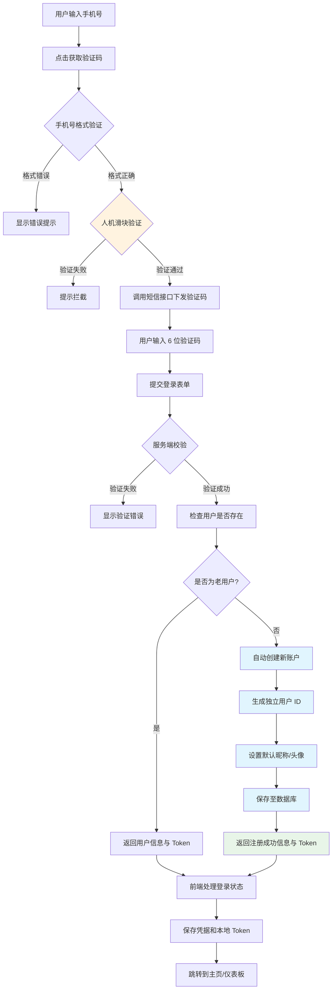
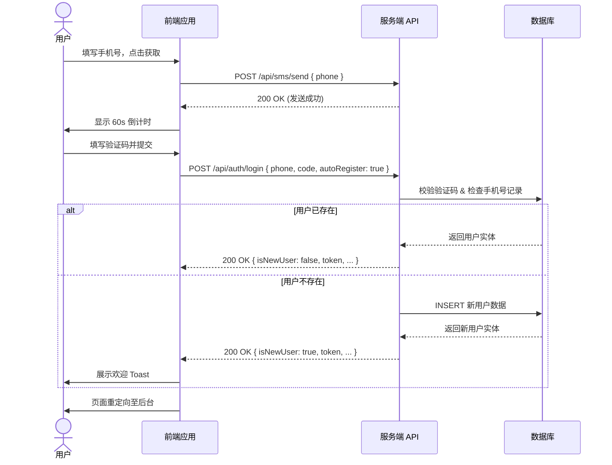

# 手机验证码登录

手机验证码登录为用户提供了无需记忆密码的安全认证方式，是我们**推荐的首选登录方式**，特别适合移动端场景与重视安全性的现代 Web 应用。

## 核心功能

- **手机号智能验证：** 前端正则校验与后段严格验证。 
- **验证码状态管理：** 发送节流与 60 秒倒计时防刷。 
- **多场景复用：** 支持注册、登录、找回密码等多种业务链路。 
- **自动注册账户（极简流程）：** 首次登录用户自动创建账户，无需跳转冗长的注册表单。 
- **智能凭据管理：** 无缝对接浏览器 Credential Management API。

## 为什么选择手机验证码登录？

### 🚀 用户体验优势

- **零记忆负担：** 无需记住繁琐的复杂密码组合。 
- **快速便捷：** 登录与注册逻辑合二为一，一步完成。 
- **普适性强：** 适用于所有年龄段及各种数字技能水平的用户。

### 🔒 安全性保障

- **实时验证：** 验证码具有单次有效性与极短的时效性（通常为 5 分钟）。
- **实名溯源：** 基于国内手机号实名制的基础身份验证。
- **防暴力破解：** 配合人机验证与请求频率限制，天然防御撞库攻击。

## 交互流程

在深入代码之前，我们先了解验证码登录的核心交互逻辑与时序。

### 业务流程图



### 客户端与服务端时序图



## 代码实现

以下是基于 `React Hook Form`、`Zod` 和现代化的 `shadcn/ui` 组件库的手机验证码登录表单组件实现。这种组合能够提供极佳的开发者体验（DX）与用户体验（UX），大幅减少了模板代码，并内置了无障碍（a11y）支持。

```tsx
import { useEffect, useRef, useState } from 'react';
import { useForm } from 'react-hook-form';
import { zodResolver } from '@hookform/resolvers/zod';
import { z } from 'zod';
import { toast } from 'sonner';
import { Button } from '@/components/ui/button';
import { Checkbox } from '@/components/ui/checkbox';
import { Input } from '@/components/ui/input';
import {
  Form,
  FormControl,
  FormField,
  FormItem,
  FormLabel,
  FormMessage,
} from '@/components/ui/form';

const COUNTDOWN_SECONDS = 60;
const MOCK_API_DELAY = 800;
const REDIRECT_DELAY = 1000;
const PHONE_REGEX = /^1[3-9]\d{9}$/;

const smsLoginSchema = z.object({
  phone: z
    .string()
    .min(1, { message: '请输入手机号' })
    .regex(PHONE_REGEX, { message: '请输入有效的 11 位手机号' }),
  code: z
    .string()
    .min(1, { message: '请输入验证码' })
    .length(6, { message: '验证码必须为 6 位数字' }),
  remember: z.boolean().optional().default(false),
});

type SmsLoginData = z.infer<typeof smsLoginSchema>;

function SmsLoginForm() {
  const [countdown, setCountdown] = useState(0);
  const [codeStatus, setCodeStatus] = useState<'idle' | 'sending' | 'sent'>('idle');

  const timerRef = useRef<NodeJS.Timeout | null>(null);

  const form = useForm<SmsLoginData>({
    resolver: zodResolver(smsLoginSchema),
    defaultValues: { phone: '', code: '', remember: false },
    mode: 'onChange',
  });

  useEffect(() => () => {
    if (timerRef.current) clearInterval(timerRef.current);
  }, []);

  useEffect(() => {
    if (countdown > 0) {
      timerRef.current = setInterval(() => {
        setCountdown((prev) => {
          if (prev <= 1) {
            clearInterval(timerRef.current!);
            return 0;
          }
          return prev - 1;
        });
      }, 1000);
    }

    return () => {
      if (timerRef.current) clearInterval(timerRef.current);
    };
  }, [countdown]);

  useEffect(() => {
    if ('credentials' in navigator) {
      navigator.credentials.get({ password: true, mediation: 'optional' })
        .then((cred) => {
          if (cred && 'id' in cred && PHONE_REGEX.test(cred.id)) {
            form.setValue('phone', cred.id);
            form.setValue('remember', true);
          }
        })
        .catch((err) => console.warn('获取凭据失败:', err));
    }
  }, [form]);

  const sendVerificationCode = async () => {
    if (countdown > 0) return;

    const isPhoneValid = await form.trigger('phone');
    if (!isPhoneValid) return;

    setCodeStatus('sending');
    const currentPhone = form.getValues('phone');

    try {
      // ⚠️ 生产环境建议在此处触发图形滑块验证 (Captcha) 防止短信被刷
      // await triggerCaptcha();
      await new Promise((resolve) => setTimeout(resolve, MOCK_API_DELAY));

      setCodeStatus('sent');
      setCountdown(COUNTDOWN_SECONDS);

      toast.success('验证码已发送', {
        description: `验证码已发送至 ${currentPhone.slice(0, 3)}****${currentPhone.slice(-4)}，请注意查收。`,
      });

      form.setFocus('code');
    } catch (error) {
      console.error('发送验证码失败:', error);
      setCodeStatus('idle');
      toast.error('发送失败', {
        description: '无法发送验证码，请稍后重试。',
      });
    }
  };

  const onSubmit = async (values: SmsLoginData) => {
    try {
      const { phone, code, remember } = values;

      const response = await fetch('/api/auth/sms/login', {
        method: 'POST',
        headers: { 'Content-Type': 'application/json' },
        body: JSON.stringify({ phone, code, autoRegister: true }),
      });

      if (!response.ok) throw new Error('网络请求异常');

      const result = await response.json();

      if (result.success) {
        if (remember && 'credentials' in navigator) {
          try {
            const cred = new PasswordCredential({
              id: phone,
              password: 'sms-auth-placeholder',
              name: result.isNewUser ? `新用户-${phone.slice(-4)}` : result.nickname,
            });
            await navigator.credentials.store(cred);
          } catch (err) {
            console.warn('凭据 API 存储失败:', err);
          }
        }

        localStorage.setItem('auth_token', result.token);

        toast.success(result.isNewUser ? '注册并登录成功' : '登录成功', {
          description: '正在为您跳转...',
        });

        setTimeout(() => {
          const redirectUrl = new URLSearchParams(window.location.search)
            .get('redirect') || '/dashboard';
          window.location.href = redirectUrl;
        }, REDIRECT_DELAY);
      } else {
        throw new Error(result.message || '登录失败，请检查验证码');
      }
    } catch (error) {
      form.setError('code', { type: 'manual', message: (error as Error).message });
    }
  };

  const renderButtonText = () => {
    if (countdown > 0) return `${countdown}s 后重发`;
    return codeStatus === 'sending' ? '发送中...' : '获取验证码';
  };

  const sanitizeToDigits = (value: string) => value.replace(/[^\d]/g, '');

  return (
    <div className="w-full max-w-md p-6 space-y-6 bg-white rounded-xl shadow-sm border">
      <div className="space-y-2 text-center">
        <h2 className="text-2xl font-semibold tracking-tight">欢迎登录</h2>
        <p className="text-sm text-muted-foreground">未注册的手机号验证后将自动注册</p>
      </div>

      <Form {...form}>
        <form onSubmit={form.handleSubmit(onSubmit)} className="space-y-6">
          <FormField
            control={form.control}
            name="phone"
            render={({ field }) => (
              <FormItem>
                <FormLabel>手机号码</FormLabel>
                <FormControl>
                  <Input
                    type="tel"
                    placeholder="请输入 11 位手机号码"
                    autoComplete="username"
                    maxLength={11}
                    {...field}
                    onChange={(e) => field.onChange(sanitizeToDigits(e.target.value))}
                  />
                </FormControl>
                <FormMessage />
              </FormItem>
            )}
          />

          <FormField
            control={form.control}
            name="code"
            render={({ field }) => (
              <FormItem>
                <FormLabel>验证码</FormLabel>
                <div className="flex gap-3">
                  <FormControl>
                    <Input
                      type="text"
                      inputMode="numeric"
                      autoComplete="one-time-code"
                      placeholder="6位数字"
                      maxLength={6}
                      className="flex-1"
                      {...field}
                      onChange={(e) => field.onChange(sanitizeToDigits(e.target.value))}
                    />
                  </FormControl>
                  <Button
                    type="button"
                    variant="outline"
                    className="w-[120px]"
                    onClick={sendVerificationCode}
                    disabled={countdown > 0 || codeStatus === 'sending'}
                  >
                    {renderButtonText()}
                  </Button>
                </div>
                <FormMessage />
              </FormItem>
            )}
          />

          <FormField
            control={form.control}
            name="remember"
            render={({ field }) => (
              <FormItem className="flex flex-row items-start space-x-3 space-y-0 rounded-md py-2">
                <FormControl>
                  <Checkbox checked={field.value} onCheckedChange={field.onChange} />
                </FormControl>
                <div className="space-y-1 leading-none">
                  <FormLabel className="text-sm font-normal text-muted-foreground cursor-pointer">
                    记住本设备，下次自动登录
                  </FormLabel>
                </div>
              </FormItem>
            )}
          />

          <Button
            type="submit"
            className="w-full"
            disabled={form.formState.isSubmitting}
          >
            {form.formState.isSubmitting ? '验证中...' : '立即登录'}
          </Button>
        </form>
      </Form>

      <div className="text-center text-xs text-muted-foreground">
        登录即表示您已阅读并同意 <a href="/terms" className="underline hover:text-primary">服务条款</a> 与 <a href="/privacy" className="underline hover:text-primary">隐私政策</a>
      </div>
    </div>
  );
}

export default SmsLoginForm;
```

## 用户体验设计原则

1. 无缝注册体验
   - **极简入口：** 拒绝繁杂的先注册再登录步骤，入口合一。
   - **渐进式完善：** 自动创建账户不阻塞核心流程。可在用户进入 Dashboard 后再通过气泡提示引导其完善头像、昵称等个人资料。
   - **状态反馈：** 新用户注册成功后，前端应适当给与欢迎提示（如 Toast：“欢迎新朋友”），建立初步信任感。
2. 现代化的无感式登录
   - **Credential Management API：** 浏览器规范级别的凭据管理。当用户下次访问时，甚至可以通过浏览器的底边栏直接一键选取本机保存的手机号快速发起登录操作。
   - **短信智能读取：** 在移动端 H5 或 PWA 中，配置 `autoComplete="one-time-code"` 属性，可以让 iOS 和部分 Android 系统在收到短信时，直接在输入法顶部提供“验证码自动填充”建议。

### 实施注意事项与最佳实践

💡 **防范短信被刷是上线前最重要的检查点！** 验证码相关接口最容易遭受黑产的恶意请求（俗称“短信轰炸机”）。

1. 多重防刷策略： 
   - **前端拦截：** 强制加入滑块验证、拼图验证或 reCAPTCHA 等人机验证机制，只有人机验证通过才能调用发送验证码 API。 
   - **服务端频控：** 限制同一手机号（例如：1分钟1次，1天最多10次）以及同一 IP（例如：1小时最多发送50次）的下发频率。
2. 状态有效期与长度：
   - 短信验证码建议使用纯数字 **6 位**，有效期设置为 **5-10 分钟**。 
   - 服务端校验验证码时，须保证验证码 **“阅后即焚”**（验证成功后立即使其失效，防止重放攻击）。
3. 合规性与隐私（Privacy）：
   - 在表单下方**必须**包含《隐私政策》和《用户协议》的勾选或默认同意说明，以满足国内外的应用合规性检查（如网信办要求或 GDPR 规范）。
4. 可靠的第三方服务降级：
   - 考虑集成多家短信服务商（如阿里云、腾讯云等），当一家服务商网络波动导致下发失败率升高时，能够自动或手动切换线路。
