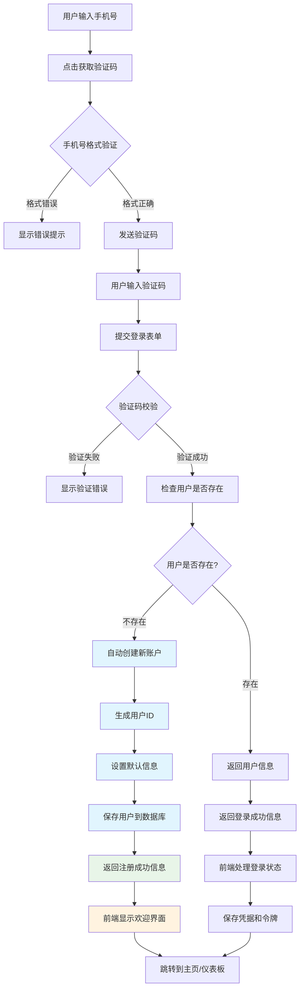
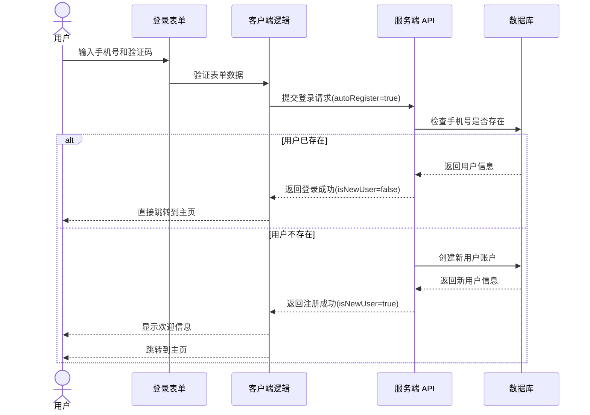

# 手机验证码登录

手机验证码登录为用户提供了无需记忆密码的安全认证方式，是我们**推荐的首选登录方式**，特别适合移动场景与重视安全性的应用。

## 核心功能

- 手机号格式智能验证
- 验证码发送与倒计时管理
- 防刷机制与流量控制
- 多场景验证码登录支持（注册、登录、找回）
- **自动注册账户** - 首次登录用户自动创建账户
- 完整的错误处理与用户反馈

## 为什么选择手机验证码登录？

### 🚀 用户体验优势

- **零记忆负担** - 无需记住复杂密码
- **快速便捷** - 一步完成登录和注册
- **安全可靠** - 基于手机实名制的身份验证
- **普适性强** - 适用于所有年龄段用户

### 🔒 安全性保障

- **实时验证** - 验证码具有时效性
- **设备绑定** - 与用户手机设备强关联
- **防暴力破解** - 天然的频率限制机制
- **可追溯性** - 完整的登录日志记录

## 代码实现

```tsx
import React, { useState, useEffect, useRef } from 'react';
import { z } from 'zod';

// 定义验证规则
const smsLoginSchema = z.object({
  phone: z.string()
    .required('请输入手机号')
    .regex(/^1[3-9]\d{9}$/, '请输入有效的手机号'),
  code: z.string()
    .required('请输入验证码')
    .length(6, '验证码为 6 位数字'),
  remember: z.boolean()
});

type SmsLoginData = z.infer<typeof smsLoginSchema>;

// 添加用户信息状态
interface UserRegistrationData {
  isNewUser: boolean;
  needsProfile: boolean;
  userId?: string;
  profile?: {
    nickname?: string;
    avatar?: string;
  };
}

const SmsLoginForm: React.FC = () => {
  const [formData, setFormData] = useState<SmsLoginData>({
    phone: '',
    code: '',
    remember: false
  });
  const [errors, setErrors] = useState<Partial<Record<keyof SmsLoginData, string>>>({});
  const [isSubmitting, setIsSubmitting] = useState(false);
  const [countdown, setCountdown] = useState(0);
  const [codeStatus, setCodeStatus] = useState<'idle' | 'sending' | 'sent' | 'error'>('idle');
  const [userRegistration, setUserRegistration] = useState<UserRegistrationData | null>(null);
  
  const timerRef = useRef<NodeJS.Timeout | null>(null);
  const codeInputRef = useRef<HTMLInputElement>(null);

  // 清理倒计时
  useEffect(() => {
    return () => {
      if (timerRef.current) clearInterval(timerRef.current);
    };
  }, []);

  // 倒计时处理
  useEffect(() => {
    if (countdown > 0) {
      timerRef.current = setInterval(() => {
        setCountdown(prev => {
          if (prev <= 1) {
            clearInterval(timerRef.current!);
            return 0;
          }
          return prev - 1;
        });
      }, 1000);
    }
    
    return () => {
      if (timerRef.current) clearInterval(timerRef.current);
    };
  }, [countdown]);

  // 检查凭据 API 并尝试自动登录
  useEffect(() => {
    // 检查浏览器是否支持凭据 API
    if ('credentials' in navigator) {
      // 尝试获取已保存的凭据
      navigator.credentials.get({
        password: true,
        mediation: 'optional' // 可选的凭据请求
      })
      .then(cred => {
        // 如果找到凭据且满足条件（这里检查 id 是否为手机号格式）
        if (cred && 'id' in cred && /^1[3-9]\d{9}$/.test(cred.id)) {
          console.log('找到保存的凭据，尝试自动登录');
          // 自动填充手机号
          setFormData(prev => ({
            ...prev,
            phone: cred.id,
            remember: true
          }));
          
          // 这里可以选择引导用户获取验证码
          // 或者如果有其他自动登录机制可以触发
        }
      })
      .catch(err => {
        console.error('获取凭据失败:', err);
      });
    }
  }, []);

  const validateField = <K extends keyof SmsLoginData>(
    field: K, 
    value: SmsLoginData[K]
  ) => {
    try {
      smsLoginSchema.pick({ [field]: true }).parse({ [field]: value });
      setErrors(prev => ({ ...prev, [field]: '' }));
      return true;
    } catch (error) {
      if (error instanceof z.ZodError) {
        setErrors(prev => ({
          ...prev,
          [field]: error.errors[0].message
        }));
      }
      return false;
    }
  };

  const handleChange = (e: React.ChangeEvent<HTMLInputElement>) => {
    const { name, value, type, checked } = e.target;
    const fieldValue = type === 'checkbox' ? checked : value;
    
    // 验证码输入限制为 6 位数字
    if (name === 'code' && typeof fieldValue === 'string') {
      const sanitizedValue = fieldValue.replace(/[^\d]/g, '').slice(0, 6);
      setFormData(prev => ({ ...prev, [name]: sanitizedValue }));
    } else {
      setFormData(prev => ({ ...prev, [name]: fieldValue }));
    }
    
    if (errors[name as keyof SmsLoginData]) {
      validateField(name as keyof SmsLoginData, fieldValue);
    }
  };

  const handleBlur = (e: React.FocusEvent<HTMLInputElement>) => {
    const { name, value, type, checked } = e.target;
    const fieldValue = type === 'checkbox' ? checked : value;
    validateField(name as keyof SmsLoginData, fieldValue);
  };

  const sendVerificationCode = async () => {
    if (countdown > 0) return;
    
    const isPhoneValid = validateField('phone', formData.phone);
    if (!isPhoneValid) return;
    
    setCodeStatus('sending');
    
    try {
      // 实际发送验证码的 API 调用
      await new Promise(resolve => setTimeout(resolve, 1000)); // 模拟 API 请求
      
      // 发送成功
      setCodeStatus('sent');
      setCountdown(60); // 60 秒倒计时
      
      // 自动聚焦到验证码输入框
      setTimeout(() => {
        codeInputRef.current?.focus();
      }, 100);
    } catch (error) {
      console.error('发送验证码失败:', error);
      setCodeStatus('error');
    }
  };

  const handleSubmit = async (e: React.FormEvent) => {
    e.preventDefault();
    
    try {
      smsLoginSchema.parse(formData);
      setErrors({});
      setIsSubmitting(true);
      
      // 提交登录请求，支持自动注册
      const response = await fetch('/api/auth/sms/login', {
        method: 'POST',
        headers: {
          'Content-Type': 'application/json'
        },
        body: JSON.stringify({
          phone: formData.phone,
          code: formData.code,
          autoRegister: true // 启用自动注册
        })
      });

      if (!response.ok) {
        throw new Error('登录失败');
      }

      const result = await response.json();
      
      if (result.success) {
        // 检查是否为新注册用户
        if (result.isNewUser) {
          console.log('新用户自动注册成功');
          setUserRegistration({
            isNewUser: true,
            needsProfile: result.needsProfile || false,
            userId: result.userId,
            profile: result.profile
          });
        }

        // 登录成功后保存凭据
        if (formData.remember && 'credentials' in navigator) {
          try {
            // 创建新凭据对象 - 对于 SMS 登录，我们只存储手机号码
            const cred = new PasswordCredential({
              id: formData.phone, // 手机号作为 ID
              password: '', // 验证码不保存
              name: result.isNewUser 
                ? `新用户-${formData.phone.substring(7)}` 
                : (result.nickname || `手机用户-${formData.phone.substring(7)}`) // 显示昵称或默认名称
            });
            
            // 存储凭据
            await navigator.credentials.store(cred);
            console.log('凭据已保存');
          } catch (err) {
            console.error('保存凭据失败:', err);
          }
        }
        
        // 如果用户选择了记住登录状态，可以存储令牌
        if (formData.remember) {
          localStorage.setItem('auth_token', result.token);
          localStorage.setItem('user_info', JSON.stringify({
            phone: formData.phone,
            userId: result.userId,
            isNewUser: result.isNewUser,
            nickname: result.nickname
          }));
        }
        
        // 直接跳转到首页或指定页面
        setTimeout(() => {
          const redirectUrl = new URLSearchParams(window.location.search).get('redirect') || '/dashboard';
          window.location.href = redirectUrl;
        }, 1500);
      } else {
        throw new Error(result.message || '登录失败');
      }
    } catch (error) {
      if (error instanceof z.ZodError) {
        const newErrors: Partial<Record<keyof SmsLoginData, string>> = {};
        error.errors.forEach(err => {
          const field = err.path[0] as keyof SmsLoginData;
          newErrors[field] = err.message;
        });
        setErrors(newErrors);
      } else {
        console.error('登录失败:', error);
      }
    } finally {
      setIsSubmitting(false);
    }
  };

  return (
    <div className="sms-login-container">
      <h2>手机验证码登录</h2>

      <form onSubmit={handleSubmit}>
        <div className="form-group">
          <label htmlFor="phone">手机号码</label>
          <div className="phone-input-wrapper">
            <input
              id="phone"
              name="phone"
              type="tel"
              inputMode="tel"
              autoComplete="tel"
              placeholder="请输入手机号码"
              value={formData.phone}
              onChange={handleChange}
              onBlur={handleBlur}
              aria-invalid={!!errors.phone}
            />
          </div>
          {errors.phone && <p className="error-message">{errors.phone}</p>}
        </div>
        
        <div className="form-group">
          <label htmlFor="code">验证码</label>
          <div className="code-input-wrapper">
            <input
              id="code"
              name="code"
              type="text"
              inputMode="numeric"
              autoComplete="one-time-code"
              placeholder="请输入 6 位验证码"
              value={formData.code}
              onChange={handleChange}
              onBlur={handleBlur}
              aria-invalid={!!errors.code}
              ref={codeInputRef}
              maxLength={6}
            />
            <button
              type="button"
              onClick={sendVerificationCode}
              disabled={countdown > 0 || codeStatus === 'sending'}
            >
              {countdown > 0 ? `${countdown} 秒后重发` :
               codeStatus === 'sending' ? '发送中...' : '获取验证码'}
            </button>
          </div>
          {errors.code && <p className="error-message">{errors.code}</p>}
        </div>
        
        <div className="form-group">
          <label>
            <input
              type="checkbox"
              name="remember"
              checked={formData.remember}
              onChange={handleChange}
              onBlur={handleBlur}
            />
            记住登录状态
          </label>
        </div>
        
        <button 
          type="submit" 
          className="submit-button" 
          disabled={isSubmitting}
        >
          {isSubmitting ? '验证中...' : '登录 / 注册'}
        </button>
      </form>
      
      {/* 自动注册说明 */}
      <div className="auto-register-notice">
        <p className="notice-text">
          📱 首次使用该手机号将自动为您创建账户
        </p>
        <p className="privacy-text">
          登录即表示您同意我们的 
          <a href="/terms" target="_blank">服务条款</a> 和 
          <a href="/privacy" target="_blank">隐私政策</a>
        </p>
      </div>
    </div>
  );
};

export default SmsLoginForm;
```

## 交互流程

## 新用户注册流程





## 用户体验

### 无缝注册体验

1. **统一入口** - 登录和注册使用同一个表单，减少用户认知负担
2. **自动识别** - 系统自动判断是否为新用户，无需用户手动选择
3. **欢迎引导** - 新用户注册成功后显示欢迎信息，提升归属感
4. **渐进式完善** - 支持后续完善个人信息，不阻塞主流程

### 状态反馈优化

1. **按钮文案** - 将按钮文本改为"登录 / 注册"，明确表达功能
2. **进度提示** - 新用户显示注册进度和后续引导
3. **个性化信息** - 保存用户注册状态，用于后续个性化体验
4. **明确说明** - 提供自动注册的说明文字，让用户了解流程

### 隐私与合规

1. **明确告知** - 在注册前告知用户将自动创建账户
2. **协议同意** - 提供服务条款和隐私政策链接
3. **最小权限** - 只获取手机号等必要信息
4. **用户控制** - 允许用户后续修改或删除账户

### 无感式登录

1. **凭据管理集成** - 利用浏览器的 Credential Management API 存储微信登录状态
2. **快速重认证** - 用户再次访问网站时，可以绕过扫码步骤直接登录
3. **智能降级** - 对不支持凭据 API 的浏览器，提供标准登录流程
4. **安全考量** - 结合令牌有效期管理，确保安全性不受凭据存储影响
5. **隐私尊重** - 用户可通过浏览器管理已存储的凭据

## 实施注意事项

1. **短信服务集成** - 需要集成可靠的短信服务提供商，处理发送失败、重试等逻辑
2. **国际化支持** - 如需支持国际用户，考虑添加国家/地区代码选择
3. **兼容性处理** - 确保在不同浏览器和设备上的一致体验
4. **可访问性** - 确保表单符合 WCAG 可访问性标准
5. **风控系统** - 实现风险控制逻辑，检测异常登录行为
6. **多场景复用** - 设计时考虑验证码功能在注册、找回密码等场景的复用
7. **凭据管理** - Credential Management API 要求在 HTTPS 环境下使用
8. **安全平衡** - 在便捷性和安全性之间找到平衡点，考虑业务场景需求

## 最佳实践

1. 验证码长度通常为 4-6 位，建议使用 6 位提升安全性
2. 验证码有效期建议设置为 5-10 分钟，平衡安全性和用户体验
3. 为提升用户体验，可考虑客户端保存手机号（但不保存验证码）
4. 针对高频用户的场景，可实现短信验证码智能判断功能（自动读取）
5. 考虑添加图形验证码作为发送短信前的预验证，降低短信成本