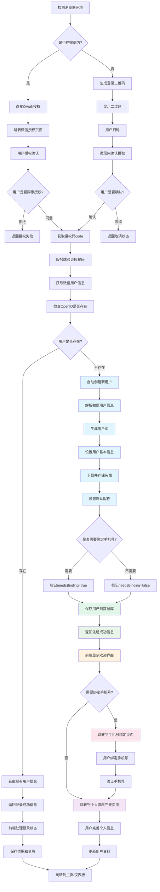
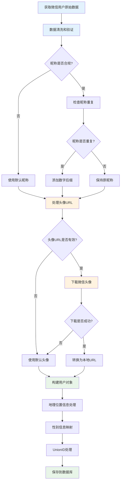
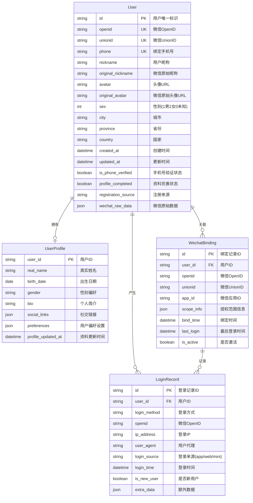
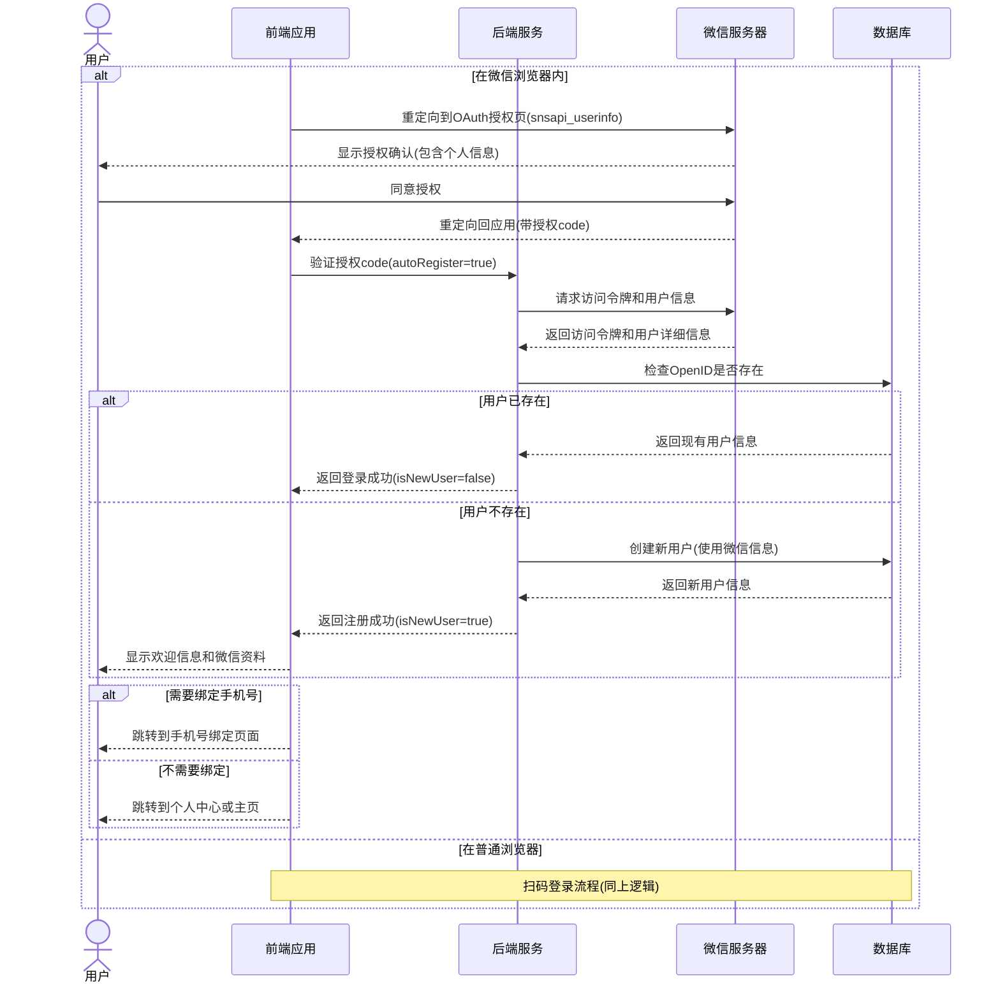

# 微信登录

微信登录为用户提供了便捷的第三方身份认证方式，无需记忆额外的账号密码，是**移动端用户的推荐选择**，特别适合移动应用和追求便捷体验的 Web 应用。

## 核心功能

- 网页扫码登录（适用于 PC 端）
- 微信内应用直接授权登录
- 小程序关联登录
- **自动注册账户** - 首次微信登录用户自动创建账户
- 账号绑定与用户信息同步
- 登录状态管理与刷新机制

## 适用场景

### 📱 移动端优先

- **微信生态用户** - 深度使用微信的用户群体
- **移动应用** - 手机 App 和移动网页应用
- **社交场景** - 需要获取用户社交信息的应用
- **快速体验** - 希望极速开始使用的用户

### 💻 PC 端支持

- **扫码登录** - 通过二维码实现 PC 端登录
- **多端同步** - 与移动端账户信息同步
- **办公场景** - 企业微信集成应用

## 代码实现

```tsx
import React, { useState, useEffect, useRef } from 'react';
import QRCode from 'qrcode.react'; // 引入二维码生成库

// 微信登录状态类型
type WechatLoginStatus = 
  | 'initial'     // 初始状态
  | 'loading'     // 加载中
  | 'ready'       // 二维码已生成
  | 'scanning'    // 已扫描
  | 'confirming'  // 确认中
  | 'success'     // 登录成功
  | 'expired'     // 二维码过期
  | 'error';      // 发生错误

interface WechatLoginState {
  status: WechatLoginStatus;
  qrUrl: string;
  error?: string;
  authToken?: string;
  sceneId?: string;
}

// 添加用户注册相关类型
interface WechatUserProfile {
  openid: string;
  nickname: string;
  headimgurl: string;
  sex: number;
  city: string;
  province: string;
  country: string;
  unionid?: string;
}

interface RegistrationResult {
  isNewUser: boolean;
  userId: string;
  profile: WechatUserProfile;
  token: string;
  needsBinding: boolean; // 是否需要绑定手机号
}

const WechatLogin: React.FC = () => {
  const [loginState, setLoginState] = useState<WechatLoginState>({
    status: 'initial',
    qrUrl: '',
  });
  const [registrationResult, setRegistrationResult] = useState<RegistrationResult | null>(null);
  
  const pollingRef = useRef<NodeJS.Timeout | null>(null);
  const isWeChatBrowser = useRef<boolean>(false);
  
  // 检测是否在微信浏览器内并尝试使用凭据API
  useEffect(() => {
    const userAgent = navigator.userAgent.toLowerCase();
    isWeChatBrowser.current = /micromessenger/.test(userAgent);
    
    // 尝试使用凭据API自动登录
    if ('credentials' in navigator && 'FederatedCredential' in window) {
      navigator.credentials.get({
        federated: {
          providers: ['https://open.weixin.qq.com']
        },
        mediation: 'optional'
      }).then(cred => {
        if (cred && cred instanceof FederatedCredential) {
          // 发现微信凭据，使用OpenID进行认证
          console.log('找到保存的微信凭据，使用OpenID认证');
          
          // 向后端发送身份验证请求
          fetch('/api/auth/wechat/federated', {
            method: 'POST',
            headers: { 'Content-Type': 'application/json' },
            body: JSON.stringify({ 
              id: cred.id,
              provider: cred.provider
            })
          }).then(/* 处理认证结果 */);
          return; // 阻止后续执行
        }
        
        // 如果没有找到有效凭据，继续正常流程
        // 如果在微信内，直接走授权流程
        if (isWeChatBrowser.current) {
          initWechatDirectAuth();
        } else {
          // PC端则准备扫码登录
          initQRCodeLogin();
        }
      }).catch(() => {
        // 凭据API错误，继续正常流程
        if (isWeChatBrowser.current) {
          initWechatDirectAuth();
        } else {
          initQRCodeLogin();
        }
      });
    } else {
      // 浏览器不支持凭据API，继续正常流程
      if (isWeChatBrowser.current) {
        initWechatDirectAuth();
      } else {
        initQRCodeLogin();
      }
    }
    
    return () => {
      if (pollingRef.current) {
        clearInterval(pollingRef.current);
      }
    };
  }, []);
  
  // 初始化二维码登录
  const initQRCodeLogin = async () => {
    try {
      setLoginState(prev => ({ ...prev, status: 'loading' }));
      
      // 请求后端API获取二维码URL和场景ID
      const response = await fetch('/api/auth/wechat/qrcode', {
        method: 'POST',
        headers: {
          'Content-Type': 'application/json'
        }
      });
      
      if (!response.ok) throw new Error('获取二维码失败');
      
      const data = await response.json();
      
      setLoginState({
        status: 'ready',
        qrUrl: data.qrUrl,
        sceneId: data.sceneId
      });
      
      // 开始轮询检查登录状态
      startPolling(data.sceneId);
      
    } catch (error) {
      console.error('初始化微信登录失败:', error);
      setLoginState({
        status: 'error',
        qrUrl: '',
        error: '获取二维码失败，请刷新重试'
      });
    }
  };
  
  // 初始化微信内直接授权
  const initWechatDirectAuth = () => {
    // 获取当前页面URL
    const currentUrl = encodeURIComponent(window.location.href);
    
    // 构建微信OAuth重定向URL
    const redirectUrl = `https://open.weixin.qq.com/connect/oauth2/authorize?appid=${process.env.NEXT_PUBLIC_WECHAT_APP_ID}&redirect_uri=${currentUrl}&response_type=code&scope=snsapi_userinfo&state=STATE#wechat_redirect`;
    
    // 从URL中获取code参数
    const urlParams = new URLSearchParams(window.location.search);
    const code = urlParams.get('code');
    
    if (!code) {
      // 没有code，重定向到微信授权页面
      window.location.href = redirectUrl;
    } else {
      // 已有code，验证登录
      verifyWechatAuth(code);
    }
  };
  
  // 验证微信授权
  const verifyWechatAuth = async (code: string) => {
    try {
      setLoginState(prev => ({ ...prev, status: 'loading' }));
      
      const response = await fetch('/api/auth/wechat/verify', {
        method: 'POST',
        headers: { 'Content-Type': 'application/json' },
        body: JSON.stringify({ 
          code,
          autoRegister: true, // 启用自动注册
          scope: 'snsapi_userinfo' // 请求用户信息权限
        })
      });
      
      if (!response.ok) throw new Error('验证失败');
      
      const data: RegistrationResult = await response.json();
      
      if (data.userId) {
        setLoginState({
          status: 'success',
          qrUrl: '',
          authToken: data.token
        });
        
        // 保存注册结果
        setRegistrationResult(data);
        
        // 如果是新用户，显示欢迎信息
        if (data.isNewUser) {
          console.log('新用户通过微信自动注册成功');
        }
        
        // 存储认证信息
        localStorage.setItem('auth_token', data.token);
        localStorage.setItem('user_info', JSON.stringify({
          openid: data.profile.openid,
          unionid: data.profile.unionid,
          nickname: data.profile.nickname,
          avatar: data.profile.headimgurl,
          userId: data.userId,
          isNewUser: data.isNewUser,
          loginMethod: 'wechat'
        }));
        
        // 保存凭据用于自动登录 - 使用FederatedCredential，适合OpenID认证
        if ('credentials' in navigator && 'FederatedCredential' in window) {
          try {
            // 使用FederatedCredential存储微信OpenID凭据
            const cred = new FederatedCredential({
              id: data.profile.openid, // 微信用户的唯一标识
              provider: 'https://open.weixin.qq.com', // 微信作为身份提供者
              name: data.profile.nickname || '微信用户', // 用户昵称
              iconURL: data.profile.headimgurl // 头像URL
            });
            
            // 存储凭据
            await navigator.credentials.store(cred);
            console.log('微信凭据已保存');
          } catch (err) {
            console.error('保存凭据失败:', err);
          }
        }
        
        // 根据用户状态决定跳转
        if (data.isNewUser && data.needsBinding) {
          // 新用户需要绑定手机号
          setTimeout(() => {
            window.location.href = '/profile/bind-phone?source=wechat&welcome=true';
          }, 3000);
        } else if (data.isNewUser) {
          // 新用户但不需要绑定手机号
          setTimeout(() => {
            window.location.href = '/profile/setup?source=wechat&welcome=true';
          }, 2500);
        } else {
          // 老用户直接跳转
          setTimeout(() => {
            const redirectUrl = new URLSearchParams(window.location.search).get('redirect') || '/dashboard';
            window.location.href = redirectUrl;
          }, 1500);
        }
      } else {
        throw new Error(data.message || '登录失败');
      }
    } catch (error) {
      console.error('微信授权验证失败:', error);
      setLoginState({
        status: 'error',
        qrUrl: '',
        error: '登录失败，请重试'
      });
    }
  };
  
  // 开始轮询检查登录状态
  const startPolling = (sceneId: string) => {
    // 设置过期时间（2分钟）
    const expireTime = Date.now() + 2 * 60 * 1000;
    
    pollingRef.current = setInterval(async () => {
      try {
        // 检查是否已过期
        if (Date.now() > expireTime) {
          setLoginState(prev => ({ ...prev, status: 'expired' }));
          if (pollingRef.current) clearInterval(pollingRef.current);
          return;
        }
        
        // 检查登录状态
        const response = await fetch('/api/auth/wechat/check-status', {
          method: 'POST',
          headers: { 'Content-Type': 'application/json' },
          body: JSON.stringify({ 
            sceneId,
            autoRegister: true, // 启用自动注册
            requestUserInfo: true // 请求用户信息
          })
        });
        
        if (!response.ok) throw new Error('检查状态失败');
        
        const data = await response.json();
        
        // 更新状态
        switch (data.status) {
          case 'SCANNED':
            setLoginState(prev => ({ ...prev, status: 'scanning' }));
            break;
          case 'CONFIRMED':
            setLoginState(prev => ({ ...prev, status: 'confirming' }));
            break;
          case 'AUTHORIZED':
            setLoginState({
              status: 'success',
              qrUrl: '',
              authToken: data.token
            });
            
            // 处理注册结果
            if (data.registrationResult) {
              setRegistrationResult(data.registrationResult);
              
              if (data.registrationResult.isNewUser) {
                setShowWelcome(true);
                console.log('新用户通过扫码微信登录自动注册成功');
              }
            }
            
            // 存储认证信息
            localStorage.setItem('auth_token', data.token);
            if (data.registrationResult) {
              localStorage.setItem('user_info', JSON.stringify({
                openid: data.registrationResult.profile.openid,
                unionid: data.registrationResult.profile.unionid,
                nickname: data.registrationResult.profile.nickname,
                avatar: data.registrationResult.profile.headimgurl,
                userId: data.registrationResult.userId,
                isNewUser: data.registrationResult.isNewUser,
                loginMethod: 'wechat'
              }));
            }
            
            // 清除轮询
            if (pollingRef.current) clearInterval(pollingRef.current);
            
            // 根据用户状态决定跳转
            if (data.registrationResult?.isNewUser && data.registrationResult.needsBinding) {
              setTimeout(() => {
                window.location.href = '/profile/bind-phone?source=wechat&welcome=true';
              }, 3000);
            } else if (data.registrationResult?.isNewUser) {
              setTimeout(() => {
                window.location.href = '/profile/setup?source=wechat&welcome=true';
              }, 2500);
            } else {
              setTimeout(() => {
                const redirectUrl = new URLSearchParams(window.location.search).get('redirect') || '/dashboard';
                window.location.href = redirectUrl;
              }, 1500);
            }
            break;
          case 'EXPIRED':
            setLoginState(prev => ({ ...prev, status: 'expired' }));
            if (pollingRef.current) clearInterval(pollingRef.current);
            break;
        }
      } catch (error) {
        console.error('检查登录状态失败:', error);
      }
    }, 2000); // 每2秒检查一次
  };
  
  // 刷新二维码
  const refreshQRCode = () => {
    if (pollingRef.current) {
      clearInterval(pollingRef.current);
    }
    initQRCodeLogin();
  };
  
  // 渲染登录界面
  return (
    <div className="wechat-login-container">
      <h2>微信登录</h2>
      
      <div className="qrcode-container">
        {loginState.status === 'initial' || loginState.status === 'loading' ? (
          <div className="loading-state">
            <div className="spinner"></div>
            <p>正在加载微信登录...</p>
          </div>
        ) : loginState.status === 'ready' ? (
          <div className="ready-state">
            <QRCode 
              value={loginState.qrUrl} 
              size={200} 
              level="H"
              renderAs="svg"
              imageSettings={{
                src: "/wechat-logo.png",
                height: 40,
                width: 40,
                excavate: true
              }}
            />
            <p>请使用微信扫描二维码登录</p>
            <p className="tips">二维码有效期为2分钟</p>
          </div>
        ) : loginState.status === 'scanning' ? (
          <div className="scanning-state">
            <div className="scan-animation"></div>
            <p>已扫描，请在微信中确认登录</p>
          </div>
        ) : loginState.status === 'confirming' ? (
          <div className="confirming-state">
            <div className="spinner"></div>
            <p>正在确认登录...</p>
          </div>
        ) : loginState.status === 'success' ? (
          <div className="success-state">
            <div className="success-icon">✓</div>
            <p>登录成功，正在跳转...</p>
          </div>
        ) : loginState.status === 'expired' ? (
          <div className="expired-state">
            <p>二维码已过期</p>
            <button onClick={refreshQRCode}>刷新二维码</button>
          </div>
        ) : (
          <div className="error-state">
            <p>登录失败: {loginState.error}</p>
            <button onClick={refreshQRCode}>重试</button>
          </div>
        )}
      </div>
      
      {/* 自动注册说明 */}
      <div className="auto-register-notice">
        <p className="notice-text">
          🔐 首次使用微信登录将自动为您创建账户
        </p>
        <p className="feature-text">
          📋 我们将获取您的微信昵称和头像用于账户设置
        </p>
        <p className="privacy-text">
          登录即表示您同意我们的 
          <a href="/terms" target="_blank">服务条款</a> 和 
          <a href="/privacy" target="_blank">隐私政策</a>
        </p>
      </div>
      
      {/* 其他登录方式提示 */}
      <div className="other-login-methods">
        <p>您还可以选择：</p>
        <div className="login-options">
          <a href="/auth/password">账号密码登录</a>
          <a href="/auth/sms">手机验证码登录</a>
        </div>
      </div>
    </div>
  );
};

export default WechatLogin;
```

## 交互流程



## 微信用户数据处理流程



## 微信注册数据模型





## OpenID 集成与凭据管理

微信登录支持 OpenID Connect 协议，我们可以利用这一特性来改进用户认证体验。

### FederatedCredential 与 OpenID

```tsx
// 检测是否有已保存的微信凭据
useEffect(() => {
  // 检查浏览器是否支持凭据 API 和 FederatedCredential
  if ('credentials' in navigator && 'FederatedCredential' in window) {
    // 尝试获取已保存的微信凭据
    navigator.credentials.get({
      federated: {
        providers: ['https://open.weixin.qq.com']
      },
      mediation: 'optional'
    }).then(cred => {
      if (cred && cred instanceof FederatedCredential) {
        // 发现微信凭据，使用 OpenID 进行认证
        console.log('找到保存的微信凭据，使用 OpenID 认证');
        
        // 向后端发送身份验证请求
        fetch('/api/auth/wechat/federated', {
          method: 'POST',
          headers: { 'Content-Type': 'application/json' },
          body: JSON.stringify({ 
            id: cred.id,
            provider: cred.provider
          })
        }).then(/* 处理认证结果 */);
      } else {
        // 继续普通登录流程
      }
    });
  }
}, []);
```

### 与 PasswordCredential 的区别

| 特性 | FederatedCredential | PasswordCredential |
| ---- | ------------------ | ------------------ |
| 适用场景 | 第三方身份提供商（如微信、谷歌） | 用户名密码形式的本地认证 |
| 所需属性 | id、provider（必填） | id、password（必填） |
| 认证流程 | 基于 OpenID/OAuth 等第三方协议 | 基于应用自身的验证逻辑 |
| 安全特性 | 不存储敏感令牌，仅保存身份标识 | 可能存储敏感信息 |
| 用户体验 | 适合单点登录和跨站身份 | 适合单一网站的认证记忆 |

## 用户体验

### 状态反馈与指引

1. **进度可视化** - 清晰展示登录全流程状态，包括加载、扫码、确认、成功等
2. **超时处理** - 二维码过期后提供明确提示和刷新选项
3. **动态视觉反馈** - 使用动画指示当前状态，增强交互体验
4. **适时提示** - 在适当时候提供引导性文字，指导用户完成操作

### 多场景适配

1. **环境识别** - 自动检测微信环境，提供最优的登录路径
2. **无缝体验** - 微信内直接授权，无需扫码过程
3. **降级方案** - 提供备选的登录方式，应对所有场景
4. **响应式设计** - 根据设备尺寸调整登录界面布局

### 安全与隐私

1. **二维码时效控制** - 限制二维码有效期，通常为 2 分钟
2. **状态码一次性** - 确保每个场景 ID 只能使用一次
3. **数据最小化** - 只请求必要的用户信息
4. **明确的授权说明** - 清晰告知用户授权的权限范围

### 无感式登录

1. **凭据管理集成** - 利用浏览器的 Credential Management API 存储微信登录状态
2. **快速重认证** - 用户再次访问网站时，可以绕过扫码步骤直接登录
3. **智能降级** - 对不支持凭据 API 的浏览器，提供标准登录流程
4. **安全考量** - 结合令牌有效期管理，确保安全性不受凭据存储影响
5. **隐私尊重** - 用户可通过浏览器管理已存储的凭据

## 实施注意事项

1. **应用注册与配置**
   - 需在微信开放平台注册应用
   - 配置回调域名和安全域名
   - 获取 AppID 和 AppSecret
   - **申请 snsapi_userinfo 权限以获取用户详细信息**

2. **用户信息处理**
   - **合规获取** - 明确告知用户获取哪些信息及用途
   - **数据映射** - 将微信用户信息映射到应用用户模型
   - **头像处理** - 下载并存储微信头像到本地存储
   - **昵称去重** - 处理相同昵称的用户注册情况

3. **账号关联策略**
   - **UnionID 优先** - 如有 UnionID，优先使用它关联多个应用
   - **OpenID 备选** - 单应用场景使用 OpenID 作为唯一标识
   - **手机号绑定** - 新用户可选择性绑定手机号增强安全性
   - **多账号整合** - 处理用户既有手机注册又有微信注册的情况

4. **数据安全与隐私**
   - **最小化原则** - 只获取必要的用户信息
   - **加密存储** - 敏感信息加密存储
   - **权限控制** - 实现细粒度的数据访问权限
   - **用户控制** - 允许用户管理授权信息和删除数据

5. **用户体验优化**
   - **渐进式引导** - 新用户分步骤完成账户设置
   - **智能跳转** - 根据用户状态智能选择跳转页面
   - **个性化欢迎** - 使用微信昵称和头像提供个性化体验
   - **错误处理** - 优雅处理各种异常情况

## 最佳实践

1. **统一注册入口** - 所有登录方式都支持自动注册，提供一致体验
2. **渐进式信息收集** - 注册时只获取必要信息，后续渐进式完善
3. **多重身份验证** - 新用户可选择绑定多种验证方式提升安全性
4. **数据同步机制** - 定期同步微信用户信息，保持数据新鲜度
5. **用户画像构建** - 基于微信信息和行为数据构建用户画像
6. **兼容性考虑** - 确保自动注册功能在各种设备和浏览器上正常工作
7. **监控和分析** - 监控注册转化率和用户行为，持续优化体验
8. **合规性保障** - 确保用户信息收集和使用符合相关法律法规