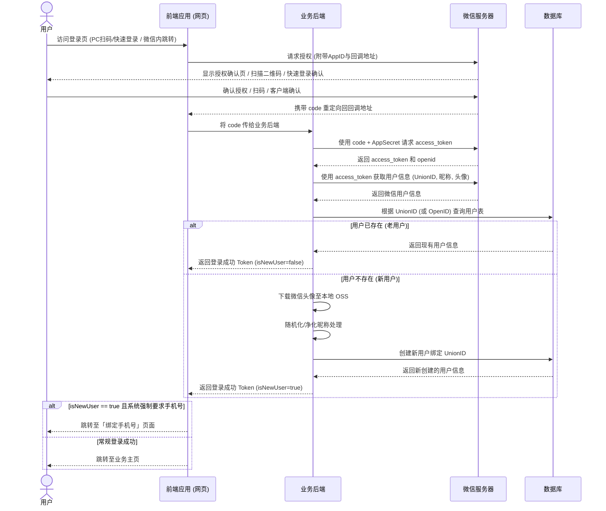

# 微信登录

微信登录为用户提供了便捷的第三方身份认证方式，无需记忆额外的账号密码。本指南涵盖了基于微信开放平台（Website App）和微信公众平台（微信内浏览器）的标准登录接入方案。

## 适用场景与接入策略

针对不同的运行环境，我们需要采用不同的接入策略以保证最佳的用户体验：

- 💻 **PC 端网页（扫码 / 快速登录）**
  - **场景：** 用户在电脑端浏览器访问网站。 
  - **策略：** 使用微信官方提供的内嵌登录组件。如果用户本地已登录微信，可实现一键快速登录；否则展示二维码由手机扫码授权。 
- 📱 **微信内置浏览器（静默 / 弹窗授权）** 
  - **场景：** 用户在微信 App 内直接访问网页。 
  - **策略：** 直接跳转微信 OAuth2.0 授权链接，实现无缝登录（支持静默获取 OpenID 或弹窗获取完整用户信息）。

## 🛠 准备工作

在开始编写代码前，请确保您已完成以下配置：

1. 登录 [微信开放平台](https://open.weixin.qq.com/)，创建网站应用并审核通过。 
2. 获取应用的 `AppID` 和 `AppSecret`。 
3. 在开放平台中配置授权回调域（如 `www.yourdomain.com`）。 
4. 确保您的后端服务器已准备好接收微信返回的 `code` 并换取 `access_token`。
   

## 💻 场景一：PC 端网页扫码与快速登录

为了提供最佳体验，官方推荐使用内嵌组件的方式（通过 wxLogin.js），用户无需离开当前页面即可完成认证。

- ⚡️ **体验增强：PC/Mac 端快速登录（免扫码）**：为了简化用户登录流程，微信官方目前已支持“网站应用快速登录”功能：
  - **触发条件：** 当网页发起登录请求时，如果用户在当前设备已登录符合版本要求的微信客户端（Windows 3.9.11 及以上 / Mac 4.0.0 及以上），且客户端处于非锁定状态。 
  - **交互体验：** 网页会优先提示用户使用当前客户端已登录的账号进行一键快速确认登录，全程无需使用手机扫码。 
  - **向下兼容：** 用户仍可在界面上点击切换其他微信账号，或退回使用传统的二维码扫码登录模式。

注：开发者只需按照标准 `wxLogin.js` 流程接入，即可自动获得此功能支持，无需额外编写代码。

### 1. 引入官方 JS 文件

在项目的 `index.html` 或入口文件中引入

```html
<script src="https://res.wx.qq.com/connect/zh_CN/htmledition/js/wxLogin.js"></script>
```

### 2. React 组件实现

```tsx
import { useEffect } from 'react';

interface WeChatQRProps {
  redirectUrl: string; // 扫码或快速登录成功后的回调地址
}

function WeChatQRCodeLogin({ redirectUrl }: WeChatQRProps) {
  useEffect(() => {
    // 实例化微信登录对象，使用 eslint-disable-next-line 忽略对实例化但不赋值的检查
    // eslint-disable-next-line no-new
    new (window as any).WxLogin({
      self_redirect: false, // true: 扫码后在iframe内跳转; false: 顶层跳转
      id: 'wechat-qrcode-container', // 挂载组件的DOM节点ID
      appid: process.env.NEXT_PUBLIC_WECHAT_APP_ID,
      scope: 'snsapi_login',
      redirect_uri: encodeURIComponent(redirectUrl),
      state: Math.random().toString(36).substring(2), // 防CSRF攻击
      style: 'black', // 样式：black 或 white
      href: '', // 可选，自定义样式的 CSS 链接
    });
  }, [redirectUrl]);

  return (
    <div className="login-container">
      <h3>使用微信登录</h3>
      {/* 微信快速登录确认卡片或二维码将渲染在这个 div 中 */}
      <div id="wechat-qrcode-container" className="qr-box" />
    </div>
  );
}

export default WeChatQRCodeLogin;
```

## 📱 场景二：微信内置浏览器直接授权

当用户在微信 App 内打开网页时，展示二维码是无意义的。此时应直接利用微信环境进行 OAuth2.0 授权。

```tsx
import { useEffect } from 'react';

function WeChatDirectLogin() {
  useEffect(() => {
    const handleCodeVerify = async (code: string) => {
      try {
        // 发送 code 到后端换取 Token 与用户信息
        const response = await fetch('/api/auth/wechat/verify', {
          method: 'POST',
          headers: { 'Content-Type': 'application/json' },
          body: JSON.stringify({ code }),
        });
        const data = await response.json();
        
        if (data.success) {
          localStorage.setItem('auth_token', data.token);
          // 根据业务需求跳转（如：新用户跳转手机绑定页）
          window.location.href = data.isNewUser ? '/bind-phone' : '/dashboard';
        }
      } catch (error) {
        console.error('微信登录验证失败', error);
      }
    };

    // 检测是否为微信浏览器
    const isWechat = /micromessenger/i.test(navigator.userAgent);
    
    if (isWechat) {
      const currentUrl = encodeURIComponent(window.location.href);
      // 公众平台 AppID
      const appId = process.env.NEXT_PUBLIC_WECHAT_MP_APP_ID;
      
      // 构建微信 OAuth 重定向 URL
      // scope=snsapi_userinfo: 获取用户基本信息(需弹窗同意)
      // scope=snsapi_base: 仅获取 OpenID(静默授权)
      const wechatAuthUrl = `https://open.weixin.qq.com/connect/oauth2/authorize?appid=${appId}&redirect_uri=${currentUrl}&response_type=code&scope=snsapi_userinfo&state=WECHAT_H5#wechat_redirect`;
      
      const urlParams = new URLSearchParams(window.location.search);
      const code = urlParams.get('code');
      
      if (!code) {
        // 无 code，跳转至微信授权页
        window.location.replace(wechatAuthUrl);
      } else {
        // 已拿到 code，交给后端进行验证登录
        handleCodeVerify(code);
      }
    }
  }, []);

  return <div className="loading-spinner">正在拉起微信授权...</div>;
}

export default WeChatDirectLogin;
```

## 🔄 核心业务逻辑：自动注册与账号绑定

单纯获取到微信的 OpenID 仅仅是认证的第一步，实际业务中，我们通常需要实现“首次微信登录自动注册”以及“多端账号信息互通”。

### 身份标识：OpenID vs UnionID

- **OpenID**：同一用户在**同一个应用**下的唯一标识。
- **UnionID**：同一用户在同一个微信开放平台账号（即开发者账号）下的唯一标识。

:::tip[强烈建议]
如果您的产品包含 PC网站、小程序、APP，请务必使用 `UnionID` 作为底层用户的关联主键，以实现跨端账号同源。
:::

### 业务流程图

以下是完整的 OAuth 交互与业务系统自动注册流程：



## 🚀 高级特性：无感式登录 (Credential Management API)

对于现代浏览器，我们可以利用 Web 凭据管理 API (`FederatedCredential`) 来存储微信登录状态，实现同一浏览器下次访问时的“无感登录”。.

```ts
// 保存微信凭据 (登录成功后调用)
const saveWeChatCredential = async (userInfo) => {
  if ('credentials' in navigator && 'FederatedCredential' in window) {
    try {
      const cred = new FederatedCredential({
        id: userInfo.openid, // 微信用户的唯一标识
        provider: 'https://open.weixin.qq.com',
        name: userInfo.nickname || '微信用户',
        iconURL: userInfo.headimgurl,
      });
      await navigator.credentials.store(cred);
    } catch (err) {
      console.error('凭据保存失败:', err);
    }
  }
};

// 尝试静默获取凭据 (初始化页面时调用)
const checkExistingCredential = async () => {
  if ('credentials' in navigator && 'FederatedCredential' in window) {
    const cred = await navigator.credentials.get({
      federated: { providers: ['https://open.weixin.qq.com'] },
      mediation: 'optional',
    });
    
    if (cred && cred instanceof FederatedCredential) {
      // 发现已存凭据，直接向后端发送验证请求免扫码
      verifyFederatedLogin(cred.id, cred.provider);
    }
  }
};
```

## 🛡️ 实施注意事项与最佳实践

### 1. 数据安全与合规

- **防范 CSRF 攻击：** 传递给微信的 `state` 参数必须是一个随机的、不可预测的字符串，后端在回调时必须验证此 `state` 与发出的 `state` 是否一致。 
- **信息最小化：** 仅在确实需要用户昵称和头像时才使用 `snsapi_userinfo` / `snsapi_login`。如果仅仅是为了底层账户绑定，且在微信浏览器内，推荐使用 snsapi_base 静默获取 OpenID 以减少用户授权弹窗的流失率。 
- **隐私政策：** 如果启用了自动注册，请在登录页面醒目位置明示《用户协议》与《隐私政策》。

### 2. 边缘情况处理

- **昵称特殊字符：** 微信昵称可能包含 Emoji 或罕见字符，保存至数据库时必须考虑字符集支持（建议 MySQL 使用 `utf8mb4`）或对昵称进行过滤。
- **头像 URL 失效：** 微信头像 URL 有时效性且依赖外网，**严禁直接在数据库中长期存储微信的绝对路径 URL**。后端在首次注册时，应当将头像下载转存至您的自有 OSS（如阿里云、AWS），并存储自有的 CDN 链接。

### 3. 多账号合并策略

当系统同时支持「手机号注册」与「微信登录」时，极易产生账号分裂。最佳实践是：

1. 首次微信登录强制重定向至**手机号绑定页**。 
2. 后端校验手机号，如果该手机号已经存在，则将该手机号对应的老账号与当前微信 `UnionID` 关联（合并逻辑）。 
3. 如果手机号不存在，则真正完成新用户的创建。

## 参考资料

- [网站应用微信登录开发指南](https://developers.weixin.qq.com/doc/oplatform/Website_App/WeChat_Login/Wechat_Login.html)
