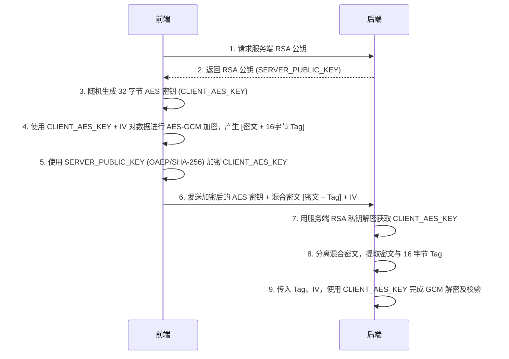
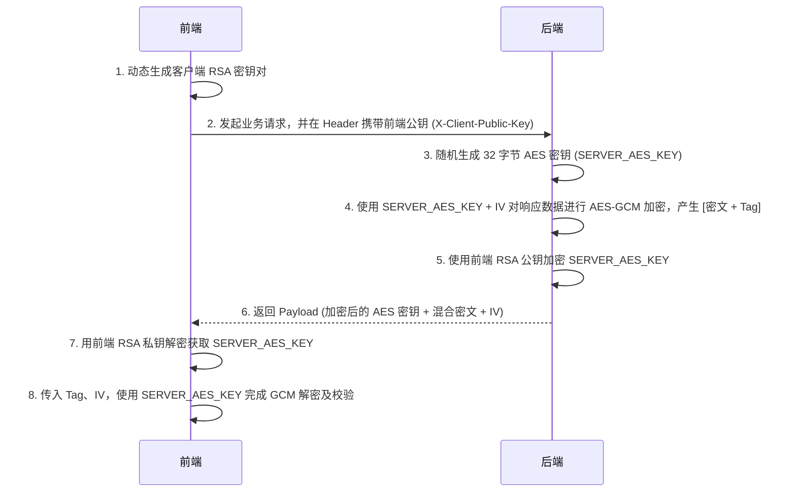

# 敏感数据加密

对敏感数据采用 AES 加密传输，支持前端到后端和后端到前端的双向加密通信，避免数据泄露

:::warning
采用 AES 加密传输属于**纵深防御**，在传输数据时，应该确保**优先使用 HTTPS**
:::

## 敏感数据治理与识别

在实施加密之前，必须首先对系统内的敏感数据进行梳理。我们将这一过程划分为“数据分类与发现”以及“表现层脱敏”。

### 1. 敏感数据的分类与特征

敏感数据是指一旦泄露可能对个人、企业造成危害的信息。我们通常将其分为三大类，并针对其特征采用不同的识别策略：

| 数据类别 | 具体字段示例 | 识别策略推荐 |
|---|---|---|
| **个人身份信息** | 身份证号、手机号、邮箱、家庭住址、姓名 | 格式固定，优先使用**正则表达式**进行自动化值匹配 |
| **金融与交易信息** | 银行卡号、账户余额、交易流水、薪资 | 部分格式固定（如银行卡号可用正则），其余依赖**手动字段标记** |
| **认证与凭据信息** | 登录密码、支付密码、API Key、JWT Token | 具有明确的语义特征，优先通过**字段名（Key）匹配**或手动标记 |

### 2. 自动化识别与手动标记的结合

在实际项目中，我们推荐采用“正则值检测”与“字段字典映射”相结合的纯函数手段，来精准定位复杂业务对象中的敏感数据，避免“一刀切”全量加密带来的性能开销。

```ts
// --- 1. 正则匹配规则库 (针对 PII 和标准格式) ---
const sensitivePatterns = {
  idCard: /^[1-9]\d{5}(18|19|20)\d{2}((0[1-9])|(1[0-2]))(([0-2][1-9])|10|20|30|31)\d{3}[0-9Xx]$/,
  phone: /^1[3-9]\d{9}$/,
  bankCard: /^\d{13,19}$/,
  email: /^[a-zA-Z0-9._%+-]+@[a-zA-Z0-9.-]+\.[a-zA-Z]{2,}$/,
};

// --- 2. 业务字段映射表 (针对无固定格式的敏感信息) ---
const sensitiveFields: Record<string, string> = {
  'user.address': 'PII',
  'payment.balance': 'FINANCIAL',
  'auth.password': 'AUTH',
  'auth.apiKey': 'AUTH',
};

/**
 * 敏感字段检测管道
 * 检查依据：1. 值是否符合正则特征；2. 字段名是否包含密码特征；3. 字段路径是否在敏感字典中
 */
export const isSensitiveData = (fieldPath: string, value: unknown): boolean => {
  // 检查是否在手动配置的字典中
  if (sensitiveFields[fieldPath]) return true;

  // 检查键名是否包含敏感词 (如 password, secret)
  if (/(password|pwd|secret|token)/i.test(fieldPath)) return true;

  // 检查字符串值是否匹配正则特征
  if (typeof value === 'string') {
    return Object.values(sensitivePatterns).some((pattern) => pattern.test(value));
  }

  return false;
};
```

### 3. 表现层：数据脱敏处理

对于非网络传输场景（如日志打印、前端页面只读展示），我们使用数据脱敏（Masking）来保护隐私。以下是基于纯函数实现的标准脱敏工具：

```typescript
/**
 * 身份证号脱敏：保留前6位和后4位，中间用*替换
 * 示例：110101199001011234 -> 110101********1234
 */
export const maskIdCard = (idCard: string): string => {
  if (!idCard || idCard.length !== 18) return idCard;
  return idCard.replace(/(\d{6})\d{8}(\d{4})/, '$1********$2');
};

/**
 * 手机号脱敏：保留前3位和后4位，中间4位用*替换
 * 示例：13800138000 -> 138****8000
 */
export const maskPhone = (phone: string): string => {
  if (!phone || phone.length !== 11) return phone;
  return phone.replace(/(\d{3})\d{4}(\d{4})/, '$1****$2');
};

/**
 * 银行卡号脱敏：只保留后4位，其余位每4位用*分隔
 * 示例：6225880123456789 -> **** **** **** 6789
 */
export const maskBankCard = (cardNumber: string): string => {
  if (!cardNumber) return cardNumber;
  const lastFour = cardNumber.slice(-4);
  const maskedLength = Math.max(0, cardNumber.length - 4);
  const maskedGroups = Math.ceil(maskedLength / 4);
  return `${'**** '.repeat(maskedGroups)}${lastFour}`;
};

/**
 * 邮箱脱敏：保留第一个字符和域名，用户名其余部分用*替换
 * 示例：zhangsan@example.com -> z*******@example.com
 */
export const maskEmail = (email: string): string => {
  if (!email || !email.includes('@')) return email;
  const [username, domain] = email.split('@');
  if (username.length <= 1) return email;
  return `${username[0]}${'*'.repeat(username.length - 1)}@${domain}`;
};

/**
 * 姓名脱敏：保留姓氏，名字部分用*替换
 * 示例：张三 -> 张*，李四五 -> 李**
 */
export const maskName = (name: string): string => {
  if (!name || name.length <= 1) return name;
  return `${name[0]}${'*'.repeat(name.length - 1)}`;
};
```

## 传输层：双向混合加密架构

本系统采用基于 RSA-OAEP (2048) 与 AES-GCM (256) 的混合加密方案：

- **非对称加密 (RSA-OAEP)：** 仅用于安全地传输一次性的、随机生成的对称密钥，解决密钥分发问题。
- **对称加密 (AES-GCM)：** 用于加密大容量的实际业务数据，具有极高的加解密性能，并提供**完整性校验（通过 Auth Tag）。**

### 核心前端代码实现

```typescript
export interface EncryptedPayload {
  encryptedAesKey: string; // Base64 编码的、经 RSA 加密的 AES 密钥
  encryptedData: string; // Base64 编码的、经 AES-GCM 加密的 [密文 + 16字节 Tag]
  iv: string; // Base64 编码的 12 字节初始化向量
}

// ---------------------------
// 实用工具函数
// ---------------------------

export const arrayBufferToBase64 = (buffer: ArrayBuffer): string => (
  btoa(String.fromCharCode(...new Uint8Array(buffer)))
);

export const base64ToArrayBuffer = (base64: string): ArrayBuffer => {
  const binary = atob(base64);
  const bytes = new Uint8Array(binary.length);
  for (let i = 0; i < binary.length; i += 1) {
    bytes[i] = binary.charCodeAt(i);
  }
  return bytes.buffer;
};

// ---------------------------
// 密钥处理函数
// ---------------------------

// 1. 导入服务端 RSA 公钥 (用于前端 -> 后端加密)
export const importServerPublicKey = async (
  pemHeaderExcludedBase64: string,
): Promise<CryptoKey> => {
  const binaryKey = base64ToArrayBuffer(pemHeaderExcludedBase64);
  return crypto.subtle.importKey(
    'spki',
    binaryKey,
    { name: 'RSA-OAEP', hash: 'SHA-256' },
    false,
    ['encrypt'],
  );
};

// 2. 生成客户端自有的 RSA 密钥对 (用于后端 -> 前端加密)
export const generateClientKeyPair = async (): Promise<CryptoKeyPair> => (
  crypto.subtle.generateKey(
    {
      name: 'RSA-OAEP',
      modulusLength: 2048,
      publicExponent: new Uint8Array([1, 0, 1]),
      hash: 'SHA-256',
    },
    true,
    ['encrypt', 'decrypt'],
  )
);

// 提取并导出客户端公钥为 Base64
export const exportClientPublicKey = async (publicKey: CryptoKey): Promise<string> => {
  const exported = await crypto.subtle.exportKey('spki', publicKey);
  return arrayBufferToBase64(exported);
};

// ---------------------------
// 核心加解密函数
// ---------------------------

// 3. 前端 -> 后端：加密业务数据
export const encryptForServer = async (
  data: Record<string, unknown>,
  serverPublicKey: CryptoKey,
): Promise<EncryptedPayload> => {
  // a. 随机生成 256 位 AES-GCM 密钥
  const aesKey = await crypto.subtle.generateKey(
    { name: 'AES-GCM', length: 256 },
    true,
    ['encrypt', 'decrypt'],
  );

  // b. 使用服务端的 RSA 公钥加密该 AES 密钥的 Raw 字节
  const rawAesKey = await crypto.subtle.exportKey('raw', aesKey);
  const encryptedAesKey = await crypto.subtle.encrypt(
    { name: 'RSA-OAEP' },
    serverPublicKey,
    rawAesKey,
  );

  // c. 使用 AES-GCM 加密业务数据 (Web Crypto 会自动在密文后追加 16 字节的 Tag)
  const iv = crypto.getRandomValues(new Uint8Array(12));
  const encodedData = new TextEncoder().encode(JSON.stringify(data));
  const encryptedDataAndTag = await crypto.subtle.encrypt(
    { name: 'AES-GCM', iv },
    aesKey,
    encodedData,
  );

  return {
    encryptedAesKey: arrayBufferToBase64(encryptedAesKey),
    encryptedData: arrayBufferToBase64(encryptedDataAndTag),
    iv: arrayBufferToBase64(iv),
  };
};

// 4. 后端 -> 前端：解密服务端返回的数据
export const decryptFromServer = async (
  payload: EncryptedPayload,
  clientPrivateKey: CryptoKey,
): Promise<unknown> => {
  // a. 使用客户端私钥解密出对称 AES 密钥
  const encryptedAesKeyBuf = base64ToArrayBuffer(payload.encryptedAesKey);
  const rawAesKey = await crypto.subtle.decrypt(
    { name: 'RSA-OAEP' },
    clientPrivateKey,
    encryptedAesKeyBuf,
  );

  // b. 导入对称密钥
  const aesKey = await crypto.subtle.importKey(
    'raw',
    rawAesKey,
    { name: 'AES-GCM' },
    false,
    ['decrypt'],
  );

  // c. 解密含有 16 字节尾随 Tag 的混合数据
  const ivBuf = base64ToArrayBuffer(payload.iv);
  const encryptedDataAndTagBuf = base64ToArrayBuffer(payload.encryptedData);

  const decryptedBuf = await crypto.subtle.decrypt(
    { name: 'AES-GCM', iv: ivBuf },
    aesKey,
    encryptedDataAndTagBuf,
  );

  return JSON.parse(new TextDecoder().decode(decryptedBuf));
};
```

### 前端到后端加密

前端生成随机 AES 密钥加密敏感数据，然后使用服务端公钥加密 AES 密钥，服务端接收后用私钥解密得到 AES 密钥，再用此密钥解密业务数据。

适用于前端向后端提交登录凭据、支付密码、个人隐私档案等场景。前端每次请求都会生成一次性的随机 AES 密钥。



#### 前端实现

```ts
import { importPublicKey, encryptPayload } from '@/utils/crypto';

export const submitSensitiveData = async (userData: Record<string, unknown>) => {
  try {
    // 1. 获取服务端公钥
    const response = await fetch('/api/keys/server-public-key');
    const { publicKeyBase64 } = await response.json();
    
    // 2. 导入公钥并执行混合加密
    const serverPubKey = await importPublicKey(publicKeyBase64);
    const encryptedBody = await encryptPayload(userData, serverPubKey);

    // 3. 发送加密数据给后端
    const submitRes = await fetch('/api/user/profile', {
      method: 'POST',
      headers: { 'Content-Type': 'application/json' },
      body: JSON.stringify(encryptedBody),
    });

    return await submitRes.json();
  } catch (error) {
    console.error('提交加密数据失败:', error);
    throw error;
  }
};
```

#### 后端实现

import Tabs from '@theme/Tabs';
import TabItem from '@theme/TabItem';

<Tabs>
<TabItem value="nestjs" label="NestJS" default>
<Tabs>
<TabItem value="controller" label="Controller">

```typescript
// filepath: src/encryption/encryption.controller.ts
import {
  Controller,
  Post,
  Get,
  Body,
  Headers,
  BadRequestException,
  InternalServerErrorException,
} from '@nestjs/common';
import { EncryptionService } from './encryption.service';

@Controller('api')
export class EncryptionController {
  constructor(private readonly encryptionService: EncryptionService) {}

  @Get('server-public-key')
  getServerPublicKey() {
    return { publicKey: this.encryptionService.getServerPublicKey() };
  }

  @Post('secure-data')
  receiveEncryptedData(
    @Body() body: { encryptedAesKey: string; encryptedData: string; iv: string },
  ) {
    try {
      const { encryptedAesKey, encryptedData, iv } = body;
      const businessData = this.encryptionService.decryptClientData(
        encryptedAesKey,
        encryptedData,
        iv,
      );

      console.log('接收到前端加密数据:', businessData);
      return { success: true, message: '数据接收成功', data: businessData };
    } catch (error) {
      throw new BadRequestException('数据解密失败');
    }
  }

  @Post('encrypted-response')
  sendEncryptedData(@Headers('x-client-public-key') clientPublicKey: string) {
    try {
      if (!clientPublicKey) {
        throw new BadRequestException('缺少客户端公钥');
      }

      const responseData = {
        message: '这是来自服务器的敏感数据',
        timestamp: new Date().toISOString(),
        userInfo: { id: 123, role: 'admin' },
      };

      const encryptedResponse = this.encryptionService.encryptDataForClient(
        responseData,
        clientPublicKey,
      );
      console.log('发送加密数据给前端');
      return encryptedResponse;
    } catch (error) {
      throw new InternalServerErrorException('服务器加密失败');
    }
  }
}
```

</TabItem>
<TabItem value="service" label="Service">

```typescript
// filepath: src/encryption/encryption.service.ts
import { Injectable } from '@nestjs/common';
import * as crypto from 'crypto';

@Injectable()
export class EncryptionService {
  private readonly serverKeyPair: { privateKey: string; publicKey: string };

  constructor() {
    // 初始化生成服务端的 2048 位 RSA 密钥对
    this.serverKeyPair = crypto.generateKeyPairSync('rsa', {
      modulusLength: 2048,
      publicKeyEncoding: { type: 'spki', format: 'pem' },
      privateKeyEncoding: { type: 'pkcs8', format: 'pem' },
    });
  }

  public getServerPublicKey(): string {
    // 过滤 PEM 证书头尾及换行符，输出干净的 Base64 供前端加载
    return this.serverKeyPair.publicKey.replace(
      /-----BEGIN PUBLIC KEY-----|\n|\r|-----END PUBLIC KEY-----/g,
      '',
    );
  }

  // 1. 解密前端发来的数据
  public decryptClientData(
    encryptedAesKey: string,
    encryptedData: string,
    iv: string,
  ): unknown {
    try {
      // a. 解密一次性 AES 密钥 (显式指定 OAEP 及其 MGF1 哈希为 SHA-256)
      const decryptedAesKey = crypto.privateDecrypt(
        {
          key: this.serverKeyPair.privateKey,
          padding: crypto.constants.RSA_PKCS1_OAEP_PADDING,
          oaepHash: 'sha256',
          mgf1Hash: 'sha256',
        },
        Buffer.from(encryptedAesKey, 'base64'),
      );

      // b. 分离前端发来的混合密文 [密文 (前) + 16 字节 Tag (后)]
      const combinedBuffer = Buffer.from(encryptedData, 'base64');
      if (combinedBuffer.length < 16) {
        throw new Error('Invalid ciphertext');
      }

      const ciphertext = combinedBuffer.subarray(0, combinedBuffer.length - 16);
      const tag = combinedBuffer.subarray(combinedBuffer.length - 16);

      // c. 执行解密并设置 Auth Tag 进行完整性校验
      const decipher = crypto.createDecipheriv(
        'aes-256-gcm',
        decryptedAesKey,
        Buffer.from(iv, 'base64'),
      );
      decipher.setAuthTag(tag);

      let decrypted = decipher.update(ciphertext, undefined, 'utf8');
      decrypted += decipher.final('utf8');

      return JSON.parse(decrypted);
    } catch (error) {
      const message = error instanceof Error ? error.message : String(error);
      throw new Error(`数据完整性校验失败或解密失败: ${message}`);
    }
  }

  // 2. 加密返回给前端的数据
  public encryptDataForClient(
    data: Record<string, unknown>,
    clientPublicKeyBase64: string,
  ): Record<string, string> {
    try {
      // 重新拼装标准的 SPKI PEM 格式以供 Node 导入客户端公钥
      const formattedKey = clientPublicKeyBase64.match(/.{1,64}/g)?.join('\n') || '';
      const pemKey = `-----BEGIN PUBLIC KEY-----\n${formattedKey}\n-----END PUBLIC KEY-----`;
      const clientPublicKey = crypto.createPublicKey(pemKey);

      // a. 生成对称 AES 密钥
      const aesKey = crypto.randomBytes(32);
      const iv = crypto.randomBytes(12);

      // b. 使用客户端 RSA 公钥加密对称密钥
      const encryptedAesKey = crypto.publicEncrypt(
        {
          key: clientPublicKey,
          padding: crypto.constants.RSA_PKCS1_OAEP_PADDING,
          oaepHash: 'sha256',
          mgf1Hash: 'sha256',
        },
        aesKey,
      );

      // c. AES-GCM 加密业务数据
      const cipher = crypto.createCipheriv('aes-256-gcm', aesKey, iv);
      let ciphertext = cipher.update(JSON.stringify(data), 'utf8');
      ciphertext = Buffer.concat([ciphertext, cipher.final()]);
      const tag = cipher.getAuthTag(); // 抽取生成的 16 字节验证标签

      // d. 拼接 [密文 + Tag] 合包发送，使其匹配前端 Web Crypto 解密规范
      const combinedData = Buffer.concat([ciphertext, tag]);

      return {
        encryptedAesKey: encryptedAesKey.toString('base64'),
        encryptedData: combinedData.toString('base64'),
        iv: iv.toString('base64'),
      };
    } catch (error) {
      const message = error instanceof Error ? error.message : String(error);
      throw new Error(`响应数据加密失败: ${message}`);
    }
  }
}
```

</TabItem>
<TabItem value="module" label="Module">

```typescript
// filepath: src/encryption/encryption.module.ts
import { Module } from '@nestjs/common';
import { EncryptionController } from './encryption.controller';
import { EncryptionService } from './encryption.service';

@Module({
  controllers: [EncryptionController],
  providers: [EncryptionService],
  exports: [EncryptionService],
})
export class EncryptionModule {}
```

</TabItem>
</Tabs>
</TabItem>

<TabItem value="springboot" label="Spring Boot">
<Tabs>
<TabItem value="controller" label="Controller">

```java
// filepath: src/main/java/com/example/encryption/controller/EncryptionController.java
package com.example.encryption.controller;

import com.example.encryption.service.EncryptionService;
import lombok.RequiredArgsConstructor;
import lombok.extern.slf4j.Slf4j;
import org.springframework.http.ResponseEntity;
import org.springframework.web.bind.annotation.*;

import java.time.Instant;
import java.util.HashMap;
import java.util.Map;

/**
 * 加密通信控制器
 * 提供服务端公钥查询、前端加密数据解密、响应数据加密等能力。
 */
@Slf4j
@RestController
@RequiredArgsConstructor
@RequestMapping("/api")
public class EncryptionController {

    private final EncryptionService encryptionService;

    /**
     * 获取服务端 RSA 公钥（Base64 格式）
     *
     * @return 包含公钥的响应
     */
    @GetMapping("/server-public-key")
    public ResponseEntity<Map<String, String>> getServerPublicKey() {
        String publicKey = encryptionService.getServerPublicKey();
        Map<String, String> result = new HashMap<>(1);
        result.put("publicKey", publicKey);
        return ResponseEntity.ok(result);
    }

    /**
     * 接收前端加密数据并解密
     *
     * @param request 包含密文、AES 密钥密文、IV 的请求体
     * @return 解密后的业务数据响应
     */
    @PostMapping("/secure-data")
    public ResponseEntity<Map<String, Object>> receiveEncryptedData(
            @RequestBody Map<String, String> request) {
        try {
            String encryptedAesKey = request.get("encryptedAesKey");
            String encryptedData = request.get("encryptedData");
            String iv = request.get("iv");

            Object businessData = encryptionService.decryptClientData(
                    encryptedAesKey, encryptedData, iv);
            log.info("接收到前端加密数据: {}", businessData);

            Map<String, Object> result = new HashMap<>(3);
            result.put("success", Boolean.TRUE);
            result.put("message", "数据接收成功");
            result.put("data", businessData);
            return ResponseEntity.ok(result);
        } catch (Exception e) {
            log.error("数据解密失败", e);
            Map<String, Object> result = new HashMap<>(2);
            result.put("success", Boolean.FALSE);
            result.put("message", "数据解密失败");
            return ResponseEntity.badRequest().body(result);
        }
    }

    /**
     * 加密响应数据返回给前端
     *
     * @param clientPublicKey 前端客户端公钥
     * @return 加密后的响应数据
     */
    @PostMapping("/encrypted-response")
    public ResponseEntity<Map<String, String>> sendEncryptedData(
            @RequestHeader("X-Client-Public-Key") String clientPublicKey) {
        try {
            if (clientPublicKey == null || clientPublicKey.isEmpty()) {
                Map<String, String> result = new HashMap<>(1);
                result.put("error", "缺少客户端公钥");
                return ResponseEntity.badRequest().body(result);
            }

            Map<String, Object> responseData = new HashMap<>(3);
            responseData.put("message", "这是来自服务器的敏感数据");
            responseData.put("timestamp", Instant.now().toString());
            Map<String, Object> userInfo = new HashMap<>(2);
            userInfo.put("id", 123);
            userInfo.put("role", "admin");
            responseData.put("userInfo", userInfo);

            Map<String, String> encryptedResponse =
                    encryptionService.encryptDataForClient(responseData, clientPublicKey);
            log.info("发送加密数据给前端");
            return ResponseEntity.ok(encryptedResponse);
        } catch (Exception e) {
            log.error("服务器加密失败", e);
            Map<String, String> result = new HashMap<>(1);
            result.put("error", "服务器加密失败");
            return ResponseEntity.internalServerError().body(result);
        }
    }
}
```

</TabItem>
<TabItem value="service" label="Service">

```java
// filepath: src/main/java/com/example/encryption/service/EncryptionService.java
package com.example.encryption.service;

import com.fasterxml.jackson.databind.ObjectMapper;
import lombok.extern.slf4j.Slf4j;
import org.springframework.stereotype.Service;

import javax.crypto.Cipher;
import javax.crypto.KeyGenerator;
import javax.crypto.SecretKey;
import javax.crypto.spec.GCMParameterSpec;
import javax.crypto.spec.SecretKeySpec;
import java.nio.charset.StandardCharsets;
import java.security.*;
import java.security.spec.MGF1ParameterSpec;
import java.security.spec.OAEPParameterSpec;
import java.security.spec.PSource;
import java.security.spec.X509EncodedKeySpec;
import java.util.Base64;
import java.util.HashMap;
import java.util.Map;

/**
 * 加密服务
 * 提供基于 RSA-OAEP/SHA-256 与 AES-GCM 的对称非对称混合加密能力。
 */
@Slf4j
@Service
public class EncryptionService {

    /**
     * RSA 密钥长度
     */
    private static final int RSA_KEY_SIZE = 2048;

    /**
     * AES 密钥长度（位）
     */
    private static final int AES_KEY_SIZE = 256;

    /**
     * GCM 初始化向量长度（字节）
     */
    private static final int GCM_IV_LEN = 12;

    /**
     * GCM 校验标签长度（位）
     */
    private static final int GCM_TAG_BITS = 128;

    /**
     * RSA 加密算法标识
     */
    private static final String RSA_ALGORITHM = "RSA";

    /**
     * AES 加密算法标识
     */
    private static final String AES_GCM_ALGORITHM = "AES/GCM/NoPadding";

    /**
     * RSA 加密转换标识（配合 OAEP ParameterSpec 使用）
     */
    private static final String RSA_OAEP_TRANSFORMATION = "RSA/ECB/OAEPPadding";

    /**
     * 服务端 RSA 密钥对
     */
    private final KeyPair serverKeyPair;

    /**
     * JSON 序列化工具
     */
    private final ObjectMapper objectMapper;

    /**
     * 安全随机数生成器
     */
    private final SecureRandom secureRandom;

    public EncryptionService() {
        try {
            KeyPairGenerator keyGen = KeyPairGenerator.getInstance(RSA_ALGORITHM);
            keyGen.initialize(RSA_KEY_SIZE);
            this.serverKeyPair = keyGen.generateKeyPair();
            this.objectMapper = new ObjectMapper();
            this.secureRandom = SecureRandom.getInstanceStrong();
        } catch (GeneralSecurityException e) {
            throw new RuntimeException("初始化 RSA 密钥对失败", e);
        }
    }

    /**
     * 获取服务端 RSA 公钥（Base64 编码）
     *
     * @return Base64 格式的公钥字符串
     */
    public String getServerPublicKey() {
        return Base64.getEncoder().encodeToString(serverKeyPair.getPublic().getEncoded());
    }

    /**
     * 解密前端上传的混合密文
     *
     * @param encryptedAesKey RSA 加密后的 AES 密钥（Base64）
     * @param encryptedData   AES-GCM 加密后的混合密文（Base64）
     * @param iv              初始化向量（Base64）
     * @return 解密后的业务数据对象
     */
    public Object decryptClientData(String encryptedAesKey, String encryptedData, String iv) {
        try {
            byte[] encryptedKeyBytes = Base64.getDecoder().decode(encryptedAesKey);
            Cipher rsaCipher = Cipher.getInstance(RSA_OAEP_TRANSFORMATION);
            OAEPParameterSpec oaepSpec = new OAEPParameterSpec(
                    "SHA-256", "MGF1",
                    MGF1ParameterSpec.SHA256,
                    PSource.PSpecified.DEFAULT);
            rsaCipher.init(Cipher.DECRYPT_MODE, serverKeyPair.getPrivate(), oaepSpec);
            byte[] aesKeyBytes = rsaCipher.doFinal(encryptedKeyBytes);

            SecretKey aesKey = new SecretKeySpec(aesKeyBytes, "AES");
            byte[] ivBytes = Base64.getDecoder().decode(iv);
            byte[] combinedDataBytes = Base64.getDecoder().decode(encryptedData);

            Cipher aesCipher = Cipher.getInstance(AES_GCM_ALGORITHM);
            GCMParameterSpec gcmSpec = new GCMParameterSpec(GCM_TAG_BITS, ivBytes);
            aesCipher.init(Cipher.DECRYPT_MODE, aesKey, gcmSpec);

            byte[] decryptedBytes = aesCipher.doFinal(combinedDataBytes);
            String json = new String(decryptedBytes, StandardCharsets.UTF_8);

            return objectMapper.readValue(json, Object.class);
        } catch (GeneralSecurityException e) {
            log.error("数据完整性校验失败或解密失败", e);
            throw new RuntimeException("数据完整性校验失败或解密失败", e);
        } catch (Exception e) {
            log.error("解密过程发生异常", e);
            throw new RuntimeException("解密过程发生异常", e);
        }
    }

    /**
     * 加密服务端响应数据
     *
     * @param data            需要加密的业务数据
     * @param clientPublicKey 客户端 RSA 公钥（Base64 编码）
     * @return 加密后的响应数据（包含 encryptedAesKey、encryptedData、iv）
     */
    public Map<String, String> encryptDataForClient(Object data, String clientPublicKey) {
        try {
            byte[] publicKeyBytes = Base64.getDecoder().decode(clientPublicKey);
            X509EncodedKeySpec keySpec = new X509EncodedKeySpec(publicKeyBytes);
            KeyFactory keyFactory = KeyFactory.getInstance(RSA_ALGORITHM);
            PublicKey clientRsaPublicKey = keyFactory.generatePublic(keySpec);

            KeyGenerator keyGen = KeyGenerator.getInstance("AES");
            keyGen.init(AES_KEY_SIZE, secureRandom);
            SecretKey aesKey = keyGen.generateKey();

            Cipher rsaCipher = Cipher.getInstance(RSA_OAEP_TRANSFORMATION);
            OAEPParameterSpec oaepSpec = new OAEPParameterSpec(
                    "SHA-256", "MGF1",
                    MGF1ParameterSpec.SHA256,
                    PSource.PSpecified.DEFAULT);
            rsaCipher.init(Cipher.ENCRYPT_MODE, clientRsaPublicKey, oaepSpec);
            byte[] encryptedAesKey = rsaCipher.doFinal(aesKey.getEncoded());

            String json = objectMapper.writeValueAsString(data);
            byte[] iv = new byte[GCM_IV_LEN];
            secureRandom.nextBytes(iv);

            Cipher aesCipher = Cipher.getInstance(AES_GCM_ALGORITHM);
            GCMParameterSpec gcmSpec = new GCMParameterSpec(GCM_TAG_BITS, iv);
            aesCipher.init(Cipher.ENCRYPT_MODE, aesKey, gcmSpec);

            byte[] encryptedCombined = aesCipher.doFinal(json.getBytes(StandardCharsets.UTF_8));

            Map<String, String> result = new HashMap<>(3);
            result.put("encryptedAesKey", Base64.getEncoder().encodeToString(encryptedAesKey));
            result.put("encryptedData", Base64.getEncoder().encodeToString(encryptedCombined));
            result.put("iv", Base64.getEncoder().encodeToString(iv));
            return result;
        } catch (GeneralSecurityException e) {
            log.error("加密过程发生安全异常", e);
            throw new RuntimeException("加密过程发生安全异常", e);
        } catch (Exception e) {
            log.error("响应数据加密失败", e);
            throw new RuntimeException("响应数据加密失败", e);
        }
    }
}
```

</TabItem>
<TabItem value="module" label="Module">

```java
// filepath: src/main/java/com/example/encryption/EncryptionApplication.java
package com.example.encryption;

import lombok.extern.slf4j.Slf4j;
import org.springframework.boot.SpringApplication;
import org.springframework.boot.autoconfigure.SpringBootApplication;

/**
 * Spring Boot 启动类
 * 提供加密通信示例应用的启动入口。
 */
@Slf4j
@SpringBootApplication
public class EncryptionApplication {

    /**
     * 私有构造，防止工具类被实例化（Spring Boot 主类保留空参 private 构造以符合规范）
     */
    private EncryptionApplication() {
    }

    /**
     * 应用主入口
     *
     * @param args 命令行参数
     */
    public static void main(String[] args) {
        SpringApplication.run(EncryptionApplication.class, args);
        log.info("加密通信示例应用启动完成");
    }
}
```

</TabItem>
</Tabs>
</TabItem>

<TabItem value="django" label="Django">
<Tabs>
<TabItem value="views" label="Views">

```python
# filepath: encryption/views.py
import json
import logging

from django.http import JsonResponse
from django.views.decorators.csrf import csrf_exempt
from django.views.decorators.http import require_http_methods

from .services import EncryptionService

logger = logging.getLogger(__name__)

# 全局加密服务实例
encryption_service = EncryptionService()

@require_http_methods(["GET"])
def get_server_public_key(request):
    """获取服务器RSA公钥"""
    try:
        public_key = encryption_service.get_server_public_key()
        return JsonResponse({'publicKey': public_key})
    except Exception as e:
        logger.error(f"获取服务器公钥失败: {str(e)}")
        return JsonResponse({'error': '获取公钥失败'}, status=500)

@csrf_exempt
@require_http_methods(["POST"])
def receive_encrypted_data(request):
    """接收并解密前端数据"""
    try:
        data = json.loads(request.body)
        encrypted_aes_key = data.get('encryptedAesKey')
        encrypted_data = data.get('encryptedData')
        iv = data.get('iv')

        if not all([encrypted_aes_key, encrypted_data, iv]):
            return JsonResponse({'error': '缺少必要参数'}, status=400)

        business_data = encryption_service.decrypt_client_data(
            encrypted_aes_key, encrypted_data, iv
        )
        
        logger.info(f"接收到前端加密数据: {business_data}")
        return JsonResponse({
            'success': True,
            'message': '数据接收成功',
            'data': business_data
        })
    except Exception as e:
        logger.error(f"解密前端数据失败: {str(e)}")
        return JsonResponse({'success': False, 'message': '数据解密失败'}, status=400)

@csrf_exempt
@require_http_methods(["POST"])
def send_encrypted_data(request):
    """发送加密数据给前端"""
    try:
        client_public_key = request.META.get('HTTP_X_CLIENT_PUBLIC_KEY')
        if not client_public_key:
            return JsonResponse({'error': '缺少客户端公钥'}, status=400)

        response_data = {
            'message': "这是来自服务器的敏感数据",
            'timestamp': datetime.now().isoformat(),
            'userInfo': {'id': 123, 'role': 'admin'}
        }

        encrypted_response = encryption_service.encrypt_data_for_client(
            response_data, client_public_key
        )
        
        logger.info("发送加密数据给前端")
        return JsonResponse(encrypted_response)
    except Exception as e:
        logger.error(f"加密响应数据失败: {str(e)}")
        return JsonResponse({'error': '服务器加密失败'}, status=500)
```

</TabItem>
<TabItem value="services" label="Services">

```python
# filepath: encryption/services.py
import json
import base64
import os
from cryptography.hazmat.primitives import hashes, serialization
from cryptography.hazmat.primitives.asymmetric import rsa, padding
from cryptography.hazmat.primitives.ciphers import Cipher, algorithms, modes
from cryptography.hazmat.backends import default_backend

class EncryptionService:
    def __init__(self):
        # 产生服务端 RSA 密钥对
        self.server_private_key = rsa.generate_private_key(
            public_exponent=65537,
            key_size=2048,
            backend=default_backend()
        )
        self.server_public_key = self.server_private_key.public_key()

    def get_server_public_key(self):
        # 导出为 Base64 SPKI 格式
        public_bytes = self.server_public_key.public_bytes(
            encoding=serialization.Encoding.DER,
            format=serialization.PublicFormat.SubjectPublicKeyInfo
        )
        return base64.b64encode(public_bytes).decode('utf-8')

    # 1. 解密客户端加密上报的数据
    def decrypt_client_data(self, encrypted_aes_key, encrypted_data, iv):
        try:
            # a. 解密一次性对称密钥
            encrypted_key_bytes = base64.b64decode(encrypted_aes_key)
            aes_key_bytes = self.server_private_key.decrypt(
                encrypted_key_bytes,
                padding.OAEP(
                    mgf=padding.MGF1(algorithm=hashes.SHA256()),
                    algorithm=hashes.SHA256(),
                    label=None
                )
            )

            # b. 分离前端发送的混合密文，提取 16 字节验证标签
            combined_bytes = base64.b64decode(encrypted_data)
            if len(combined_bytes) < 16:
                raise ValueError("Ciphertext too short")
            ciphertext = combined_bytes[:-16]
            tag = combined_bytes[-16:]

            # c. 执行带完整性校验的 AES-GCM 解密
            iv_bytes = base64.b64decode(iv)
            cipher = Cipher(
                algorithms.AES(aes_key_bytes),
                modes.GCM(iv_bytes, tag), # 显式传入 Tag 校验
                backend=default_backend()
            )
            decryptor = cipher.decryptor()
            decrypted = decryptor.update(ciphertext) + decryptor.finalize()

            return json.loads(decrypted.decode('utf-8'))
        except Exception as e:
            raise Exception(f"解密及完整性检测失败: {str(e)}")

    # 2. 为客户端响应加密数据
    def encrypt_data_for_client(self, data, client_public_key_b64):
        try:
            # 导入客户端公钥
            client_pub_bytes = base64.b64decode(client_public_key_b64)
            client_public_key = serialization.load_der_public_key(
                client_pub_bytes,
                backend=default_backend()
            )

            # a. 构造 256 位临时对称密钥
            aes_key = os.urandom(32)
            iv = os.urandom(12)

            # b. 用客户端 RSA 公钥加密 AES 密钥
            encrypted_aes_key = client_public_key.encrypt(
                aes_key,
                padding.OAEP(
                    mgf=padding.MGF1(algorithm=hashes.SHA256()),
                    algorithm=hashes.SHA256(),
                    label=None
                )
            )

            # c. AES-GCM 加密业务数据并拼接合包
            json_bytes = json.dumps(data).encode('utf-8')
            cipher = Cipher(
                algorithms.AES(aes_key),
                modes.GCM(iv),
                backend=default_backend()
            )
            encryptor = cipher.encryptor()
            ciphertext = encryptor.update(json_bytes) + encryptor.finalize()
            tag = encryptor.tag # 提取 Python 生成的 16 字节校验标签

            # 拼接为 [密文 + Tag] 发送
            combined_data = ciphertext + tag

            return {
                'encryptedAesKey': base64.b64encode(encrypted_aes_key).decode('utf-8'),
                'encryptedData': base64.b64encode(combined_data).decode('utf-8'),
                'iv': base64.b64encode(iv).decode('utf-8')
            }
        except Exception as e:
            raise Exception(f"响应数据构建失败: {str(e)}")
```

</TabItem>
</Tabs>
</TabItem>

<TabItem value="laravel" label="Laravel">

:::info[依赖安装]
Laravel 实现需要使用 `phpseclib` 库来支持 RSA-OAEP with SHA-256 加密：

```bash
composer require phpseclib/phpseclib:^3.0
```
:::

<Tabs>
<TabItem value="controller" label="Controller">

```php
<?php
// filepath: app/Http/Controllers/EncryptionController.php

namespace App\Http\Controllers;

use App\Services\EncryptionService;
use Exception;
use Illuminate\Http\JsonResponse;
use Illuminate\Http\Request;
use Illuminate\Support\Facades\Log;

class EncryptionController extends Controller
{
    private EncryptionService $encryptionService;

    public function __construct(EncryptionService $encryptionService)
    {
        $this->encryptionService = $encryptionService;
    }

    public function getServerPublicKey(): JsonResponse
    {
        try {
            $publicKey = $this->encryptionService->getServerPublicKey();
            return response()->json(['publicKey' => $publicKey]);
        } catch (Exception $e) {
            Log::error('获取服务器公钥失败: ' . $e->getMessage());
            return response()->json(['error' => '获取公钥失败'], 500);
        }
    }

    public function receiveEncryptedData(Request $request): JsonResponse
    {
        try {
            $encryptedAesKey = $request->input('encryptedAesKey');
            $encryptedData = $request->input('encryptedData');
            $iv = $request->input('iv');

            if (!$encryptedAesKey || !$encryptedData || !$iv) {
                return response()->json(['error' => '缺少必要参数'], 400);
            }

            $businessData = $this->encryptionService->decryptClientData(
                $encryptedAesKey,
                $encryptedData,
                $iv
            );

            Log::info('接收到前端加密数据', $businessData);

            return response()->json([
                'success' => true,
                'message' => '数据接收成功',
                'data'    => $businessData,
            ]);
        } catch (Exception $e) {
            Log::error('解密前端数据失败: ' . $e->getMessage());
            return response()->json([
                'success' => false,
                'message' => '数据解密失败',
            ], 400);
        }
    }

    public function sendEncryptedData(Request $request): JsonResponse
    {
        try {
            $clientPublicKey = $request->header('X-Client-Public-Key');
            if (!$clientPublicKey) {
                return response()->json(['error' => '缺少客户端公钥'], 400);
            }

            $responseData = [
                'message'   => '这是来自服务器的敏感数据',
                'timestamp' => now()->toISOString(),
                'userInfo'  => ['id' => 123, 'role' => 'admin'],
            ];

            $encryptedResponse = $this->encryptionService->encryptDataForClient(
                $responseData,
                $clientPublicKey
            );

            Log::info('发送加密数据给前端');
            return response()->json($encryptedResponse);
        } catch (Exception $e) {
            Log::error('加密响应数据失败: ' . $e->getMessage());
            return response()->json(['error' => '服务器加密失败'], 500);
        }
    }
}
```

</TabItem>
<TabItem value="service" label="Service">

```php
<?php

// filepath: app/Services/EncryptionService.php

namespace App\Services;

use Exception;
use phpseclib3\Crypt\RSA;

class EncryptionService
{
    private RSA\PrivateKey $serverPrivateKey;

    private string $serverPublicKey;

    public function __construct()
    {
        // 生成 2048 位 RSA 密钥对
        $this->serverPrivateKey = RSA::createKey(2048);
        $this->serverPublicKey = $this->serverPrivateKey->getPublicKey()->toString('PKCS8');
    }

    public function getServerPublicKey(): string
    {
        // 移除 PEM 头尾和换行符，只返回 Base64 编码的公钥
        return str_replace(
            ['-----BEGIN PUBLIC KEY-----', '-----END PUBLIC KEY-----', "\n", "\r"],
            '',
            $this->serverPublicKey
        );
    }

    public function decryptClientData(
        string $encryptedAesKey,
        string $encryptedData,
        string $iv
    ): array {
        try {
            // a. 使用 RSA-OAEP SHA-256 解密 AES 密钥
            $encryptedKeyBinary = base64_decode($encryptedAesKey);

            $this->serverPrivateKey = $this->serverPrivateKey
                ->withPadding(RSA::ENCRYPTION_OAEP)
                ->withHash('sha256')
                ->withMGFHash('sha256');

            $aesKey = $this->serverPrivateKey->decrypt($encryptedKeyBinary);

            // b. 分离混合密文 [密文 + 16 字节 Tag]
            $combinedBinary = base64_decode($encryptedData);
            if (strlen($combinedBinary) < 16) {
                throw new Exception('密文包长度异常');
            }
            $ciphertext = substr($combinedBinary, 0, -16);
            $tag = substr($combinedBinary, -16);

            // c. AES-GCM 解密并验证完整性
            $decrypted = openssl_decrypt(
                $ciphertext,
                'aes-256-gcm',
                $aesKey,
                OPENSSL_RAW_DATA,
                base64_decode($iv),
                $tag
            );

            if ($decrypted === false) {
                throw new Exception('数据完整性校验失败，密文或已被篡改');
            }

            return json_decode($decrypted, true);
        } catch (Exception $e) {
            throw new Exception('数据解密异常: ' . $e->getMessage());
        }
    }

    public function encryptDataForClient(array $data, string $clientPublicKeyB64): array
    {
        try {
            // a. 重新组装 PEM 格式的客户端公钥
            $clientPublicKeyPem = "-----BEGIN PUBLIC KEY-----\n" .
                chunk_split($clientPublicKeyB64, 64, "\n") .
                "-----END PUBLIC KEY-----\n";

            // b. 加载客户端公钥并设置 RSA-OAEP SHA-256
            $clientPublicKey = RSA::loadPublicKey($clientPublicKeyPem)
                ->withPadding(RSA::ENCRYPTION_OAEP)
                ->withHash('sha256')
                ->withMGFHash('sha256');

            // c. 生成对称 AES 密钥和 IV
            $aesKey = random_bytes(32);
            $iv = random_bytes(12);

            // d. 使用客户端公钥加密 AES 密钥
            $encryptedAesKey = $clientPublicKey->encrypt($aesKey);

            // e. AES-GCM 加密业务数据
            $jsonData = json_encode($data);
            $tag = '';
            $ciphertext = openssl_encrypt(
                $jsonData,
                'aes-256-gcm',
                $aesKey,
                OPENSSL_RAW_DATA,
                $iv,
                $tag,
                '',
                16
            );

            // f. 拼接 [密文 + Tag]
            $combined = $ciphertext . $tag;

            return [
                'encryptedAesKey' => base64_encode($encryptedAesKey),
                'encryptedData'   => base64_encode($combined),
                'iv'              => base64_encode($iv),
            ];
        } catch (Exception $e) {
            throw new Exception('构建响应密文失败: ' . $e->getMessage());
        }
    }
}
```

</TabItem>
<TabItem value="routes" label="Routes">

```php
<?php

// filepath: routes/api.php

use App\Http\Controllers\EncryptionController;
use Illuminate\Support\Facades\Route;

Route::get('/server-public-key', [EncryptionController::class, 'getServerPublicKey']);
Route::post('/secure-data', [EncryptionController::class, 'receiveEncryptedData']);
Route::post('/encrypted-response', [EncryptionController::class, 'sendEncryptedData']);
```

</TabItem>
</Tabs>
</TabItem>

<TabItem value="aspnet" label="ASP.NET Core">
<Tabs>
<TabItem value="service" label="Service">

```csharp
// filepath: Services/EncryptionService.cs
using System;
using System.IO;
using System.Security.Cryptography;
using System.Text;
using System.Text.Json;

namespace EncryptionApi.Services
{
    public class EncryptionService : IDisposable
    {
        private readonly RSA _serverRsa;

        public EncryptionService()
        {
            // 初始化非对称 RSA 容器
            _serverRsa = RSA.Create(2048);
        }

        public void Dispose()
        {
            _serverRsa.Dispose();
        }

        public string GetServerPublicKey()
        {
            var publicKeyBytes = _serverRsa.ExportSubjectPublicKeyInfo();
            return Convert.ToBase64String(publicKeyBytes);
        }

        // 1. 解密前端发送的合包数据
        public T DecryptClientData<T>(string encryptedAesKey, string encryptedData, string iv)
        {
            try
            {
                // a. 使用 RSA-OAEP / SHA-256 解密一次性 AES 密钥
                var encryptedAesKeyBytes = Convert.FromBase64String(encryptedAesKey);
                var aesKeyBytes = _serverRsa.Decrypt(encryptedAesKeyBytes, RSAEncryptionPadding.OaepSha256);

                // b. 拆解混合密文流，截取出尾部的 16 字节校验标签
                var combined = Convert.FromBase64String(encryptedData);
                if (combined.Length < 16) throw new InvalidOperationException("密文太短");
                
                var ciphertext = combined[..^16]; // 利用 Range 索引获取前半部分
                var tag = combined[^16..];        // 尾部 16 字节

                var ivBytes = Convert.FromBase64String(iv);
                byte[] decryptedBytes = new byte[ciphertext.Length];

                // c. .NET Core 3.0+ 推荐使用原生的安全 AesGcm 容器执行带完整性校验的解密
                using (var aesGcm = new AesGcm(aesKeyBytes))
                {
                    aesGcm.Decrypt(ivBytes, ciphertext, tag, decryptedBytes);
                }

                var json = Encoding.UTF8.GetString(decryptedBytes);
                return JsonSerializer.Deserialize<T>(json) ?? throw new InvalidOperationException("反序列化失败");
            }
            catch (Exception ex)
            {
                throw new InvalidOperationException("解密失败，密文已被损坏或签名无效", ex);
            }
        }

        // 2. 为前端构建安全响应
        public EncryptedResponse EncryptDataForClient<T>(T data, string clientPublicKeyB64)
        {
            try
            {
                // 导入前端 RSA 公钥
                var clientPublicKeyBytes = Convert.FromBase64String(clientPublicKeyB64);
                using var clientRsa = RSA.Create();
                clientRsa.ImportSubjectPublicKeyInfo(clientPublicKeyBytes, out _);

                // a. 产生安全的密钥及随机 IV
                byte[] aesKey = new byte[32];
                byte[] iv = new byte[12];
                RandomNumberGenerator.Fill(aesKey);
                RandomNumberGenerator.Fill(iv);

                // b. 加密对称密钥
                var encryptedAesKey = clientRsa.Encrypt(aesKey, RSAEncryptionPadding.OaepSha256);

                // c. 对业务数据执行 AES-GCM 格式加密
                var json = JsonSerializer.Serialize(data);
                var jsonBytes = Encoding.UTF8.GetBytes(json);

                byte[] ciphertext = new byte[jsonBytes.Length];
                byte[] tag = new byte[16]; // 申请 16 字节输出

                using (var aesGcm = new AesGcm(aesKey))
                {
                    aesGcm.Encrypt(iv, jsonBytes, ciphertext, tag);
                }

                // d. 组装合包，使后端的 C# 加密输出结构与前端 Web Crypto 的输入契合
                byte[] combined = new byte[ciphertext.Length + tag.Length];
                Buffer.BlockCopy(ciphertext, 0, combined, 0, ciphertext.Length);
                Buffer.BlockCopy(tag, 0, combined, ciphertext.Length, tag.Length);

                return new EncryptedResponse
                {
                    EncryptedAesKey = Convert.ToBase64String(encryptedAesKey),
                    EncryptedData = Convert.ToBase64String(combined),
                    Iv = Convert.ToBase64String(iv)
                };
            }
            catch (Exception ex)
            {
                throw new InvalidOperationException("响应加密构建失败", ex);
            }
        }
    }

    public class EncryptedResponse
    {
        public string EncryptedAesKey { get; set; } = string.Empty;
        public string EncryptedData { get; set; } = string.Empty;
        public string Iv { get; set; } = string.Empty;
    }
}
```

</TabItem>
<TabItem value="controller" label="Controller">

```csharp
// filepath: Controllers/EncryptionController.cs
using EncryptionApi.Services;
using Microsoft.AspNetCore.Mvc;

namespace EncryptionApi.Controllers
{
    [ApiController]
    [Route("api")]
    public class EncryptionController : ControllerBase
    {
        private readonly EncryptionService _encryptionService;
        private readonly ILogger<EncryptionController> _logger;

        public EncryptionController(EncryptionService encryptionService, ILogger<EncryptionController> logger)
        {
            _encryptionService = encryptionService;
            _logger = logger;
        }

        [HttpGet("server-public-key")]
        public IActionResult GetServerPublicKey()
        {
            try
            {
                var publicKey = _encryptionService.GetServerPublicKey();
                return Ok(new { publicKey });
            }
            catch (Exception ex)
            {
                _logger.LogError(ex, "获取服务器公钥失败");
                return StatusCode(500, new { error = "获取公钥失败" });
            }
        }

        [HttpPost("secure-data")]
        public IActionResult ReceiveEncryptedData([FromBody] EncryptedRequest? request)
        {
            try
            {
                if (request == null ||
                    string.IsNullOrEmpty(request.EncryptedAesKey) || 
                    string.IsNullOrEmpty(request.EncryptedData) || 
                    string.IsNullOrEmpty(request.Iv))
                {
                    return BadRequest(new { error = "缺少必要参数" });
                }

                var businessData = _encryptionService.DecryptClientData<object>(
                    request.EncryptedAesKey, 
                    request.EncryptedData, 
                    request.Iv
                );

                _logger.LogInformation("接收到前端加密数据: {Data}", businessData);

                return Ok(new 
                { 
                    success = true, 
                    message = "数据接收成功", 
                    data = businessData 
                });
            }
            catch (Exception ex)
            {
                _logger.LogError(ex, "解密前端数据失败");
                return BadRequest(new { success = false, message = "数据解密失败" });
            }
        }

        [HttpPost("encrypted-response")]
        public IActionResult SendEncryptedData()
        {
            try
            {
                var clientPublicKey = Request.Headers["X-Client-Public-Key"].FirstOrDefault();
                if (string.IsNullOrEmpty(clientPublicKey))
                {
                    return BadRequest(new { error = "缺少客户端公钥" });
                }

                var responseData = new
                {
                    message = "这是来自服务器的敏感数据",
                    timestamp = DateTime.UtcNow.ToString("O"),
                    userInfo = new { id = 123, role = "admin" }
                };

                var encryptedResponse = _encryptionService.EncryptDataForClient(responseData, clientPublicKey);
                _logger.LogInformation("发送加密数据给前端");
                
                return Ok(encryptedResponse);
            }
            catch (Exception ex)
            {
                _logger.LogError(ex, "加密响应数据失败");
                return StatusCode(500, new { error = "服务器加密失败" });
            }
        }
    }

    public class EncryptedRequest
    {
        public string EncryptedAesKey { get; set; } = string.Empty;
        public string EncryptedData { get; set; } = string.Empty;
        public string Iv { get; set; } = string.Empty;
    }
}
```

</TabItem>
<TabItem value="program" label="Program">

```csharp
// filepath: Program.cs
using EncryptionApi.Services;

var builder = WebApplication.CreateBuilder(args);

builder.Services.AddControllers();
builder.Services.AddSingleton<EncryptionService>();
builder.Services.AddEndpointsApiExplorer();
builder.Services.AddSwaggerGen();

var app = builder.Build();

if (app.Environment.IsDevelopment())
{
    app.UseSwagger();
    app.UseSwaggerUI();
}

app.UseHttpsRedirection();
app.UseAuthorization();
app.MapControllers();

app.Run();
```

</TabItem>
</Tabs>
</TabItem>
</Tabs>

### 后端到前端加密

后端生成随机 AES 密钥加密响应数据，然后使用前端公钥加密 AES 密钥，前端接收后用私钥解密得到 AES 密钥，再用此密钥解密业务数据。



**前端示例代码：**

```ts
import { 
  generateClientKeyPair, 
  exportPublicKeyToBase64, 
  decryptPayload,
} from '@/utils/crypto';

export const fetchSensitiveData = async () => {
  try {
    // 1. 动态生成客户端临时的 RSA 密钥对
    const { publicKey, privateKey } = await generateClientKeyPair();
    const clientPublicKeyBase64 = await exportPublicKeyToBase64(publicKey);

    // 2. 发起请求，携带前端公钥供后端加密使用
    const response = await fetch('/api/finance/statements', {
      method: 'GET',
      headers: {
        'X-Client-Public-Key': clientPublicKeyBase64,
      },
    });

    const encryptedResponsePayload = await response.json();

    // 3. 使用前端私钥解密后端返回的 Payload
    const decryptedData = await decryptPayload(encryptedResponsePayload, privateKey);
    
    console.log('成功解密后端下发的敏感账单:', decryptedData);
    return decryptedData;
  } catch (error) {
    console.error('获取或解密数据失败:', error);
    throw error;
  }
};
```

## 性能优化

### 密钥复用策略

- **会话复用（Session Key）：** 对于高频交互场景，切勿在每次请求中都执行耗时的 RSA 非对称加密。可以在一次会话开始时进行握手，交换并缓存当前的对称 AES 密钥，在后续的一定生命周期（如 30 分钟）内重复复用它。 
- **分块与异步流处理：** 
  - 当处理超过 5MB 的海量业务数据或附件时，禁止一次性全部读入内存。 
  - 前端应使用 Web Workers 开启后台线程加密，防止 UI 渲染主线程卡顿；后端采用流式（Stream）解密方式进行处理。

## 安全风险一览

| 风险点 | 业务隐患 | 防范方案 |
|---|---|---|
| **中间人攻击 (MITM)** | 攻击者在第一次握手时伪造并下发假的服务器公钥，即可拦截解密 | **必须在全站强制实施 HTTPS。** 双向加密仅作为纵深防御 |
| **重放攻击 (Replay)** | 恶意第三方拦截用户的合法密文直接重复发送给服务端，导致业务重放 | 在加密明文对象中强行添加当前的 **时间戳（Timestamp）** 和 **随机唯一序列（Nonce）**，服务端校验在一定窗口外（如 1 分钟外）或重复使用的请求，一律丢弃 |
| **内存及文件缓存泄露** | RSA 私钥在后端容器内存中常驻或直接写在磁盘配置文件中 | 生产中禁止硬编码私钥。应使用环境变量或专业的密钥管理产品（如 HSM、Vault 等）进行统一注入和生命周期轮换 |
| **IV 密钥复用风险** | 同一个 AES 密钥在加密不同数据时使用了相同的 IV，会导致安全性下降 | **强制** 每次调用 AES-GCM 加密时，都必须重新由 `SecureRandom` 随机生成全新的 12 字节 IV |

## 参考资料

### Web 加密 API

- [MDN Web Doc - Web Crypto API](https://developer.mozilla.org/zh-CN/docs/Web/API/Web_Crypto_API)
- [SubtleCrypto API 文档](https://developer.mozilla.org/zh-CN/docs/Web/API/SubtleCrypto)
