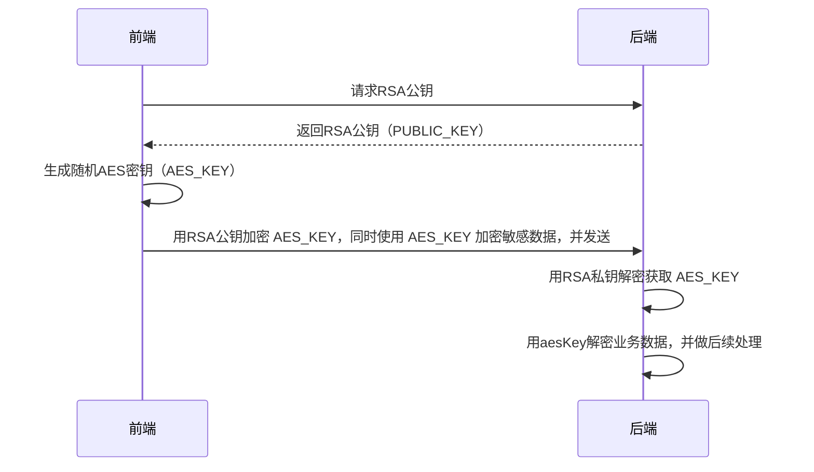

# 敏感数据加密




```ts
  // 1. 获取后端RSA公钥
  const { publicKey: rsaPublicKey } = await fetch("/api/public-key").then(res => res.json());

  // 2. 生成随机AES密钥
  const aesKey = await crypto.subtle.generateKey(
    { name: "AES-GCM", length: 256 },
    true,
    ["encrypt", "decrypt"]
  );

  // 3. 用RSA公钥加密AES密钥
  const exportedAesKey = await crypto.subtle.exportKey("raw", aesKey);
  const encryptedAesKey = await crypto.subtle.encrypt(
    { name: "RSA-OAEP" },
    await crypto.subtle.importKey(
      "spki",
      Buffer.from(rsaPublicKey, "base64"),
      { name: "RSA-OAEP", hash: "SHA-256" },
      false,
      ["encrypt"]
    ),
    exportedAesKey
  );
```