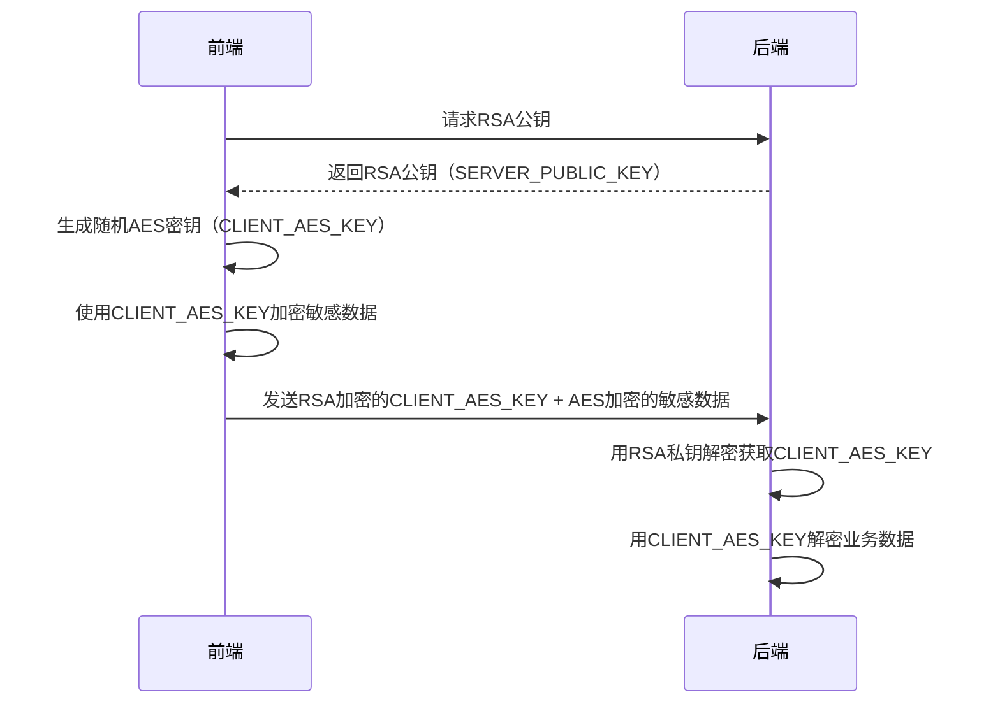
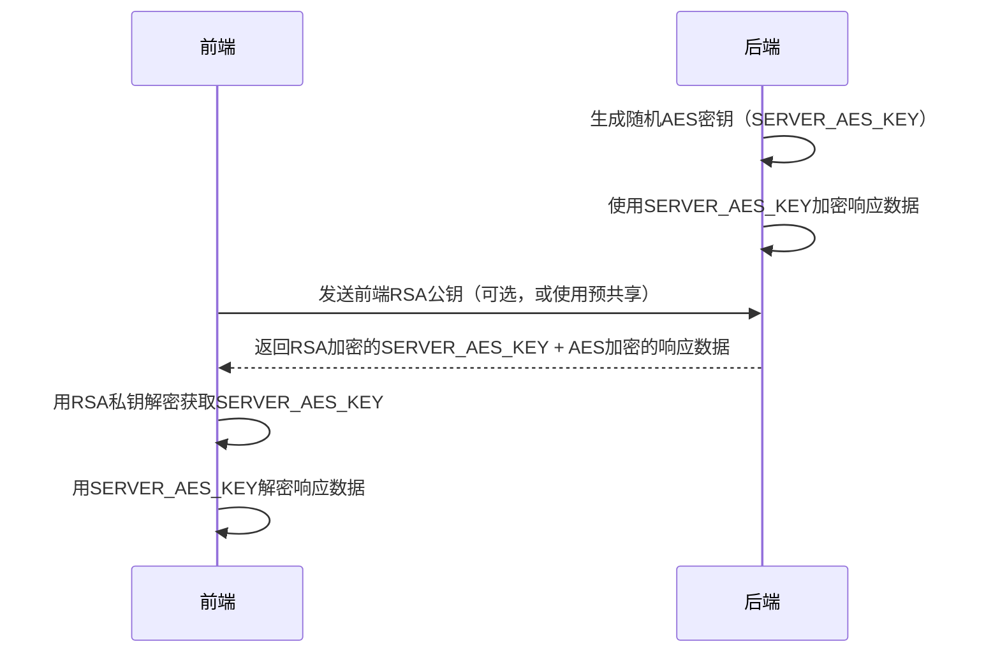

# 敏感数据加密

对敏感数据采用AES加密传输，支持前端到后端和后端到前端的双向加密通信，避免数据泄露

:::warning
采用AES加密传输属于**纵深防御**，在传输数据时，应该确保**优先使用HTTPS**
:::

## 敏感数据说明

### 什么是敏感数据

敏感数据是指一旦泄露、篡改或破坏可能对个人、企业或国家造成危害的数据信息。这些数据需要特殊的保护措施来确保其机密性、完整性和可用性。

### 敏感数据分类

#### 1. 个人身份信息（PII）
- **身份证号码**：18位身份证号码、护照号码等
- **姓名**：真实姓名，特别是与其他信息结合时
- **联系方式**：手机号码、邮箱地址、家庭住址
- **生物特征**：指纹、人脸识别数据、虹膜信息

```typescript
// 示例：个人身份信息
const personalInfo = {
  idCard: "110101199001011234",      // 需要加密
  name: "张三",                     // 需要加密
  phone: "13800138000",            // 需要加密
  email: "zhangsan@example.com"    // 需要加密
};
```

#### 2. 金融信息
- **银行卡号**：信用卡号、借记卡号
- **支付信息**：支付密码、交易流水
- **财务数据**：收入、资产、负债信息

```typescript
// 示例：金融敏感信息
const financialInfo = {
  cardNumber: "6225880123456789",     // 需要加密
  paymentPassword: "pay123456",       // 需要加密
  balance: 50000.00                   // 需要加密
};
```

#### 3. 认证凭据
- **密码**：登录密码、交易密码
- **令牌**：JWT Token、API Key
- **会话信息**：Session ID、Cookie中的敏感信息

```typescript
// 示例：认证凭据
const authInfo = {
  password: "userPassword123",        // 需要加密
  apiKey: "sk-1234567890abcdef",     // 需要加密
  jwtToken: "eyJhbGciOiJIUzI1NiIs..." // 需要加密
};
```

### 敏感数据识别

敏感数据识别是数据保护的第一步，通过自动化手段快速定位系统中的敏感信息，确保所有需要保护的数据都能被及时发现并采取相应的安全措施。

#### 自动识别的重要性

- **全面覆盖**：避免遗漏任何可能包含敏感信息的字段
- **降低风险**：及时发现潜在的数据泄露风险点
- **合规要求**：满足GDPR、CCPA等法规对数据分类的要求
- **开发效率**：减少人工审查工作量，提高开发效率

#### 常用识别规则

下面的正则表达式可以帮助自动识别常见的敏感数据类型：

```typescript
// 敏感数据识别正则表达式
const sensitivePatterns = {
  // 中国大陆18位身份证号码（含校验位）
  idCard: /^[1-9]\d{5}(18|19|20)\d{2}((0[1-9])|(1[0-2]))(([0-2][1-9])|10|20|30|31)\d{3}[0-9Xx]$/,
  
  // 中国大陆手机号码（1开头的11位数字）
  phone: /^1[3-9]\d{9}$/,
  
  // 银行卡号（13-19位数字，支持Luhn算法校验）
  bankCard: /^\d{13,19}$/,
  
  // 邮箱地址（标准RFC格式）
  email: /^[a-zA-Z0-9._%+-]+@[a-zA-Z0-9.-]+\.[a-zA-Z]{2,}$/,
  
  // 密码相关字段名（不区分大小写）
  password: /password|pwd|pass|secret|key/i
};

// 简单检测函数 - 判断字段是否为敏感数据
function isSensitiveField(fieldName: string, value: string): boolean {
  return Object.entries(sensitivePatterns).some(([type, pattern]) => 
    pattern.test(fieldName) || pattern.test(value)
  );
}

// 使用示例
const testData = {
  username: "zhangsan",
  idCard: "110101199001011234",
  mobile: "13800138000"
};

Object.entries(testData).forEach(([key, value]) => {
  if (isSensitiveField(key, value)) {
    console.log(`发现敏感字段: ${key} = ${value}`);
  }
});
```

#### 手动标记方式

对于复杂的业务场景，建议结合手动配置的方式来标记敏感字段：

```typescript
// 配置敏感字段映射表
const sensitiveFields = {
  // 个人身份信息
  'user.name': 'PII',
  'user.idCard': 'PII', 
  'user.phone': 'PII',
  'user.address': 'PII',
  
  // 金融信息
  'payment.cardNumber': 'FINANCIAL',
  'payment.accountNo': 'FINANCIAL',
  'user.salary': 'FINANCIAL',
  
  // 认证凭据
  'auth.password': 'AUTH',
  'auth.apiKey': 'AUTH',
  'session.token': 'AUTH'
};

// 根据字段路径判断敏感级别
function getSensitiveType(fieldPath: string): string | null {
  return sensitiveFields[fieldPath] || null;
}
```

#### 识别结果处理

```typescript
// 敏感数据扫描结果
interface SensitiveDataResult {
  fieldPath: string;      // 字段路径
  dataType: string;       // 敏感数据类型
  value: string;          // 原始值
  riskLevel: 'LOW' | 'MEDIUM' | 'HIGH'; // 风险级别
}

// 扫描函数示例
function scanSensitiveData(data: any, prefix = ''): SensitiveDataResult[] {
  const results: SensitiveDataResult[] = [];
  
  Object.entries(data).forEach(([key, value]) => {
    const fieldPath = prefix ? `${prefix}.${key}` : key;
    
    if (typeof value === 'string' && isSensitiveField(key, value)) {
      results.push({
        fieldPath,
        dataType: getSensitiveType(fieldPath) || 'UNKNOWN',
        value,
        riskLevel: 'HIGH'
      });
    } else if (typeof value === 'object' && value !== null) {
      results.push(...scanSensitiveData(value, fieldPath));
    }
  });
  
  return results;
}
```

### 数据脱敏处理

数据脱敏是在保持数据格式和统计特性基本不变的前提下，对敏感信息进行去标识化处理的技术手段。主要用于测试环境、日志记录、数据分析等场景，既保护了隐私又保证了业务功能的正常运行。

#### 脱敏的应用场景

- **开发测试**：在非生产环境中使用脱敏数据进行开发和测试
- **日志记录**：避免在日志中记录完整的敏感信息
- **数据分析**：在进行统计分析时保护个人隐私
- **第三方对接**：向合作伙伴提供脱敏后的数据样本
- **演示展示**：在产品演示中使用虚假但真实的数据格式

#### 常用脱敏方法

```typescript
// 常用脱敏方法工具类
class DataMasking {
  /**
   * 身份证号脱敏
   * 保留前6位（地区码）和后4位（校验码），中间8位用*替换
   * 示例：110101199001011234 -> 110101********1234
   */
  static maskIdCard(idCard: string): string {
    if (!idCard || idCard.length !== 18) return idCard;
    return idCard.replace(/(\d{6})\d{8}(\d{4})/, '$1********$2');
  }
  
  /**
   * 手机号脱敏
   * 保留前3位和后4位，中间4位用*替换
   * 示例：13800138000 -> 138****8000
   */
  static maskPhone(phone: string): string {
    if (!phone || phone.length !== 11) return phone;
    return phone.replace(/(\d{3})\d{4}(\d{4})/, '$1****$2');
  }
  
  /**
   * 银行卡号脱敏
   * 只保留后4位，其他位数用*替换，并保持4位一组的格式
   * 示例：6225880123456789 -> **** **** **** 6789
   */
  static maskBankCard(cardNumber: string): string {
    if (!cardNumber) return cardNumber;
    const lastFour = cardNumber.slice(-4);
    const maskedLength = Math.max(0, cardNumber.length - 4);
    const maskedGroups = Math.ceil(maskedLength / 4);
    return '**** '.repeat(maskedGroups) + lastFour;
  }
  
  /**
   * 邮箱脱敏
   * 保留第一个字符和@后的域名，用户名其他部分用*替换
   * 示例：zhangsan@example.com -> z*******@example.com
   */
  static maskEmail(email: string): string {
    if (!email || !email.includes('@')) return email;
    const [username, domain] = email.split('@');
    if (username.length <= 1) return email;
    return username[0] + '*'.repeat(username.length - 1) + '@' + domain;
  }
  
  /**
   * 姓名脱敏
   * 保留姓氏，名字部分用*替换
   * 示例：张三 -> 张*，李四五 -> 李**
   */
  static maskName(name: string): string {
    if (!name || name.length <= 1) return name;
    return name[0] + '*'.repeat(name.length - 1);
  }
  
  /**
   * 地址脱敏
   * 保留省市信息，详细地址用*替换
   * 示例：北京市朝阳区某某街道123号 -> 北京市朝阳区****
   */
  static maskAddress(address: string): string {
    if (!address) return address;
    // 匹配省市区的正则表达式
    const match = address.match(/^(.+?[省市].*?[区县市])/);
    if (match) {
      return match[1] + '****';
    }
    // 如果没有匹配到标准格式，保留前几个字符
    return address.length > 6 ? address.substring(0, 6) + '****' : address;
  }
  
  /**
   * 自定义脱敏
   * 根据传入的脱敏函数对数据进行处理
   * @param data 要脱敏的数据对象
   * @param rules 自定义脱敏规则，格式为{字段名: (value) => '脱敏后值'}
   */
  static maskCustom(data: any, rules: Record<string, (value: string) => string>): any {
    if (!data || typeof data !== 'object') return data;
    
    const result = Array.isArray(data) ? [] : {};
    
    Object.entries(data).forEach(([key, value]) => {
      if (typeof value === 'string' && rules[key]) {
        result[key] = rules[key](value);
      } else if (typeof value === 'object' && value !== null) {
        result[key] = this.maskCustom(value, rules);
      } else {
        result[key] = value;
      }
    });
    
    return result;
  }
}

// 批量脱敏处理
class BatchDataMasking {
  private static maskingRules: Record<string, (value: string) => string> = {
    'idCard': DataMasking.maskIdCard,
    'phone': DataMasking.maskPhone,
    'mobile': DataMasking.maskPhone,
    'bankCard': DataMasking.maskBankCard,
    'cardNumber': DataMasking.maskBankCard,
    'email': DataMasking.maskEmail,
    'name': DataMasking.maskName,
    'realName': DataMasking.maskName,
    'address': DataMasking.maskAddress
  };
  
  /**
   * 自动脱敏对象中的敏感字段
   * @param data 要脱敏的数据对象
   * @param customRules 自定义脱敏规则
   */
  static maskObject(data: any, customRules?: Record<string, (value: string) => string>): any {
    if (!data || typeof data !== 'object') return data;
    
    const rules = { ...this.maskingRules, ...customRules };
    const result = Array.isArray(data) ? [] : {};
    
    Object.entries(data).forEach(([key, value]) => {
      if (typeof value === 'string' && rules[key]) {
        result[key] = rules[key](value);
      } else if (typeof value === 'object' && value !== null) {
        result[key] = this.maskObject(value, customRules);
      } else {
        result[key] = value;
      }
    });
    
    return result;
  }
}

// 使用示例
const originalData = {
  name: "张三",
  idCard: "110101199001011234",
  phone: "13800138000",
  email: "zhangsan@example.com",
  address: "北京市朝阳区某某街道123号",
  cardNumber: "6225880123456789"
};

// 单个字段脱敏
console.log('姓名脱敏:', DataMasking.maskName(originalData.name));
console.log('身份证脱敏:', DataMasking.maskIdCard(originalData.idCard));

// 批量脱敏
const maskedData = BatchDataMasking.maskObject(originalData);
console.log('批量脱敏结果:', maskedData);
```

#### 脱敏策略选择

不同的业务场景需要选择合适的脱敏策略：

```typescript
// 脱敏策略枚举
enum MaskingStrategy {
  PARTIAL = 'partial',     // 部分遮盖（如手机号138****8000）
  FULL = 'full',          // 完全遮盖（如密码******）
  HASH = 'hash',          // 哈希替换（保持唯一性但不可逆）
  RANDOM = 'random',      // 随机替换（生成同类型的假数据）
  FORMAT = 'format'       // 格式保留（保持数据格式但内容虚假）
}

// 根据场景选择脱敏策略
function getMaskingStrategy(dataType: string, useCase: string): MaskingStrategy {
  const strategies = {
    'development': {
      'PII': MaskingStrategy.RANDOM,        // 开发环境用随机数据
      'FINANCIAL': MaskingStrategy.FORMAT,   // 保持格式便于测试
      'AUTH': MaskingStrategy.FULL          // 认证信息完全遮盖
    },
    'logging': {
      'PII': MaskingStrategy.PARTIAL,       // 日志中部分遮盖
      'FINANCIAL': MaskingStrategy.HASH,    // 金融信息哈希处理
      'AUTH': MaskingStrategy.FULL          // 认证信息完全遮盖
    },
    'analytics': {
      'PII': MaskingStrategy.HASH,          // 分析时保持唯一性
      'FINANCIAL': MaskingStrategy.PARTIAL, // 部分信息用于统计
      'AUTH': MaskingStrategy.FULL          // 认证信息不参与分析
    }
  };
  
  return strategies[useCase]?.[dataType] || MaskingStrategy.FULL;
}
```

#### 脱敏质量检查

```typescript
// 脱敏质量检查工具
class MaskingQualityChecker {
  /**
   * 检查脱敏是否成功
   * @param original 原始数据
   * @param masked 脱敏后数据
   */
  static validateMasking(original: string, masked: string): boolean {
    // 基本检查：脱敏后的数据不应与原始数据完全相同（除非数据本身就应该被完全遮盖）
    if (original === masked) {
      return false;
    }
    
    // 检查是否包含明显的敏感信息泄露
    const sensitivePatterns = [
      /\d{15,19}/,  // 可能的身份证或银行卡号
      /1[3-9]\d{9}/, // 手机号
      /.+@.+\..+/   // 邮箱
    ];
    
    return !sensitivePatterns.some(pattern => pattern.test(masked));
  }
  
  /**
   * 批量检查脱敏质量
   */
  static batchValidate(originalData: any, maskedData: any): { passed: boolean; issues: string[] } {
    const issues: string[] = [];
    
    function checkObject(orig: any, mask: any, path = '') {
      Object.keys(orig).forEach(key => {
        const currentPath = path ? `${path}.${key}` : key;
        const origValue = orig[key];
        const maskValue = mask[key];
        
        if (typeof origValue === 'string' && typeof maskValue === 'string') {
          if (!this.validateMasking(origValue, maskValue)) {
            issues.push(`字段 ${currentPath} 脱敏不充分`);
          }
        } else if (typeof origValue === 'object' && typeof maskValue === 'object') {
          checkObject(origValue, maskValue, currentPath);
        }
      });
    }
    
    checkObject(originalData, maskedData);
    
    return {
      passed: issues.length === 0,
      issues
    };
  }
}
```

## 前端到后端加密



### 前端实现

```typescript
interface ClientToServerRequest {
  encryptedAesKey: string;
  encryptedData: string;
  iv: string;
}

class ClientEncryption {
  private serverPublicKey: CryptoKey | null = null;

  async init(): Promise<void> {
    const { publicKey } = await fetch("/api/server-public-key").then(res => res.json());
    this.serverPublicKey = await crypto.subtle.importKey(
      "spki",
      this.base64ToArrayBuffer(publicKey),
      { name: "RSA-OAEP", hash: "SHA-256" },
      false,
      ["encrypt"]
    );
  }

  async encryptForServer(data: object): Promise<ClientToServerRequest> {
    if (!this.serverPublicKey) {
      throw new Error("Client encryption not initialized");
    }

    // 生成随机AES密钥
    const aesKey = await crypto.subtle.generateKey(
      { name: "AES-GCM", length: 256 },
      true,
      ["encrypt", "decrypt"]
    );

    // 用服务器RSA公钥加密AES密钥
    const exportedAesKey = await crypto.subtle.exportKey("raw", aesKey);
    const encryptedAesKey = await crypto.subtle.encrypt(
      { name: "RSA-OAEP" },
      this.serverPublicKey,
      exportedAesKey
    );

    // 使用AES密钥加密数据
    const iv = crypto.getRandomValues(new Uint8Array(12));
    const dataToEncrypt = new TextEncoder().encode(JSON.stringify(data));
    const encryptedData = await crypto.subtle.encrypt(
      { name: "AES-GCM", iv },
      aesKey,
      dataToEncrypt
    );

    return {
      encryptedAesKey: this.arrayBufferToBase64(encryptedAesKey),
      encryptedData: this.arrayBufferToBase64(encryptedData),
      iv: this.arrayBufferToBase64(iv)
    };
  }

  async sendEncryptedData(data: object): Promise<any> {
    const encryptedPayload = await this.encryptForServer(data);
    
    const response = await fetch("/api/secure-data", {
      method: "POST",
      headers: { "Content-Type": "application/json" },
      body: JSON.stringify(encryptedPayload)
    });

    if (!response.ok) {
      throw new Error(`HTTP error! status: ${response.status}`);
    }

    return response.json();
  }

  private arrayBufferToBase64(buffer: ArrayBuffer): string {
    return btoa(String.fromCharCode(...new Uint8Array(buffer)));
  }

  private base64ToArrayBuffer(base64: string): ArrayBuffer {
    const binaryString = atob(base64);
    const bytes = new Uint8Array(binaryString.length);
    for (let i = 0; i < binaryString.length; i++) {
      bytes[i] = binaryString.charCodeAt(i);
    }
    return bytes.buffer;
  }
}
```

### 后端实现（接收加密数据）

```typescript
import crypto from 'crypto';
import express from 'express';

// 服务器RSA密钥对
const { privateKey: serverPrivateKey, publicKey: serverPublicKey } = crypto.generateKeyPairSync('rsa', {
  modulusLength: 2048,
  publicKeyEncoding: { type: 'spki', format: 'pem' },
  privateKeyEncoding: { type: 'pkcs8', format: 'pem' }
});

// 提供服务器RSA公钥
app.get('/api/server-public-key', (req, res) => {
  const publicKeyBase64 = Buffer.from(serverPublicKey).toString('base64');
  res.json({ publicKey: publicKeyBase64 });
});

// 接收并解密前端数据
app.post('/api/secure-data', (req, res) => {
  try {
    const { encryptedAesKey, encryptedData, iv } = req.body;

    // 1. 用服务器私钥解密AES密钥
    const encryptedAesKeyBuffer = Buffer.from(encryptedAesKey, 'base64');
    const aesKeyBuffer = crypto.privateDecrypt(
      { key: serverPrivateKey, padding: crypto.constants.RSA_PKCS1_OAEP_PADDING },
      encryptedAesKeyBuffer
    );

    // 2. 用AES密钥解密数据
    const ivBuffer = Buffer.from(iv, 'base64');
    const encryptedDataBuffer = Buffer.from(encryptedData, 'base64');
    
    const decipher = crypto.createDecipheriv('aes-256-gcm', aesKeyBuffer, ivBuffer);
    let decryptedData = decipher.update(encryptedDataBuffer, null, 'utf8');
    decryptedData += decipher.final('utf8');

    const businessData = JSON.parse(decryptedData);
    console.log('接收到前端加密数据:', businessData);

    res.json({ success: true, message: '数据接收成功', data: businessData });
  } catch (error) {
    console.error('解密前端数据失败:', error);
    res.status(400).json({ success: false, message: '数据解密失败' });
  }
});
```

## 后端到前端加密



### 前端实现（接收加密数据）

```typescript
interface ServerToClientResponse {
  encryptedAesKey: string;
  encryptedData: string;
  iv: string;
}

class ClientDecryption {
  private clientPrivateKey: CryptoKey | null = null;
  private clientPublicKey: CryptoKey | null = null;

  async init(): Promise<void> {
    // 生成客户端RSA密钥对
    const keyPair = await crypto.subtle.generateKey(
      {
        name: "RSA-OAEP",
        modulusLength: 2048,
        publicExponent: new Uint8Array([1, 0, 1]),
        hash: "SHA-256"
      },
      true,
      ["encrypt", "decrypt"]
    );

    this.clientPrivateKey = keyPair.privateKey;
    this.clientPublicKey = keyPair.publicKey;
  }

  async getClientPublicKey(): Promise<string> {
    if (!this.clientPublicKey) {
      throw new Error("Client keys not initialized");
    }

    const exported = await crypto.subtle.exportKey("spki", this.clientPublicKey);
    return this.arrayBufferToBase64(exported);
  }

  async decryptFromServer(encryptedResponse: ServerToClientResponse): Promise<any> {
    if (!this.clientPrivateKey) {
      throw new Error("Client decryption not initialized");
    }

    // 1. 用客户端私钥解密AES密钥
    const encryptedAesKeyBuffer = this.base64ToArrayBuffer(encryptedResponse.encryptedAesKey);
    const aesKeyBuffer = await crypto.subtle.decrypt(
      { name: "RSA-OAEP" },
      this.clientPrivateKey,
      encryptedAesKeyBuffer
    );

    // 2. 导入AES密钥
    const aesKey = await crypto.subtle.importKey(
      "raw",
      aesKeyBuffer,
      { name: "AES-GCM" },
      false,
      ["decrypt"]
    );

    // 3. 用AES密钥解密数据
    const iv = this.base64ToArrayBuffer(encryptedResponse.iv);
    const encryptedData = this.base64ToArrayBuffer(encryptedResponse.encryptedData);
    
    const decryptedData = await crypto.subtle.decrypt(
      { name: "AES-GCM", iv },
      aesKey,
      encryptedData
    );

    const jsonString = new TextDecoder().decode(decryptedData);
    return JSON.parse(jsonString);
  }

  async requestEncryptedData(endpoint: string, clientPublicKey?: string): Promise<any> {
    const publicKey = clientPublicKey || await this.getClientPublicKey();
    
    const response = await fetch(endpoint, {
      method: "POST",
      headers: { 
        "Content-Type": "application/json",
        "X-Client-Public-Key": publicKey
      }
    });

    if (!response.ok) {
      throw new Error(`HTTP error! status: ${response.status}`);
    }

    const encryptedResponse: ServerToClientResponse = await response.json();
    return this.decryptFromServer(encryptedResponse);
  }

  private arrayBufferToBase64(buffer: ArrayBuffer): string {
    return btoa(String.fromCharCode(...new Uint8Array(buffer)));
  }

  private base64ToArrayBuffer(base64: string): ArrayBuffer {
    const binaryString = atob(base64);
    const bytes = new Uint8Array(binaryString.length);
    for (let i = 0; i < binaryString.length; i++) {
      bytes[i] = binaryString.charCodeAt(i);
    }
    return bytes.buffer;
  }
}
```

### 后端实现（发送加密数据）

```typescript
// 存储客户端公钥的Map（实际应用中应使用数据库）
const clientPublicKeys = new Map<string, crypto.KeyObject>();

// 处理客户端公钥注册
app.post('/api/register-client-key', (req, res) => {
  try {
    const { clientId, publicKey } = req.body;
    const keyObject = crypto.createPublicKey({
      key: Buffer.from(publicKey, 'base64'),
      format: 'der',
      type: 'spki'
    });
    clientPublicKeys.set(clientId, keyObject);
    res.json({ success: true, message: '客户端公钥注册成功' });
  } catch (error) {
    console.error('客户端公钥注册失败:', error);
    res.status(400).json({ success: false, message: '公钥注册失败' });
  }
});

// 发送加密数据给前端
app.post('/api/encrypted-response', (req, res) => {
  try {
    const clientPublicKeyB64 = req.headers['x-client-public-key'] as string;
    if (!clientPublicKeyB64) {
      return res.status(400).json({ error: '缺少客户端公钥' });
    }

    // 导入客户端公钥
    const clientPublicKey = crypto.createPublicKey({
      key: Buffer.from(clientPublicKeyB64, 'base64'),
      format: 'der',
      type: 'spki'
    });

    // 生成随机AES密钥
    const aesKey = crypto.randomBytes(32);
    
    // 用客户端公钥加密AES密钥
    const encryptedAesKey = crypto.publicEncrypt(
      { key: clientPublicKey, padding: crypto.constants.RSA_PKCS1_OAEP_PADDING },
      aesKey
    );

    // 准备要发送的数据
    const responseData = {
      message: "这是来自服务器的敏感数据",
      timestamp: new Date().toISOString(),
      userInfo: { id: 123, role: "admin" }
    };

    // 使用AES加密响应数据
    const iv = crypto.randomBytes(12);
    const cipher = crypto.createCipheriv('aes-256-gcm', aesKey, iv);
    let encryptedData = cipher.update(JSON.stringify(responseData), 'utf8');
    encryptedData = Buffer.concat([encryptedData, cipher.final()]);

    const encryptedResponse = {
      encryptedAesKey: encryptedAesKey.toString('base64'),
      encryptedData: encryptedData.toString('base64'),
      iv: iv.toString('base64')
    };

    console.log('发送加密数据给前端');
    res.json(encryptedResponse);
  } catch (error) {
    console.error('加密响应数据失败:', error);
    res.status(500).json({ success: false, message: '服务器加密失败' });
  }
});
```

```typescript
// 初始化双向加密
const clientEncryption = new ClientEncryption();
const clientDecryption = new ClientDecryption();

await clientEncryption.init();
await clientDecryption.init();

// 1. 前端到后端加密通信
const sensitiveData = {
  username: "user123",
  password: "secret123",
  creditCard: "1234-5678-9012-3456"
};

try {
  const result = await clientEncryption.sendEncryptedData(sensitiveData);
  console.log("前端到后端加密传输成功:", result);
} catch (error) {
  console.error("前端到后端传输失败:", error);
}

// 2. 后端到前端加密通信
try {
  const encryptedResponse = await clientDecryption.requestEncryptedData("/api/encrypted-response");
  console.log("接收到后端加密数据:", encryptedResponse);
} catch (error) {
  console.error("接收后端数据失败:", error);
}
```

## 性能优化

### 密钥复用策略
- 在同一会话中复用AES密钥减少RSA操作
- 实现密钥缓存机制，避免重复生成
- 批量数据加密时共享密钥

### 异步处理
- 使用Web Workers进行大数据量加密
- 流式加密处理大文件
- 非阻塞式密钥交换

## 安全注意事项

- **密钥管理**：RSA私钥必须安全存储，建议使用HSM或密钥管理服务
- **密钥轮换**：定期更新RSA密钥对
- **AES密钥随机性**：每次传输都应生成新的随机AES密钥
- **IV唯一性**：每次AES加密都应使用唯一的初始化向量
- **HTTPS优先**：加密传输仍需配合HTTPS使用
- **身份验证**：结合JWT或其他认证机制验证通信双方身份
- **重放攻击防护**：可添加时间戳和nonce防止重放攻击
- **错误处理**：避免在错误信息中泄露密钥信息