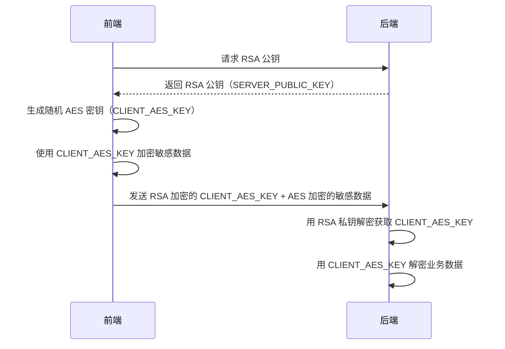

# 敏感数据加密

对敏感数据采用 AES 加密传输，支持前端到后端和后端到前端的双向加密通信，避免数据泄露

:::warning
采用 AES 加密传输属于**纵深防御**，在传输数据时，应该确保**优先使用 HTTPS**
:::

## 敏感数据说明

### 什么是敏感数据

敏感数据是指一旦泄露、篡改或破坏可能对个人、企业或国家造成危害的数据信息。这些数据需要特殊的保护措施来确保其机密性、完整性和可用性。

### 敏感数据分类

#### 1. 个人身份信息（PII）
- **身份证号码**：18位身份证号码、护照号码等
- **姓名**：真实姓名，特别是与其他信息结合时
- **联系方式**：手机号码、邮箱地址、家庭住址
- **生物特征**：指纹、人脸识别数据、虹膜信息

```typescript
// 示例：个人身份信息
const personalInfo = {
  idCard: "110101199001011234",      // 需要加密
  name: "张三",                     // 需要加密
  phone: "13800138000",            // 需要加密
  email: "zhangsan@example.com"    // 需要加密
};
```

#### 2. 金融信息
- **银行卡号**：信用卡号、借记卡号
- **支付信息**：支付密码、交易流水
- **财务数据**：收入、资产、负债信息

```typescript
// 示例：金融敏感信息
const financialInfo = {
  cardNumber: "6225880123456789",     // 需要加密
  paymentPassword: "pay123456",       // 需要加密
  balance: 50000.00                   // 需要加密
};
```

#### 3. 认证凭据
- **密码**：登录密码、交易密码
- **令牌**：JWT Token、API Key
- **会话信息**：Session ID、Cookie中的敏感信息

```typescript
// 示例：认证凭据
const authInfo = {
  password: "userPassword123",        // 需要加密
  apiKey: "sk-1234567890abcdef",     // 需要加密
  jwtToken: "eyJhbGciOiJIUzI1NiIs..." // 需要加密
};
```

### 敏感数据识别

敏感数据识别是数据保护的第一步，通过自动化手段快速定位系统中的敏感信息，确保所有需要保护的数据都能被及时发现并采取相应的安全措施。

#### 自动识别的重要性

- **全面覆盖**：避免遗漏任何可能包含敏感信息的字段
- **降低风险**：及时发现潜在的数据泄露风险点
- **合规要求**：满足 GDPR、CCPA 等法规对数据分类的要求
- **开发效率**：减少人工审查工作量，提高开发效率

#### 常用识别规则

下面的正则表达式可以帮助自动识别常见的敏感数据类型：

```typescript
// 敏感数据识别正则表达式
const sensitivePatterns = {
  // 中国大陆18位身份证号码（含校验位）
  idCard: /^[1-9]\d{5}(18|19|20)\d{2}((0[1-9])|(1[0-2]))(([0-2][1-9])|10|20|30|31)\d{3}[0-9Xx]$/,
  
  // 中国大陆手机号码（1开头的11位数字）
  phone: /^1[3-9]\d{9}$/,
  
  // 银行卡号（13-19位数字，支持Luhn算法校验）
  bankCard: /^\d{13,19}$/,
  
  // 邮箱地址（标准RFC格式）
  email: /^[a-zA-Z0-9._%+-]+@[a-zA-Z0-9.-]+\.[a-zA-Z]{2,}$/,
  
  // 密码相关字段名（不区分大小写）
  password: /password|pwd|pass|secret|key/i
};

// 简单检测函数 - 判断字段是否为敏感数据
function isSensitiveField(fieldName: string, value: string): boolean {
  return Object.entries(sensitivePatterns).some(([type, pattern]) => 
    pattern.test(fieldName) || pattern.test(value)
  );
}

// 使用示例
const testData = {
  username: "zhangsan",
  idCard: "110101199001011234",
  mobile: "13800138000"
};

Object.entries(testData).forEach(([key, value]) => {
  if (isSensitiveField(key, value)) {
    console.log(`发现敏感字段: ${key} = ${value}`);
  }
});
```

#### 手动标记方式

对于复杂的业务场景，建议结合手动配置的方式来标记敏感字段：

```typescript
// 配置敏感字段映射表
const sensitiveFields = {
  // 个人身份信息
  'user.name': 'PII',
  'user.idCard': 'PII', 
  'user.phone': 'PII',
  'user.address': 'PII',
  
  // 金融信息
  'payment.cardNumber': 'FINANCIAL',
  'payment.accountNo': 'FINANCIAL',
  'user.salary': 'FINANCIAL',
  
  // 认证凭据
  'auth.password': 'AUTH',
  'auth.apiKey': 'AUTH',
  'session.token': 'AUTH'
};

// 根据字段路径判断敏感级别
function getSensitiveType(fieldPath: string): string | null {
  return sensitiveFields[fieldPath] || null;
}
```

#### 识别结果处理

```typescript
// 敏感数据扫描结果
interface SensitiveDataResult {
  fieldPath: string;      // 字段路径
  dataType: string;       // 敏感数据类型
  value: string;          // 原始值
  riskLevel: 'LOW' | 'MEDIUM' | 'HIGH'; // 风险级别
}

// 扫描函数示例
function scanSensitiveData(data: any, prefix = ''): SensitiveDataResult[] {
  const results: SensitiveDataResult[] = [];
  
  Object.entries(data).forEach(([key, value]) => {
    const fieldPath = prefix ? `${prefix}.${key}` : key;
    
    if (typeof value === 'string' && isSensitiveField(key, value)) {
      results.push({
        fieldPath,
        dataType: getSensitiveType(fieldPath) || 'UNKNOWN',
        value,
        riskLevel: 'HIGH'
      });
    } else if (typeof value === 'object' && value !== null) {
      results.push(...scanSensitiveData(value, fieldPath));
    }
  });
  
  return results;
}
```

### 数据脱敏处理

数据脱敏是在保持数据格式和统计特性基本不变的前提下，对敏感信息进行去标识化处理的技术手段。主要用于测试环境、日志记录、数据分析等场景，既保护了隐私又保证了业务功能的正常运行。

#### 脱敏的应用场景

- **开发测试**：在非生产环境中使用脱敏数据进行开发和测试
- **日志记录**：避免在日志中记录完整的敏感信息
- **数据分析**：在进行统计分析时保护个人隐私
- **第三方对接**：向合作伙伴提供脱敏后的数据样本
- **演示展示**：在产品演示中使用虚假但真实的数据格式

#### 常用脱敏方法

```typescript
// 常用脱敏方法工具类
class DataMasking {
  /**
   * 身份证号脱敏
   * 保留前6位（地区码）和后4位（校验码），中间8位用*替换
   * 示例：110101199001011234 -> 110101********1234
   */
  static maskIdCard(idCard: string): string {
    if (!idCard || idCard.length !== 18) return idCard;
    return idCard.replace(/(\d{6})\d{8}(\d{4})/, '$1********$2');
  }
  
  /**
   * 手机号脱敏
   * 保留前3位和后4位，中间4位用*替换
   * 示例：13800138000 -> 138****8000
   */
  static maskPhone(phone: string): string {
    if (!phone || phone.length !== 11) return phone;
    return phone.replace(/(\d{3})\d{4}(\d{4})/, '$1****$2');
  }
  
  /**
   * 银行卡号脱敏
   * 只保留后4位，其他位数用*替换，并保持4位一组的格式
   * 示例：6225880123456789 -> **** **** **** 6789
   */
  static maskBankCard(cardNumber: string): string {
    if (!cardNumber) return cardNumber;
    const lastFour = cardNumber.slice(-4);
    const maskedLength = Math.max(0, cardNumber.length - 4);
    const maskedGroups = Math.ceil(maskedLength / 4);
    return '**** '.repeat(maskedGroups) + lastFour;
  }
  
  /**
   * 邮箱脱敏
   * 保留第一个字符和@后的域名，用户名其他部分用*替换
   * 示例：zhangsan@example.com -> z*******@example.com
   */
  static maskEmail(email: string): string {
    if (!email || !email.includes('@')) return email;
    const [username, domain] = email.split('@');
    if (username.length <= 1) return email;
    return username[0] + '*'.repeat(username.length - 1) + '@' + domain;
  }
  
  /**
   * 姓名脱敏
   * 保留姓氏，名字部分用*替换
   * 示例：张三 -> 张*，李四五 -> 李**
   */
  static maskName(name: string): string {
    if (!name || name.length <= 1) return name;
    return name[0] + '*'.repeat(name.length - 1);
  }
  
  /**
   * 地址脱敏
   * 保留省市信息，详细地址用*替换
   * 示例：北京市朝阳区某某街道123号 -> 北京市朝阳区****
   */
  static maskAddress(address: string): string {
    if (!address) return address;
    // 匹配省市区的正则表达式
    const match = address.match(/^(.+?[省市].*?[区县市])/);
    if (match) {
      return match[1] + '****';
    }
    // 如果没有匹配到标准格式，保留前几个字符
    return address.length > 6 ? address.substring(0, 6) + '****' : address;
  }
  
  /**
   * 自定义脱敏
   * 根据传入的脱敏函数对数据进行处理
   * @param data 要脱敏的数据对象
   * @param rules 自定义脱敏规则，格式为{字段名: (value) => '脱敏后值'}
   */
  static maskCustom(data: any, rules: Record<string, (value: string) => string>): any {
    if (!data || typeof data !== 'object') return data;
    
    const result = Array.isArray(data) ? [] : {};
    
    Object.entries(data).forEach(([key, value]) => {
      if (typeof value === 'string' && rules[key]) {
        result[key] = rules[key](value);
      } else if (typeof value === 'object' && value !== null) {
        result[key] = this.maskCustom(value, rules);
      } else {
        result[key] = value;
      }
    });
    
    return result;
  }
}

// 批量脱敏处理
class BatchDataMasking {
  private static maskingRules: Record<string, (value: string) => string> = {
    'idCard': DataMasking.maskIdCard,
    'phone': DataMasking.maskPhone,
    'mobile': DataMasking.maskPhone,
    'bankCard': DataMasking.maskBankCard,
    'cardNumber': DataMasking.maskBankCard,
    'email': DataMasking.maskEmail,
    'name': DataMasking.maskName,
    'realName': DataMasking.maskName,
    'address': DataMasking.maskAddress
  };
  
  /**
   * 自动脱敏对象中的敏感字段
   * @param data 要脱敏的数据对象
   * @param customRules 自定义脱敏规则
   */
  static maskObject(data: any, customRules?: Record<string, (value: string) => string>): any {
    if (!data || typeof data !== 'object') return data;
    
    const rules = { ...this.maskingRules, ...customRules };
    const result = Array.isArray(data) ? [] : {};
    
    Object.entries(data).forEach(([key, value]) => {
      if (typeof value === 'string' && rules[key]) {
        result[key] = rules[key](value);
      } else if (typeof value === 'object' && value !== null) {
        result[key] = this.maskObject(value, customRules);
      } else {
        result[key] = value;
      }
    });
    
    return result;
  }
}

// 使用示例
const originalData = {
  name: "张三",
  idCard: "110101199001011234",
  phone: "13800138000",
  email: "zhangsan@example.com",
  address: "北京市朝阳区某某街道123号",
  cardNumber: "6225880123456789"
};

// 单个字段脱敏
console.log('姓名脱敏:', DataMasking.maskName(originalData.name));
console.log('身份证脱敏:', DataMasking.maskIdCard(originalData.idCard));

// 批量脱敏
const maskedData = BatchDataMasking.maskObject(originalData);
console.log('批量脱敏结果:', maskedData);
```

## 数据加密

为了保护敏感数据在传输过程中的安全，我们采用了基于 RSA 和 AES 的混合加密方案，既保证了数据传输的安全性，又兼顾了系统性能。加密传输分为前端到后端和后端到前端两个方向，通过非对称密钥交换和对称加密相结合的方式，实现了端到端的数据保护。

### 前端到后端加密

前端生成随机 AES 密钥加密敏感数据，然后使用服务端公钥加密 AES 密钥，服务端接收后用私钥解密得到 AES 密钥，再用此密钥解密业务数据。



#### 前端实现

```typescript
interface ClientToServerRequest {
  encryptedAesKey: string;
  encryptedData: string;
  iv: string;
}

class ClientEncryption {
  private serverPublicKey: CryptoKey | null = null;

  async init(): Promise<void> {
    const { publicKey } = await fetch("/api/server-public-key").then(res => res.json());
    this.serverPublicKey = await crypto.subtle.importKey(
      "spki",
      this.base64ToArrayBuffer(publicKey),
      { name: "RSA-OAEP", hash: "SHA-256" },
      false,
      ["encrypt"]
    );
  }

  async encryptForServer(data: object): Promise<ClientToServerRequest> {
    if (!this.serverPublicKey) {
      throw new Error("Client encryption not initialized");
    }

    // 生成随机AES密钥
    const aesKey = await crypto.subtle.generateKey(
      { name: "AES-GCM", length: 256 },
      true,
      ["encrypt", "decrypt"]
    );

    // 用服务器RSA公钥加密AES密钥
    const exportedAesKey = await crypto.subtle.exportKey("raw", aesKey);
    const encryptedAesKey = await crypto.subtle.encrypt(
      { name: "RSA-OAEP" },
      this.serverPublicKey,
      exportedAesKey
    );

    // 使用AES密钥加密数据
    const iv = crypto.getRandomValues(new Uint8Array(12));
    const dataToEncrypt = new TextEncoder().encode(JSON.stringify(data));
    const encryptedData = await crypto.subtle.encrypt(
      { name: "AES-GCM", iv },
      aesKey,
      dataToEncrypt
    );

    return {
      encryptedAesKey: this.arrayBufferToBase64(encryptedAesKey),
      encryptedData: this.arrayBufferToBase64(encryptedData),
      iv: this.arrayBufferToBase64(iv)
    };
  }

  async sendEncryptedData(data: object): Promise<any> {
    const encryptedPayload = await this.encryptForServer(data);
    
    const response = await fetch("/api/secure-data", {
      method: "POST",
      headers: { "Content-Type": "application/json" },
      body: JSON.stringify(encryptedPayload)
    });

    if (!response.ok) {
      throw new Error(`HTTP error! status: ${response.status}`);
    }

    return response.json();
  }

  private arrayBufferToBase64(buffer: ArrayBuffer): string {
    return btoa(String.fromCharCode(...new Uint8Array(buffer)));
  }

  private base64ToArrayBuffer(base64: string): ArrayBuffer {
    const binaryString = atob(base64);
    const bytes = new Uint8Array(binaryString.length);
    for (let i = 0; i < binaryString.length; i++) {
      bytes[i] = binaryString.charCodeAt(i);
    }
    return bytes.buffer;
  }
}
```

#### 后端实现

import Tabs from '@theme/Tabs';
import TabItem from '@theme/TabItem';

<Tabs>
<TabItem value="nestjs" label="NestJS" default>
<Tabs>
<TabItem value="controller" label="Controller">

```typescript
// filepath: src/encryption/encryption.controller.ts
import { Controller, Post, Get, Body, Headers, BadRequestException, InternalServerErrorException } from '@nestjs/common';
import { EncryptionService } from './encryption.service';

@Controller('api')
export class EncryptionController {
  constructor(private readonly encryptionService: EncryptionService) {}

  @Get('server-public-key')
  getServerPublicKey() {
    return { publicKey: this.encryptionService.getServerPublicKey() };
  }

  @Post('secure-data')
  receiveEncryptedData(@Body() body: { encryptedAesKey: string; encryptedData: string; iv: string }) {
    try {
      const { encryptedAesKey, encryptedData, iv } = body;
      const businessData = this.encryptionService.decryptClientData(encryptedAesKey, encryptedData, iv);
      
      console.log('接收到前端加密数据:', businessData);
      return { success: true, message: '数据接收成功', data: businessData };
    } catch (error) {
      throw new BadRequestException('数据解密失败');
    }
  }

  @Post('encrypted-response')
  sendEncryptedData(@Headers('x-client-public-key') clientPublicKey: string) {
    try {
      if (!clientPublicKey) {
        throw new BadRequestException('缺少客户端公钥');
      }

      const responseData = {
        message: "这是来自服务器的敏感数据",
        timestamp: new Date().toISOString(),
        userInfo: { id: 123, role: "admin" }
      };

      const encryptedResponse = this.encryptionService.encryptDataForClient(responseData, clientPublicKey);
      console.log('发送加密数据给前端');
      return encryptedResponse;
    } catch (error) {
      throw new InternalServerErrorException('服务器加密失败');
    }
  }
}
```

</TabItem>
<TabItem value="service" label="Service">

```typescript
// filepath: src/encryption/encryption.service.ts
import { Injectable } from '@nestjs/common';
import * as crypto from 'crypto';

@Injectable()
export class EncryptionService {
  private serverKeyPair: { privateKey: string; publicKey: string };

  constructor() {
    // 生成服务器RSA密钥对
    this.serverKeyPair = crypto.generateKeyPairSync('rsa', {
      modulusLength: 2048,
      publicKeyEncoding: { type: 'spki', format: 'pem' },
      privateKeyEncoding: { type: 'pkcs8', format: 'pem' }
    });
  }

  getServerPublicKey(): string {
    return Buffer.from(this.serverKeyPair.publicKey).toString('base64');
  }

  decryptClientData(encryptedAesKey: string, encryptedData: string, iv: string): any {
    try {
      // 1. 用服务器私钥解密AES密钥
      const encryptedAesKeyBuffer = Buffer.from(encryptedAesKey, 'base64');
      const aesKeyBuffer = crypto.privateDecrypt(
        { key: this.serverKeyPair.privateKey, padding: crypto.constants.RSA_PKCS1_OAEP_PADDING },
        encryptedAesKeyBuffer
      );

      // 2. 用AES密钥解密数据
      const ivBuffer = Buffer.from(iv, 'base64');
      const encryptedDataBuffer = Buffer.from(encryptedData, 'base64');
      
      const decipher = crypto.createDecipheriv('aes-256-gcm', aesKeyBuffer, ivBuffer);
      let decryptedData = decipher.update(encryptedDataBuffer, undefined, 'utf8');
      decryptedData += decipher.final('utf8');

      return JSON.parse(decryptedData);
    } catch (error) {
      throw new Error('数据解密失败');
    }
  }

  encryptDataForClient(data: any, clientPublicKey: string): any {
    try {
      const publicKey = crypto.createPublicKey({
        key: Buffer.from(clientPublicKey, 'base64'),
        format: 'der',
        type: 'spki'
      });

      // 生成随机AES密钥
      const aesKey = crypto.randomBytes(32);
      
      // 用客户端公钥加密AES密钥
      const encryptedAesKey = crypto.publicEncrypt(
        { key: publicKey, padding: crypto.constants.RSA_PKCS1_OAEP_PADDING },
        aesKey
      );

      // 使用AES加密响应数据
      const iv = crypto.randomBytes(12);
      const cipher = crypto.createCipheriv('aes-256-gcm', aesKey, iv);
      let encryptedData = cipher.update(JSON.stringify(data), 'utf8');
      encryptedData = Buffer.concat([encryptedData, cipher.final()]);

      return {
        encryptedAesKey: encryptedAesKey.toString('base64'),
        encryptedData: encryptedData.toString('base64'),
        iv: iv.toString('base64')
      };
    } catch (error) {
      throw new Error('数据加密失败');
    }
  }
}
```

</TabItem>
<TabItem value="module" label="Module">

```typescript
// filepath: src/encryption/encryption.module.ts
import { Module } from '@nestjs/common';
import { EncryptionController } from './encryption.controller';
import { EncryptionService } from './encryption.service';

@Module({
  controllers: [EncryptionController],
  providers: [EncryptionService],
  exports: [EncryptionService]
})
export class EncryptionModule {}
```

</TabItem>
</Tabs>
</TabItem>

<TabItem value="springboot" label="Spring Boot">
<Tabs>
<TabItem value="controller" label="Controller">

```java
// filepath: src/main/java/com/example/encryption/controller/EncryptionController.java
package com.example.encryption.controller;

import com.example.encryption.service.EncryptionService;
import org.springframework.beans.factory.annotation.Autowired;
import org.springframework.http.ResponseEntity;
import org.springframework.web.bind.annotation.*;
import java.util.Map;

@RestController
@RequestMapping("/api")
public class EncryptionController {

    @Autowired
    private EncryptionService encryptionService;

    @GetMapping("/server-public-key")
    public ResponseEntity<Map<String, String>> getServerPublicKey() {
        String publicKey = encryptionService.getServerPublicKey();
        return ResponseEntity.ok(Map.of("publicKey", publicKey));
    }

    @PostMapping("/secure-data")
    public ResponseEntity<Map<String, Object>> receiveEncryptedData(@RequestBody Map<String, String> request) {
        try {
            String encryptedAesKey = request.get("encryptedAesKey");
            String encryptedData = request.get("encryptedData");
            String iv = request.get("iv");
            
            Object businessData = encryptionService.decryptClientData(encryptedAesKey, encryptedData, iv);
            System.out.println("接收到前端加密数据: " + businessData);
            
            return ResponseEntity.ok(Map.of(
                "success", true,
                "message", "数据接收成功",
                "data", businessData
            ));
        } catch (Exception e) {
            return ResponseEntity.badRequest().body(Map.of(
                "success", false,
                "message", "数据解密失败"
            ));
        }
    }

    @PostMapping("/encrypted-response")
    public ResponseEntity<Map<String, String>> sendEncryptedData(
            @RequestHeader("X-Client-Public-Key") String clientPublicKey) {
        try {
            if (clientPublicKey == null || clientPublicKey.isEmpty()) {
                return ResponseEntity.badRequest().body(Map.of("error", "缺少客户端公钥"));
            }

            Map<String, Object> responseData = Map.of(
                "message", "这是来自服务器的敏感数据",
                "timestamp", java.time.Instant.now().toString(),
                "userInfo", Map.of("id", 123, "role", "admin")
            );

            Map<String, String> encryptedResponse = encryptionService.encryptDataForClient(responseData, clientPublicKey);
            System.out.println("发送加密数据给前端");
            return ResponseEntity.ok(encryptedResponse);
        } catch (Exception e) {
            return ResponseEntity.internalServerError().body(Map.of("error", "服务器加密失败"));
        }
    }
}
```

</TabItem>
<TabItem value="service" label="Service">

```java
// filepath: src/main/java/com/example/encryption/service/EncryptionService.java
package com.example.encryption.service;

import com.fasterxml.jackson.databind.ObjectMapper;
import org.springframework.stereotype.Service;
import javax.crypto.Cipher;
import javax.crypto.KeyGenerator;
import javax.crypto.SecretKey;
import javax.crypto.spec.GCMParameterSpec;
import javax.crypto.spec.SecretKeySpec;
import java.security.*;
import java.security.spec.X509EncodedKeySpec;
import java.util.Base64;
import java.util.HashMap;
import java.util.Map;

@Service
public class EncryptionService {
    
    private final KeyPair serverKeyPair;
    private final ObjectMapper objectMapper;

    public EncryptionService() {
        this.objectMapper = new ObjectMapper();
        this.serverKeyPair = generateRSAKeyPair();
    }

    private KeyPair generateRSAKeyPair() {
        try {
            KeyPairGenerator keyGen = KeyPairGenerator.getInstance("RSA");
            keyGen.initialize(2048);
            return keyGen.generateKeyPair();
        } catch (Exception e) {
            throw new RuntimeException("RSA密钥对生成失败", e);
        }
    }

    public String getServerPublicKey() {
        byte[] publicKeyBytes = serverKeyPair.getPublic().getEncoded();
        return Base64.getEncoder().encodeToString(publicKeyBytes);
    }

    public Object decryptClientData(String encryptedAesKey, String encryptedData, String iv) throws Exception {
        // 1. 用服务器私钥解密AES密钥
        byte[] encryptedAesKeyBytes = Base64.getDecoder().decode(encryptedAesKey);
        Cipher rsaCipher = Cipher.getInstance("RSA/ECB/OAEPWithSHA-256AndMGF1Padding");
        rsaCipher.init(Cipher.DECRYPT_MODE, serverKeyPair.getPrivate());
        byte[] aesKeyBytes = rsaCipher.doFinal(encryptedAesKeyBytes);

        // 2. 用AES密钥解密数据
        SecretKey aesKey = new SecretKeySpec(aesKeyBytes, "AES");
        byte[] ivBytes = Base64.getDecoder().decode(iv);
        byte[] encryptedDataBytes = Base64.getDecoder().decode(encryptedData);

        Cipher aesCipher = Cipher.getInstance("AES/GCM/NoPadding");
        GCMParameterSpec gcmSpec = new GCMParameterSpec(128, ivBytes);
        aesCipher.init(Cipher.DECRYPT_MODE, aesKey, gcmSpec);
        
        byte[] decryptedBytes = aesCipher.doFinal(encryptedDataBytes);
        String decryptedJson = new String(decryptedBytes, "UTF-8");
        
        return objectMapper.readValue(decryptedJson, Object.class);
    }

    public Map<String, String> encryptDataForClient(Object data, String clientPublicKeyB64) throws Exception {
        // 导入客户端公钥
        byte[] publicKeyBytes = Base64.getDecoder().decode(clientPublicKeyB64);
        X509EncodedKeySpec keySpec = new X509EncodedKeySpec(publicKeyBytes);
        KeyFactory keyFactory = KeyFactory.getInstance("RSA");
        PublicKey clientPublicKey = keyFactory.generatePublic(keySpec);

        // 生成随机AES密钥
        KeyGenerator keyGen = KeyGenerator.getInstance("AES");
        keyGen.init(256);
        SecretKey aesKey = keyGen.generateKey();

        // 用客户端公钥加密AES密钥
        Cipher rsaCipher = Cipher.getInstance("RSA/ECB/OAEPWithSHA-256AndMGF1Padding");
        rsaCipher.init(Cipher.ENCRYPT_MODE, clientPublicKey);
        byte[] encryptedAesKey = rsaCipher.doFinal(aesKey.getEncoded());

        // 使用AES加密响应数据
        String jsonData = objectMapper.writeValueAsString(data);
        byte[] iv = new byte[12];
        new SecureRandom().nextBytes(iv);

        Cipher aesCipher = Cipher.getInstance("AES/GCM/NoPadding");
        GCMParameterSpec gcmSpec = new GCMParameterSpec(128, iv);
        aesCipher.init(Cipher.ENCRYPT_MODE, aesKey, gcmSpec);
        byte[] encryptedData = aesCipher.doFinal(jsonData.getBytes("UTF-8"));

        Map<String, String> result = new HashMap<>();
        result.put("encryptedAesKey", Base64.getEncoder().encodeToString(encryptedAesKey));
        result.put("encryptedData", Base64.getEncoder().encodeToString(encryptedData));
        result.put("iv", Base64.getEncoder().encodeToString(iv));
        
        return result;
    }
}
```

</TabItem>
<TabItem value="module" label="Module">

```java
// filepath: src/main/java/com/example/encryption/EncryptionApplication.java
package com.example.encryption;

import org.springframework.boot.SpringApplication;
import org.springframework.boot.autoconfigure.SpringBootApplication;

@SpringBootApplication
public class EncryptionApplication {

    public static void main(String[] args) {
        SpringApplication.run(EncryptionApplication.class, args);
    }
}
```

</TabItem>
</Tabs>
</TabItem>

<TabItem value="django" label="Django">
<Tabs>
<TabItem value="views" label="Views">

```python
# filepath: encryption/views.py
import json
import base64
import os
from datetime import datetime
from cryptography.hazmat.primitives import hashes, serialization
from cryptography.hazmat.primitives.asymmetric import rsa, padding
from cryptography.hazmat.primitives.ciphers import Cipher, algorithms, modes
from cryptography.hazmat.backends import default_backend
from django.http import JsonResponse
from django.views.decorators.csrf import csrf_exempt
from django.views.decorators.http import require_http_methods
import logging

from .services import EncryptionService

logger = logging.getLogger(__name__)

# 全局加密服务实例
encryption_service = EncryptionService()

@require_http_methods(["GET"])
def get_server_public_key(request):
    """获取服务器RSA公钥"""
    try:
        public_key = encryption_service.get_server_public_key()
        return JsonResponse({'publicKey': public_key})
    except Exception as e:
        logger.error(f"获取服务器公钥失败: {str(e)}")
        return JsonResponse({'error': '获取公钥失败'}, status=500)

@csrf_exempt
@require_http_methods(["POST"])
def receive_encrypted_data(request):
    """接收并解密前端数据"""
    try:
        data = json.loads(request.body)
        encrypted_aes_key = data.get('encryptedAesKey')
        encrypted_data = data.get('encryptedData')
        iv = data.get('iv')

        if not all([encrypted_aes_key, encrypted_data, iv]):
            return JsonResponse({'error': '缺少必要参数'}, status=400)

        business_data = encryption_service.decrypt_client_data(
            encrypted_aes_key, encrypted_data, iv
        )
        
        logger.info(f"接收到前端加密数据: {business_data}")
        return JsonResponse({
            'success': True,
            'message': '数据接收成功',
            'data': business_data
        })
    except Exception as e:
        logger.error(f"解密前端数据失败: {str(e)}")
        return JsonResponse({'success': False, 'message': '数据解密失败'}, status=400)

@csrf_exempt
@require_http_methods(["POST"])
def send_encrypted_data(request):
    """发送加密数据给前端"""
    try:
        client_public_key = request.META.get('HTTP_X_CLIENT_PUBLIC_KEY')
        if not client_public_key:
            return JsonResponse({'error': '缺少客户端公钥'}, status=400)

        response_data = {
            'message': "这是来自服务器的敏感数据",
            'timestamp': datetime.now().isoformat(),
            'userInfo': {'id': 123, 'role': 'admin'}
        }

        encrypted_response = encryption_service.encrypt_data_for_client(
            response_data, client_public_key
        )
        
        logger.info("发送加密数据给前端")
        return JsonResponse(encrypted_response)
    except Exception as e:
        logger.error(f"加密响应数据失败: {str(e)}")
        return JsonResponse({'error': '服务器加密失败'}, status=500)
```

</TabItem>
<TabItem value="services" label="Services">

```python
# filepath: encryption/services.py
import json
import base64
import os
from cryptography.hazmat.primitives import hashes, serialization
from cryptography.hazmat.primitives.asymmetric import rsa, padding
from cryptography.hazmat.primitives.ciphers import Cipher, algorithms, modes
from cryptography.hazmat.backends import default_backend

class EncryptionService:
    def __init__(self):
        # 生成服务器RSA密钥对
        self.server_private_key = rsa.generate_private_key(
            public_exponent=65537,
            key_size=2048,
            backend=default_backend()
        )
        self.server_public_key = self.server_private_key.public_key()

    def get_server_public_key(self):
        """获取服务器公钥的Base64编码"""
        public_key_bytes = self.server_public_key.public_bytes(
            encoding=serialization.Encoding.DER,
            format=serialization.PublicFormat.SubjectPublicKeyInfo
        )
        return base64.b64encode(public_key_bytes).decode('utf-8')

    def decrypt_client_data(self, encrypted_aes_key, encrypted_data, iv):
        """解密客户端发送的数据"""
        try:
            # 1. 用服务器私钥解密AES密钥
            encrypted_aes_key_bytes = base64.b64decode(encrypted_aes_key)
            aes_key_bytes = self.server_private_key.decrypt(
                encrypted_aes_key_bytes,
                padding.OAEP(
                    mgf=padding.MGF1(algorithm=hashes.SHA256()),
                    algorithm=hashes.SHA256(),
                    label=None
                )
            )

            # 2. 用AES密钥解密数据
            iv_bytes = base64.b64decode(iv)
            encrypted_data_bytes = base64.b64decode(encrypted_data)

            cipher = Cipher(
                algorithms.AES(aes_key_bytes),
                modes.GCM(iv_bytes),
                backend=default_backend()
            )
            decryptor = cipher.decryptor()
            decrypted_data = decryptor.update(encrypted_data_bytes) + decryptor.finalize()

            return json.loads(decrypted_data.decode('utf-8'))
        except Exception as e:
            raise Exception(f"数据解密失败: {str(e)}")

    def encrypt_data_for_client(self, data, client_public_key_b64):
        """为客户端加密数据"""
        try:
            # 导入客户端公钥
            client_public_key_bytes = base64.b64decode(client_public_key_b64)
            client_public_key = serialization.load_der_public_key(
                client_public_key_bytes,
                backend=default_backend()
            )

            # 生成随机AES密钥
            aes_key = os.urandom(32)  # 256位密钥

            # 用客户端公钥加密AES密钥
            encrypted_aes_key = client_public_key.encrypt(
                aes_key,
                padding.OAEP(
                    mgf=padding.MGF1(algorithm=hashes.SHA256()),
                    algorithm=hashes.SHA256(),
                    label=None
                )
            )

            # 使用AES加密响应数据
            json_data = json.dumps(data)
            iv = os.urandom(12)  # 96位IV用于GCM

            cipher = Cipher(
                algorithms.AES(aes_key),
                modes.GCM(iv),
                backend=default_backend()
            )
            encryptor = cipher.encryptor()
            encrypted_data = encryptor.update(json_data.encode('utf-8')) + encryptor.finalize()

            return {
                'encryptedAesKey': base64.b64encode(encrypted_aes_key).decode('utf-8'),
                'encryptedData': base64.b64encode(encrypted_data).decode('utf-8'),
                'iv': base64.b64encode(iv).decode('utf-8')
            }
        except Exception as e:
            raise Exception(f"数据加密失败: {str(e)}")
```

</TabItem>
</Tabs>
</TabItem>

<TabItem value="laravel" label="Laravel">
<Tabs>
<TabItem value="controller" label="Controller">

```php
<?php
// filepath: app/Http/Controllers/EncryptionController.php
namespace App\Http\Controllers;

use App\Services\EncryptionService;
use Illuminate\Http\Request;
use Illuminate\Http\JsonResponse;
use Illuminate\Support\Facades\Log;
use Exception;

class EncryptionController extends Controller
{
    private $encryptionService;

    public function __construct(EncryptionService $encryptionService)
    {
        $this->encryptionService = $encryptionService;
    }

    public function getServerPublicKey(): JsonResponse
    {
        try {
            $publicKey = $this->encryptionService->getServerPublicKey();
            return response()->json(['publicKey' => $publicKey]);
        } catch (Exception $e) {
            Log::error('获取服务器公钥失败: ' . $e->getMessage());
            return response()->json(['error' => '获取公钥失败'], 500);
        }
    }

    public function receiveEncryptedData(Request $request): JsonResponse
    {
        try {
            $encryptedAesKey = $request->input('encryptedAesKey');
            $encryptedData = $request->input('encryptedData');
            $iv = $request->input('iv');

            if (!$encryptedAesKey || !$encryptedData || !$iv) {
                return response()->json(['error' => '缺少必要参数'], 400);
            }

            $businessData = $this->encryptionService->decryptClientData(
                $encryptedAesKey,
                $encryptedData,
                $iv
            );

            Log::info('接收到前端加密数据', $businessData);

            return response()->json([
                'success' => true,
                'message' => '数据接收成功',
                'data' => $businessData
            ]);
        } catch (Exception $e) {
            Log::error('解密前端数据失败: ' . $e->getMessage());
            return response()->json([
                'success' => false,
                'message' => '数据解密失败'
            ], 400);
        }
    }

    public function sendEncryptedData(Request $request): JsonResponse
    {
        try {
            $clientPublicKey = $request->header('X-Client-Public-Key');
            if (!$clientPublicKey) {
                return response()->json(['error' => '缺少客户端公钥'], 400);
            }

            $responseData = [
                'message' => '这是来自服务器的敏感数据',
                'timestamp' => now()->toISOString(),
                'userInfo' => ['id' => 123, 'role' => 'admin']
            ];

            $encryptedResponse = $this->encryptionService->encryptDataForClient(
                $responseData,
                $clientPublicKey
            );

            Log::info('发送加密数据给前端');
            return response()->json($encryptedResponse);
        } catch (Exception $e) {
            Log::error('加密响应数据失败: ' . $e->getMessage());
            return response()->json(['error' => '服务器加密失败'], 500);
        }
    }
}
```

</TabItem>
<TabItem value="service" label="Service">

```php
<?php
// filepath: app/Services/EncryptionService.php
namespace App\Services;

use Exception;
use Illuminate\Support\Facades\Log;

class EncryptionService
{
    private $serverPrivateKey;
    private $serverPublicKey;

    public function __construct()
    {
        // 生成服务器RSA密钥对
        $config = [
            "digest_alg" => "sha256",
            "private_key_bits" => 2048,
            "private_key_type" => OPENSSL_KEYTYPE_RSA,
        ];

        $res = openssl_pkey_new($config);
        openssl_pkey_export($res, $this->serverPrivateKey);

        $details = openssl_pkey_get_details($res);
        $this->serverPublicKey = $details['key'];
    }

    public function getServerPublicKey(): string
    {
        return base64_encode($this->serverPublicKey);
    }

    public function decryptClientData(string $encryptedAesKey, string $encryptedData, string $iv): array
    {
        try {
            // 1. 用服务器私钥解密AES密钥
            $encryptedAesKeyBinary = base64_decode($encryptedAesKey);
            $aesKey = '';
            
            if (!openssl_private_decrypt($encryptedAesKeyBinary, $aesKey, $this->serverPrivateKey, OPENSSL_RAW_DATA)) {
                throw new Exception('AES密钥解密失败');
            }

            // 2. 用AES密钥解密数据
            $ivBinary = base64_decode($iv);
            $encryptedDataBinary = base64_decode($encryptedData);

            $decryptedData = openssl_decrypt(
                $encryptedDataBinary,
                'aes-256-gcm',
                $aesKey,
                OPENSSL_RAW_DATA,
                $ivBinary
            );

            if ($decryptedData === false) {
                throw new Exception('数据解密失败');
            }

            return json_decode($decryptedData, true);
        } catch (Exception $e) {
            throw new Exception('数据解密失败: ' . $e->getMessage());
        }
    }

    public function encryptDataForClient(array $data, string $clientPublicKeyB64): array
    {
        try {
            // 导入客户端公钥
            $clientPublicKey = base64_decode($clientPublicKeyB64);

            // 生成随机AES密钥
            $aesKey = random_bytes(32); // 256位密钥

            // 用客户端公钥加密AES密钥
            $encryptedAesKey = '';
            if (!openssl_public_encrypt($aesKey, $encryptedAesKey, $clientPublicKey, OPENSSL_RAW_DATA)) {
                throw new Exception('AES密钥加密失败');
            }

            // 使用AES加密响应数据
            $jsonData = json_encode($data);
            $iv = random_bytes(12); // 96位IV用于GCM

            $encryptedData = openssl_encrypt(
                $jsonData,
                'aes-256-gcm',
                $aesKey,
                OPENSSL_RAW_DATA,
                $iv
            );

            if ($encryptedData === false) {
                throw new Exception('数据加密失败');
            }

            return [
                'encryptedAesKey' => base64_encode($encryptedAesKey),
                'encryptedData' => base64_encode($encryptedData),
                'iv' => base64_encode($iv)
            ];
        } catch (Exception $e) {
            throw new Exception('数据加密失败: ' . $e->getMessage());
        }
    }
}
```

</TabItem>
<TabItem value="routes" label="Routes">

```php
<?php
// filepath: routes/api.php
use App\Http\Controllers\EncryptionController;

Route::get('/server-public-key', [EncryptionController::class, 'getServerPublicKey']);
Route::post('/secure-data', [EncryptionController::class, 'receiveEncryptedData']);
Route::post('/encrypted-response', [EncryptionController::class, 'sendEncryptedData']);
```

</TabItem>
</Tabs>
</TabItem>

<TabItem value="aspnet" label="ASP.NET Core">
<Tabs>
<TabItem value="service" label="Service">

```csharp
// filepath: Services/EncryptionService.cs
using System.Security.Cryptography;
using System.Text;
using System.Text.Json;

namespace EncryptionApi.Services
{
    public class EncryptionService
    {
        private readonly RSA _serverRsa;
        private readonly ILogger<EncryptionService> _logger;

        public EncryptionService(ILogger<EncryptionService> logger)
        {
            _logger = logger;
            _serverRsa = RSA.Create(2048);
        }

        public string GetServerPublicKey()
        {
            var publicKeyBytes = _serverRsa.ExportRSAPublicKey();
            return Convert.ToBase64String(publicKeyBytes);
        }

        public T DecryptClientData<T>(string encryptedAesKey, string encryptedData, string iv)
        {
            try
            {
                // 1. 用服务器私钥解密AES密钥
                var encryptedAesKeyBytes = Convert.FromBase64String(encryptedAesKey);
                var aesKeyBytes = _serverRsa.Decrypt(encryptedAesKeyBytes, RSAEncryptionPadding.OaepSha256);

                // 2. 用AES密钥解密数据
                var ivBytes = Convert.FromBase64String(iv);
                var encryptedDataBytes = Convert.FromBase64String(encryptedData);

                using var aes = Aes.Create();
                aes.Key = aesKeyBytes;
                aes.IV = ivBytes;
                aes.Mode = CipherMode.GCM;

                using var decryptor = aes.CreateDecryptor();
                using var msDecrypt = new MemoryStream(encryptedDataBytes);
                using var csDecrypt = new CryptoStream(msDecrypt, decryptor, CryptoStreamMode.Read);
                using var srDecrypt = new StreamReader(csDecrypt);
                
                var decryptedJson = srDecrypt.ReadToEnd();
                return JsonSerializer.Deserialize<T>(decryptedJson) ?? throw new InvalidOperationException("反序列化失败");
            }
            catch (Exception ex)
            {
                _logger.LogError(ex, "解密客户端数据失败");
                throw new InvalidOperationException("数据解密失败", ex);
            }
        }

        public EncryptedResponse EncryptDataForClient<T>(T data, string clientPublicKeyB64)
        {
            try
            {
                // 导入客户端公钥
                var clientPublicKeyBytes = Convert.FromBase64String(clientPublicKeyB64);
                using var clientRsa = RSA.Create();
                clientRsa.ImportRSAPublicKey(clientPublicKeyBytes, out _);

                // 生成随机AES密钥
                using var aes = Aes.Create();
                aes.GenerateKey();
                aes.GenerateIV();
                aes.Mode = CipherMode.GCM;

                // 用客户端公钥加密AES密钥
                var encryptedAesKey = clientRsa.Encrypt(aes.Key, RSAEncryptionPadding.OaepSha256);

                // 使用AES加密响应数据
                var jsonData = JsonSerializer.Serialize(data);
                var jsonBytes = Encoding.UTF8.GetBytes(jsonData);

                using var encryptor = aes.CreateEncryptor();
                using var msEncrypt = new MemoryStream();
                using var csEncrypt = new CryptoStream(msEncrypt, encryptor, CryptoStreamMode.Write);
                
                csEncrypt.Write(jsonBytes, 0, jsonBytes.Length);
                csEncrypt.FlushFinalBlock();
                
                var encryptedData = msEncrypt.ToArray();

                return new EncryptedResponse
                {
                    EncryptedAesKey = Convert.ToBase64String(encryptedAesKey),
                    EncryptedData = Convert.ToBase64String(encryptedData),
                    Iv = Convert.ToBase64String(aes.IV)
                };
            }
            catch (Exception ex)
            {
                _logger.LogError(ex, "为客户端加密数据失败");
                throw new InvalidOperationException("数据加密失败", ex);
            }
        }
    }

    public class EncryptedResponse
    {
        public string EncryptedAesKey { get; set; } = string.Empty;
        public string EncryptedData { get; set; } = string.Empty;
        public string Iv { get; set; } = string.Empty;
    }
}
```

</TabItem>
<TabItem value="controller" label="Controller">

```csharp
// filepath: Controllers/EncryptionController.cs
using EncryptionApi.Services;
using Microsoft.AspNetCore.Mvc;

namespace EncryptionApi.Controllers
{
    [ApiController]
    [Route("api")]
    public class EncryptionController : ControllerBase
    {
        private readonly EncryptionService _encryptionService;
        private readonly ILogger<EncryptionController> _logger;

        public EncryptionController(EncryptionService encryptionService, ILogger<EncryptionController> logger)
        {
            _encryptionService = encryptionService;
            _logger = logger;
        }

        [HttpGet("server-public-key")]
        public IActionResult GetServerPublicKey()
        {
            try
            {
                var publicKey = _encryptionService.GetServerPublicKey();
                return Ok(new { publicKey });
            }
            catch (Exception ex)
            {
                _logger.LogError(ex, "获取服务器公钥失败");
                return StatusCode(500, new { error = "获取公钥失败" });
            }
        }

        [HttpPost("secure-data")]
        public IActionResult ReceiveEncryptedData([FromBody] EncryptedRequest request)
        {
            try
            {
                if (string.IsNullOrEmpty(request.EncryptedAesKey) || 
                    string.IsNullOrEmpty(request.EncryptedData) || 
                    string.IsNullOrEmpty(request.Iv))
                {
                    return BadRequest(new { error = "缺少必要参数" });
                }

                var businessData = _encryptionService.DecryptClientData<object>(
                    request.EncryptedAesKey, 
                    request.EncryptedData, 
                    request.Iv
                );

                _logger.LogInformation("接收到前端加密数据: {Data}", businessData);

                return Ok(new 
                { 
                    success = true, 
                    message = "数据接收成功", 
                    data = businessData 
                });
            }
            catch (Exception ex)
            {
                _logger.LogError(ex, "解密前端数据失败");
                return BadRequest(new { success = false, message = "数据解密失败" });
            }
        }

        [HttpPost("encrypted-response")]
        public IActionResult SendEncryptedData()
        {
            try
            {
                var clientPublicKey = Request.Headers["X-Client-Public-Key"].FirstOrDefault();
                if (string.IsNullOrEmpty(clientPublicKey))
                {
                    return BadRequest(new { error = "缺少客户端公钥" });
                }

                var responseData = new
                {
                    message = "这是来自服务器的敏感数据",
                    timestamp = DateTime.UtcNow.ToString("O"),
                    userInfo = new { id = 123, role = "admin" }
                };

                var encryptedResponse = _encryptionService.EncryptDataForClient(responseData, clientPublicKey);
                _logger.LogInformation("发送加密数据给前端");
                
                return Ok(encryptedResponse);
            }
            catch (Exception ex)
            {
                _logger.LogError(ex, "加密响应数据失败");
                return StatusCode(500, new { error = "服务器加密失败" });
            }
        }
    }

    public class EncryptedRequest
    {
        public string EncryptedAesKey { get; set; } = string.Empty;
        public string EncryptedData { get; set; } = string.Empty;
        public string Iv { get; set; } = string.Empty;
    }
}
```

</TabItem>
<TabItem value="program" label="Program">

```csharp
// filepath: Program.cs
using EncryptionApi.Services;

var builder = WebApplication.CreateBuilder(args);

builder.Services.AddControllers();
builder.Services.AddSingleton<EncryptionService>();
builder.Services.AddEndpointsApiExplorer();
builder.Services.AddSwaggerGen();

var app = builder.Build();

if (app.Environment.IsDevelopment())
{
    app.UseSwagger();
    app.UseSwaggerUI();
}

app.UseHttpsRedirection();
app.UseAuthorization();
app.MapControllers();

app.Run();
```

</TabItem>
</Tabs>
</TabItem>
</Tabs>

### 后端到前端加密

后端生成随机 AES 密钥加密响应数据，然后使用前端公钥加密 AES 密钥，前端接收后用私钥解密得到 AES 密钥，再用此密钥解密业务数据。


#### 前端实现

```typescript
interface ServerToClientResponse {
  encryptedAesKey: string;
  encryptedData: string;
  iv: string;
}

class ClientDecryption {
  private clientPrivateKey: CryptoKey | null = null;
  private clientPublicKey: CryptoKey | null = null;

  async init(): Promise<void> {
    // 生成客户端RSA密钥对
    const keyPair = await crypto.subtle.generateKey(
      {
        name: "RSA-OAEP",
        modulusLength: 2048,
        publicExponent: new Uint8Array([1, 0, 1]),
        hash: "SHA-256"
      },
      true,
      ["encrypt", "decrypt"]
    );

    this.clientPrivateKey = keyPair.privateKey;
    this.clientPublicKey = keyPair.publicKey;
  }

  async getClientPublicKey(): Promise<string> {
    if (!this.clientPublicKey) {
      throw new Error("Client keys not initialized");
    }

    const exported = await crypto.subtle.exportKey("spki", this.clientPublicKey);
    return this.arrayBufferToBase64(exported);
  }

  async decryptFromServer(encryptedResponse: ServerToClientResponse): Promise<any> {
    if (!this.clientPrivateKey) {
      throw new Error("Client decryption not initialized");
    }

    // 1. 用客户端私钥解密AES密钥
    const encryptedAesKeyBuffer = this.base64ToArrayBuffer(encryptedResponse.encryptedAesKey);
    const aesKeyBuffer = await crypto.subtle.decrypt(
      { name: "RSA-OAEP" },
      this.clientPrivateKey,
      encryptedAesKeyBuffer
    );

    // 2. 导入AES密钥
    const aesKey = await crypto.subtle.importKey(
      "raw",
      aesKeyBuffer,
      { name: "AES-GCM" },
      false,
      ["decrypt"]
    );

    // 3. 用AES密钥解密数据
    const iv = this.base64ToArrayBuffer(encryptedResponse.iv);
    const encryptedData = this.base64ToArrayBuffer(encryptedResponse.encryptedData);
    
    const decryptedData = await crypto.subtle.decrypt(
      { name: "AES-GCM", iv },
      aesKey,
      encryptedData
    );

    const jsonString = new TextDecoder().decode(decryptedData);
    return JSON.parse(jsonString);
  }

  async requestEncryptedData(endpoint: string): Promise<any> {
    const publicKey = await this.getClientPublicKey();
    
    const response = await fetch(endpoint, {
      method: "POST",
      headers: { 
        "Content-Type": "application/json",
        "X-Client-Public-Key": publicKey
      }
    });

    if (!response.ok) {
      throw new Error(`HTTP error! status: ${response.status}`);
    }

    const encryptedResponse: ServerToClientResponse = await response.json();
    return this.decryptFromServer(encryptedResponse);
  }

  private arrayBufferToBase64(buffer: ArrayBuffer): string {
    return btoa(String.fromCharCode(...new Uint8Array(buffer)));
  }

  private base64ToArrayBuffer(base64: string): ArrayBuffer {
    const binaryString = atob(base64);
    const bytes = new Uint8Array(binaryString.length);
    for (let i = 0; i < binaryString.length; i++) {
      bytes[i] = binaryString.charCodeAt(i);
    }
    return bytes.buffer;
  }
}
```

## 性能优化

### 密钥复用策略
- 在同一会话中复用 AES 密钥减少 RSA 操作
- 实现密钥缓存机制，避免重复生成
- 批量数据加密时共享密钥

### 异步处理
- 使用 Web Workers 进行大数据量加密
- 流式加密处理大文件
- 非阻塞式密钥交换

## 安全注意事项

- **密钥管理**：RSA 私钥必须安全存储，建议使用 HSM 或密钥管理服务
- **密钥轮换**：定期更新 RSA 密钥对
- **AES 密钥随机性**：每次传输都应生成新的随机 AES 密钥
- **IV 唯一性**：每次 AES 加密都应使用唯一的初始化向量
- **HTTPS 优先**：加密传输仍需配合 HTTPS 使用
- **身份验证**：结合 JWT 或其他认证机制验证通信双方身份
- **重放攻击防护**：可添加时间戳和 nonce 防止重放攻击
- **错误处理**：避免在错误信息中泄露密钥信息