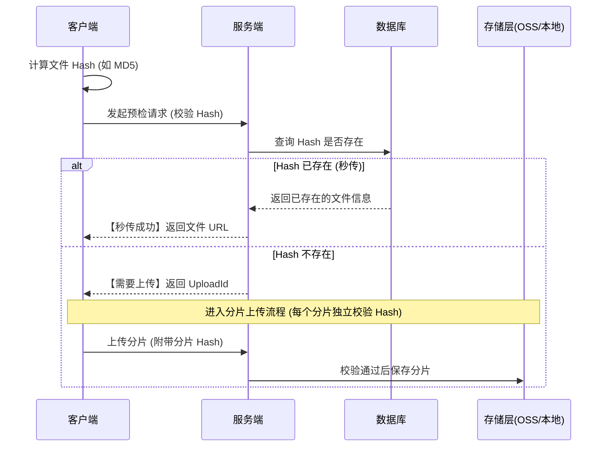
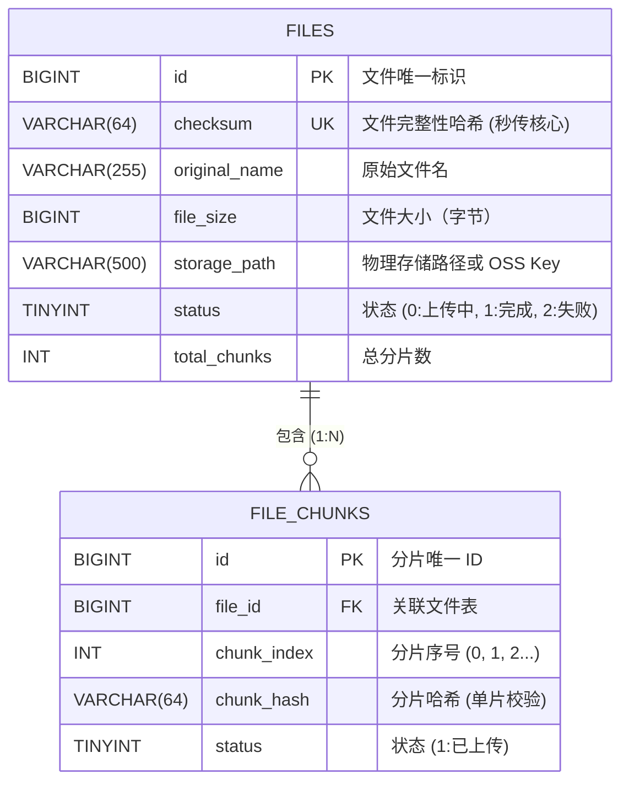
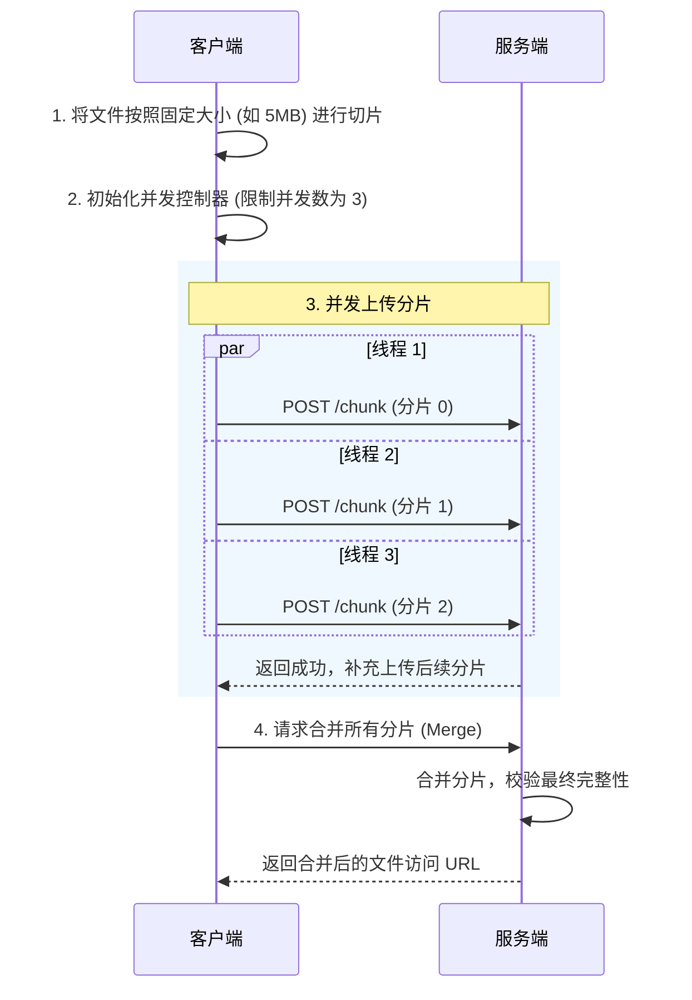
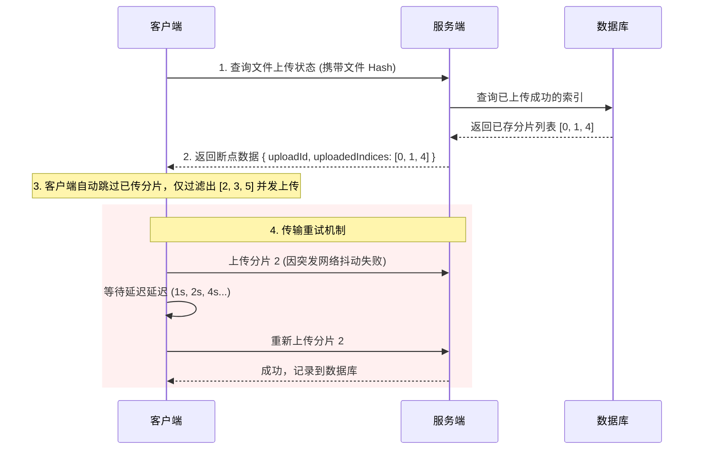

# 文件上传

构建一个稳定、高效、安全的文件上传系统是现代 Web 应用的基础设施。综合考虑了性能、可靠性和安全性，通过引入 **哈希校验 (秒传)**、**分片并发上传**、**断点续传** 以及 **多重安全防护**，并深度集成主流云原生存储方案 (OSS / MinIO)，提供了一套完整的企业级解决方案。

## 🌟 核心能力特性

- **极速上传：** 基于 Checksum 的文件级“秒传”与去重。
- **高可靠性：** 分片并发传输，支持网络中断后的无缝断点续传。
- **安全可控：** 前端预检、文件魔数校验、服务端防病毒扫描与 STS 临时凭证直传。
- **云端原生：** 灵活对接公有云 OSS 或私有化 MinIO，彻底释放后端带宽压力。

## 1. 核心架构与校验机制 (Checksum)

通过计算文件（及分片）的 SHA-256 或 MD5 哈希值，实现文件完整性校验和“秒传”功能。

### 1.1 上传校验与秒传时序



### 1.2 数据库模型设计

为支持完善的断点续传和秒传，系统采用 **主表 (`FILES`)** + **分片记录表 (`FILE_CHUNKS`)** 的一对多设计，确保服务端随时掌握已上传的可靠分片状态。



### 1.3 基于 Checksum 的物理存储路径设计

为了在物理存储层面实现高效索引与去重，系统在服务端/存储端采用基于 Checksum 的内容寻址存储（Content-Addressable Storage）设计：

```
/uploads/
├── e3b0c44298fc1c14.../  (以文件 Hash 命名的目录)
│   ├── document.pdf      # 用户A上传的文件名
│   └── report_v2.pdf     # 用户B上传的同内容文件，不同命名
├── 9f8e7d6c5b4a3b21.../
│   └── company_video.mp4
└── ...
```

## 2. 分片并发上传与断点续传

针对大文件，客户端将其切割为多个 Chunk 并发上传，结合服务端的进度记录，网络中断后仅重传未成功的分片。

### 2.1 分片并发上传

客户端通过 `File.slice()` 切割文件，配合并发控制器实现多通道并发上传。



#### 核心代码实现

```ts
export interface ChunkUploaderOptions {
  chunkSize?: number;
  concurrency?: number;
}

export interface ChunkTask {
  chunkBlob: Blob;
  index: number;
}

/**
 * 基础分片上传类
 */
export class ChunkUploader {
  protected file: File;

  protected chunkSize: number;

  protected maxConcurrency: number;

  protected chunks: Blob[];

  constructor(file: File, options: ChunkUploaderOptions = {}) {
    this.file = file;
    this.chunkSize = options.chunkSize || 5 * 1024 * 1024; // 默认分片 5MB
    this.maxConcurrency = options.concurrency || 3; // 默认并发限制为 3
    this.chunks = this.createChunks();
  }

  // 1. 文件分片
  protected createChunks(): Blob[] {
    const chunks: Blob[] = [];
    let start = 0;
    while (start < this.file.size) {
      chunks.push(this.file.slice(start, start + this.chunkSize));
      start += this.chunkSize;
    }
    return chunks;
  }

  // 2. 并发上传调度
  public async uploadChunks(uploadId: string, uploadedIndices: number[] = []): Promise<void> {
    // 过滤掉已成功上传的分片
    const tasks: ChunkTask[] = this.chunks
      .map((chunkBlob, index) => ({ chunkBlob, index }))
      .filter((task) => !uploadedIndices.includes(task.index));

    let activeCount = 0;
    let taskIndex = 0;

    return new Promise((resolve, reject) => {
      const next = (): void => {
        if (taskIndex >= tasks.length && activeCount === 0) {
          resolve();
          return;
        }

        while (activeCount < this.maxConcurrency && taskIndex < tasks.length) {
          const { chunkBlob, index } = tasks[taskIndex];
          taskIndex += 1;
          activeCount += 1;

          this.uploadSingleChunk(uploadId, index, chunkBlob)
            .then(() => {
              activeCount -= 1;
              next(); // 释放槽位，加载下一任务
            })
            .catch((err: Error) => {
              reject(new Error(`分片 ${index} 上传失败: ${err.message}`));
            });
        }
      };

      next();
    });
  }

  // 3. 执行单分片上传
  protected async uploadSingleChunk(uploadId: string, index: number, chunkBlob: Blob): Promise<any> {
    const formData = new FormData();
    formData.append('chunk', chunkBlob);
    formData.append('uploadId', uploadId);
    formData.append('index', String(index));

    const response = await fetch('/api/upload/chunk', {
      method: 'POST',
      body: formData,
    });

    if (!response.ok) {
      throw new Error('网络请求异常');
    }

    return response.json();
  }
}

export default ChunkUploader;
```

### 2.2 断点续传与网络重试

发生中断或页面刷新后，客户端通过服务端的已上传分片列表直接“定位断点”，并提供指数退避重试机制确保抗网络抖动能力。



#### 核心代码实现

```ts
export interface ResumableUploaderOptions extends ChunkUploaderOptions {
  retries?: number;
  baseDelay?: number;
}

export interface StatusResponse {
  uploadId: string;
  uploadedIndices: number[];
}

/**
 * 支持断点续传与重试的上传器
 */
class ResumableUploader extends ChunkUploader {
  private maxRetries: number;

  private baseDelay: number;

  constructor(file: File, options: ResumableUploaderOptions = {}) {
    super(file, options);
    this.maxRetries = options.retries || 3; // 单分片最大重试次数
    this.baseDelay = options.baseDelay || 1000; // 重试基础退避延迟 (1秒)
  }

  // 覆盖单分片上传方法，添加指数退避与随机抖动重试逻辑
  protected async uploadSingleChunk(
    uploadId: string,
    index: number,
    chunkBlob: Blob,
    retryCount = 0,
  ): Promise<any> {
    try {
      return await super.uploadSingleChunk(uploadId, index, chunkBlob);
    } catch (error) {
      if (retryCount < this.maxRetries) {
        // 指数退避延迟 + 随机抖动避免惊群效应
        const jitter = Math.floor(Math.random() * 500);
        // eslint-disable-next-line no-restricted-properties
        const delay = (2 ** retryCount) * this.baseDelay + jitter;

        console.warn(`分片 ${index} 上传失败，将在 ${delay}ms 后进行第 ${retryCount + 1} 次重试...`);

        await new Promise((resolve) => { setTimeout(resolve, delay); });
        return this.uploadSingleChunk(uploadId, index, chunkBlob, retryCount + 1);
      }
      throw new Error(`分片 ${index} 超过最大重试限额`);
    }
  }

  // 断点续传主流程
  public async startUpload(): Promise<void> {
    // 1. 获取已上传分片列表
    const statusRes = await fetch(`/api/upload/status?fileName=${this.file.name}&size=${this.file.size}`);
    const { uploadId, uploadedIndices } = await statusRes.json() as StatusResponse;

    console.log(`断点定位成功，跳过已上传分片: ${uploadedIndices.join(',')}`);

    // 2. 调度未上传分片并发请求
    await this.uploadChunks(uploadId, uploadedIndices);

    // 3. 所有分片完成后通知服务端合并
    await fetch('/api/upload/merge', {
      method: 'POST',
      headers: { 'Content-Type': 'application/json' },
      body: JSON.stringify({ uploadId, fileName: this.file.name }),
    });

    console.log('文件上传及合并成功！');
  }
}

export default ResumableUploader;
```

## 3. 安全防护体系

文件上传属于 Web 安全的高风险业务，系统在服务端设计了三层纵深防护体系：

1. **三层校验：** 
   - **前端预检：** 文件扩展名及 `accept` 属性校验，过滤普通错误选择。 
   - **MIME 类型校验：** 检查 HTTP 报文中的 `Content-Type`。 
   - **文件魔数校验 (Magic Number)：** 服务端读取文件头前几位字节判定真实类型。
     ```ts
     // Node.js 读取文件头示例
     const buffer: ArrayBuffer = await file.slice(0, 4).arrayBuffer();
     const hex: string = Buffer.from(buffer).toString('hex');
     // 例如 JPG 是 'ffd8ff', PNG 是 '89504e47'
     ```
2. **重命名混淆：** 使用哈希值或 UUID 重新命名落盘目录与文件名，杜绝路径遍历攻击 (`../../`)。
3. **取消执行权限：** 确保物理存储目录具有只读和写权限，但坚决取消执行权限，防止 WebShell 注入被意外执行。

## 4. 企业级存储引擎选型

在大规模生产环境中，强烈建议将数据与应用服务器解耦，采用对象存储服务，配合**客户端直传模式**以降低后端 I/O 压力。

### 4.1 方案对比

| 存储引擎 | 适用场景 | 优势 |
|---|---|---|
| **阿里云 OSS** / **腾讯云 COS** 等 | 公有云业务、高并发互联网产品 | 弹性无限扩容，免除运维烦恼；内置 CDN 加速及丰富的图像、视频处理服务 |
| **MinIO** | 私有云部署、内网隔离、信创及合规业务 | 开源且完全兼容 AWS S3 标准 API；单节点吞吐率极高，适合完全内网和本地化环境 |

### 4.2 前端直传方案实现 (以阿里云 OSS 为例)

通过服务端签发 STS (临时访问凭证)，由前端 SDK 直接将文件流分片推送到云端存储。

#### Node.js 服务端签发 STS Token

```ts
import Core from '@alicloud/pop-core';

export interface STSCredentials {
  AccessKeyId: string;
  AccessKeySecret: string;
  SecurityToken: string;
  Expiration: string;
}

export async function generateUploadToken(userId: string): Promise<STSCredentials> {
  const client = new Core({
    accessKeyId: process.env.RAM_AK as string,
    accessKeySecret: process.env.RAM_SK as string,
    endpoint: 'https://sts.aliyuncs.com',
    apiVersion: '2015-04-01',
  });

  // 严格限制该凭证只能上传到特定用户的目录下
  const policy = {
    Version: '1',
    Statement: [
      {
        Effect: 'Allow',
        Action: ['oss:PutObject', 'oss:MultipartUpload'],
        Resource: [`acs:oss:*:*:your-bucket/uploads/${userId}/*`],
      },
    ],
  };

  const res = await client.request('AssumeRole', {
    RoleArn: process.env.ROLE_ARN,
    RoleSessionName: `session_${userId}`,
    Policy: JSON.stringify(policy),
    DurationSeconds: 3600, // 凭证1小时有效
  }, { method: 'POST' });

  return (res as any).Credentials as STSCredentials;
}
```

#### 前端 SDK 直传与断点续传

```ts
import OSS from 'ali-oss';

export interface STSConfig {
  AccessKeyId: string;
  AccessKeySecret: string;
  SecurityToken: string;
}

export async function uploadToOSS(
  file: File,
  stsConfig: STSConfig,
  userId: string,
): Promise<string | undefined> {
  const client = new OSS({
    region: 'oss-cn-hangzhou',
    accessKeyId: stsConfig.AccessKeyId,
    accessKeySecret: stsConfig.AccessKeySecret,
    stsToken: stsConfig.SecurityToken,
    bucket: 'your-bucket',
  });

  const objectKey = `uploads/${userId}/${Date.now()}_${file.name}`;
  const checkpointKey = `oss_upload_${file.name}_${file.size}`;
  const checkpointStr = localStorage.getItem(checkpointKey);

  // eslint-disable-next-line @typescript-eslint/no-unsafe-assignment
  const checkpoint: any = checkpointStr ? JSON.parse(checkpointStr) : undefined;

  try {
    const result = await client.multipartUpload(objectKey, file, {
      parallel: 3, // 并发数
      partSize: 5 * 1024 * 1024, // 5MB 块大小
      checkpoint, // 传入断点位置
      progress: (p: number, cpt: any) => {
        localStorage.setItem(checkpointKey, JSON.stringify(cpt)); // 记录进度
        console.log(`OSS 传输进度: ${Math.floor(p * 100)}%`);
      },
    });

    localStorage.removeItem(checkpointKey);
    return result.res.requestUrls[0];
  } catch (err) {
    console.error('OSS 上传中断或失败:', err);
    return undefined;
  }
}
```