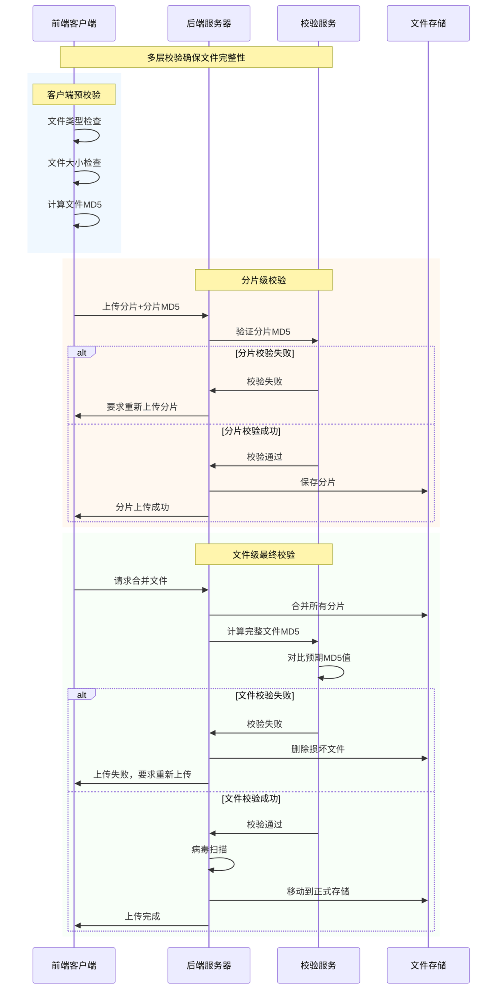
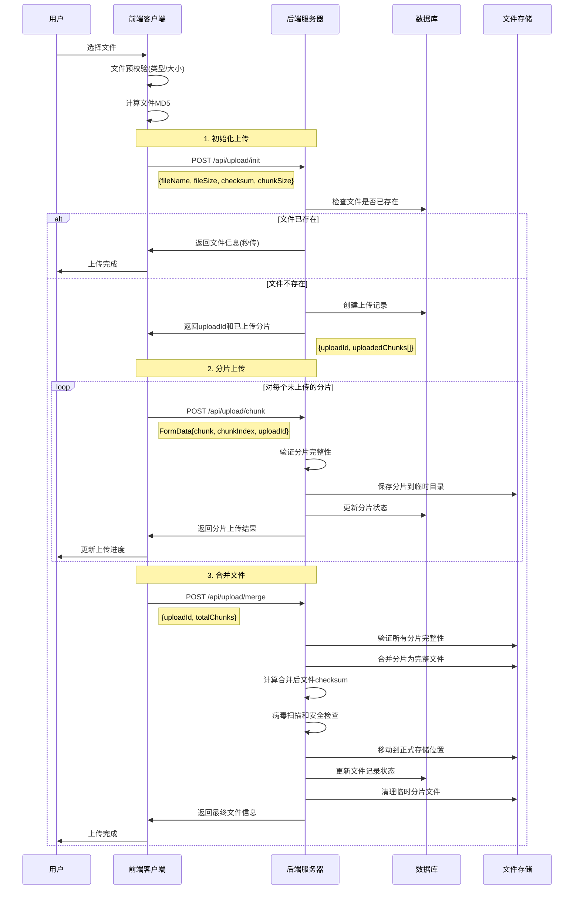
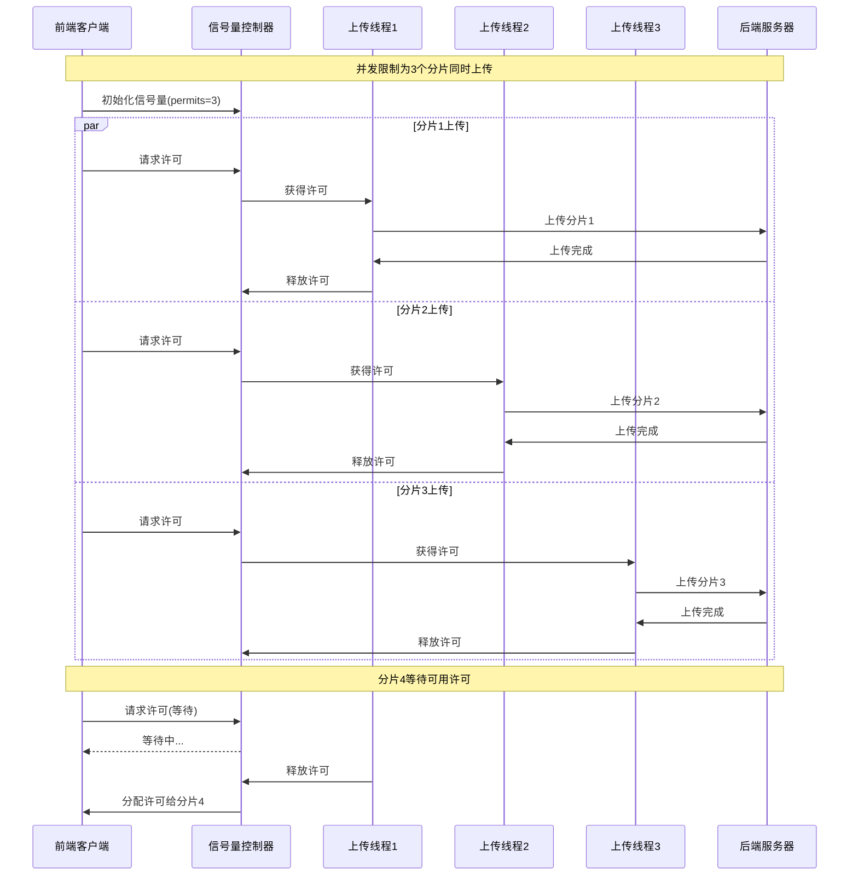
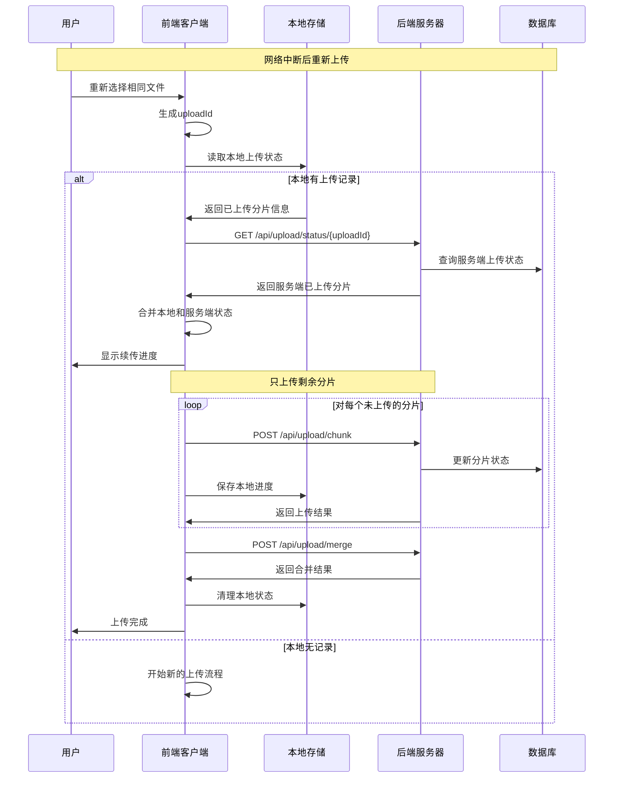
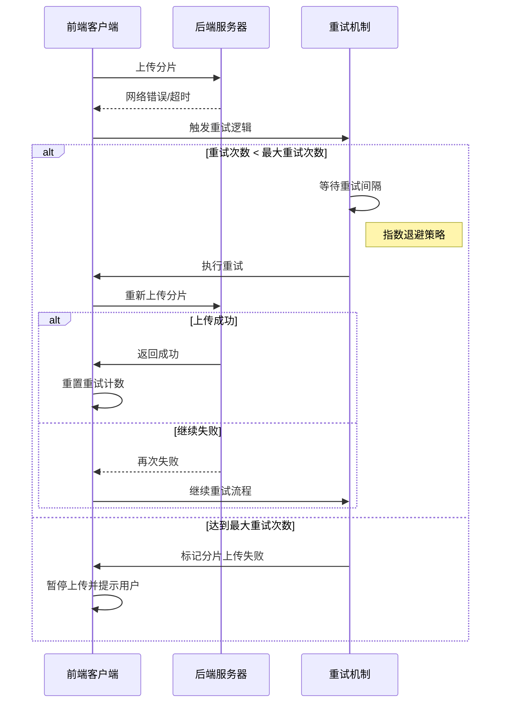

# 文件上传

文件上传系统需要综合考虑性能、可靠性和安全性。通过checksum校验确保文件完整性，分片上传提高传输效率，断点续传增强用户体验，多层安全检查保护系统安全。

## 文件Checksum校验

### 概述

通过计算文件的哈希值来确保文件完整性，防止传输过程中的数据损坏。

### 校验流程图



### 实现方式

<details>
<summary>基础MD5计算</summary>

```javascript
// 计算文件MD5
async function calculateFileMD5(file) {
  return new Promise((resolve, reject) => {
    const spark = new SparkMD5.ArrayBuffer();
    const fileReader = new FileReader();
    const chunkSize = 2097152; // 2MB chunks
    let currentChunk = 0;
    const chunks = Math.ceil(file.size / chunkSize);

    fileReader.onload = function(e) {
      spark.append(e.target.result);
      currentChunk++;

      if (currentChunk < chunks) {
        loadNext();
      } else {
        resolve(spark.end());
      }
    };

    fileReader.onerror = reject;

    function loadNext() {
      const start = currentChunk * chunkSize;
      const end = Math.min(start + chunkSize, file.size);
      fileReader.readAsArrayBuffer(file.slice(start, end));
    }

    loadNext();
  });
}

// 校验文件完整性
async function verifyFileIntegrity(file, expectedChecksum) {
  const actualChecksum = await calculateFileMD5(file);
  return actualChecksum === expectedChecksum;
}
```

</details>

<details>
<summary>OSS校验实现</summary>

```javascript
// OSS文件校验
class OSSFileValidator {
  constructor(ossClient) {
    this.client = ossClient;
  }

  // 上传时校验
  async uploadWithChecksum(objectKey, file, expectedMD5) {
    try {
      const result = await this.client.put(objectKey, file, {
        headers: {
          'Content-MD5': expectedMD5,
          'x-oss-storage-class': 'Standard'
        }
      });
      
      return {
        success: true,
        etag: result.etag,
        verified: true
      };
    } catch (error) {
      if (error.code === 'InvalidDigest') {
        throw new Error('文件MD5校验失败');
      }
      throw error;
    }
  }

  // 下载后校验
  async downloadAndVerify(objectKey, expectedMD5) {
    try {
      const result = await this.client.get(objectKey);
      const actualMD5 = await this.calculateMD5(result.content);
      
      return {
        verified: actualMD5 === expectedMD5,
        actualMD5,
        expectedMD5
      };
    } catch (error) {
      throw new Error(`下载校验失败: ${error.message}`);
    }
  }
}
```

</details>

### 校验策略

1. **预校验**: 上传前计算本地文件checksum
2. **服务端校验**: 接收完成后重新计算并对比
3. **分片校验**: 每个分片都进行独立校验
4. **最终校验**: 合并后的完整文件校验

## 分片上传

### 概述

将大文件分割成多个小片段并发上传，提高上传效率和可靠性。

### 分片上传流程图



### 并发控制流程图



### 核心实现

<details>
<summary>基础分片上传</summary>

```javascript
class ChunkedUploader {
  constructor(file, options = {}) {
    this.file = file;
    this.chunkSize = options.chunkSize || 2 * 1024 * 1024; // 2MB
    this.concurrency = options.concurrency || 3;
    this.chunks = this.createChunks();
    this.uploadedChunks = new Set();
  }

  createChunks() {
    const chunks = [];
    const totalChunks = Math.ceil(this.file.size / this.chunkSize);
    
    for (let i = 0; i < totalChunks; i++) {
      const start = i * this.chunkSize;
      const end = Math.min(start + this.chunkSize, this.file.size);
      
      chunks.push({
        index: i,
        start,
        end,
        size: end - start,
        blob: this.file.slice(start, end),
        retries: 0
      });
    }
    
    return chunks;
  }

  async upload() {
    const uploadPromises = [];
    const semaphore = new Semaphore(this.concurrency);

    for (const chunk of this.chunks) {
      uploadPromises.push(
        semaphore.acquire().then(async (release) => {
          try {
            await this.uploadChunk(chunk);
            this.uploadedChunks.add(chunk.index);
          } finally {
            release();
          }
        })
      );
    }

    await Promise.all(uploadPromises);
    return this.mergeChunks();
  }

  async uploadChunk(chunk) {
    const formData = new FormData();
    formData.append('chunk', chunk.blob);
    formData.append('chunkIndex', chunk.index);
    formData.append('totalChunks', this.chunks.length);
    formData.append('fileName', this.file.name);
    formData.append('fileSize', this.file.size);

    const response = await fetch('/api/upload/chunk', {
      method: 'POST',
      body: formData
    });

    if (!response.ok) {
      throw new Error(`Chunk ${chunk.index} upload failed`);
    }

    return response.json();
  }

  async mergeChunks() {
    const response = await fetch('/api/upload/merge', {
      method: 'POST',
      headers: { 'Content-Type': 'application/json' },
      body: JSON.stringify({
        fileName: this.file.name,
        totalChunks: this.chunks.length,
        fileSize: this.file.size
      })
    });

    return response.json();
  }
}
```

</details>

<details>
<summary>OSS分片上传</summary>

```javascript
// OSS分片上传实现
class OSSChunkedUploader {
  constructor(config) {
    this.config = config;
    this.chunkSize = config.chunkSize || 5 * 1024 * 1024; // 5MB
    this.ossClient = null;
  }

  async initOSSClient() {
    const stsToken = await this.getSTSToken();
    this.ossClient = new OSS({
      region: this.config.region,
      accessKeyId: stsToken.accessKeyId,
      accessKeySecret: stsToken.accessKeySecret,
      stsToken: stsToken.securityToken,
      bucket: this.config.bucket,
      secure: true
    });
  }

  async uploadLargeFile(file, options = {}) {
    if (!this.ossClient) {
      await this.initOSSClient();
    }

    const objectKey = this.generateObjectKey(file.name, options.userId);
    
    try {
      const result = await this.ossClient.multipartUpload(objectKey, file, {
        parallel: 3, // 并发数
        partSize: this.chunkSize,
        progress: (p, checkpoint) => {
          const percent = Math.floor(p * 100);
          
          if (checkpoint) {
            localStorage.setItem(
              `oss_upload_${file.name}_${file.size}`, 
              JSON.stringify(checkpoint)
            );
          }

          if (options.onProgress) {
            options.onProgress(percent, checkpoint);
          }
        },
        checkpoint: this.loadCheckpoint(file),
        headers: {
          'x-oss-storage-class': 'Standard',
          'x-oss-object-acl': 'private'
        }
      });

      this.clearCheckpoint(file);
      return {
        success: true,
        url: result.res.requestUrls[0].split('?')[0],
        objectKey: objectKey,
        etag: result.etag
      };
    } catch (error) {
      console.error('OSS分片上传失败:', error);
      throw error;
    }
  }

  generateObjectKey(fileName, userId) {
    const timestamp = Date.now();
    const randomString = Math.random().toString(36).substring(2);
    const ext = fileName.split('.').pop();
    return `uploads/${userId}/${timestamp}_${randomString}.${ext}`;
  }

  loadCheckpoint(file) {
    const key = `oss_upload_${file.name}_${file.size}`;
    const saved = localStorage.getItem(key);
    return saved ? JSON.parse(saved) : null;
  }

  clearCheckpoint(file) {
    const key = `oss_upload_${file.name}_${file.size}`;
    localStorage.removeItem(key);
  }
}
```

</details>

### 分片策略

- **固定大小**: 每片2-10MB，适合大部分场景
- **动态调整**: 根据网络状况自适应调整分片大小
- **并发控制**: 限制同时上传的分片数量

## 断点续传

### 概述

支持网络中断后从断点位置继续上传，避免重复传输已完成的部分。

### 断点续传流程图



### 错误处理和重试机制



### 实现机制

<details>
<summary>基础断点续传</summary>

```javascript
class ResumableUploader extends ChunkedUploader {
  constructor(file, options = {}) {
    super(file, options);
    this.uploadId = this.generateUploadId();
    this.storageKey = `upload_${this.uploadId}`;
  }

  generateUploadId() {
    return `${this.file.name}_${this.file.size}_${this.file.lastModified}`;
  }

  // 恢复上传状态
  async resumeUpload() {
    const savedState = this.loadUploadState();
    if (savedState) {
      this.uploadedChunks = new Set(savedState.uploadedChunks);
      console.log(`恢复上传: ${this.uploadedChunks.size}/${this.chunks.length} 分片已完成`);
    }

    // 检查服务端状态
    const serverState = await this.checkServerState();
    if (serverState.uploadedChunks) {
      serverState.uploadedChunks.forEach(index => {
        this.uploadedChunks.add(index);
      });
    }

    return this.upload();
  }

  async checkServerState() {
    const response = await fetch(`/api/upload/status/${this.uploadId}`);
    if (response.ok) {
      return response.json();
    }
    return { uploadedChunks: [] };
  }

  saveUploadState() {
    const state = {
      uploadId: this.uploadId,
      fileName: this.file.name,
      fileSize: this.file.size,
      totalChunks: this.chunks.length,
      uploadedChunks: Array.from(this.uploadedChunks),
      timestamp: Date.now()
    };
    
    localStorage.setItem(this.storageKey, JSON.stringify(state));
  }

  loadUploadState() {
    const saved = localStorage.getItem(this.storageKey);
    return saved ? JSON.parse(saved) : null;
  }

  async uploadChunk(chunk) {
    // 跳过已上传的分片
    if (this.uploadedChunks.has(chunk.index)) {
      return { success: true, message: 'Chunk already uploaded' };
    }

    try {
      const result = await super.uploadChunk(chunk);
      this.uploadedChunks.add(chunk.index);
      this.saveUploadState(); // 保存进度
      return result;
    } catch (error) {
      chunk.retries++;
      if (chunk.retries < 3) {
        console.log(`分片 ${chunk.index} 重试第 ${chunk.retries} 次`);
        return this.uploadChunk(chunk);
      }
      throw error;
    }
  }

  async upload() {
    const remainingChunks = this.chunks.filter(
      chunk => !this.uploadedChunks.has(chunk.index)
    );

    if (remainingChunks.length === 0) {
      return this.mergeChunks();
    }

    // 只上传未完成的分片
    const uploadPromises = [];
    const semaphore = new Semaphore(this.concurrency);

    for (const chunk of remainingChunks) {
      uploadPromises.push(
        semaphore.acquire().then(async (release) => {
          try {
            await this.uploadChunk(chunk);
          } finally {
            release();
          }
        })
      );
    }

    await Promise.all(uploadPromises);
    
    // 清理本地状态
    localStorage.removeItem(this.storageKey);
    
    return this.mergeChunks();
  }
}
```

</details>

<details>
<summary>OSS断点续传</summary>

```javascript
// OSS断点续传扩展
class OSSResumableUploader extends OSSChunkedUploader {
  async resumeUpload(file, options = {}) {
    const checkpoint = this.loadCheckpoint(file);
    
    if (checkpoint) {
      console.log('发现断点信息，继续上传...');
      options.checkpoint = checkpoint;
    }

    return this.uploadLargeFile(file, options);
  }

  // 批量断点续传
  async resumeMultipleUploads(files, options = {}) {
    const results = [];
    const concurrency = options.concurrency || 2;
    
    for (let i = 0; i < files.length; i += concurrency) {
      const batch = files.slice(i, i + concurrency);
      const batchPromises = batch.map(file => 
        this.resumeUpload(file, options).catch(error => ({ error, file }))
      );
      
      const batchResults = await Promise.all(batchPromises);
      results.push(...batchResults);
    }

    return results;
  }
}
```

</details>

### 断点续传特性

- **状态持久化**: 本地存储上传进度
- **服务端校验**: 确认已上传分片的有效性
- **自动重试**: 失败分片的智能重试机制
- **进度恢复**: 页面刷新后自动恢复上传

## 文件上传安全性

### 概述

多层安全检查保护系统免受恶意文件攻击，确保上传文件的安全性。

### 文件类型验证

<details>
<summary>前端验证</summary>

```javascript
// 前端验证
function validateFileType(file, allowedTypes) {
  const fileExtension = file.name.split('.').pop().toLowerCase();
  const mimeType = file.type;
  
  // 扩展名验证
  if (!allowedTypes.extensions.includes(fileExtension)) {
    throw new Error('不支持的文件类型');
  }
  
  // MIME类型验证
  if (!allowedTypes.mimeTypes.includes(mimeType)) {
    throw new Error('文件MIME类型不匹配');
  }
  
  return true;
}

// 文件魔数验证
async function validateFileSignature(file) {
  const buffer = await file.slice(0, 16).arrayBuffer();
  const uint8Array = new Uint8Array(buffer);
  const signature = Array.from(uint8Array)
    .map(byte => byte.toString(16).padStart(2, '0'))
    .join('');
  
  const signatures = {
    'jpg': 'ffd8ff',
    'png': '89504e47',
    'pdf': '25504446',
    'zip': '504b0304'
  };
  
  const fileType = Object.keys(signatures).find(type => 
    signature.startsWith(signatures[type])
  );
  
  if (!fileType) {
    throw new Error('无法识别的文件类型');
  }
  
  return fileType;
}
```

</details>

<details>
<summary>服务端安全检查</summary>

```javascript
// Node.js 后端安全检查
const multer = require('multer');
const path = require('path');
const crypto = require('crypto');

// 安全的文件存储配置
const storage = multer.diskStorage({
  destination: (req, file, cb) => {
    // 使用随机目录名
    const randomDir = crypto.randomBytes(16).toString('hex');
    const uploadPath = path.join('./uploads', randomDir);
    fs.mkdirSync(uploadPath, { recursive: true });
    cb(null, uploadPath);
  },
  filename: (req, file, cb) => {
    // 生成安全的文件名
    const ext = path.extname(file.originalname);
    const safeFileName = crypto.randomBytes(16).toString('hex') + ext;
    cb(null, safeFileName);
  }
});

// 文件过滤器
const fileFilter = (req, file, cb) => {
  // 黑名单检查
  const blacklist = ['.exe', '.bat', '.cmd', '.scr', '.pif'];
  const ext = path.extname(file.originalname).toLowerCase();
  
  if (blacklist.includes(ext)) {
    return cb(new Error('危险文件类型'), false);
  }
  
  // 大小限制
  if (file.size > 100 * 1024 * 1024) { // 100MB
    return cb(new Error('文件过大'), false);
  }
  
  cb(null, true);
};

// 病毒扫描中间件
async function virusScanning(req, res, next) {
  try {
    // 集成ClamAV或其他杀毒引擎
    const scanResult = await scanFile(req.file.path);
    if (!scanResult.clean) {
      fs.unlinkSync(req.file.path); // 删除危险文件
      return res.status(400).json({ error: '文件包含病毒' });
    }
    next();
  } catch (error) {
    next(error);
  }
}
```

</details>

<details>
<summary>OSS安全配置</summary>

```javascript
// OSS安全配置最佳实践
const ossSecurityConfig = {
  // Bucket CORS配置
  cors: [
    {
      allowedOrigin: ['https://yourdomain.com'],
      allowedMethod: ['GET', 'POST', 'PUT', 'DELETE'],
      allowedHeader: ['*'],
      exposeHeader: ['ETag', 'x-oss-version-id'],
      maxAgeSeconds: 3600
    }
  ],

  // Bucket防盗链配置
  referer: {
    allowEmptyReferer: false,
    refererList: ['https://yourdomain.com/*']
  },

  // 生命周期管理
  lifecycle: [
    {
      id: 'DeleteIncompleteMultipartUploads',
      status: 'Enabled',
      filter: { prefix: 'uploads/' },
      abortIncompleteMultipartUpload: {
        daysAfterInitiation: 1
      }
    },
    {
      id: 'DeleteTempFiles',
      status: 'Enabled',
      filter: { prefix: 'temp/' },
      expiration: { days: 7 }
    }
  ]
};

// 应用安全配置
async function applyOSSSecurityConfig(ossClient, bucketName) {
  try {
    // 设置CORS
    await ossClient.putBucketCORS(bucketName, ossSecurityConfig.cors);
    
    // 设置防盗链
    await ossClient.putBucketReferer(bucketName, 
      ossSecurityConfig.referer.allowEmptyReferer,
      ossSecurityConfig.referer.refererList
    );
    
    // 设置生命周期
    await ossClient.putBucketLifecycle(bucketName, ossSecurityConfig.lifecycle);
    
    console.log('OSS安全配置应用成功');
  } catch (error) {
    console.error('应用OSS安全配置失败:', error);
  }
}
```

</details>

### 安全最佳实践

1. **文件类型限制**
   - 白名单机制，只允许特定类型
   - 多层验证：扩展名、MIME类型、文件头

2. **文件大小控制**
   - 单文件大小限制
   - 用户总存储配额
   - 上传频率限制

3. **存储安全**
   - 文件重命名，避免路径遍历
   - 隔离存储，不在Web根目录
   - 定期清理临时文件

4. **访问控制**
   - 身份验证和授权
   - 防止直接访问上传文件
   - 通过代理服务提供文件访问

5. **内容安全**
   - 病毒扫描
   - 恶意代码检测
   - 图片内容过滤

## 阿里云OSS集成

### 概述

阿里云对象存储服务(OSS)提供了强大的文件存储和管理能力，支持直传、分片上传、断点续传等功能。

### 快速开始

```bash
# 安装阿里云OSS SDK
npm install ali-oss
```

### 基础配置

```javascript
// OSS配置
const OSS = require('ali-oss');

const ossConfig = {
  region: 'oss-cn-hangzhou',
  accessKeyId: 'your-access-key-id',
  accessKeySecret: 'your-access-key-secret',
  bucket: 'your-bucket-name'
};

const client = new OSS(ossConfig);
```

### STS临时凭证

<details>
<summary>服务端STS实现</summary>

```javascript
// Node.js 后端生成STS凭证
const Core = require('@alicloud/pop-core');

class STSService {
  constructor(config) {
    this.client = new Core({
      accessKeyId: config.accessKeyId,
      accessKeySecret: config.accessKeySecret,
      endpoint: 'https://sts.cn-hangzhou.aliyuncs.com',
      apiVersion: '2015-04-01'
    });
    
    this.roleArn = config.roleArn;
    this.bucketName = config.bucketName;
  }

  async generateSTSToken(userId, permissions = 'readwrite') {
    const policy = this.generatePolicy(userId, permissions);
    
    const params = {
      'RegionId': 'cn-hangzhou',
      'RoleArn': this.roleArn,
      'RoleSessionName': `upload_session_${userId}_${Date.now()}`,
      'Policy': JSON.stringify(policy),
      'DurationSeconds': 3600
    };

    try {
      const result = await this.client.request('AssumeRole', params, {
        method: 'POST'
      });

      const credentials = result.Credentials;
      
      return {
        accessKeyId: credentials.AccessKeyId,
        accessKeySecret: credentials.AccessKeySecret,
        securityToken: credentials.SecurityToken,
        expiration: credentials.Expiration
      };
    } catch (error) {
      throw new Error('无法获取上传凭证');
    }
  }

  generatePolicy(userId, permissions) {
    return {
      'Version': '1',
      'Statement': [{
        'Effect': 'Allow',
        'Action': [
          'oss:PutObject',
          'oss:PutObjectAcl',
          'oss:InitiateMultipartUpload',
          'oss:UploadPart',
          'oss:CompleteMultipartUpload',
          'oss:AbortMultipartUpload',
          'oss:ListParts'
        ],
        'Resource': [
          `acs:oss:*:*:${this.bucketName}/uploads/${userId}/*`
        ]
      }]
    };
  }
}
```

</details>

### 文件管理

<details>
<summary>OSS文件操作</summary>

```javascript
// OSS文件管理服务
class OSSFileManager {
  constructor(ossClient) {
    this.client = ossClient;
  }

  // 列出文件
  async listFiles(prefix, options = {}) {
    try {
      const result = await this.client.list({
        prefix: prefix,
        marker: options.marker,
        'max-keys': options.limit || 100
      });

      return {
        files: result.objects || [],
        nextMarker: result.nextMarker,
        isTruncated: result.isTruncated
      };
    } catch (error) {
      throw new Error(`列出文件失败: ${error.message}`);
    }
  }

  // 删除文件
  async deleteFile(objectKey) {
    try {
      await this.client.delete(objectKey);
      return { success: true };
    } catch (error) {
      throw new Error(`删除文件失败: ${error.message}`);
    }
  }

  // 生成预签名URL
  async generateSignedURL(objectKey, options = {}) {
    const expires = options.expires || 3600;
    
    try {
      const url = this.client.signatureUrl(objectKey, {
        method: options.method || 'GET',
        expires: expires
      });

      return { url, expires: new Date(Date.now() + expires * 1000) };
    } catch (error) {
      throw new Error(`生成签名URL失败: ${error.message}`);
    }
  }
}
```

</details>

## 完整使用示例

### 智能上传器

```javascript
// 完整的安全文件上传实现
class SecureFileUploader {
  constructor(options = {}) {
    this.maxFileSize = options.maxFileSize || 100 * 1024 * 1024;
    this.allowedTypes = options.allowedTypes || {
      extensions: ['jpg', 'jpeg', 'png', 'pdf', 'doc', 'docx'],
      mimeTypes: ['image/jpeg', 'image/png', 'application/pdf']
    };
    this.chunkSize = options.chunkSize || 2 * 1024 * 1024;
    this.useOSS = options.useOSS || false;
  }

  async uploadFile(file) {
    // 1. 安全检查
    await this.securityCheck(file);
    
    // 2. 计算checksum
    const checksum = await calculateFileMD5(file);
    
    // 3. 检查是否已存在（秒传）
    const existingFile = await this.checkDuplicate(checksum);
    if (existingFile) {
      return { success: true, fileId: existingFile.id, message: '文件已存在（秒传）' };
    }
    
    // 4. 选择上传方式
    let uploader;
    if (this.useOSS) {
      uploader = new OSSResumableUploader(this.ossConfig);
    } else {
      uploader = new ResumableUploader(file, {
        chunkSize: this.chunkSize,
        concurrency: 3
      });
    }
    
    const result = await uploader.resumeUpload();
    
    // 5. 最终校验
    await this.finalVerification(result.fileId, checksum);
    
    return result;
  }

  async securityCheck(file) {
    if (file.size > this.maxFileSize) {
      throw new Error('文件过大');
    }
    
    validateFileType(file, this.allowedTypes);
    await validateFileSignature(file);
  }

  async checkDuplicate(checksum) {
    const response = await fetch(`/api/files/check/${checksum}`);
    if (response.ok) {
      return response.json();
    }
    return null;
  }

  async finalVerification(fileId, expectedChecksum) {
    const response = await fetch(`/api/files/verify/${fileId}`, {
      method: 'POST',
      headers: { 'Content-Type': 'application/json' },
      body: JSON.stringify({ checksum: expectedChecksum })
    });
    
    if (!response.ok) {
      throw new Error('文件校验失败');
    }
  }
}
```

### 使用示例

```javascript
// 配置上传器
const uploader = new SecureFileUploader({
  maxFileSize: 50 * 1024 * 1024, // 50MB
  allowedTypes: {
    extensions: ['jpg', 'png', 'pdf'],
    mimeTypes: ['image/jpeg', 'image/png', 'application/pdf']
  },
  useOSS: true,
  ossConfig: {
    region: 'oss-cn-hangzhou',
    bucket: 'my-bucket'
  }
});

// 单文件上传
document.getElementById('fileInput').addEventListener('change', async (e) => {
  const file = e.target.files[0];
  if (!file) return;

  try {
    const result = await uploader.uploadFile(file);
    console.log('上传成功:', result);
  } catch (error) {
    console.error('上传失败:', error.message);
  }
});

// 拖拽上传
const dropZone = document.getElementById('dropZone');

dropZone.addEventListener('dragover', (e) => {
  e.preventDefault();
  dropZone.classList.add('drag-over');
});

dropZone.addEventListener('drop', async (e) => {
  e.preventDefault();
  dropZone.classList.remove('drag-over');
  
  const files = Array.from(e.dataTransfer.files);
  
  for (const file of files) {
    try {
      await uploader.uploadFile(file);
      console.log(`${file.name} 上传成功`);
    } catch (error) {
      console.error(`${file.name} 上传失败:`, error.message);
    }
  }
});
```
