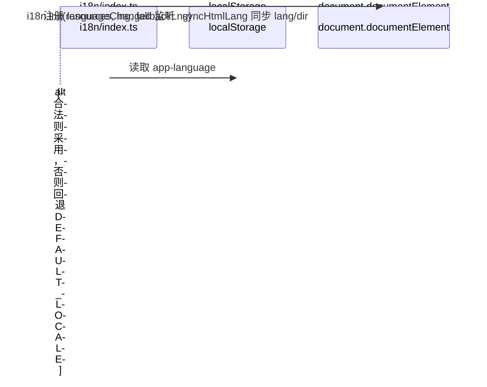

# 国际化

面向多语种用户的 Web 控制台采用 i18next + react-i18next 国际化方案。语言资源按业务模块组织，切换实时生效并持久化到 localStorage，同步 HTML `lang` 与 `dir` 属性以支持 RTL 与无障碍识别。

## 核心能力特性

- **多语种覆盖**：内置 20 种语言，语言元数据集中声明。
- **RTL 支持**：阿拉伯语自动切换 `dir` 为 `rtl`，驱动布局镜像。
- **持久化与恢复**：语言选择写入 `localStorage`，下次访问自动恢复，异常场景静默回退默认语言。
- **HTML 属性同步**：切换时同步 `<html lang>` 与 `<html dir>`，供无障碍工具与搜索引擎识别。
- **命名空间组织**：翻译资源按业务模块分命名空间管理，键名扁平。
- **插值与回退**：支持变量插值与 `defaultValue` 兜底，缺失键回退默认语言而非抛错。

## 1. 模块结构

```
src/i18n/
├── index.ts          # 初始化入口：注册资源、读取初始语言、绑定副作用
├── constants.ts      # 语言清单、默认语言、存储键等常量与类型
└── locales/          # 各语言翻译资源，按语言代码命名
    ├── zh-CN.ts      # 简体中文（默认语言）
    ├── en.ts         # 英语
    ├── ar.ts         # 阿拉伯语（RTL）
    └── ...
```

| 文件 | 职责 |
| --- | --- |
| `constants.ts` | 声明 `AppLocale` 类型、`SUPPORTED_LOCALES`、`DEFAULT_LOCALE`、`LANGUAGE_STORAGE_KEY` |
| `index.ts` | 读取初始语言、注册资源、初始化 i18next、绑定 `languageChanged` 副作用、导出单例 |
| `locales/*.ts` | 单一语言的全部翻译资源，键结构与默认语言保持一致 |

## 2. 语言清单与元数据

每种语言的元数据由 `AppLocale` 接口约束，涵盖 i18next 代码、菜单名、存储键、HTML lang 与文本方向：

```ts
export interface AppLocale {
  code: string;         // i18next 语言代码
  label: string;        // 语言切换菜单中显示的本地化名称
  storageKey: string;   // localStorage 持久化的语言代码
  htmlLang: string;     // HTML lang 属性值（BCP 47）
  dir: 'ltr' | 'rtl';   // 文本方向
}
```

设计要点：`code` 与 `storageKey` 分离便于未来与 `navigator.language` 解耦；`htmlLang` 用脚本子标签（`zh-Hans`/`zh-Hant`）避免繁简歧义；`dir` 仅阿拉伯语为 `rtl`。

`SUPPORTED_LOCALES` 以 `as const` 声明为只读元组，数组顺序即菜单展示顺序，默认语言 `DEFAULT_LOCALE = 'zh-CN'`，存储键 `LANGUAGE_STORAGE_KEY = 'app-language'`。当前 20 种语言含简繁中文、英、阿、孟、德、西、法、印地、印尼、意、日、韩、挪、荷、葡、俄、土、泰、越，仅 `ar` 为 `rtl`。

## 3. 初始化流程

`initI18n()` 在模块求值时一次性执行，确保首帧即可读取翻译：



初始语言由 `getInitialLanguage` 从 localStorage 恢复并校验，非法值或读取异常回退默认语言；SSR 通过 `typeof window === 'undefined'` 短路。init 关键配置：`resources` 全量注入避免首帧空白；`fallbackLng: 'zh-CN'` 缺失键回退；`interpolation.escapeValue: false` 避免与 React 双重转义；`returnNull: false` 便于排查缺失键。

初始化同步一次 HTML 属性，并通过 `i18n.on('languageChanged')` 监听切换，届时写入 localStorage 并调用 `syncHtmlLang` 更新 `<html lang>` 与 `<html dir>`。localStorage 读写均 try/catch 以兼容隐私模式。

## 4. 翻译资源组织

采用单命名空间 `translation`，内部按业务模块以一级键划分逻辑分组：

```ts
const zhCN = {
  common: { save: '保存', cancel: '取消' },        // 跨模块复用
  nav: { home: '首页', 'basic-data': '基础数据' },  // 键名与菜单 id 对齐
  routes: { '/basic-data/shift': '班次管理' },      // 键名为路由 path
  home: { incDecAdd: '加{{n}}人' },                 // 业务模块，支持插值
};
```

命名约定：`common` 收敛通用文案；`nav` 键与菜单项 `id` 对齐（含连字符的键用引号包裹）；`routes` 键为路由 `path`；业务模块以模块名为命名空间，内部 camelCase。所有语言文件键结构必须一致，缺失键由 `fallbackLng` 兜底；含变量的文案用 i18next 插值 `{{varName}}`，变量名语义化。

## 5. 组件层使用

通过 `useTranslation` 获取 `t` 函数，键名以 `命名空间.键名` 访问，第二参数传插值变量；动态键名传 `defaultValue` 兜底：

```tsx
const { t } = useTranslation();

t('app.loadingTitle');                       // 基础翻译
t('home.incDecAdd', { n: flag });            // 变量插值
t(`nav.${menu.id}`, { defaultValue: menu.title }); // 动态键 + 兜底
```

语言切换通过 `i18n.changeLanguage(code)` 触发 `languageChanged` 事件，自动完成持久化与 HTML 属性同步，所有使用 `useTranslation` 的组件自动重渲染。语言切换器读取 `SUPPORTED_LOCALES` 渲染菜单，当前语言通过 `i18n.language` 读取。

## 6. RTL 与无障碍

阿拉伯语切换时 `syncHtmlLang` 将 `<html dir>` 设为 `rtl`，CSS 逻辑属性布局自动镜像。布局应优先用逻辑属性（`margin-inline-*`、`inset-inline-*`）而非物理属性（`margin-left`），避免为 RTL 单独维护样式分支。`<html lang>` 同步为 BCP 47 值，供屏幕阅读器选语音引擎、搜索引擎识别语种、拼写检查启用词典。

## 7. 本地化格式与语言策略

文本翻译之外，国际化还涉及 locale 敏感格式化（日期、货币、数字）、同语言跨地区变体、以及翻译完整度分级。这三点决定多语言产品是否“地道”而非仅“可读”。

### 7.1 日期、货币与数字格式化

i18next 只管文案翻译，不处理 locale 敏感的数据格式化。日期顺序、货币符号位置、小数与千分位分隔符、百分比写法因地区而异，格式化若不跟随 UI 语言，会出现“中文界面 + 美式日期”的割裂体验。

| 维度 | en-US | en-GB | de | zh-CN | ar |
| --- | --- | --- | --- | --- | --- |
| 日期 | 7/23/2026 | 23/7/2026 | 23.7.2026 | 2026/7/23 | ٢٣/٧/٢٠٢٦ |
| 时间 | 2:30 PM | 14:30 | 14:30 | 14:30 | ٢:٣٠ م |
| 数字 | 1,234.56 | 1,234.56 | 1.234,56 | 1,234.56 | ١٬٢٣٤٫٥٦ |
| 货币 | $1,234.56 | £1,234.56 | 1.234,56 € | ¥1,234.56 | ١٬٢٣٤٫٥٦ ر.س. |
| 百分比 | 50% | 50% | 50 % | 50% | ٥٠٪ |

当前项目日期基于 `date-fns` 但 locale 硬编码为 `zhCN`，未读取 `i18n.language`；货币与数字无 locale 感知处理，依赖后端返回或前端硬编码模板，属未覆盖项。

推荐方案按场景选择工具，统一由 `i18n.language` 驱动：

- **日期/时间**：继续使用 `date-fns`，token 模板（`format(date, 'yyyy-MM-dd')`）表达力强；需要严格跟随 locale 格式时用 `intlFormat` 委托 Intl 处理。需建立语言代码到 date-fns locale 模块的映射，语言切换时同步加载。
- **货币/数字/百分比**：统一走 `Intl.NumberFormat`，原生覆盖货币符号位置、千分位分隔符、阿拉伯数字等差异，零依赖。
- **相对时间**：`Intl.RelativeTimeFormat`（如“3 天前”）。

封装工具函数统一读取当前语言：

```ts
import i18n from '@/i18n';
import { format, intlFormat } from 'date-fns';
import { zhCN, enUS, ja, ko } from 'date-fns/locale';

const dateLocaleMap = { 'zh-CN': zhCN, en: enUS, ja, ko } as const;

// 日期：date-fns + locale，PPP 自动跟随语言习惯（如 zh-CN → 2026年7月24日，en → July 24th, 2026）
export const formatDate = (d: Date, fmt: string = 'PPP') =>
  format(d, fmt, { locale: dateLocaleMap[i18n.language as keyof typeof dateLocaleMap] ?? enUS });

// 日期：委托 Intl，严格跟随 locale 习惯
export const formatDateLocale = (d: Date, opts?: Intl.DateTimeFormatOptions) =>
  intlFormat(d, opts ?? { dateStyle: 'medium' }, { locale: i18n.language });

// 货币/数字：Intl 原生处理
export const formatCurrency = (v: number, currency = 'CNY') =>
  new Intl.NumberFormat(i18n.language, { style: 'currency', currency }).format(v);

export const formatNumber = (v: number, opts?: Intl.NumberFormatOptions) =>
  new Intl.NumberFormat(i18n.language, opts).format(v);
```

### 7.2 跨地区语言变体

当前语言代码为语言级（`en`、`fr`），仅中文区分简繁与地区（`zh-CN`/`zh-TW`），不支持同语言多地区变体（`en-US` vs `en-GB`）。BCP 47 标签结构为 `language-Script-REGION`，同语言跨地区的差异分两层：文案层（color/colour）差异小，格式层（日期顺序、货币默认值、度量单位）差异显著——地区变体的价值在格式层。

引入时采用“文案按语言级共享、格式按地区级精确”：`en` 一份资源覆盖所有英语地区，仅差异显著的键拆分；`fallbackLng` 按语言映射使地区变体回退语言级（`'en-GB': ['en']`），地区资源文件只含差异键。是否引入取决于业务覆盖区域——仅单一英语市场时语言级 `en` 足够，需同时服务英美且对格式敏感（财务、订单）时按地区拆分。

### 7.3 语言支持分级

| 级别 | 含义 | 判定标准 | 处理 |
| --- | --- | --- | --- |
| L1 基准 | 中文 + 英文 | 开发默认语言与国际通用语 | 全键覆盖，回退终点 |
| L2 通用 | 多地区通用语言 | 跨多国/多洲通行、覆盖人口多、具备 RTL 等特殊形态 | 核心模块完整覆盖，长尾键回退 L1 |
| L3 重要 | 主要经济体与区域语言 | 单一国家或区域使用但人口/经济体量大 | 高频流程覆盖，大部分回退 L1 |
| L4 兼容 | 小语种与区域市场 | 使用区域集中、人口少或范围窄 | 菜单可选，标注“预览”，按需补充 |

| 语言 | 中文 | 代码 | 级别 | 原因 |
| --- | --- | --- | --- | --- |
| 简体中文 | 中文 | zh-CN | L1 | 开发与产品默认语言，所有翻译的数据源与最终回退基准 |
| English | 英语 | en | L1 | 使用人口与覆盖范围最广的国际通用语，非母语用户默认备选 |
| 繁體中文 | 繁体中文 | zh-TW | L2 | 繁体中文用户群，与简中文案高度共通，维护成本低 |
| Français | 法语 | fr | L2 | 跨欧洲、非洲、北美多洲通用，使用人口超 3 亿 |
| Español | 西班牙语 | es | L2 | 覆盖西班牙与拉美，使用国家数仅次于英语 |
| Русский | 俄语 | ru | L2 | 覆盖俄罗斯及中亚、东欧广大地区，区域通用语 |
| العربية | 阿拉伯语 | ar | L2 | 覆盖中东与北非 20 余国，唯一 RTL 语言，兼作布局验证 |
| Deutsch | 德语 | de | L2 | 中欧通用语，德国、奥地利、瑞士等多国官方语言 |
| Português | 葡萄牙语 | pt | L2 | 覆盖葡萄牙与巴西，跨欧、美、非三洲，南美使用人口最多 |
| 日本語 | 日语 | ja | L3 | 东亚重要语言，日本为主要经济体 |
| 한국어 | 韩语 | ko | L3 | 朝鲜半岛通用，韩国为主要经济体 |
| हिन्दी | 印地语 | hi | L3 | 印度使用人口最多的语言，覆盖印度北部 |
| Italiano | 意大利语 | it | L3 | 意大利及瑞士意大利语区官方语言 |
| Türkçe | 土耳其语 | tr | L3 | 土耳其官方语言，中亚部分国家可理解 |
| Bahasa Indonesia | 印尼语 | id | L3 | 印尼官方语言，东南亚使用人口最多 |
| Tiếng Việt | 越南语 | vi | L3 | 越南官方语言 |
| বাংলা | 孟加拉语 | bn | L4 | 孟加拉国国语，使用人口多但地区集中 |
| ไทย | 泰语 | th | L4 | 泰国官方语言，使用区域集中 |
| Norsk | 挪威语 | nb | L4 | 挪威官方语言，使用人口少 |
| Nederlands | 荷兰语 | nl | L4 | 荷兰与比利时弗拉芒区官方语言，使用区域集中 |

落地方式：`AppLocale` 增加 `tier: 'L1' | 'L2' | 'L3' | 'L4'` 字段；`fallbackLng` 按语言映射使 L2/L3/L4 优先回退同语系 L1（如 `ja → en` 而非 `→ zh-CN`），减少跨语系跳变；菜单按 `tier` 标注，L4 标“预览”；CI 以 L1 键集合为基准校验各语言完整度，低于阈值降级或阻断发布。分级随翻译完成度与市场优先级动态调整。

### 7.4 Intl API 的使用

当前项目未使用任何 Intl API。Intl（ECMA-402）是浏览器原生国际化能力集，与 i18next 分工：i18next 管文案翻译，Intl 管 locale 敏感运算，两者以 `i18n.language`（合法 BCP 47 标签）桥接，原生内置零依赖。

| API | 用途 | 场景 |
| --- | --- | --- |
| `Intl.DateTimeFormat` | 日期/时间 | 创建时间、交期 |
| `Intl.NumberFormat` | 数字/货币/百分比/单位 | 金额、良品率 |
| `Intl.RelativeTimeFormat` | 相对时间 | “3 天前” |
| `Intl.PluralRules` | 复数判定 | “1 项 / 3 项” |
| `Intl.Collator` | locale 感知排序 | 表格本地字母序 |
| `Intl.ListFormat` | 列表连词 | “A、B 和 C” |
| `Intl.DisplayNames` | 语言/地区/货币显示名 | 语言菜单 |
| `Intl.Locale` | locale 标签解析 | 提取 region |

格式化类由 Intl 承担。复数需两者协作：i18next 复数规则由 `Intl.PluralRules` 驱动，资源键按 `_one`/`_other`（及部分语言 `_few`/`_many`）后缀提供变体。排序用 `Intl.Collator(lng, { numeric: true })` 避免 `'item10'` 排在 `'item2'` 前。建议 Intl 作格式化统一底座，以 `i18n.language` 驱动，避免各模块硬编码 locale；Node.js 早期版本需 full-icu，浏览器无此问题。

## 8. 新增语言步骤

1. 在 `locales/` 新建 `xx.ts`，从 `zh-CN.ts` 复制键结构并翻译，默认导出对象。
2. 在 `constants.ts` 的 `SUPPORTED_LOCALES` 按展示顺序插入元数据条目（RTL 语言 `dir: 'rtl'`）。
3. 在 `index.ts` import 并加入 `resources` 映射（`xx: { translation: xx }`）。
4. 校验键完整性，确保与 `zh-CN.ts` 键集合一致，缺失键将回退造成混合语言显示。

## 9. 关键约束与最佳实践

**必须遵守**

- 所有语言文件键结构必须一致，缺失键将回退造成混合语言显示。
- `SUPPORTED_LOCALES` 必须 `as const` 声明，保证 `dir` 为字面量联合类型。
- HTML lang 必须使用 BCP 47 值（`zh-Hans`/`zh-Hant` 而非 `zh-CN`/`zh-TW`），避免繁简歧义。
- `syncHtmlLang` 与 `getInitialLanguage` 必须 SSR 守卫（`typeof window/document === 'undefined'`）。

**最佳实践**

- 动态键名（菜单、路由标题）传 `defaultValue` 兜底，避免显示原始 key。
- 通用按钮收敛到 `common` 命名空间，避免各模块重复定义。
- 插值变量名语义化（`{{count}}` 而非 `{{0}}`），便于翻译人员理解上下文。
- CSS 布局优先逻辑属性（`margin-inline-*`），自动适配 RTL。
- localStorage 访问必须 try/catch，隐私模式静默降级默认语言。

## 10. 技术选型说明

| 维度 | 选型 | 理由 |
| --- | --- | --- |
| 国际化框架 | i18next | 生态成熟，支持插值、回退、命名空间、事件监听 |
| React 绑定 | react-i18next | `useTranslation` Hook，切换自动触发重渲染 |
| 资源加载 | 静态全量注入 | 一次性打包所有语言，避免异步加载首帧空白 |
| 持久化 | localStorage | 同步读取，首帧即可恢复语言 |
| 文本方向 | HTML `dir` + CSS 逻辑属性 | 声明式镜像，无需 RTL 单独分支 |
| 语言代码 | BCP 47（zh-Hans、ar） | 无障碍与搜索引擎准确识别，区分繁简 |

## 参考资料

- [i18next 官方文档](https://www.i18next.com/)
- [react-i18next 文档](https://react.i18next.com/)
- [MDN · Intl](https://developer.mozilla.org/zh-CN/docs/Web/JavaScript/Reference/Global_Objects/Intl)
- [MDN · Intl.DateTimeFormat](https://developer.mozilla.org/zh-CN/docs/Web/JavaScript/Reference/Global_Objects/Intl/DateTimeFormat)
- [MDN · Intl.NumberFormat](https://developer.mozilla.org/zh-CN/docs/Web/JavaScript/Reference/Global_Objects/Intl/NumberFormat)
- [BCP 47 · RFC 5646 语言标签](https://www.rfc-editor.org/rfc/rfc5646.html)
- [Unicode CLDR（locale 数据标准）](https://cldr.unicode.org/)
- [W3C · 语言与方向（lang & dir）](https://www.w3.org/International/questions/qa-html-language-declarations)
- [date-fns · I18n（国际化）](https://date-fns.org/v4.4.0/docs/I18n)
- [date-fns · intlFormat（Intl 委托）](https://date-fns.org/v4.4.0/docs/intlFormat)
