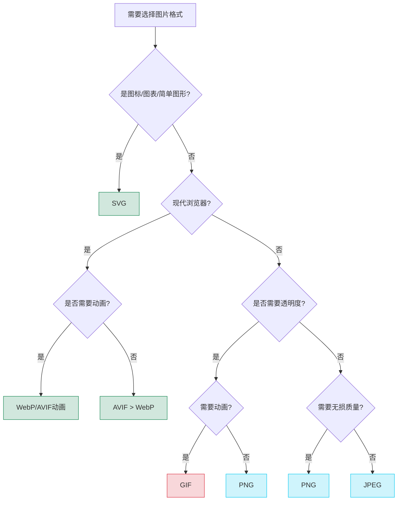

# 图片

## 图片元素

图片资源采用了 **"新格式优先，传统格式兜底"** 的多层次策略：

- 对于矢量图形，首选 SVG 格式（无损缩放，极小文件体积）
- 对于位图，首选 AVIF 格式（最高压缩比与质量，支持现代浏览器）
- 其次是 WebP 格式（良好压缩比，广泛支持）
- 再次是传统格式 PNG（透明图像）和 JPEG（照片）

对于矢量图形，SVG 应作为首选格式：

```html
<!-- 内联 SVG（可通过 CSS/JS 控制） -->
<svg width="100" height="100" viewBox="0 0 100 100">
  <circle cx="50" cy="50" r="40" stroke="black" stroke-width="2" fill="red" />
</svg>

<!-- 外部 SVG 文件 -->

```

:::tip
**内联 SVG 和外部 SVG 的对比：**

| 特性 | 内联 SVG | 外部 SVG |
|------|----------|----------|
| **文件请求** | 无需额外请求 | 需要额外的 HTTP 请求 |
| **缓存** | 不可缓存 | 可被浏览器缓存 |
| **DOM 访问** | 可直接操作 SVG 元素 | 需通过 `<object>` 或 JS 才能操作 |
| **CSS 控制** | 可直接用 CSS 选择器控制 | 外部样式表影响有限，除非使用 `<object>` |
| **JavaScript** | 可直接添加事件处理 | 需要额外技术访问 SVG DOM |
| **适用场景** | 交互式图标、需动态修改的图形 | 重复使用的图标、静态图表、大型图形 |
| **文件大小影响** | 增加 HTML 大小 | HTML 体积较小，但增加网络请求 |
| **SEO** | 对搜索引擎友好 | 使用恰当的 alt 属性同样友好 |

选择内联还是外部 SVG 应根据实际需求权衡：
- 对于需频繁交互的小图标，内联 SVG 更有优势
- 对于大型复杂的 SVG 或多处重用的图标，外部文件更合适
:::

对于位图，使用 HTML5 `<picture>` 元素和 `<source>` 标签提供多格式图片源，按优先级排列：

```html
<picture>
  <!-- 现代高效格式（优先） -->
  <source srcset="image.avif 1x, image@2x.avif 2x, image@3x.avif 3x" type="image/avif">
  <source srcset="image.webp 1x, image@2x.webp 2x, image@3x.webp 3x" type="image/webp">
  
  <!-- 响应式图片设置 -->
  <source media="(min-width: 1200px)" srcset="image-large.jpg 1x, image-large@2x.jpg 2x, image-large@3x.jpg 3x" type="image/jpeg">
  <source media="(min-width: 768px)" srcset="image-medium.jpg 1x, image-medium@2x.jpg 2x, image-medium@3x.jpg 3x" type="image/jpeg">
  
  <!-- 传统格式（兜底） -->
  
</picture>
```

也可以在 CSS 中使用位图，例如作为背景图片。推荐使用 `image-set()` 函数来提供多种格式和分辨率的图片源：

```css
.hero-section {
  background-image: image-set(
    url("hero.avif") type("image/avif"), /* 现代格式优先 */
    url("hero.webp") type("image/webp"), /* 其次现代格式 */
    url("hero.jpg") type("image/jpeg")   /* 传统格式兜底 */
  );
  /* 为高分屏提供更高分辨率的图片 */
  background-image: image-set(
    url("hero@2x.avif") 2x type("image/avif"),
    url("hero@2x.webp") 2x type("image/webp"),
    url("hero@2x.jpg") 2x type("image/jpeg"),
    url("hero.avif") 1x type("image/avif"),
    url("hero.webp") 1x type("image/webp"),
    url("hero.jpg") 1x type("image/jpeg")
  );
  background-size: cover;
  background-position: center;
}
```

:::tip
可以优先使用现代图片并且不使用 `<picture>` 元素，现在浏览器的对 AVIF 和 WebP 格式的覆盖支持率是非常高的。
:::

## 图片格式比较

在 Web 开发中，图片格式的选择对性能、视觉质量和用户体验有重大影响。了解不同图片格式的特点对于优化网站至关重要。



### 主要图片格式

1. **SVG**：
   - 矢量图形格式，基于 XML
   - 可无限缩放而不失真
   - 文件大小小，适合图标、图表和简单插图
   - 可通过 CSS 和 JavaScript 交互和动画
   - 支持 HTTP 压缩（如 Gzip 或 Brotli），可进一步减小传输大小
   - 所有现代浏览器都支持

:::tip
iconfont？iconfont 已经不推荐使用了，SVG 是更好的选择！
:::

2. **AVIF**：
   - 基于 AV1 视频编解码器的图像格式
   - 提供极高的压缩率，比 WebP 小约 20-40%
   - 保持优秀的图像质量，支持透明度和动画
   - 支持 HDR、无损压缩和 10/12 位色深
   - Chrome、Firefox、Safari 16.4+ 已支持

3. **WebP**：
   - 由 Google 开发的现代图像格式
   - 比 JPEG 小约 25-35%，保持类似的视觉质量
   - 支持有损压缩、无损压缩和透明度
   - 几乎所有现代浏览器都支持
   - 支持动画(可替代 GIF)

4. **JPEG/JPG**：
   - 广泛使用的有损压缩格式，特别适合照片
   - 不支持透明度
   - 所有浏览器和设备都支持
   - 文件大小与图像质量可调

5. **PNG**：
   - 无损压缩格式，支持透明度
   - 适合需要清晰边缘和透明背景的图像
   - 所有浏览器都支持
   - 文件通常大于同等 JPEG 图像

6. **GIF**：
   - 支持简单动画和透明度
   - 色彩限制(256色)，不适合照片
   - 文件大小通常较大，特别是对于动画内容
   - 正被更高效的格式(如 AVIF 和 WebP 动画)取代

:::warning
虽然保留了 GIF 选项，但对于动画内容，建议使用视频格式替代以提升性能。
:::

### 图片格式兼容性表格

| 格式 | 压缩类型 | 透明度 | 动画 | 浏览器兼容性 | 最适用场景 |
|------|---------|-------|-----|------------|-----------|
| **SVG** | 矢量 | ✔️ | ✔️* | 所有现代浏览器 | 图标、标志、图表、简单插图 |
| **AVIF** | 有损/无损 | ✔️ | ✔️ | Chrome 85+, Firefox 93+, Safari 16.4+ | 高质量照片、复杂图像 |
| **WebP** | 有损/无损 | ✔️ | ✔️ | 所有现代浏览器 | 通用网页图像、产品照片 |
| **JPEG** | 有损 | ❌ | ❌ | 所有浏览器 | 照片、没有透明度需求的图像 |
| **PNG** | 无损 | ✔️ | ❌ | 所有浏览器 | 需要透明度的图像、屏幕截图 |
| **GIF** | 无损(索引) | ✔️† | ✔️ | 所有浏览器 | 简单动画、极简图像 |

*通过 CSS/JS 实现动画  
†仅支持完全透明或完全不透明

:::tip
可以使用 [Can I Use](https://caniuse.com/) 检查浏览器对不同图片格式的支持情况：

- [SVG](https://caniuse.com/svg)
- [AVIF](https://caniuse.com/avif)
- [WebP](https://caniuse.com/webp)
- [JPEG 2000](https://caniuse.com/jpeg2000)
- [JPEG XR](https://caniuse.com/jpegxr)
:::

### 图片格式性能比较

| 格式 | 文件大小 | 质量 | 编码速度 | 解码速度 | 颜色深度 | 特殊特性 |
|------|---------|------|---------|----------|---------|---------|
| **SVG** | 极小(简单)/大(复杂) | 无损矢量 | 极快 | 快* | 不适用 | 可交互、可编程 |
| **AVIF** | 极小 | 极高 | 慢 | 中 | 8-12 位 | HDR, 宽色域 |
| **WebP** | 小 | 高 | 中 | 快 | 8 位 | 综合性能优异 |
| **JPEG** | 中等 | 中-高 | 快 | 极快 | 8 位 | 渐进式加载 |
| **PNG** | 大(照片)/中(图形) | 无损 | 快 | 快 | 8-16 位 | 索引色模式 |
| **GIF** | 大(动画) | 低 | 快 | 极快 | 8 位(256色) | 简单动画循环 |

*复杂 SVG 可能渲染较慢

### 图片格式转换

使用 `image-minimizer-webpack-plugin` 进行图片格式转换和优化：

```html
<picture>
  <!-- 自动生成的现代格式 (使用 as=avif 和 as=webp 参数生成) -->
  <source srcset="assets/images/photo.jpg?as=avif" type="image/avif">
  <source srcset="assets/images/photo.jpg?as=webp" type="image/webp">
  
</picture>
```

生成后的图片：

```html
<picture>
  <!-- 自动生成的现代格式 (使用 as=avif 和 as=webp 参数生成) -->
  <source srcset="assets/images/photo.avif" type="image/avif">
  <source srcset="assets/images/photo.webp" type="image/webp">
  
</picture>
```

生成后的文件结构示例：
```
assets/
└── images/
    ├── photo.jpg     // 原始图片(可能经过压缩)
    ├── photo.webp    // 由 image-minimizer-webpack-plugin 生成的 WebP 版本
    └── photo.avif    // 由 image-minimizer-webpack-plugin 生成的 AVIF 版本
```

## 响应式图片技术

响应式图片技术允许浏览器根据设备特性（如屏幕尺寸、分辨率）加载和显示最合适的图片版本，从而优化性能和用户体验。主要通过 `srcset`/`sizes` 属性和 `<picture>` 元素实现。

### Next.js Image 组件

Next.js 提供了优化的 `Image` 组件，它是 HTML `` 标签的扩展，具有多种强大的内置功能：

- **自动图像优化**：自动按需将图像转换为 WebP 和 AVIF 等现代格式，同时根据设备需求调整图像大小，减少不必要的带宽占用
- **立即尺寸确定**：通过强制设置宽高比例，消除加载过程中的布局偏移 (CLS)，提升页面稳定性
- **智能懒加载**：使用 IntersectionObserver 自动实现视口内加载，仅当图片即将进入可视区域时才加载
- **预加载优先级**：可设置高优先级图像提前加载，显著改善 LCP (最大内容绘制) 性能指标
- **模糊占位符**：支持加载期间显示低质量图像占位符 (LQIP)，提升用户感知体验
- **自适应尺寸**：通过 sizes 属性自动为不同视口宽度提供最佳的图像尺寸

这种一体化图像解决方案极大简化了 Web 开发中的图像优化工作，同时保证了高性能和良好的用户体验。

```jsx
import Image from 'next/image';

function HomePage() {
  return (
    <div>
      {/* 本地图像 */}
      <Image
        src="/images/hero.jpg"
        alt="Hero Image"
        width={800}
        height={600}
      />

      {/* 远程图像（需要在配置中允许对应域名） */}
      <Image
        src="https://example.com/profile.jpg"
        alt="Profile Picture"
        width={500}
        height={500}
        loading="lazy"
      />
    </div>
  );
}
```

:::tip
使用 Next.js Image 组件可以大幅简化图像优化流程，自动为您处理现代格式转换、按需加载和适合设备的尺寸调整。
:::

### 图像 CDN 和自动优化

结合使用阿里云 CDN 和对象存储 OSS（及其图片处理服务）可以自动生成、优化并快速分发响应式图像和最佳格式。阿里云 CDN 负责加速 OSS 中图片资源的访问，而 OSS 图片处理服务则允许通过 URL 参数动态处理图片。

```html
<!-- 阿里云 OSS 图片处理服务，并通过 CDN 分发 -->

```

在这个例子中：

- `resize,m_lfit,w_400,h_300`: 将图片等比例缩放，限制在宽度 400px 和高度 300px 的矩形框内。
- `format,webp`: 将图片转换为 WebP 格式。
- `quality,q_80`: 设置 WebP 格式的质量为 80。

OSS 会按需处理原图并返回结果，同时 CDN 会缓存处理后的图片。

## SVGR

在 React 应用中，SVGR（SVG to React）是一个强大的工具，可将 SVG 文件转换为 React 组件。这种方式让你能够像处理普通 React 组件一样处理 SVG 图形，实现更灵活的操作和动态交互。

```jsx
// 使用 SVGR 导入 SVG 文件作为 React 组件
import { ReactComponent as Logo } from './logo.svg';

function Header() {
  return (
    <header>
      {/* SVG 组件接受常规 props 如 className, style 等 */}
      <Logo className="site-logo" width={80} height={40} aria-label="公司标志" />
    </header>
  );
}
```

SVGR 相比于传统的 SVG 使用方法有以下优势：

- 可以使用 React 组件的所有功能，包括传递 props 和处理事件
- 可以轻松地将 SVG 图标集成到组件库中
- 使用 React 的状态管理来动态改变 SVG 属性（如颜色、尺寸）
- 可以结合 CSS-in-JS 解决方案使用
- 在构建时优化 SVG 代码，减小包体积

## 最佳实践

### 性能优化

- **选择正确的格式**: 根据内容类型和视觉需求选择最佳格式
  - 照片和复杂图像：AVIF > WebP > JPEG
  - 需要透明度的图像：AVIF > WebP > PNG

- **预加载关键图像**:
  ```html
  <link rel="preload" as="image" href="hero-image.avif" type="image/avif">
  <link rel="preload" as="image" href="hero-image.webp" type="image/webp">
  ```

- **图像懒加载**: 使用 `loading="lazy"` 属性或 Intersection Observer
  ```html
  
  ```

- **适当的图像尺寸**: 不要加载超过显示尺寸的图像
  ```css
  .thumbnail {
    width: 100%;
    max-width: 300px;
    height: auto;
  }
  ```

- **使用内容分发网络 (CDN)**: 减少加载时间并提高可用性
  ```html
  
  ```

- **图像优化工具工作流**:
  - 使用构建工具自动生成不同格式和尺寸
  - 集成到 CI/CD 流程中

### 用户体验

- **提供合适的图像尺寸**: 使用 `width` 和 `height` 属性防止布局偏移
  ```html
  
  ```

- **图像加载状态**: 实现骨架屏或模糊加载技术
  ```css
  .image-container {
    background-color: #f0f0f0;
    position: relative;
  }
  ```

- **避免突然的布局变化**: 通过固定宽高比容器防止累积布局偏移 (CLS)
  ```css
  .aspect-ratio-box {
    position: relative;
    height: 0;
    padding-top: 56.25%; /* 16:9 宽高比 */
  }
  .aspect-ratio-box img {
    position: absolute;
    top: 0;
    left: 0;
    width: 100%;
    height: 100%;
    object-fit: cover;
  }
  ```

- **使用宽高比盒子**: 避免加载时的布局变化
  ```html
  <div class="aspect-ratio-box">
    
  </div>
  ```

### 无障碍性考虑

#### 替代文本

- **提供描述性替代文本**:
  ```html
  
  ```

- **隐藏装饰性图片**:
  ```html
  
  ```

- **复杂图像的扩展描述**:
  ```html
  <figure>
    
    <figcaption id="viz-desc">
      此图表展示了 2023 年各季度销售趋势，突出显示 Q3 销售额创历史新高，达到 100 万元。
    </figcaption>
  </figure>
  ```

#### 颜色和对比度考虑

- 不要仅依赖颜色传达信息
- 确保图像中的文本有足够对比度 (至少 4.5:1)
- 考虑提供高对比度版本的信息图表

#### 减少动画图片的干扰

动画图片虽然能吸引用户注意力，但对于有认知障碍、前庭功能障碍或光敏性癫痫的用户可能造成困扰或健康风险。尊重用户的系统设置，当用户在系统中设置了减少动画的偏好时，应相应调整网页中的动画效果：

```css
@media (prefers-reduced-motion: reduce) {
  .animated-image {
    animation: none;
  }
}
```

### 色彩管理

色彩管理是确保图像在不同设备上保持一致视觉效果的关键，尤其对于对色彩敏感的行业（如时尚、艺术、电子商务等）至关重要：

- **色彩配置文件**: 在专业图像中嵌入 ICC 配置文件，确保跨设备的色彩准确性。Adobe RGB 或 DCI-P3 适用于宽色域内容，而 sRGB 最适合 Web 应用。

- **色彩空间考虑**: 为支持的浏览器使用广色域图像
  ```html
  <picture>
    <source srcset="image-p3.avif" type="image/avif" media="(color-gamut: p3)">
    <source srcset="image-srgb.avif" type="image/avif">
    
  </picture>
  ```
