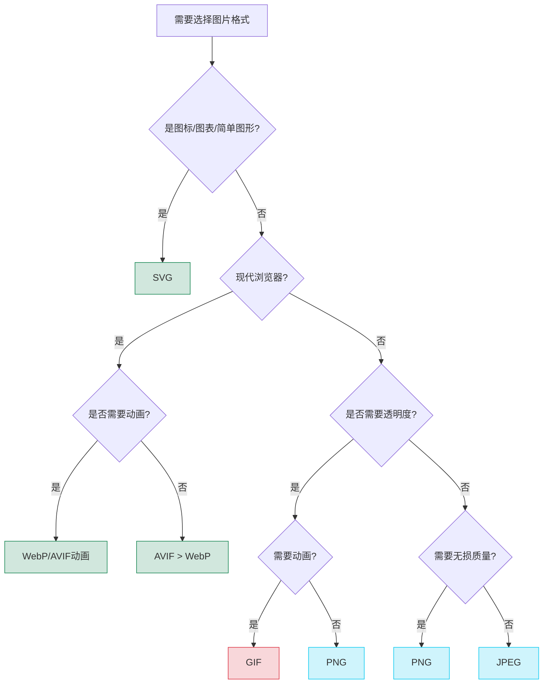

# 图片

## 图片元素

图片资源采用了 **"新格式优先，传统格式兜底"** 的多层次策略：

- 对于矢量图形，首选 SVG 格式（无损缩放，极小文件体积）
- 对于位图，首选 AVIF 格式（最高压缩比与质量，支持现代浏览器）
- 其次是 WebP 格式（良好压缩比，广泛支持）
- 再次是传统格式 PNG（透明图像）和 JPEG（照片）

对于矢量图形，SVG 应作为首选格式：

```html
<!-- 内联 SVG（可通过 CSS/JS 控制） -->
<svg width="100" height="100" viewBox="0 0 100 100">
  <circle cx="50" cy="50" r="40" stroke="black" stroke-width="2" fill="red" />
</svg>

<!-- 外部 SVG 文件 -->

```

对于位图，使用 HTML5 `<picture>` 元素和 `<source>` 标签提供多格式图片源，按优先级排列：

```html
<picture>
  <!-- 现代高效格式（优先） -->
  <source srcset="image.avif" type="image/avif">
  <source srcset="image.webp" type="image/webp">
  
  <!-- 响应式图片设置 -->
  <source media="(min-width: 1200px)" srcset="image-large.jpg" type="image/jpeg">
  <source media="(min-width: 768px)" srcset="image-medium.jpg" type="image/jpeg">
  
  <!-- 传统格式（兜底） -->
  
</picture>
```

:::tip
可以优先使用现代图片并且不使用 `<picture>` 元素，现在浏览器的对 AVIF 和 WebP 格式的覆盖支持率是非常高的。
:::

## 图片格式比较

在 Web 开发中，图片格式的选择对性能、视觉质量和用户体验有重大影响。了解不同图片格式的特点对于优化网站至关重要。



### 主要图片格式

1. **SVG**：
   - 矢量图形格式，基于 XML
   - 可无限缩放而不失真
   - 文件大小小，适合图标、图表和简单插图
   - 可通过 CSS 和 JavaScript 交互和动画
   - 所有现代浏览器都支持

:::tip
iconfont？iconfont 已经不推荐使用了，SVG 是更好的选择！
:::

2. **AVIF**：
   - 基于 AV1 视频编解码器的图像格式
   - 提供极高的压缩率，比 WebP 小约 20-40%
   - 保持优秀的图像质量，支持透明度和动画
   - 支持 HDR、无损压缩和 10/12 位色深
   - Chrome、Firefox、Safari 16.4+ 已支持

3. **WebP**：
   - 由 Google 开发的现代图像格式
   - 比 JPEG 小约 25-35%，保持类似的视觉质量
   - 支持有损压缩、无损压缩和透明度
   - 几乎所有现代浏览器都支持
   - 支持动画(可替代 GIF)

4. **JPEG/JPG**：
   - 广泛使用的有损压缩格式，特别适合照片
   - 不支持透明度
   - 所有浏览器和设备都支持
   - 文件大小与图像质量可调

5. **PNG**：
   - 无损压缩格式，支持透明度
   - 适合需要清晰边缘和透明背景的图像
   - 所有浏览器都支持
   - 文件通常大于同等 JPEG 图像

6. **GIF**：
   - 支持简单动画和透明度
   - 色彩限制(256色)，不适合照片
   - 文件大小通常较大，特别是对于动画内容
   - 正被更高效的格式(如 AVIF 和 WebP 动画)取代

:::warning
虽然保留了GIF选项，但对于动画内容，建议使用视频格式替代以提升性能。
:::

### 图片格式兼容性表格

| 格式 | 压缩类型 | 透明度 | 动画 | 浏览器兼容性 | 最适用场景 |
|------|---------|-------|-----|------------|-----------|
| **SVG** | 矢量 | ✔️ | ✔️* | 所有现代浏览器 | 图标、标志、图表、简单插图 |
| **AVIF** | 有损/无损 | ✔️ | ✔️ | Chrome 85+, Firefox 93+, Safari 16.4+ | 高质量照片、复杂图像 |
| **WebP** | 有损/无损 | ✔️ | ✔️ | 所有现代浏览器 | 通用网页图像、产品照片 |
| **JPEG** | 有损 | ❌ | ❌ | 所有浏览器 | 照片、没有透明度需求的图像 |
| **PNG** | 无损 | ✔️ | ❌ | 所有浏览器 | 需要透明度的图像、屏幕截图 |
| **GIF** | 无损(索引) | ✔️† | ✔️ | 所有浏览器 | 简单动画、极简图像 |

*通过 CSS/JS 实现动画  
†仅支持完全透明或完全不透明

:::tip
可以使用 [Can I Use](https://caniuse.com/) 检查浏览器对不同图片格式的支持情况：

- [SVG](https://caniuse.com/svg)
- [AVIF](https://caniuse.com/avif)
- [WebP](https://caniuse.com/webp)
- [JPEG 2000](https://caniuse.com/jpeg2000)
- [JPEG XR](https://caniuse.com/jpegxr)
:::

### 图片格式性能比较

| 格式 | 文件大小 | 质量 | 编码速度 | 解码速度 | 颜色深度 | 特殊特性 |
|------|---------|------|---------|----------|---------|---------|
| **SVG** | 极小(简单)/大(复杂) | 无损矢量 | 极快 | 快* | 不适用 | 可交互、可编程 |
| **AVIF** | 极小 | 极高 | 慢 | 中 | 8-12 位 | HDR, 宽色域 |
| **WebP** | 小 | 高 | 中 | 快 | 8 位 | 综合性能优异 |
| **JPEG** | 中等 | 中-高 | 快 | 极快 | 8 位 | 渐进式加载 |
| **PNG** | 大(照片)/中(图形) | 无损 | 快 | 快 | 8-16 位 | 索引色模式 |
| **GIF** | 大(动画) | 低 | 快 | 极快 | 8 位(256色) | 简单动画循环 |

*复杂SVG可能渲染较慢

### 图片格式转换

使用image-minimizer-webpack-plugin进行图片格式转换和优化：

```html
<picture>
  <!-- 自动生成的现代格式 (使用as=avif和as=webp参数生成) -->
  <source srcset="assets/images/photo.jpg?as=avif" type="image/avif">
  <source srcset="assets/images/photo.jpg?as=webp" type="image/webp">
  
</picture>
```

生成后的图片：

```html
<picture>
  <!-- 自动生成的现代格式 (使用as=avif和as=webp参数生成) -->
  <source srcset="assets/images/photo.avif" type="image/avif">
  <source srcset="assets/images/photo.webp" type="image/webp">
  
</picture>
```

生成后的文件结构示例：
```
assets/
└── images/
    ├── photo.jpg     // 原始图片(可能经过压缩)
    ├── photo.webp    // 由image-minimizer-webpack-plugin生成的WebP版本
    └── photo.avif    // 由image-minimizer-webpack-plugin生成的AVIF版本
```

## 响应式图片技术

### 使用 srcset 和 sizes 属性

```html

```

### 使用 picture 元素用于艺术指导

```html
<picture>
  <!-- 竖屏移动设备使用剪裁版本 -->
  <source media="(max-width: 600px) and (orientation: portrait)"
          srcset="image-mobile-portrait.jpg">
  
  <!-- 横屏设备使用宽视图版本 -->
  <source media="(max-width: 900px) and (orientation: landscape)"
          srcset="image-mobile-landscape.jpg">
  
  <!-- 桌面版本 -->
  <source media="(min-width: 901px)"
          srcset="image-desktop.jpg">
  
  <!-- 回退图像 -->
  
</picture>
```

## 最佳实践

### 性能优化

- **选择正确的格式**: 根据内容类型和视觉需求选择最佳格式
  - 照片和复杂图像：AVIF > WebP > JPEG
  - 需要透明度的图像：AVIF > WebP > PNG
  - 图标和简单图形：SVG
  - 屏幕截图：PNG 或有损 WebP

- **预加载关键图像**:
  ```html
  <link rel="preload" as="image" href="hero-image.avif" type="image/avif">
  <link rel="preload" as="image" href="hero-image.webp" type="image/webp">
  ```

- **图像懒加载**: 使用 `loading="lazy"` 属性或 Intersection Observer
  ```html
  
  ```

- **适当的图像尺寸**: 不要加载超过显示尺寸的图像
  ```css
  .thumbnail {
    width: 100%;
    max-width: 300px;
    height: auto;
  }
  ```

- **使用内容分发网络 (CDN)**: 减少加载时间并提高可用性
  ```html
  
  ```

- **图像优化工具工作流**:
  - 使用构建工具自动生成不同格式和尺寸
  - 考虑 [Squoosh](https://squoosh.app/)、[ImageOptim](https://imageoptim.com/) 等工具
  - 集成到 CI/CD 流程中

### 用户体验

- **提供合适的图像尺寸**: 使用 `width` 和 `height` 属性防止布局偏移
  ```html
  
  ```

- **图像加载状态**: 实现骨架屏或模糊加载技术
  ```css
  .image-container {
    background-color: #f0f0f0;
    position: relative;
  }
  ```

- **避免突然的布局变化**: 通过固定宽高比容器防止累积布局偏移(CLS)
  ```css
  .aspect-ratio-box {
    position: relative;
    height: 0;
    padding-top: 56.25%; /* 16:9 宽高比 */
  }
  .aspect-ratio-box img {
    position: absolute;
    top: 0;
    left: 0;
    width: 100%;
    height: 100%;
    object-fit: cover;
  }
  ```

- **使用宽高比盒子**: 避免加载时的布局变化
  ```html
  <div class="aspect-ratio-box">
    
  </div>
  ```

### 无障碍性考虑

#### 替代文本

- **提供描述性替代文本**:
  ```html
  
  ```

- **隐藏装饰性图片**:
  ```html
  
  ```

- **复杂图像的扩展描述**:
  ```html
  <figure>
    
    <figcaption id="viz-desc">
      此图表展示了2023年各季度销售趋势，突出显示Q3销售额创历史新高，达到100万元。
    </figcaption>
  </figure>
  ```

#### 颜色和对比度考虑

- 不要仅依赖颜色传达信息
- 确保图像中的文本有足够对比度(至少4.5:1)
- 考虑提供高对比度版本的信息图表

#### 减少动画图片的干扰

```css
@media (prefers-reduced-motion: reduce) {
  .animated-image {
    animation: none;
  }
}
```

### 色彩管理

- **色彩配置文件**: 为专业图像使用嵌入的颜色配置文件
- **色彩空间考虑**: 为支持的浏览器使用广色域图像
  ```html
  <picture>
    <source srcset="image-p3.avif" type="image/avif" media="(color-gamut: p3)">
    <source srcset="image-srgb.avif" type="image/avif">
    
  </picture>
  ```

### 图像CDN和自动优化

- 使用图像CDN服务自动生成响应式图像和最佳格式
  ```html
  <!-- 示例：使用Cloudinary或类似服务 -->
  
  ```

- 使用URL参数控制图像质量、格式和尺寸
  ```html
  
  ```

### 图片内容注意事项

- **图片压缩级别**: 根据内容类型选择适当的压缩级别
  - 照片：JPEG/WebP/AVIF质量75-85%
  - 插图和图像：质量85-90%
  - 屏幕截图：质量80-90%或无损PNG

- **尺寸策略**:
  - 移动优先：400px-800px
  - 平板电脑：800px-1200px
  - 桌面：1200px-1800px
  - 视网膜/高DPI：原尺寸的1.5x-2x

- **图像布局和图库**:
  ```html
  <div class="image-gallery" role="region" aria-label="产品图片库">
    <figure>
      
      <figcaption>产品正面</figcaption>
    </figure>
    <!-- 更多图片... -->
  </div>
  ```

- **背景图片**:
  ```css
  .hero {
    background-image: image-set(
      url("hero.avif") type("image/avif"),
      url("hero.webp") type("image/webp"),
      url("hero.jpg") type("image/jpeg")
    );
    background-size: cover;
    background-position: center;
    height: 60vh;
  }
  ```
