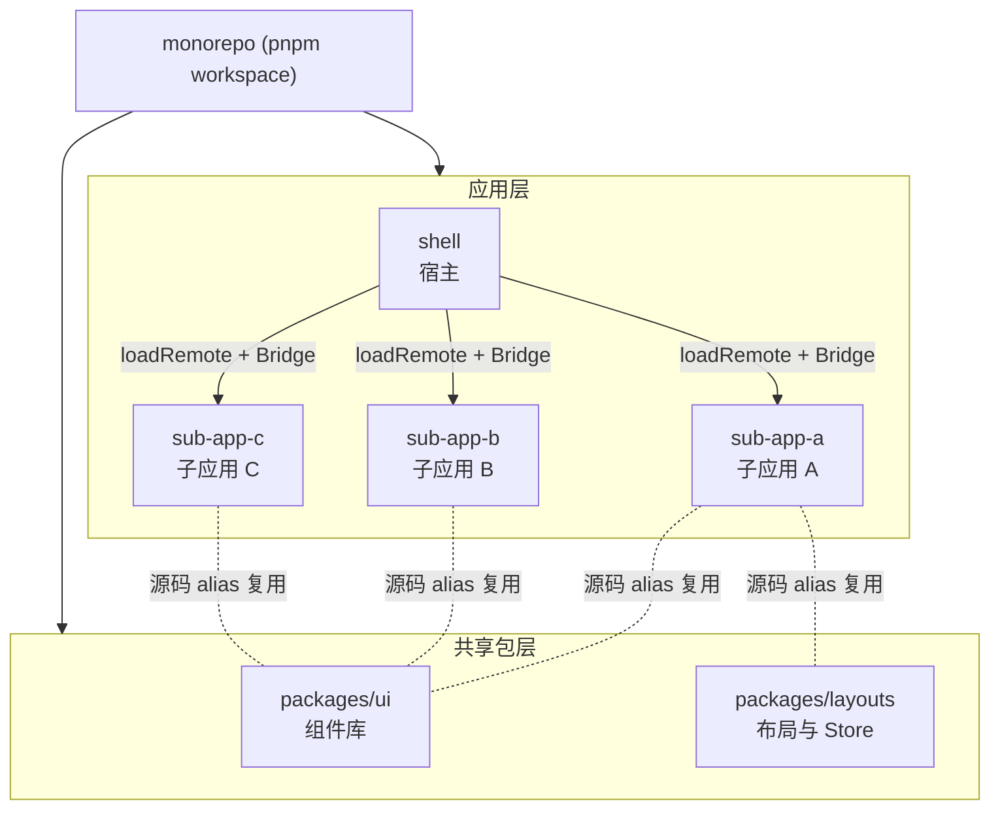
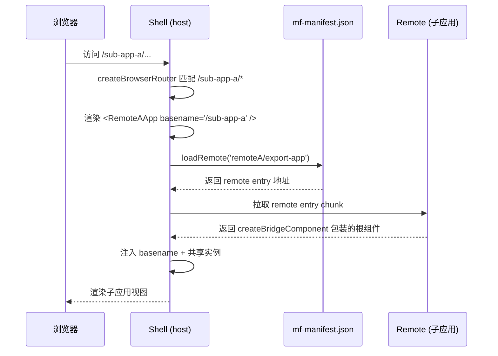
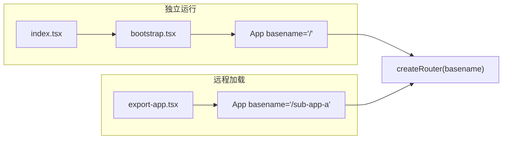
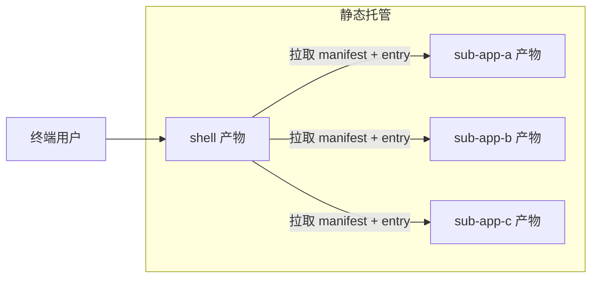

# 微前端

面向多业务线的 Web 控制台采用 Module Federation 2.x + Bridge 微前端架构。 宿主应用（shell）作为统一入口，通过 Bridge 协议动态加载各业务子应用，共享 React、React Router、状态管理等运行时实例，实现独立开发、独立部署、统一体验。

## 核心能力特性

- **多应用聚合**： 宿主按 URL 前缀分发到多个 Bridge 远程子应用，单一入口覆盖全部业务线。
- **运行时共享**： 核心依赖（React、Router、Query、UI 库）以 singleton + eager 策略共享，杜绝实例重复与状态割裂。
- **路由协调**： Bridge Router 自动注入 basename，子应用路由前缀与宿主路由对齐，无需手动同步。
- **独立部署**： 各子应用独立构建、独立发布，宿主通过 mf-manifest.json 远端发现，发布互不阻塞。
- **独立运行**： 子应用保留独立入口（bootstrap.tsx），可脱离宿主单独开发与调试。

## 1. 架构总览

### 1.1 Monorepo 结构

项目以 pnpm workspace 组织，宿主、子应用、共享包平铺管理：



各应用角色分工：

| 应用 | MF 角色 | 暴露入口 | 职责 |
| --- | --- | --- | --- |
| shell | host | — | 统一入口、登录、路由分发、共享实例提供方 |
| sub-app-* | remote | ./export-app | 各业务线业务实现 |

packages/ui 与 packages/layouts 不单独发布，由各应用通过 Rsbuild resolve.alias 在构建时以源码形式引入，确保跨应用组件实例与样式一致。

### 1.2 运行时加载流程

宿主启动后，按访问路径按需加载对应子应用的 export-app，经 Bridge 包装后挂载到宿主路由出口：



## 2. Module Federation 配置

Module Federation 配置统一通过 @module-federation/rsbuild-plugin 的 createModuleFederationConfig 生成，由 Rsbuild 插件 pluginModuleFederation 注入构建流程。

### 2.1 宿主配置（shell）

宿主声明所有远程子应用地址，并以 eager: true 将共享依赖同步打入初始 chunk，作为共享实例的唯一提供方：

```ts
// shell/module-federation.config.ts
export default createModuleFederationConfig({
  name: 'shell',
  dts: false,
  remotes: {
    remoteA: 'remoteA@https://host-a/mf-manifest.json',
    remoteB: 'remoteB@https://host-b/mf-manifest.json',
    remoteC: 'remoteC@https://host-c/mf-manifest.json',
  },
  shared: {
    react: { singleton: true, eager: true, requiredVersion: '^19.2.7' },
    'react-dom/': { singleton: true, eager: true, requiredVersion: '^19.2.7' },
    'react-router/': { singleton: true, eager: true, requiredVersion: '^7.18.1' },
    // ...其余运行时依赖均 singleton + eager
  },
  bridge: { enableBridgeRouter: true },
  shareStrategy: 'loaded-first',
});
```

### 2.2 子应用配置（remote）

子应用通过 exposes 暴露 Bridge 入口，共享配置保持 singleton 但 不设置 eager，避免将全部依赖打入 remote entry 导致入口体积膨胀：

```ts
// sub-app-a/module-federation.config.ts
export default createModuleFederationConfig({
  name: 'remoteA',
  dts: false,
  exposes: {
    './export-app': './src/export-app.tsx',
  },
  shared: {
    react: { singleton: true, requiredVersion: '^19.2.7' },
    'react-dom/': { singleton: true, requiredVersion: '^19.2.7' },
    'react-router/': { singleton: true, requiredVersion: '^7.18.1' },
    // ...与宿主保持一致，但不设置 eager
  },
  bridge: { enableBridgeRouter: true },
  shareStrategy: 'loaded-first',
});
```

### 2.3 共享策略要点

| 维度 | 宿主 (host) | 子应用 (remote) |
| --- | --- | --- |
| singleton | true | true |
| eager | true | false（必须省略） |
| shareStrategy | loaded-first | loaded-first |
| 共享依赖清单 | 完整声明 | 与宿主完全对齐 |

关键约束：

- **react-dom/ 带斜杠后缀**：才能将 react-dom/client 一并共享，Bridge v19 必需。
- **react-router/ 带斜杠后缀**：才能覆盖 bridge-react 的深度导入 react-router/dist/production/index.js。
- **启用 Bridge Router 后不要共享 react-router-dom**：路由协调由 Bridge 接管，共享 react-router-dom 会造成路由实例冲突。
- **remote 端禁止 eager**：eager 会将依赖打入 remote entry，导致入口文件 10MB+ 引发加载超时；remote 通过 loaded-first 策略复用宿主已加载的共享实例。

## 3. Bridge 集成

Bridge 是 Module Federation 提供的子应用集成协议，负责宿主与子应用之间的通信、路由协调与生命周期管理。本项目使用 @module-federation/bridge-react/v19 适配 React 19。

### 3.1 子应用暴露入口

子应用通过 createBridgeComponent 包装根组件 App，生成符合 Bridge 规范的导出模块。该入口 不经过 bootstrap.tsx，因此样式与 i18n 必须在此显式引入：

```tsx
// sub-app-a/src/export-app.tsx
import { createBridgeComponent } from '@module-federation/bridge-react/v19';

import './index.css';
import './i18n';
import App from './App';

export default createBridgeComponent({ rootComponent: App });
```

createBridgeComponent 职责：

- 包装 rootComponent，注入 Bridge 通信能力；
- 接收宿主透传的 basename 并转给 App；
- 卸载时清理副作用，确保子应用切换时不残留状态。

### 3.2 宿主加载远程组件

宿主使用 createRemoteAppComponent 将远程子应用包装为 React 组件，由路由按 path 前缀分发加载，并提供加载与错误回退 UI：

```tsx
// shell/src/router/remote-components.tsx
import { createRemoteAppComponent } from '@module-federation/bridge-react';
import { loadRemote } from '@module-federation/runtime';

export const RemoteAApp = createRemoteAppComponent({
  loader: () => loadRemote('remoteA/export-app'),
  loading: <RemoteLoading />,
  fallback: RemoteErrorFallback,
});

export const RemoteBApp = createRemoteAppComponent({
  loader: () => loadRemote('remoteB/export-app'),
  loading: <RemoteLoading />,
  fallback: RemoteErrorFallback,
});

export const RemoteCApp = createRemoteAppComponent({
  loader: () => loadRemote('remoteC/export-app'),
  loading: <RemoteLoading />,
  fallback: RemoteErrorFallback,
});
```

### 3.3 路由分发

宿主路由通过 path/* 通配匹配子应用前缀，并将 basename 透传给远程组件。Bridge Router 启用后会自动将 basename 注入子应用路由，子应用内无需显式设置：

```tsx
// shell/src/router/index.tsx
const router = createBrowserRouter([
  { path: '/', element: <Navigate to="/sub-app-a/" replace /> },
  { path: '/login', Component: lazy(() => import('@/pages/Login')) },
  { path: '/sub-app-a/*', element: <RemoteAApp basename="/sub-app-a" /> },
  { path: '/sub-app-b/*', element: <RemoteBApp basename="/sub-app-b" /> },
  { path: '/sub-app-c/*', element: <RemoteCApp basename="/sub-app-c" /> },
  { path: '*', element: <Navigate to="/" replace /> },
]);
```

> **约束**：必须使用 createBrowserRouter。Bridge Router 内部通过 createBrowserRouter 读取 window.location.pathname 匹配子应用路由；使用 hash router 会导致 basename 与实际 pathname 不一致，子应用路由无法命中。

## 4. 子应用双入口设计

子应用保留两套入口，兼顾“独立开发调试”与“Bridge 远程加载”两种场景：



| 入口 | 触发场景 | basename | 职责 |
| --- | --- | --- | --- |
| index.tsx → bootstrap.tsx | pnpm dev 独立运行 | / | 注册 Service Worker、启用 MSW Mock、直接挂载 |
| export-app.tsx | 宿主 loadRemote | 由 Bridge 注入 | 显式引入样式与 i18n，包装为 Bridge 组件 |

App 组件接收 basename prop，在 basename 变化时重建 router，确保 Bridge 切换子应用时路由前缀正确：

```tsx
function App({ basename = '/' }: AppProps) {
  const router = useMemo(() => createRouter(basename), [basename]);
  return (
    <QueryClientProvider client={queryClient}>
      <RouterProvider router={router} />
    </QueryClientProvider>
  );
}
```

## 5. 共享包与构建配置

### 5.1 源码级复用

packages/ui 与 packages/layouts 不发布产物，由各应用在 rsbuild.config.ts 中通过 resolve.alias 指向源码路径，并配合 source.include 将其纳入构建：

```ts
// rsbuild.config.ts
const sharedAlias = {
  '@/components/ui': path.resolve(rootDir, '../packages/ui/src/components/ui'),
  '@/lib/utils': path.resolve(rootDir, '../packages/ui/src/lib/utils'),
  '@/hooks/use-mobile': path.resolve(rootDir, '../packages/ui/src/hooks/use-mobile'),
  '@/layouts/stores': path.resolve(rootDir, '../packages/layouts/src/stores'),
  '@/layouts': path.resolve(rootDir, '../packages/layouts/src'),
  '@': path.resolve(rootDir, 'src'),
};

export default defineConfig({
  source: { include: [/[\\/]packages[\\/](ui|layouts)[\\/]/] },
  resolve: { alias: sharedAlias },
  plugins: [
    pluginReact({ reactCompiler: true }),
    pluginTailwindcss(),
    pluginModuleFederation(moduleFederationConfig),
  ],
});
```

该方式保证跨应用组件实例与 Tailwind 上下文一致，避免因产物版本错位导致的样式漂移。

### 5.2 生产构建优化

- **输出模块格式**：output.module = true（生产环境）启用 ESM，配合 crossorigin: 'anonymous' 支持跨域加载 remote entry。
- **SRI 校验**：security.sri.enable = 'auto' 在生产环境自动启用子资源完整性校验。
- **预压缩**：生产环境通过 CompressionPlugin 预生成 brotli（level 11）与 gzip（level 9）产物，覆盖 HTML/JS/CSS/字体等静态资源。
- **预加载策略**：performance.preload.type = 'initial' 预取初始 chunk，prefetch.type = 'async-chunks' 空闲预取异步 chunk。
- **Source Map**：开发环境 cheap-module-source-map，生产环境 hidden-source-map（不上传到 CDN，仅用于错误回溯）。

## 6. 开发与部署

### 6.1 本地开发

根目录脚本支持并行启动全部应用或单独启动指定应用：

```bash
# 并行启动宿主 + 全部子应用
pnpm dev

# 单独启动宿主 / 子应用（可独立调试，不依赖宿主）
pnpm dev:shell
pnpm dev:sub-app-a
```

开发阶段各应用监听独立端口，宿主通过 mf-manifest.json 发现子应用。子应用可脱离宿主单独运行，便于隔离调试。

### 6.2 构建与发布

```bash
# 构建全部应用
pnpm build

# 按应用构建
pnpm build:shell
pnpm build:sub-app-a
```

各应用独立构建产物，独立部署到对应静态服务器。子应用发布新版本后，宿主无需重新构建，下一次拉取 mf-manifest.json 即可发现更新。

### 6.3 部署拓扑



部署要点：

- 宿主与子应用产物分别托管，互不耦合。
- 子应用静态资源需配置 crossorigin: 'anonymous' 与正确的 CORS 响应头，确保宿主跨域加载 remote entry。
- mf-manifest.json 必须禁用强缓存（或设置短缓存），保证宿主能及时发现子应用新版本；entry chunk 可长缓存（依赖 contenthash）。

## 7. 关键约束与常见问题

### 7.1 必须遵守的约束

- **react-dom/ 与 react-router/ 保留斜杠后缀**：否则深度导入路径不会被共享，导致 Bridge v19 与路由协调失败。
- **宿主与子应用共享依赖清单必须完全对齐**：遗漏任一依赖会导致子应用异步加载自身副本，破坏 singleton 单例。
- **remote 端禁止 eager**：会导致 remote entry 膨胀至 10MB+ 引发超时。
- **必须使用 createBrowserRouter**：Bridge Router 依赖 window.location.pathname，hash router 会破坏 basename 匹配。
- **启用 Bridge Router 后不要共享 react-router-dom**：路由协调由 Bridge 接管，共享会造成实例冲突。
- **export-app.tsx 必须显式引入样式与 i18n**：该入口不经过 bootstrap.tsx，遗漏会导致子应用在 Bridge 模式下样式丢失或国际化失效。

### 7.2 常见问题排查

| 现象 | 根因 | 解决方案 |
| --- | --- | --- |
| 子应用加载超时 | remote 设置了 eager，entry 过大 | 移除 remote 端 eager，仅由宿主提供 |
| 路由跳转 404 | 使用了 hash router，或 basename 未对齐 | 改用 createBrowserRouter，确认宿主 basename 与子应用前缀一致 |
| React 实例重复警告 | 共享依赖清单未对齐，或未设置 singleton | 核对宿主与子应用 shared 完全一致，全部 singleton: true |
| 子应用样式丢失 | export-app.tsx 未引入 index.css | 在 export-app.tsx 顶部显式 import './index.css' |
| 跨域加载 remote entry 失败 | 静态服务器未配置 CORS | 子应用服务器返回 Access-Control-Allow-Origin 并启用 crossorigin: 'anonymous' |
| react-dom/client 找不到 | 共享的是 react-dom 而非 react-dom/ | 共享 key 改为带斜杠后缀的 react-dom/ |

## 8. 技术选型说明

| 维度 | 选型 | 理由 |
| --- | --- | --- |
| 微前端框架 | Module Federation 2.8 | 运行时集成，原生支持共享依赖与远程发现；Bridge 协议提供 React 一等公民支持 |
| 构建工具 | Rsbuild + Rspack | 基于 Rust 的高速构建，原生集成 MF 插件与 React Compiler |
| 子应用协议 | Bridge (bridge-react/v19) | 自动处理 basename 注入、生命周期、通信，避免手写 loadRemote 与路由同步 |
| 共享策略 | loaded-first + singleton | 宿主优先加载，子应用复用实例，杜绝重复初始化 |
| 仓库形态 | pnpm workspace | 源码级共享 UI/布局包，保证跨应用一致性；保留应用独立部署能力 |
| 路由模式 | createBrowserRouter | Bridge Router 依赖 pathname 协调，history 模式为唯一可行方案 |
