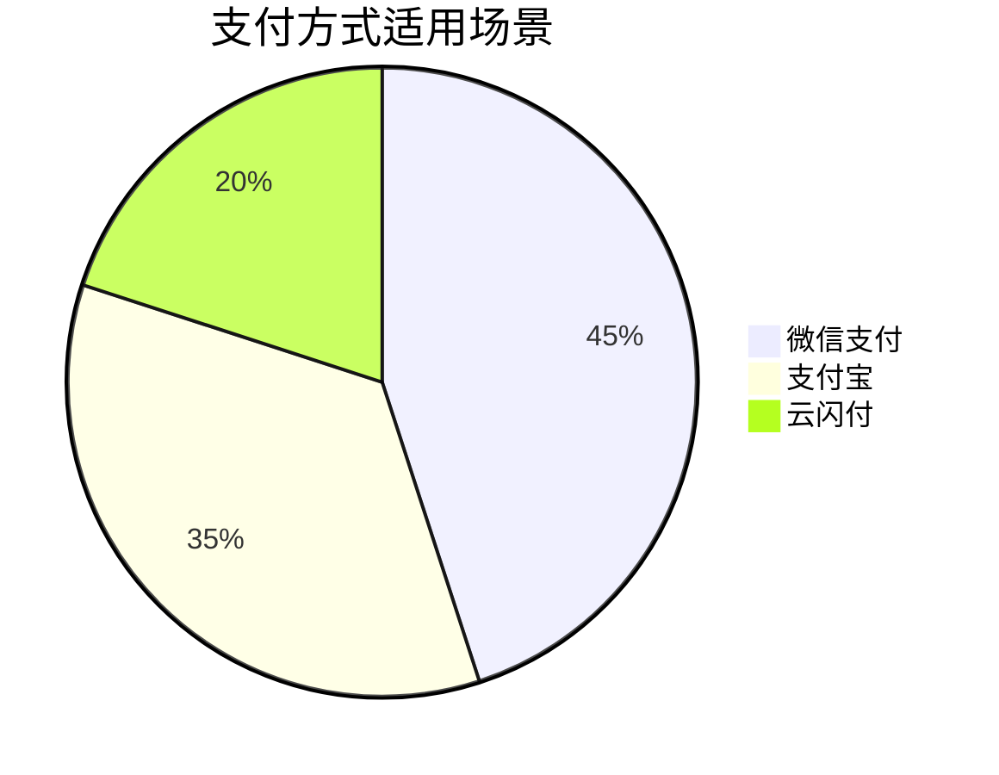
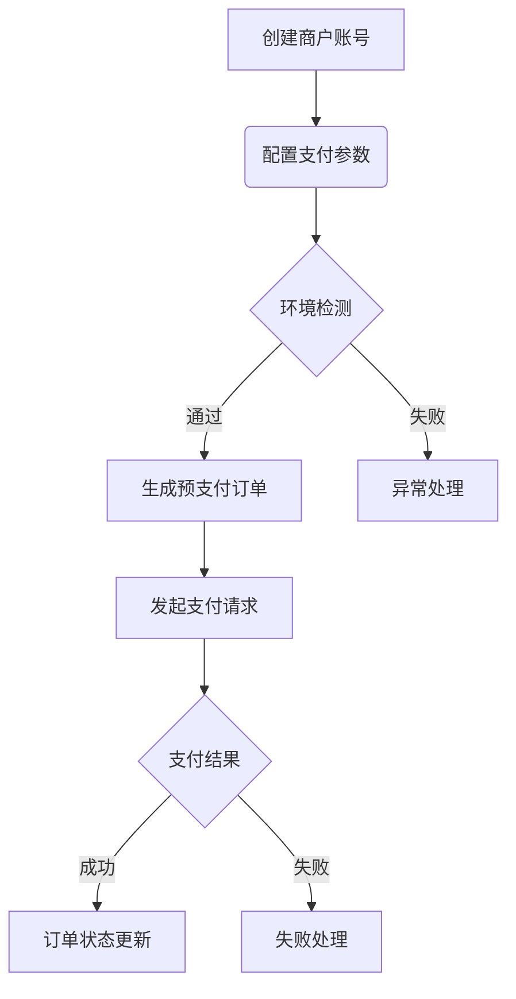

# 支付

## 概述
本系统集成以下主流支付方式：
- [微信支付](weixinpay/README.md) - 适用于公众号/小程序场景
- [支付宝](alipay/README.md) - 支持电脑网站和移动端支付
- [云闪付](unionpay/README.md) - 支持银联卡快捷支付

## 支付方式对比

## 如何选择
| 维度         | 微信支付         | 支付宝           | 云闪付          |
|--------------|----------------|----------------|---------------|
| 适用终端      | 微信公众号/小程序 | PC/移动浏览器   | 银联卡用户      |
| 手续费率      | 0.6%           | 0.55%          | 0.5%          |
| 到账周期      | T+1            | T+1            | T+1           |
| 开发复杂度    | 中等            | 简单            | 较高           |

## 通用接入流程

详细接入指南请参考各支付子文档。
