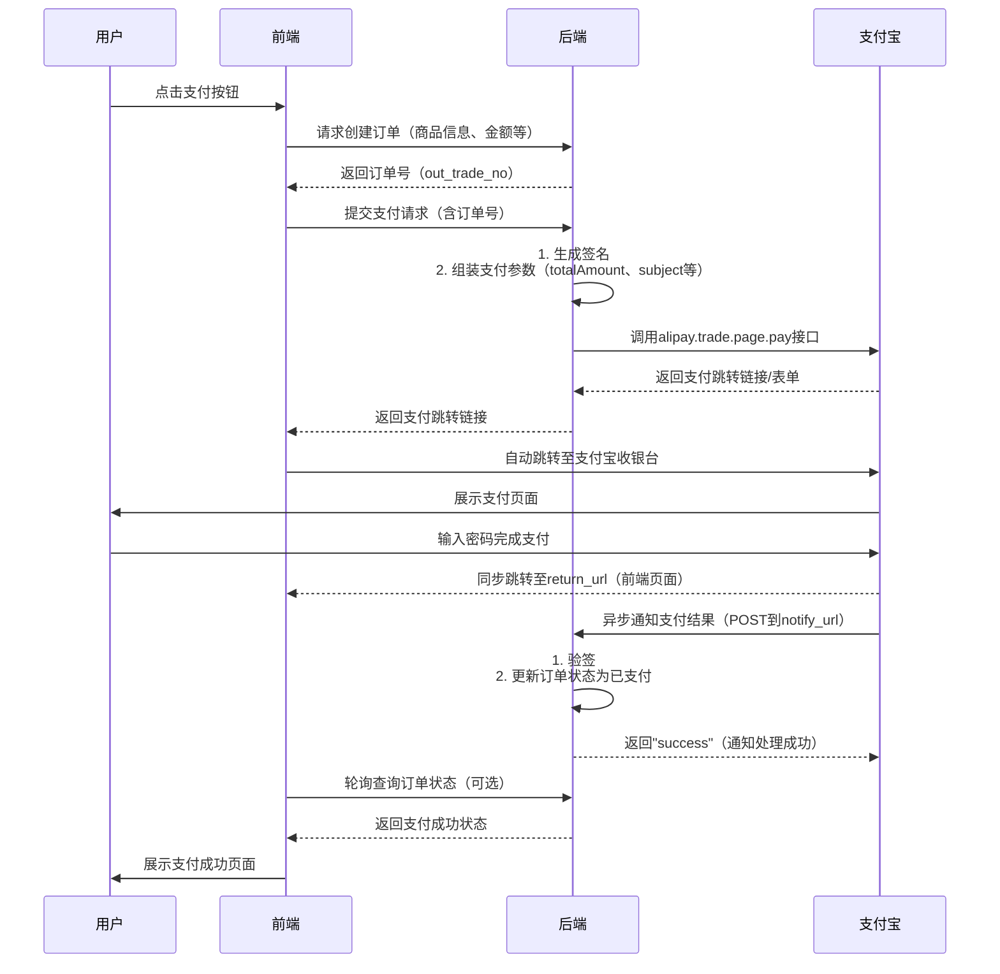

# 支付宝支付

- [Alipay JSAPI 使用说明](https://opendocs.alipay.com/open/024kz4)
- [Alipay JSAPI 概览](https://opendocs.alipay.com/open/025a4p)
- [JSAPI DEMO](https://opendocs.alipay.com/open/54/104510)
- [Alipay JSSDK](https://myjsapi.alipay.com/alipayjsapi/index.html)

