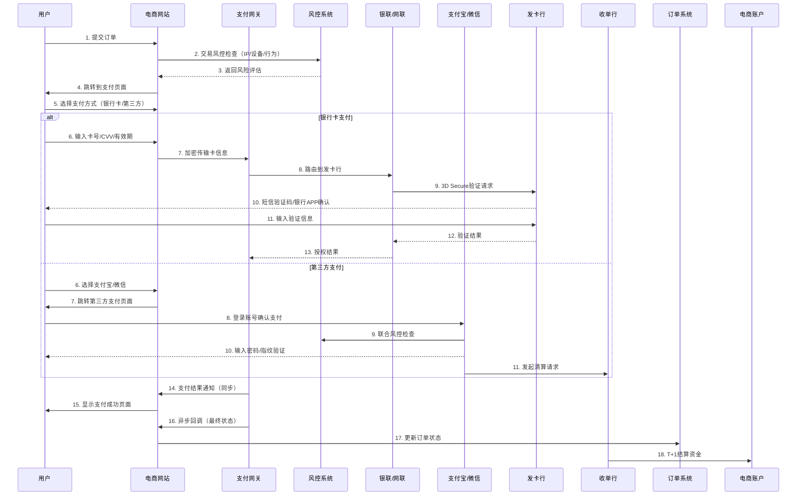

# 云闪付

- 云闪付开发文档中心：[中国银联开放平台](https://open.unionpay.com/)
- 全渠道接口规范下载：[云闪付官网](https://yunshanfu.unionpay.com/)

```mermaid
sequenceDiagram
    participant 用户 as 用户
    participant 电商网站 as 电商网站
    participant 支付网关 as 支付网关
    participant 风控系统 as 风控系统
    participant 银联/网联 as 银联/网联
    participant 第三方支付 as 支付宝/微信
    participant 发卡行 as 发卡行
    participant 收单行 as 收单行

    用户 ->> 电商网站: 1. 提交订单
    电商网站 ->> 风控系统: 2. 交易风控检查（IP/设备/行为）
    风控系统 -->> 电商网站: 3. 返回风险评估
    电商网站 ->> 用户: 4. 跳转到支付页面
    用户 ->> 电商网站: 5. 选择支付方式（银行卡/第三方）
    
    alt 银行卡支付
        用户 ->> 电商网站: 6. 输入卡号/CVV/有效期
        电商网站 ->> 支付网关: 7. 加密传输卡信息
        支付网关 ->> 银联/网联: 8. 路由到发卡行
        银联/网联 ->> 发卡行: 9. 3D Secure验证请求
        发卡行 -->> 用户: 10. 短信验证码/银行APP确认
        用户 ->> 发卡行: 11. 输入验证信息
        发卡行 -->> 银联/网联: 12. 验证结果
        银联/网联 -->> 支付网关: 13. 授权结果
    else 第三方支付
        用户 ->> 电商网站: 6. 选择支付宝/微信
        电商网站 ->> 用户: 7. 跳转第三方支付页面
        用户 ->> 第三方支付: 8. 登录账号确认支付
        第三方支付 ->> 风控系统: 9. 联合风控检查
        第三方支付 -->> 用户: 10. 输入密码/指纹验证
        第三方支付 ->> 收单行: 11. 发起清算请求
    end

    支付网关 ->> 电商网站: 14. 支付结果通知（同步）
    电商网站 ->> 用户: 15. 显示支付成功页面
    支付网关 ->> 电商网站: 16. 异步回调（最终状态）
    电商网站 ->> 订单系统: 17. 更新订单状态
    收单行 ->> 电商账户: 18. T+1结算资金
```