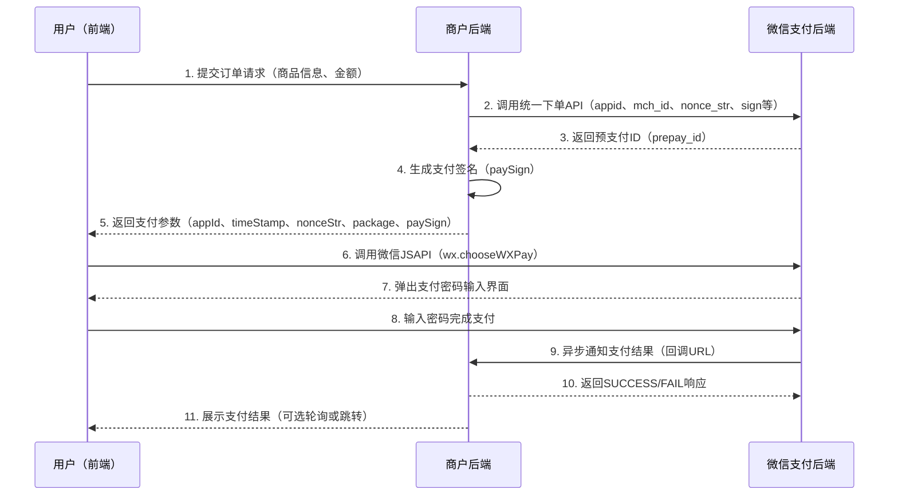

# 微信支付

- https://pay.weixin.qq.com/doc/v3/merchant/4012062524

```mermaid
sequenceDiagram
    participant 用户 as 用户（前端）
    participant 商户后端 as 商户后端
    participant 微信支付 as 微信支付后端

    用户->>商户后端: 1. 提交订单请求（商品信息、金额）
    商户后端->>微信支付: 2. 调用统一下单API（appid、mch_id、nonce_str、sign等）
    微信支付-->>商户后端: 3. 返回预支付ID（prepay_id）
    商户后端->>商户后端: 4. 生成支付签名（paySign）
    商户后端-->>用户: 5. 返回支付参数（appId、timeStamp、nonceStr、package、paySign）
    用户->>微信支付: 6. 调用微信JSAPI（wx.chooseWXPay）
    微信支付-->>用户: 7. 弹出支付密码输入界面
    用户->>微信支付: 8. 输入密码完成支付
    微信支付->>商户后端: 9. 异步通知支付结果（回调URL）
    商户后端-->>微信支付: 10. 返回SUCCESS/FAIL响应
    商户后端-->>用户: 11. 展示支付结果（可选轮询或跳转）
```