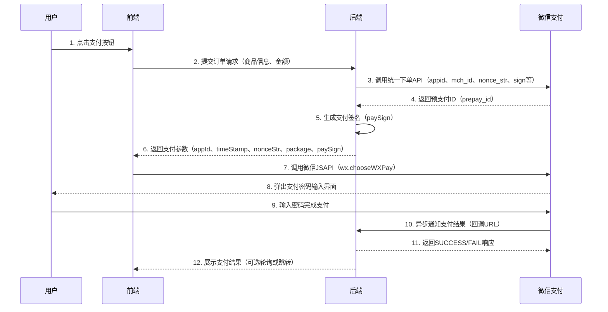

# 微信支付

## 简介

微信支付是腾讯旗下的第三方支付平台，为用户提供安全、快捷的支付服务。支持多种支付方式，包括扫码支付、公众号支付、小程序支付、APP支付等。本文档主要介绍JSAPI支付（公众号支付）的接入流程和代码实现。

JSAPI支付是用户在微信中打开商户的H5页面，商户在H5页面通过调用微信支付提供的JSAPI接口调起微信支付模块完成支付。适用于在微信客户端内的网页应用。

## 参考资料
- [微信支付开发文档](https://pay.weixin.qq.com/wiki/doc/apiv3/index.shtml)
- [JSAPI支付](https://pay.weixin.qq.com/wiki/doc/apiv3/apis/chapter3_1_1.shtml)
- [微信支付接入指引](https://pay.weixin.qq.com/wiki/doc/apiv3/open/pay/chapter2_1.shtml)
- [微信支付SDK下载](https://pay.weixin.qq.com/wiki/doc/apiv3/wechatpay/wechatpay6_0.shtml)

## 支付流程



## 关键代码实现

### 前端调用（JavaScript）

```javascript
// 1. 引入微信JSSDK
// 方式一：通过CDN引入
// <script src="https://res.wx.qq.com/open/js/jweixin-1.6.0.js"></script>

// 方式二：通过npm安装
// npm install weixin-js-sdk
// import wx from 'weixin-js-sdk'

// 2. 配置微信JSSDK
wx.config({
  debug: false, // 开启调试模式
  appId: 'your_app_id', // 必填，公众号的唯一标识
  timestamp: '', // 必填，生成签名的时间戳
  nonceStr: '', // 必填，生成签名的随机串
  signature: '', // 必填，签名
  jsApiList: ['chooseWXPay'] // 必填，需要使用的JS接口列表
});

// 3. 发起支付请求
async function createWxPayOrder(orderData) {
  const response = await fetch('/api/wxpay/create-order', {
    method: 'POST',
    headers: { 'Content-Type': 'application/json' },
    body: JSON.stringify(orderData)
  });
  
  const payParams = await response.json();
  
  // 调用微信JSAPI
  wx.chooseWXPay({
    timestamp: payParams.timeStamp,
    nonceStr: payParams.nonceStr,
    package: payParams.package,
    signType: 'RSA',
    paySign: payParams.paySign,
    success: function(res) {
      console.log('支付成功', res);
      // 跳转成功页面或轮询订单状态
    },
    fail: function(res) {
      console.log('支付失败', res);
    }
  });
}
```

### 后端实现

import Tabs from '@theme/Tabs';
import TabItem from '@theme/TabItem';

<Tabs>
<TabItem value="java" label="Java" default>

```java
// 使用微信官方SDK
import com.wechat.pay.java.core.Config;
import com.wechat.pay.java.core.RSAAutoCertificateConfig;
import com.wechat.pay.java.service.payments.jsapi.JsapiServiceExtension;
import com.wechat.pay.java.service.payments.jsapi.model.*;

public class WxPayService {
  private Config config;
  private JsapiServiceExtension service;
  
  public WxPayService(WxPayConfig wxConfig) {
    this.config = new RSAAutoCertificateConfig.Builder()
      .merchantId(wxConfig.getMchId())
      .privateKeyFromPath(wxConfig.getPrivateKeyPath())
      .merchantSerialNumber(wxConfig.getSerialNo())
      .apiV3Key(wxConfig.getApiv3PrivateKey())
      .build();
    this.service = new JsapiServiceExtension.Builder().config(config).build();
  }
  
  // 统一下单
  public PrepayWithRequestPaymentResponse createOrder(OrderData orderData) {
    PrepayRequest request = new PrepayRequest();
    request.setAppid(orderData.getAppId());
    request.setMchid(orderData.getMchId());
    request.setDescription(orderData.getDescription());
    request.setOutTradeNo(orderData.getOutTradeNo());
    request.setNotifyUrl(orderData.getNotifyUrl());
    
    Amount amount = new Amount();
    amount.setTotal(orderData.getAmount());
    amount.setCurrency("CNY");
    request.setAmount(amount);
    
    Payer payer = new Payer();
    payer.setOpenid(orderData.getOpenid());
    request.setPayer(payer);
    
    return service.prepayWithRequestPayment(request);
  }
  
  // 查询订单
  public Transaction queryOrder(String outTradeNo) {
    QueryOrderByOutTradeNoRequest request = new QueryOrderByOutTradeNoRequest();
    request.setOutTradeNo(outTradeNo);
    return service.queryOrderByOutTradeNo(request);
  }
}
```

</TabItem>
<TabItem value="php" label="PHP">

```php
<?php
// 使用微信官方SDK
use WeChatPay\Builder;
use WeChatPay\Crypto\Rsa;
use WeChatPay\Util\PemUtil;

class WxPayService {
  private $instance;
  
  public function __construct($config) {
    $merchantPrivateKeyInstance = Rsa::from(
      file_get_contents($config['privateKeyPath']), 
      Rsa::KEY_TYPE_PRIVATE
    );
    
    $this->instance = Builder::factory([
      'mchid' => $config['mchId'],
      'serial' => $config['serialNo'],
      'privateKey' => $merchantPrivateKeyInstance,
      'certs' => [
        $config['serialNo'] => file_get_contents($config['certPath'])
      ],
    ]);
  }
  
  // 统一下单
  public function createOrder($orderData) {
    $resp = $this->instance
      ->chain('v3/pay/transactions/jsapi')
      ->post([
        'json' => [
          'mchid' => $orderData['mchId'],
          'out_trade_no' => $orderData['outTradeNo'],
          'appid' => $orderData['appId'],
          'description' => $orderData['description'],
          'notify_url' => $orderData['notifyUrl'],
          'amount' => [
            'total' => $orderData['amount'],
            'currency' => 'CNY'
          ],
          'payer' => [
            'openid' => $orderData['openid']
          ]
        ]
      ]);
    
    return $resp->toArray();
  }
  
  // 查询订单
  public function queryOrder($outTradeNo) {
    $resp = $this->instance
      ->chain("v3/pay/transactions/out-trade-no/{$outTradeNo}")
      ->get([
        'query' => [
          'mchid' => $this->mchId
        ]
      ]);
    
    return $resp->toArray();
  }
}
?>
```

</TabItem>
<TabItem value="go" label="Go">

```go
// 使用微信官方SDK
package main

import (
  "context"
  "crypto/rsa"
  "crypto/x509"
  "encoding/pem"
  "io/ioutil"
  
  "github.com/wechatpay-apiv3/wechatpay-go/core"
  "github.com/wechatpay-apiv3/wechatpay-go/core/option"
  "github.com/wechatpay-apiv3/wechatpay-go/services/payments/jsapi"
  "github.com/wechatpay-apiv3/wechatpay-go/utils"
)

type WxPayService struct {
  client *core.Client
  mchId  string
}

func NewWxPayService(config *WxPayConfig) (*WxPayService, error) {
  privateKey, err := utils.LoadPrivateKeyWithPath(config.PrivateKeyPath)
  if err != nil {
    return nil, err
  }
  
  ctx := context.Background()
  client, err := core.NewClient(
    ctx,
    option.WithWechatPayAutoAuthCipher(config.MchId, config.SerialNo, privateKey, config.Apiv3PrivateKey),
  )
  if err != nil {
    return nil, err
  }
  
  return &WxPayService{
    client: client,
    mchId:  config.MchId,
  }, nil
}

func (s *WxPayService) CreateOrder(orderData *OrderData) (*jsapi.PrepayResponse, error) {
  svc := jsapi.JsapiApiService{Client: s.client}
  
  resp, _, err := svc.Prepay(context.Background(),
    jsapi.PrepayRequest{
      Appid:       core.String(orderData.AppId),
      Mchid:       core.String(orderData.MchId),
      Description: core.String(orderData.Description),
      OutTradeNo:  core.String(orderData.OutTradeNo),
      NotifyUrl:   core.String(orderData.NotifyUrl),
      Amount: &jsapi.Amount{
        Total:    core.Int64(orderData.Amount),
        Currency: core.String("CNY"),
      },
      Payer: &jsapi.Payer{
        Openid: core.String(orderData.Openid),
      },
    },
  )
  
  return resp, err
}

func (s *WxPayService) QueryOrder(outTradeNo string) (*jsapi.Transaction, error) {
  svc := jsapi.JsapiApiService{Client: s.client}
  
  resp, _, err := svc.QueryOrderByOutTradeNo(context.Background(),
    jsapi.QueryOrderByOutTradeNoRequest{
      OutTradeNo: core.String(outTradeNo),
      Mchid:      core.String(s.mchId),
    },
  )
  
  return resp, err
}
```

</TabItem>
</Tabs>

### 配置文件

```json
{
  "wxpay": {
    "appId": "your_app_id",
    "mchId": "your_mch_id",
    "apiKey": "your_api_key",
    "privateKeyPath": "./cert/apiclient_key.pem",
    "notifyUrl": "https://your-domain.com/api/wxpay/notify"
  }
}
```
