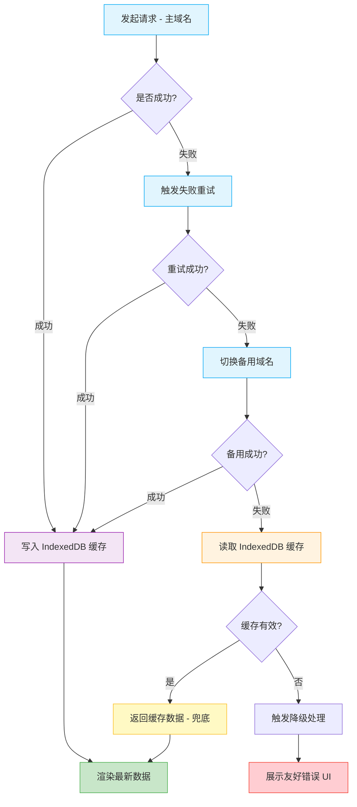

# 接口请求兜底容灾

基于 IndexedDB 的前端接口请求容灾解决方案，提供多层级的容错机制，确保在极端网络或服务异常情况下，让 Web 应用依然“坚不可摧”。

## ✨ 核心特性

- **四级递进容灾：** 主域名 -> 重试 -> 备用域名 -> 本地缓存 -> 平滑降级。
- **业务零中断：** 有效避免接口挂掉导致的页面白屏。
- **无感存取：** 成功请求自动缓存至 IndexedDB，无需手动干预。
- **全链路可观测：** 清晰标记数据来源（实时/缓存/备用），便于监控报警。

## 🏗️ 容灾策略架构

本方案采用递进式的处理机制。当发起一个 GET 请求时，系统会按以下流程流转：



## 🚀 实际工程落地指南

在生产环境中，推荐使用 **TanStack Query + Axios + localforage** 的组合来实现这套容灾机制。

### 核心依赖安装

```bash
pnpm add @tanstack/react-query @tanstack/react-query-persist-client @tanstack/query-async-storage-persister axios localforage
```

### Axios 层面：定制 Orval Mutator 实现主/备域名容灾

结合 RESTful 规范，我们在 Orval 配置的自定义 Mutator `src/api/mutator/axios.ts` 中植入备用域名的重试策略：

```ts
// src/api/mutator/axios.ts
import Axios from 'axios';
import type { AxiosError, AxiosRequestConfig } from 'axios';

// 结合 RESTful 规范定义的统一错误响应格式
export interface ApiErrorResponse {
  code: string;
  message: string;
  error: string;
}

const PRIMARY_DOMAIN = import.meta.env.VITE_API_BASE_URL || '/api';
const BACKUP_DOMAINS = [
  'https://backup1.example.com',
  'https://backup2.example.com',
];

export const axiosInstance = Axios.create({
  baseURL: PRIMARY_DOMAIN,
  timeout: 5000,
});

// 请求拦截器：自动携带 Token
axiosInstance.interceptors.request.use(
  (config) => {
    const token = localStorage.getItem('token');
    if (token) {
      config.headers.Authorization = `Bearer ${token}`;
    }
    return config;
  },
  (error) => Promise.reject(error),
);

// 扩展 AxiosRequestConfig 以支持容灾参数
interface FallbackRequestConfig extends AxiosRequestConfig {
  fallbackEnabled?: boolean;
  fallbackDomains?: string[];
  _retryCount?: number;
}

// 响应拦截器：先尝试备用域名容灾，失败后再处理全局业务错误
axiosInstance.interceptors.response.use(
  (response) => response,
  async (error: AxiosError<ApiErrorResponse>) => {
    const config = error.config as FallbackRequestConfig;

    // ============================================
    // 1. 容灾降级：备用域名切换策略
    // ============================================
    if (config && config.fallbackEnabled && config.method === 'get') {
      config._retryCount = config._retryCount || 0;
      const fallbackDomains = config.fallbackDomains || BACKUP_DOMAINS;

      if (config._retryCount < fallbackDomains.length) {
        const nextDomain = fallbackDomains[config._retryCount];
        config._retryCount += 1;

        config.baseURL = nextDomain;
        console.warn(`[API Fallback] 主域名请求失败，正在尝试备用域名: ${nextDomain}`);

        return axiosInstance(config);
      }
    }

    // ============================================
    // 2. 全局错误拦截 (容灾全部失效或无需容灾的请求)
    // ============================================
    if (error.response) {
      const { status, data } = error.response;
      switch (status) {
        case 401:
          localStorage.removeItem('token');
          window.location.href = '/login';
          break;
        case 403:
          console.error('访问被拒绝:', data.message || '没有操作权限');
          break;
        case 500:
          console.error('服务器内部错误:', data.error || '系统异常');
          break;
        default:
          break;
      }
    }
    return Promise.reject(error);
  },
);

// Orval 自定义请求函数
export const axios = <T>(
  config: AxiosRequestConfig,
  options?: FallbackRequestConfig,
): Promise<T> =>
  axiosInstance({
    ...config,
    ...options,
  }).then(({ data }) => data);

export type ErrorType<Error = ApiErrorResponse> = AxiosError<Error>;
export type BodyType<BodyData> = BodyData;
```

### TanStack Query 层面：利用全局 Provider 开启 IndexedDB 兜底

在 `src/providers/QueryProvider.tsx` 中配置持久化存储：

```tsx
// src/providers/QueryProvider.tsx
import { useEffect } from 'react';
import { QueryClient, QueryClientProvider } from '@tanstack/react-query';
import { ReactQueryDevtools } from '@tanstack/react-query-devtools';
import { persistQueryClient } from '@tanstack/react-query-persist-client';
import { createAsyncStoragePersister } from '@tanstack/query-async-storage-persister';
import localforage from 'localforage';
import type { ReactNode } from 'react';

// 初始化 IndexedDB 存储
const idbStorage = localforage.createInstance({
  name: 'AppFallbackDB',
  storeName: 'api_cache',
});

const asyncStoragePersister = createAsyncStoragePersister({
  storage: idbStorage,
});

// 初始化 QueryClient
const queryClient = new QueryClient({
  defaultOptions: {
    queries: {
      retry: 2, // TanStack 自带的主域名网络级重试
      retryDelay: (attemptIndex) => Math.min(1000 * 2 ** attemptIndex, 10000),
      staleTime: 5 * 60 * 1000, // 5 分钟内数据被认为是新鲜的
      gcTime: 24 * 60 * 60 * 1000, // 垃圾回收时间保留 24 小时，作为断网兜底池
      refetchOnWindowFocus: false,
    },
  },
});

interface QueryProviderProps {
  children: ReactNode;
}

function QueryProvider({ children }: QueryProviderProps) {
  useEffect(() => {
    const unsubscribe = persistQueryClient({
      queryClient,
      persister: asyncStoragePersister,
      maxAge: 24 * 60 * 60 * 1000, // 缓存最长保留 24 小时
    });

    return () => unsubscribe[1]();
  }, []);

  return (
    <QueryClientProvider client={queryClient}>
      {children}
      <ReactQueryDevtools initialIsOpen={false} />
    </QueryClientProvider>
  );
}

export default QueryProvider;
```

### 组件级使用：结合 Orval 生成的 Hooks 处理降级

业务代码只需正常调用 Orval 自动生成的 hooks，并加上 `fallbackEnabled` 配置即可。遇到断网或服务器崩溃，UI 会自动展示 IndexedDB 里的旧数据：

```tsx
// src/pages/UserDetail.tsx
import { AlertCircle } from 'lucide-react';
import { useGetUserById } from '@/api/user/user'; // 由 Orval 自动生成
import { Skeleton } from '@/components/ui/skeleton';
import { Card, CardContent, CardHeader, CardTitle } from '@/components/ui/card';
import { Alert, AlertDescription, AlertTitle } from '@/components/ui/alert';

interface UserDetailProps {
  userId: string;
}

function UserDetail({ userId }: UserDetailProps) {
  // 第二个参数传递给自定义的 axios mutator，开启容灾标识
  const { data: user, isLoading, error, isFetching } = useGetUserById(userId, {
    fallbackEnabled: true,
  });

  if (isLoading) {
    return (
      <div className="space-y-4">
        <Skeleton className="h-8 w-[200px]" />
        <Skeleton className="h-[100px] w-full rounded-xl" />
      </div>
    );
  }

  // error 只有在所有备用域名失效，且 IndexedDB 中完全没有缓存时才会出现
  if (error) {
    const apiCode = error.response?.data?.code;
    return (
      <Alert variant="destructive">
        <AlertCircle className="h-4 w-4" />
        <AlertTitle>加载失败</AlertTitle>
        <AlertDescription>
          {apiCode === 'A0201'
            ? '账户异常，用户不存在'
            : error.response?.data?.message || error.message}
        </AlertDescription>
      </Alert>
    );
  }

  return (
    <div className="space-y-4">
      {/* 离线状态且取到缓存兜底数据的 UI 提示 */}
      {!isFetching && !navigator.onLine && (
        <Alert>
          <AlertTitle>您处于离线状态</AlertTitle>
          <AlertDescription>当前网络不可用，正在显示离线缓存数据</AlertDescription>
        </Alert>
      )}

      <Card>
        <CardHeader>
          <CardTitle>用户信息</CardTitle>
        </CardHeader>
        <CardContent>
          <p className="text-sm text-muted-foreground">姓名：{user?.name}</p>
        </CardContent>
      </Card>
    </div>
  );
}

export default UserDetail;
```

## 📖 典型应用场景

- 🛒 **电商平台：** 主服务器故障或大促限流时，优先展示 IndexedDB 中缓存的商品列表，避免用户看到空白页面，挽回交易转化率。
- 📰 **内容/资讯平台：** 网络不稳定时，用户依然可以阅读之前缓存的文章列表，保证“永远有内容可看”。 
- 🏢 **企业级 SaaS：** 权限或配置接口异常时，利用缓存的“基础权限”维持核心流程运转，同时静默上报异常。

## ⚠️ 最佳实践与限制

- **仅限 GET 请求：** 兜底缓存机制仅适用于无副作用的 GET 请求。不要对 POST/PUT/DELETE 等操作使用缓存兜底。
- **区分缓存层级：** Axios 层面的备用域名保证了“服务器宕机但网络通畅”的情况；TanStack Query 层的 IndexedDB 保证了“断网或所有服务器全挂”的情况。两者的责任边界很清晰。
- **数据敏感性安全：** 若应用包含高度敏感的金融/医疗数据，缓存至 IndexedDB 前需考虑前端加密加密（如 `crypto-js`），或在用户登出时主动调用 `queryClient.clear()` 和 `idbStorage.clear()` 清理本地数据。