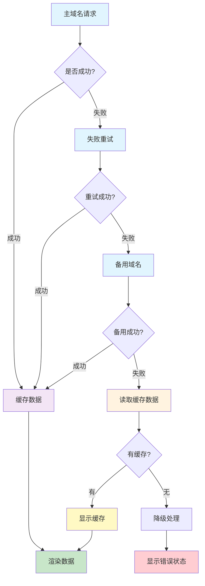

# 接口请求兜底容灾

基于 IndexedDB 的接口请求容灾解决方案，提供多层级的容错机制。

## 兜底容灾的必要性和意义

### 为什么需要兜底容灾？

在现代 Web 应用中，接口请求失败是不可避免的现象。传统的错误处理往往只是简单地显示“网络错误”或“服务异常”，这会严重影响用户体验。兜底容灾机制能够在各种异常情况下，仍然为用户提供可用的服务。

### 常见的接口失败场景

1. **网络问题**
   - 用户网络不稳定
   - DNS 解析失败
   - 网络延迟过高

2. **服务端问题**
   - 服务器宕机
   - 接口响应超时
   - 服务过载限流

3. **CDN 问题**
   - CDN 节点故障
   - 缓存失效
   - 地域网络问题

4. **第三方依赖**
   - 依赖服务异常
   - API 限额超限
   - 服务维护升级

### 兜底容灾的核心价值

#### 1. 业务连续性保障
- **零中断体验**: 即使主服务不可用，用户仍能获得基础功能
- **核心功能保护**: 关键业务流程不受外部依赖影响
- **服务降级**: 在异常情况下提供简化但可用的服务

#### 2. 用户体验优化
- **避免白屏**: 永远不让用户看到空白页面
- **内容可见**: 即使是缓存数据也比错误页面更有价值
- **操作流畅**: 减少因网络问题导致的操作中断

#### 3. 业务损失减少
- **转化率保护**: 避免因技术问题导致的用户流失
- **品牌形象**: 展现技术团队的专业性和可靠性
- **竞争优势**: 在同类产品中提供更稳定的服务

#### 4. 技术架构优势
- **系统韧性**: 提升整体系统的容错能力
- **监控友好**: 清晰的数据来源标识便于问题排查
- **可观测性**: 不同层级的容灾触发情况提供运维洞察

### 实际应用场景

#### 电商场景

在电商平台中，当主服务器出现故障时，兜底机制能够确保用户仍然可以浏览商品。系统会优先显示缓存的商品列表，如果缓存不可用，则展示预设的热门商品或推荐商品，避免用户看到空白页面。这样既保持了购物体验的连续性，也为系统恢复争取了时间。

#### 内容平台

对于新闻、博客等内容平台，当接口异常时，用户依然可以看到之前缓存的文章列表。如果没有缓存数据，系统会展示精选热门文章或编辑推荐内容，确保用户总是有内容可读。这种策略能够有效减少用户流失，保持平台的活跃度。

#### 企业应用

在企业管理系统中，权限验证接口的稳定性至关重要。当权限服务不可用时，兜底机制会为用户分配基础权限，确保系统的核心功能仍可正常使用。同时，系统会记录异常情况，便于管理员及时处理权限问题。

## 兜底容灾策略

### 多级容灾机制

本方案采用四层递进式容灾策略，确保在各种异常情况下都能为用户提供可用的服务：

1. **主域名请求**：优先使用主要的 API 服务域名发起请求
2. **失败重试**：当主域名请求失败时，进行自动重试（默认 3 次），采用指数退避策略
3. **备用域名**：重试失败后切换到预配置的备用域名列表，逐一尝试
4. **读取缓存数据**：所有域名都失败时，从 IndexedDB 中读取之前缓存的数据作为兜底
5. **降级处理**：缓存也不可用时，显示友好的错误提示，避免白屏

每次成功请求的数据都会自动缓存到 IndexedDB，为后续的容灾提供数据支撑。

## 兜底机制优势

1. **多层保障**: 多层容灾机制确保服务可用性
2. **数据一致性**: 兜底数据版本管理
3. **性能优化**: 本地备份快速响应
4. **用户体验**: 避免白屏和错误页面
5. **可配置性**: 灵活的兜底策略配置
6. **监控友好**: 数据来源标识便于排查

## 注意事项

- 仅对 GET 请求进行缓存
- 缓存数据有过期时间，默认 5 分钟
- 备用域名需要提供相同的 API 接口
- IndexedDB 存储有浏览器兼容性要求
