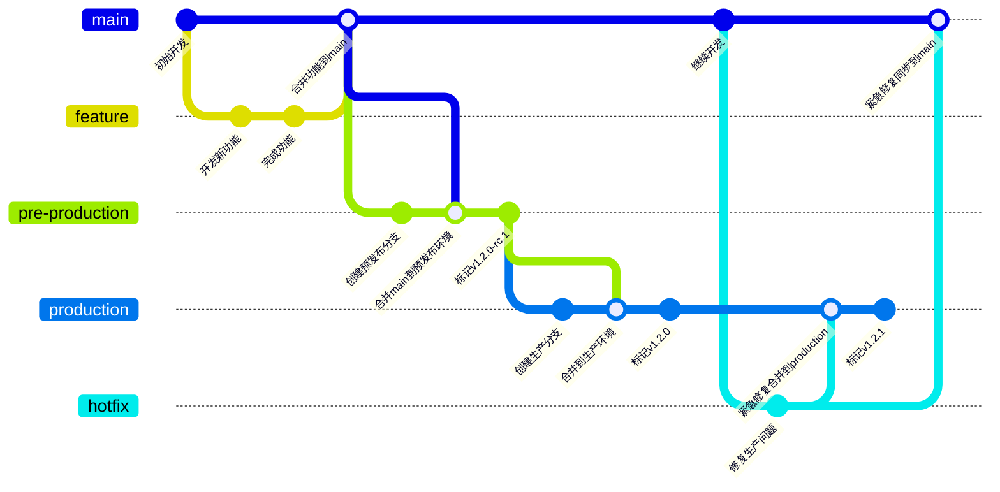
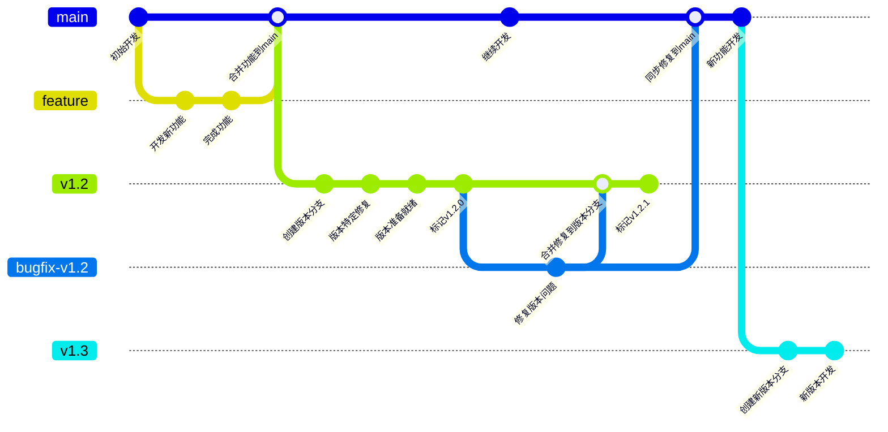
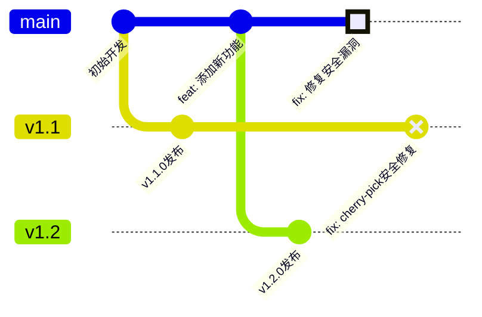

# 分支管理和提交

## 分支管理

分支管理采用GitLab Flow，GitLab Flow 是一种基于 Git 的工作流程模型，结合了 GitHub Flow 和 Git Flow 的优点，同时又增加了一些新的特性。

### 持续发布模式



#### 创建功能分支开发新功能

```bash
git checkout main
git pull origin main  # 确保本地 main 分支最新
git checkout -b feature/new-login  # 创建功能分支
```

#### 合并功能分支到 main 分支

```bash
git checkout main
git merge feature/new-login  # 合并功能分支到 main
git push origin main         # 推送更新到远程仓库
```

#### 合并到预发布环境（pre-production）

```bash
# 将 release 分支或 main 分支合并到 pre-production
git checkout pre-production
git merge main

# 打版本标签（SemVer 格式，例如 v1.2.0-rc.1）
git tag -a v1.2.0-rc.1
git push origin pre-production --tags

# 触发预发布环境部署（假设 CI/CD 已配置）
# GitLab Runner 检测到 pre-production 分支更新，执行部署脚本
```

#### 合并到生产环境（production）

预发布环境测试通过后，合并到生产环境（production）

```bash
# 从 pre-production 合并到 production
git checkout production
git merge pre-production --no-ff

# 打正式生产版本标签（例如 v1.2.0）
git tag -a v1.2.0 -m "Production release v1.2.0"
git push origin production --tags

# 触发生产环境部署
# CI/CD 检测到 production 分支更新，自动执行部署
```

#### 热修复流程（生产环境紧急修复）

```bash
# 从 production 分支创建热修复分支
git checkout production
git checkout -b hotfix/v1.2.1

# 修复问题并提交
echo "紧急修复" >> hotfix.txt
git add hotfix.txt
git commit -m "fix: 修复生产环境中的关键登录错误"

# 合并到 production 和 main
git checkout production
git merge hotfix/v1.2.1 --no-ff

git checkout main
git merge hotfix/v1.2.1 --no-ff

# 打新版本标签（例如 v1.2.1）
git tag -a v1.2.1 -m "热修复版本 v1.2.1"
git push origin production --tags
git push origin main
```

### 版本发布模式



#### 创建版本分支

当需要发布特定版本时，从main分支创建版本分支：

```bash
git checkout main
git pull origin main  # 确保本地 main 分支最新
git checkout -b v1.2  # 创建版本分支，使用版本号命名
git push origin v1.2  # 推送版本分支到远程仓库
```

#### 在版本分支上进行最终准备和测试

```bash
git checkout v1.2
# 进行版本特定的修复和调整
git commit -m "chore: 调整配置为生产环境参数"
git commit -m "docs: 更新版本说明文档"
git push origin v1.2
```

#### 标记并发布版本

当版本准备就绪时，打上版本标签并发布：

```bash
git checkout v1.2
git tag -a v1.2.0 -m "发布版本 1.2.0"
git push origin v1.2.0  # 推送标签到远程仓库

# CI/CD 可以配置为检测到标签后自动构建和发布
```

#### 版本分支上的问题修复

当已发布版本出现问题需要修复时：

```bash
# 从版本分支创建修复分支
git checkout v1.2
git checkout -b bugfix/v1.2-login-issue

# 修复问题并提交
git commit -m "fix: 修复v1.2中的用户登录问题"
git push origin bugfix/v1.2-login-issue

# 创建合并请求到v1.2分支
# 审核通过后合并到v1.2分支

# 合并修复后，更新版本号并打标签
git checkout v1.2
git tag -a v1.2.1 -m "发布版本 1.2.1，修复登录问题"
git push origin v1.2.1
```

#### 使用Cherry-Pick在版本间选择性应用提交

除了创建修复分支并合并的方式外，cherry-pick是版本发布模式中的重要工具，特别适用于：

- 将特定修复应用到多个版本分支
- 选择性地将main分支上的功能移植到特定版本
- 在不合并整个分支的情况下应用单个提交



执行cherry-pick的操作流程：

```bash
# 首先找到需要cherry-pick的提交哈希值
git checkout main
git log --oneline  # 找到修复提交的哈希值，例如abc1234

# 将该提交应用到版本分支
git checkout v1.2
git cherry-pick abc1234
# 解决可能出现的冲突
git add .
git cherry-pick --continue
git tag -a v1.2.1 -m "发布版本 v1.2.1，包含安全修复"
git push origin v1.2 --tags

# 对旧版本也执行相同操作
git checkout v1.1
git cherry-pick abc1234
# 解决可能的冲突
git tag -a v1.1.2 -m "发布版本 v1.1.2，包含安全修复" 
git push origin v1.1 --tags
```

cherry-pick的最佳实践：

1. 在commit message中添加引用原始提交的信息
2. 保持cherry-pick的提交尽量小且专注于单一问题
3. 记录每次cherry-pick操作，确保关键修复应用到所有需要维护的版本分支
4. 当多个提交需要一起cherry-pick时，考虑使用`git cherry-pick <commit1>..<commit2>`命令

#### 将修复同步回主分支

确保修复内容也合并到主分支，避免问题在新版本中重现：

```bash
git checkout main
git merge bugfix/v1.2-login-issue
git push origin main
```

#### 创建新版本分支

当开发下一个版本时：

```bash
git checkout main  # 从主分支创建新版本分支
git pull origin main
git checkout -b v1.3
git push origin v1.3
```

### 两种模式的区别

- **持续发布模式**：适合 SaaS 应用程序，更新可以直接推送到生产环境
- **版本发布模式**：适合传统软件交付，需要在多个环境中测试验证后才能部署到生产环境

## Commit 提交规范

### 提交信息格式

Commit 提交规范使用[约定式提交](https://www.conventionalcommits.org/zh-hans/v1.0.0/)。约定式提交规范是一种基于提交信息的轻量级约定。 它提供了一组简单规则来创建清晰的提交历史；描述在提交信息中描述功能、修复和破坏性变更。

```
<type>[optional scope]: <description>

[optional body]

[optional footer(s)]
```

提交说明包含了下面的结构化元素，表明其意图：

- `fix:` 类型 为 `fix` 的提交表示在代码库中修复了一个 bug。
- `feat:` 类型 为 `feat` 的提交表示在代码库中新增了一个功能。
- `BREAKING CHANGE:` 在脚注中包含 `BREAKING CHANGE:` 或 `<类型>(范围)` 后面有一个 `!` 的提交，表示引入了破坏性 API 变更。 破坏性变更可以是任意 类型 提交的一部分。
- 除 `fix:` 和 `feat:` 之外，也可以使用其它提交 类型 ，例如 @commitlint/config-conventional（基于 Angular 约定）中推荐的 `build:`、`chore:`、 `ci:`、`docs:`、`style:`、`refactor:`、`perf:`、`test:`，等等。
  - `build:` 用于修改项目构建系统，例如修改依赖库、外部接口或者升级 Node 版本等；
  - `chore:` 用于对非业务性代码进行修改，例如修改构建过程或者工具配置等；
  - `ci:` 用于修改持续集成流程，例如修改 Travis、Jenkins 等工作流配置；
  - `docs:` 用于修改文档，例如修改 README 文件、API 文档等；
  - `style:` 用于修改代码的样式，例如调整缩进、空格、空行等；
  - `refactor:` 用于重构代码，例如修改代码结构、变量名、函数名等但不修改功能逻辑；
  - `perf:` 用于优化性能，例如提升代码的性能、减少内存占用等；
  - `test:` 用于修改测试用例，例如添加、删除、修改代码的测试用例等。
- 脚注中除了 `BREAKING CHANGE: <description>` ，其它条目应该采用类似 [git trailer format](https://git-scm.com/docs/git-interpret-trailers) 这样的惯例。

:::info
可以参考 **[约定式提交](https://www.conventionalcommits.org/zh-hans/v1.0.0/)** 页面提供的具体案例。
:::

:::warning
在项目中，总是使用 [commitlint](https://commitlint.js.org/) 来验证提交信息是否符合约定式提交规范。 如果不符合规范，提交将被拒绝。
:::

### 生成变更日志

使用约定式提交规范的一个重要优势是可以利用工具自动生成标准化的变更日志（CHANGELOG）。[conventional-changelog](https://github.com/conventional-changelog/conventional-changelog)是一套基于约定式提交规范的工具，可以根据Git提交历史自动生成变更日志文档。

#### 工作流程

1. 修改代码 
2. 提交（commit）这些变更 
3. 确保 CI/CD 流水线运行成功
4. 修改 package.json 版本号
5. 运行 conventional-changelog 
6. 提交 package.json 和 CHANGELOG.md 文件 
7. 打上版本标签（tag）
8. 推送到远程仓库（push）

#### 变更日志内容结构

基于约定式提交，生成的变更日志会自动分类：

- **Features** (`feat:`): 新功能
- **Bug Fixes** (`fix:`): 问题修复
- **BREAKING CHANGES**: 破坏性变更
- **Performance Improvements** (`perf:`): 性能优化
- **Documentation** (`docs:`): 文档更新
- 其他类型的提交（如`refactor:`, `test:`, `chore:`等）

#### 最佳实践

 **版本管理**：结合语义化版本（SemVer）使用，确保版本号与变更内容匹配
 
- `fix:` 类型的提交对应 PATCH 版本更新
- `feat:` 类型的提交对应 MINOR 版本更新
- 带有 `BREAKING CHANGE:` 的提交对应 MAJOR 版本更新

通过这种方式，团队可以保持一致的提交规范，并自动生成易于阅读、结构清晰的变更日志，提高项目文档的质量和可维护性。
