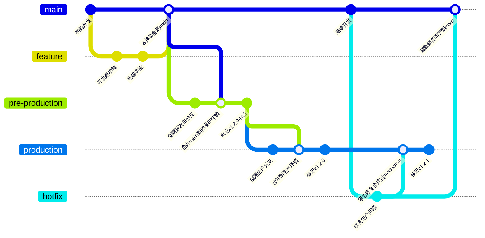

# 分支管理和提交

## 分支管理

分支管理采用GitLab Flow，GitLab Flow 是一种基于 Git 的工作流程模型，结合了 GitHub Flow 和 Git Flow 的优点，同时又增加了一些新的特性。

### 持续发布模式



#### 创建功能分支开发新功能

```bash
git checkout main
git pull origin main  # 确保本地 main 分支最新
git checkout -b feature/new-login  # 创建功能分支
```

#### 合并功能分支到 main 分支

```bash
git checkout main
git merge feature/new-login  # 合并功能分支到 main
git push origin main         # 推送更新到远程仓库
```

#### 合并到预发布环境（pre-production）

```bash
# 将 release 分支或 main 分支合并到 pre-production
git checkout pre-production
git merge main

# 打版本标签（SemVer 格式，例如 v1.2.0-rc.1）
git tag -a v1.2.0-rc.1
git push origin pre-production --tags

# 触发预发布环境部署（假设 CI/CD 已配置）
# GitLab Runner 检测到 pre-production 分支更新，执行部署脚本
```

#### 合并到预生产环境（production）

预发布环境测试通过后，合并到生产环境（production）

```bash
# 从 pre-production 合并到 production
git checkout production
git merge pre-production --no-ff

# 打正式生产版本标签（例如 v1.2.0）
git tag -a v1.2.0 -m "Production release v1.2.0"
git push origin production --tags

# 触发生产环境部署
# CI/CD 检测到 production 分支更新，自动执行部署
```

#### 热修复流程（生产环境紧急修复）

```bash
# 从 production 分支创建热修复分支
git checkout production
git checkout -b hotfix/v1.2.1

# 修复问题并提交
echo "Emergency fix" >> hotfix.txt
git add hotfix.txt
git commit -m "Fix critical bug in production"

# 合并到 production 和 main
git checkout production
git merge hotfix/v1.2.1 --no-ff

git checkout main
git merge hotfix/v1.2.1 --no-ff

# 打新版本标签（例如 v1.2.1）
git tag -a v1.2.1 -m "Hotfix release v1.2.1"
git push origin production --tags
git push origin main
```

### 版本发布模式


### 两种模式的区别

- **持续发布模式**：适合 SaaS 应用程序，更新可以直接推送到生产环境
- **版本发布模式**：适合传统软件交付，需要在多个环境中测试验证后才能部署到生产环境