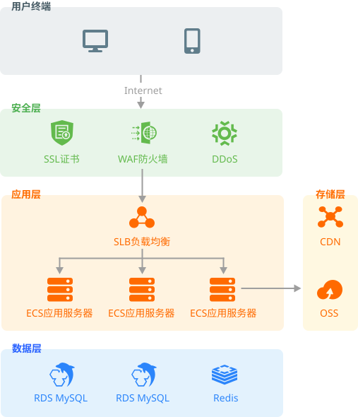

# 部署

## 项目构建和环境部署

采用现代化的构建工具栈和严谨的自动化 CI/CD 流水线，来保障交付产物的质量与安全性。

所有的构建和部署操作，均在 **Gitlab CI** 执行操作。

### 构建和部署流程

主要依赖于下面两个镜像：

- [Node.js](https://nodejs.org/)：用于安装依赖、构建和启动
- [nginx](https://nginx.org/)：作为 HTTP 服务器，或者充当反向代理

:::tip
- [nginx 配置](/docs/reference/configuration/#nginx)
- [Docker 配置](/docs/reference/configuration/#docker)
:::

| 镜像      | 步骤                                                                         | React/Vue | Next.js |
|---------|----------------------------------------------------------------------------|-----------|---------|
| Node.js | 执行 `pnpm i --frozen-lockfile` 安装依赖                                         | ✔️        | ✔️      |
|         | 执行 `npm run build` 构建项目                                                    | ✔️        | ✔️      |
|         | 构建完成后生成 `/dist` 目录                                                         | ✔️        |         |
|         | 将静态资源文件上传至 CDN/OSS 存储                                                      | ✔️        | ✔️      |
|         | 执行 `npm run start` 启动 Node.js 服务                                           |           | ✔️      |
| nginx   | 编译 [Brotli nginx 模块](https://github.com/google/ngx_brotli)                 | ✔️        | ✔️      |
|         | 编译 [ModSecurity nginx 模块](https://github.com/SpiderLabs/ModSecurity-nginx) | ✔️        | ✔️      |
|         | 将编译完成后模块复制到 nginx 的模块目录                                                    | ✔️        | ✔️      |
|         | 复制 `/dist` 目录到 nginx 的服务器目录                                                | ✔️        |         |
|         | 复制 `nginx.conf` 文件替换镜像的 nginx 配置文件                                         | ✔️        | ✔️      |
|         | 更新 nginx 配置以使用 CDN/OSS 域名作为静态资源引用                                          | ✔️        | ✔️      |
|         | 执行 `nginx -s reload` 重新加载 nginx 配置                                         | ✔️        | ✔️      |
|         | 启动 nginx                                                                   | ✔️        | ✔️      |

:::info[🔥 容器与部署细节说明]
- **深度定制的 Nginx 镜像：** 基于轻量级 Alpine 基础镜像，在构建过程中动态编译并植入了 `ngx_brotli`（支持高压缩率）和 ModSecurity 模块（配合 OWASP CRS 防御攻击），兼顾了极简体积与高级别安全防御。 
- **分离式资源上传策略：** 在生产部署时，CI 流水线会将构建出的静态资源目录同步至云端对象存储（CDN 回源站），**并且会特意排除** `index.html` 和 `service-worker.js`。这两个核心入口文件将始终保留在 Nginx 容器内直出，以彻底杜绝入口文件被 CDN 强缓存导致的“版本不更新”问题。
:::

:::warning
- 安装依赖和构建项目的步骤，均在 Gitlab CI 中执行，不需要配置在 Dockerfile 中
- Dockerfile 仅需要配置 nginx 的相关步骤
  - 如果需要使用 Node.js 启动服务，则需要在 Dockerfile 中配置 Node.js 的相关步骤，并运行 Node.js 服务。此时，需要使用 `docker-compose` 来启动服务，并配置 nginx 的反向代理
:::

### 前端构建优化

在代码打包阶段，我们通过构建工具实施了以下深度的前端性能与安全优化：

1. **资源体积与图像极致优化**
   - 在构建时对项目内资产进行深度压缩（包含 SVG 优化、去除图像冗余元数据等）。
   - 自动生成 WebP 及 AVIF 等现代高压缩比图像格式，以提升 LCP 性能。
   - 配置代码分割（Code Splitting）及 Tree Shaking 移除无效代码。
2. **预压缩与 PWA 增强**
   - 生产环境下自动生成最高级别的 `.br` (Brotli) 和 `.gz` 预压缩静态文件，大幅节省服务器侧动态压缩的 CPU 消耗。
   - 集成 Service Worker 生成策略，提供强悍的本地缓存和 PWA 离线能力（最大缓存单文件可达 5MB）。
3. **前端安全基线加固**
   - 构建时自动生成 SRI (Subresource Integrity) 哈希校验码，防止 CDN 静态资源被恶意篡改。
   - 为资源配置 `crossorigin='anonymous'` 属性，规范化跨域行为。

## 高级发布策略

传统的覆盖式部署风险较高。对于核心业务线，建议结合我们的分离部署架构采用以下策略：

### 蓝绿部署

针对前端单页应用实施无缝的蓝绿部署：

1. **资源准备：** 因构建时使用了内容哈希（Content Hash），多次打包上传至 OSS 的资源天然共存。
2. **流量切换：** 由于核心入口 `index.html` 驻留在 Nginx 容器内，只需通过容器编排工具（如 Kubernetes 或 Docker Swarm）将网关流量平滑切换至新版本的 Nginx 容器实例。
3. **优势体现：** 实现用户零感知的应用更新，避免发布期间旧版本页面请求新版本哈希资源导致的 404 问题。

### 金丝雀发布 (Canary Release)

实施渐进式的前端功能发布：

1. **客户端分流：** 借助特性开关系统 (Feature Flags) 进行 5% -> 20% -> 100% 的灰度放量。
2. **指标观测：** 在灰度期间密切跟踪流水线中的自动化性能趋势预警，以及用户核心转化漏斗。
3. **状态保持：** 使用 Cookie 或 LocalStorage 记录用户的分流状态，确保单一用户在灰度期间体验的一致性。

## 线上验证与应急回滚

无论采用何种发布策略，发布后的监控验证和突发状况的兜底回滚都是运维生命周期的最后一环。

### 部署上线验证

部署上线后，前端开发者应立即跟进以下验证点：

1. **前端健康状态**
   - 检查 API 健康端点响应状态（如 `/health` 或 `/api/health` 返回 200）。
   - 确认前端路由跳转逻辑是否正常。
   - 检查浏览器控制台（Console），确保无预期外的错误或警告。
2. **静态资源验证**
   - 验证 OSS 资源与 CDN 节点的映射状态，检查 HTTP 响应头，确认 `content-encoding: br` 或 `gzip` 已生效。 
   - 确认 HTML 中引入的图片是否成功应用了构建时压缩的 WebP 或 AVIF 格式。
3. **安全与质量复测**
   - 确认静态资源发起的请求头中包含了预期的 `crossorigin` 属性与 `integrity` (SRI) 校验值。 
   - 人工复核 CI 流水线中最新生成的性能基准测试报告。

### 紧急回滚预案

当线上环境出现严重缺陷时，应立即启动前端专属的回滚预案：

1. **回滚触发条件**
   - 核心性能监控指标出现断崖式劣化。 
   - E2E 自动化监控任务在生产环境巡检中连续失败告警。 
   - 爆发大规模客诉或安全层 (ModSecurity) 误拦截率过高。
2. **安全秒级回滚动作**
   - 容器回滚：将负载均衡器/网关指向的 Nginx 镜像 Tag 回退至上一稳定版本（如 `latest-stable`），恢复旧版 `index.html`。由于 OSS 上保留了历史资源，页面请求旧版哈希文件将依然正常。 
   - 清理边缘缓存：紧急调用 CDN API 刷新 `index.html` 和 `service-worker.js` 的节点缓存。
3. **客户端缓存干预 (PWA/SW)**
   - 由于接入了 Service Worker，回滚后需密切注意浏览器本地的驻留缓存更新。 
   - 如发生 SW 旧缓存死锁导致锁死用户视图，需在下发的新版 `index.html` 中预留紧急逃生舱机制（如注入自动注销当前注册的 SW 并强制刷新页面的逻辑）。

## 服务器架构推荐

服务器产品推荐使用[阿里云](https://cn.aliyun.com/)产品

### 安全层

- [SSL 证书](https://www.aliyun.com/product/cas)：为网站提供 HTTPS 访问，保障数据的安全
- [DDoS 防护](https://www.aliyun.com/product/security/ddos)：降低潜在DDoS攻击风险，减少业务损失
- [Web 应用防火墙 WAF](https://www.aliyun.com/product/waf)：避免网站服务器被恶意入侵，保障业务的核心数据安全

:::info
前端 Nginx 容器层面深度集成了 ModSecurity 并引入了 OWASP CRS 核心规则集，在接入侧形成了一道独立且强大的应用级防火墙。
:::

### 应用层

- [负载均衡 SLB](https://www.aliyun.com/product/slb)：通过对多台云服务器进行均衡的流量分发调度，消除单点故障提升应用系统的可靠性与吞吐力
- [云服务器 ECS](https://www.aliyun.com/product/ecs)：部署 HTTP 服务器和项目代码
  - CPU 内存比为 1:2，推荐使用 2vCPU 和 4GB 内存以上配置，CPU 推荐使用 AMD EPYC 系列
  - 推荐使用 5MB+ 带宽
  - 建议支持 IPv6
  - 推荐使用 [Ubuntu Server](https://ubuntu.com/server)、[Rocky Linux](https://rockylinux.org/) 或 [AlmaLinux](https://almalinux.org/) 操作系统

### 存储层

- [CDN](https://www.aliyun.com/product/cdn)：部署静态资源，将网站、音视频、下载等内容分发至接近用户的节点，使用户可就近取得所需内容，提高用户访问的响应速度和成功率
  - 配置合理的缓存策略（长缓存 + 版本化文件名）
  - 启用 HTTP/2 和 HTTP/3（QUIC）支持
  - 配置适当的 CORS 策略允许跨域资源共享
  - 启用 Brotli 压缩获得更高的压缩率
  - 考虑使用自动 WebP/AVIF 转换功能

- [对象存储 OSS](https://www.aliyun.com/product/oss)：优化资源存储成本
  - 设置适当的生命周期策略管理旧版本资源
  - 利用存储类型策略（标准、低频、归档）降低成本
  - 配合 CDN 使用提高访问性能

### 数据层

（数据层不是前端关注的重点，这里不做说明）
