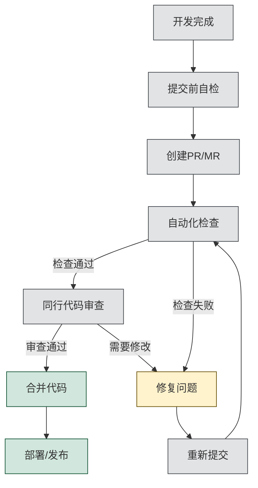
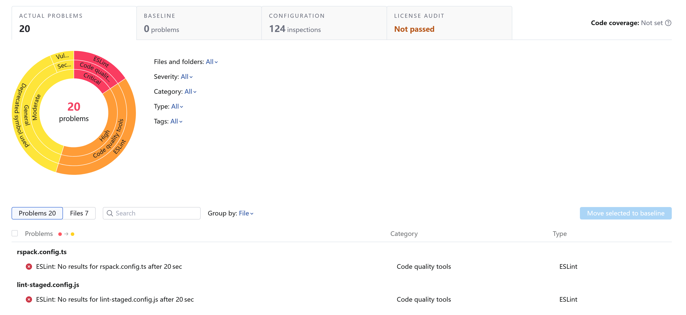

# 代码质量保障

前端开发中的代码质量保障是确保产品稳定性、可维护性和性能的关键环节，包括代码审查、静态检查和性能测试等多个方面。

## 代码审查

代码审查（Code Review）是开发团队成员互相检查代码的过程，旨在提高代码质量、分享知识并确保代码符合团队标准。

### 前端代码审查重点

#### 1. 功能实现

- **需求覆盖度**：检查是否完整实现了所有需求点
- **边缘情况**：是否处理了错误状态、空数据、加载状态等边缘情况
- **兼容性**：跨浏览器和设备的兼容性考虑

#### 2. 代码质量

- **可读性**：命名是否清晰、注释是否充分、结构是否合理
- **复杂度**：是否存在过度复杂的函数或组件
- **重复代码**：检查是否有可以抽象复用的代码段
- **设计模式**：是否合理使用了设计模式解决问题

#### 3. 性能考量

- **不必要的渲染**：检查是否存在可避免的重渲染
- **资源加载**：大文件是否需要懒加载或分片
- **内存泄漏**：是否存在潜在的内存泄漏风险
- **请求处理**：API 调用是否高效，是否考虑了缓存

#### 4. 安全性

- **输入验证**：用户输入是否得到适当验证
- **XSS 防护**：是否存在跨站脚本攻击风险
- **敏感数据**：敏感数据是否安全处理

#### 5. 可访问性

- **语义化 HTML**：是否使用了恰当的HTML元素
- **键盘可访问性**：交互元素是否可通过键盘操作
- **ARIA 属性**：是否正确应用了ARIA角色和属性
- **对比度**：颜色对比度是否符合WCAG标准

#### 6. UI/UX一致性

- **设计规范**：是否遵循了设计系统规范
- **交互反馈**：用户操作是否有适当的反馈
- **响应式设计**：布局在不同屏幕尺寸下是否合理

### 代码审查流程

1. **提交前自检**：开发者提交前进行自我检查
2. **创建PR/MR**：提交完整的拉取/合并请求
3. **自动化检查**：触发 CI/CD 流水线进行自动化检查
4. **同行审查**：至少一名团队成员进行代码审查
5. **修复问题**：根据反馈修复问题
6. **再次审查**：重新审查修复后的代码
7. **合并代码**：所有问题解决后合并到目标分支

## 静态检查

静态检查是在不运行代码的情况下分析源代码，发现潜在问题的过程。在前端开发中，TypeScript 和各种Linter 是主要的静态检查工具。

### TypeScript 类型检查

TypeScript 通过静态类型系统提供了强大的代码检查能力：

- **类型安全**：在编译时捕获类型错误，避免运行时异常
- **接口定义**：明确的接口定义使组件之间的交互更加清晰
- **自动补全**：IDE可以提供更智能的代码补全和提示
- **代码重构**：类型系统让重构更加安全和高效

### Linter 代码规范检查

Linter 工具（如 ESLint）在静态检查环节的作用十分突出：

- **错误检测**：发现潜在的逻辑错误和代码问题
- **最佳实践**：强制执行推荐的编码实践
- **代码风格**：确保一致的代码风格
- **特定问题检测**：针对React、Vue等框架的特定规则

### Qodana 代码质量平台

Qodana 是 JetBrains 开发的代码质量平台，专为CI/CD管道设计，能无缝集成到自动化工作流中进行静态代码分析。

#### 主要特点

- **多维度检测**：检查代码质量问题、安全漏洞、架构问题和格式一致性
- **多语言支持**：覆盖 JavaScript/TypeScript、Java、PHP、Python 等多种语言
- **灵活配置**：可自定义检查规则和设置基线忽略已知问题
- **持续监控**：追踪项目质量变化趋势
- **易于集成**：与主流 CI/CD 系统和开发工具链无缝对接

Qodana 通过自动化代码检查帮助团队尽早发现问题，减少技术债务，提升整体代码质量。

:::warning
Qodana 是 JetBrains 的商业产品，使用前请确保团队有相应的许可证。
:::

## 性能测试

性能测试是评估和优化应用响应能力的关键步骤，对于提供良好用户体验至关重要。

### Lighthouse 性能分析

Lighthouse 是由 Google 开发的开源自动化工具，用于提升网页应用的质量。它不仅仅是一个性能测试工具，更是一个全面的网站质量评估解决方案。

#### Lighthouse 介绍

Lighthouse 可以对网页进行一系列测试，并生成有关页面质量的报告。它主要从五个方面评估网站：

- **性能**：测量加载性能和运行时性能
- **可访问性**：检查网站是否遵循无障碍设计原则
- **最佳实践**：检查网站是否遵循现代 Web 开发的最佳实践
- **搜索引擎优化(SEO)**：评估页面对搜索引擎的友好程度
- **Progressive Web App(PWA)**：评估网站作为 PWA 的合规性

#### 使用方式

Lighthouse 提供多种使用方式，适合不同场景：

1. **Chrome DevTools**：在 Chrome 浏览器的开发者工具中直接使用
2. **浏览器扩展**：通过安装 Chrome 插件方式使用
3. **命令行工具**：通过npm安装使用命令行版本
4. **Node 模块**：作为程序包集成到自动化测试流程
5. **CI 集成**：通过 Lighthouse CI 在持续集成环境中运行

#### 关键性能指标

Lighthouse检测的核心性能指标包括：

1. **First Contentful Paint (FCP)**：首次内容绘制时间，表示浏览器首次绘制来自 DOM 的内容的时间
2. **Largest Contentful Paint (LCP)**：最大内容绘制时间，测量视口中最大内容元素的渲染时间
3. **Cumulative Layout Shift (CLS)**：累积布局偏移，测量视觉稳定性，量化用户体验到的意外布局偏移
4. **Total Blocking Time (TBT)**：总阻塞时间，测量 FCP 与 Time to Interactive 之间主线程被阻塞超过50ms的总时间
5. **Time to Interactive (TTI)**：可交互时间，测量页面完全可交互所需的时间
6. **Speed Index**：速度指数，衡量页面内容在视觉上的填充速度

#### 报告解读

Lighthouse生成的报告为每个类别提供分数（0-100）和具体改进建议：

- **90-100分**：优秀，符合最佳实践
- **50-89分**：中等，有改进空间
- **0-49分**：较差，需要重点优化

报告中会详细列出每项检测的结果，并按照对总体分数的影响程度排序，同时提供具体的优化建议和文档参考链接。

:::tip
Lighthouse报告本身也是一份优秀的学习资源，其提供的建议和最佳实践可以帮助开发者了解现代 Web 开发标准。具体可以参考 [Lighthouse 官方文档](https://developers.google.com/web/tools/lighthouse)。
:::

### Lighthouse CI

Lighthouse CI 是基于 Lighthouse 构建的持续集成工具，用于自动化运行Lighthouse并追踪性能变化。它可以：

- 在每次提交时运行 Lighthouse 测试
- 设置性能预算和阈值
- 对历史测试结果进行比较分析
- 与GitHub Actions、Gitlab CI等 CI 服务集成

通过将 Lighthouse 集成到开发流程中，团队可以更早发现并解决潜在的性能问题，确保网站始终保持良好的用户体验。
