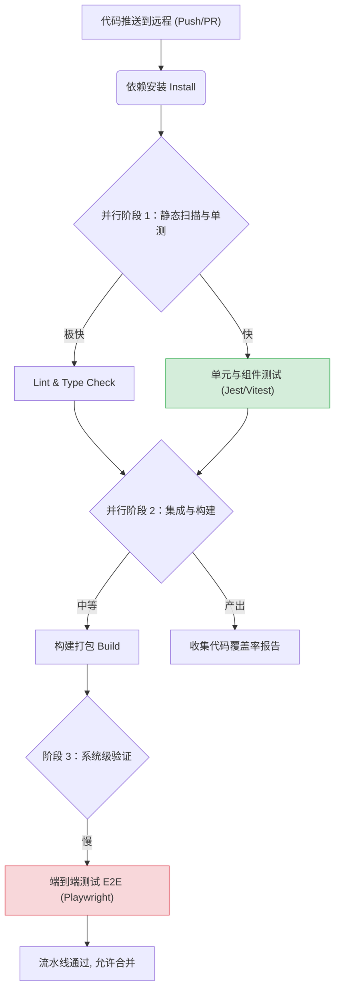

# 测试

测试是前端工程化中的重要环节，有助于提高代码质量、减少 bug 出现率，并确保应用在各种场景下都能稳定运行。

## 统一测试工具栈

根据项目的技术栈特点，确立了以下统一的测试工具矩阵。无论是在本地执行还是 CI/CD 流水线中，都将依赖这些核心工具链：

| 测试环节 | Next.js / React 生态 | Vue 生态 | 工具定位说明                                |
|---------|---------------------|---------|---------------------------------------|
| 单元测试 | [Jest](https://jestjs.io/zh-Hans/) | [Vitest](https://cn.vitest.dev/) | **极速反馈层：** 用于纯逻辑、工具函数、Hooks 的测试       |
| 组件测试 | [React Testing Library](https://testing-library.com/) | [Vue Test Utils](https://test-utils.vuejs.org/zh/) | **UI 交互层：** 关注组件的 DOM 渲染与用户行为，不测实现细节  |
| 集成/Mock | [MSW](https://mswjs.io/) + [Faker](https://fakerjs.dev/) | [MSW](https://mswjs.io/) + [Faker](https://fakerjs.dev/) | **数据拦截层：** 拦截真实网络请求，返回随机伪造数据，实现前后端解耦  |
| E2E 测试 | [Playwright](https://playwright.dev/) | [Playwright](https://playwright.dev/) | **系统验证层：** 跨浏览器的真实用户场景模拟（高度侧重 UI 的验证） |

## 阶段一：本地开发测试流 (Local Development)

在本地开发阶段，测试的核心目的是**快速验证（Fast Feedback）与防范回归（Regression Prevention）**。

### 1. 静态分析拦截

在编写任何逻辑和测试之前，静态分析（Static Analysis）作为最底层的防线开始工作。通过编辑器实时校验，以及配合 eslint / stylelint 检查拼写、语法和代码风格，可在不运行程序的情况下，将最基本的低级 Bug 拦截在摇篮中。

### 2. Mock 数据就绪 (MSW + Faker.js)

在开发组件之前或同时，优先利用 MSW 拦截网络请求，并用 Faker.js 生成测试数据。

实际操作时，应先明确 API 接口协议，编写对应的 MSW Handlers 拦截目标路由，随后利用 Faker.js 动态填充响应体的各种边界状态（如快乐路径、荒凉路径等）。这样一来，前端开发与测试将不再受制于后端接口的交付进度，集成测试也随之拥有了绝对可控的数据源。

### 3. 编写与运行单测/组件测 (Jest / Vitest)

在开发业务逻辑时，遵循 **AAA (Arrange, Act, Assert)** 模式来编写测试：

- **准备 (Arrange)：** 引入组件，挂载初始状态，并配置 MSW 返回当前用例所需的 Mock 数据。
- **执行 (Act)：** 使用 RTL / Vue Test Utils 模拟用户的真实交互（例如点击按钮、输入文本）。
- **断言 (Assert)：** 验证 DOM 结构的变化或相关回调函数是否按预期触发。

**编码规范：** 测试代码应尽可能保持简单，确保每个 `it()` 或 `test()` 块只专注于验证一个行为。请绝不测试实现细节——应依赖 `data-testid` 或 ARIA 角色进行元素定位，而不是依赖组件内部的私有状态或具体的 CSS 类名。

### 4. 关键链路 E2E 调试 (Playwright)

当一个完整的功能模块开发完毕后，需要编写少而精的端到端测试。可直接利用 Playwright 的代码生成器（Codegen）录制用户的基础交互路径（主要覆盖核心的"快乐路径"与导致报错的"可怕路径"），随后在生成的代码中补充断言，并执行无头（Headless）或唤起 UI 浏览器的本地运行调试。

## 阶段二：代码提交管控流 (Pre-Commit)

为了防止将破坏性的代码推送到远程仓库，通过 Husky + lint-staged 在本地提交时设置卡点。

- **Lint 校验：** 对暂存区代码运行 ESLint。
- **相关性测试运行：** 自动运行受当前提交文件影响的单元测试（例如 Jest 的 `--findRelatedTests` 或 Vitest 的 `vitest run --changed` 功能）。
- **卡点规则：** 仅当上述静态分析和受影响的单测全部通过时，才允许生成 commit。

## 阶段三：CI/CD 持续集成流水线 (Pipeline)

当代码推送到远程代码库，将触发标准的 CI 测试流水线。流水线的设计遵循"从快到慢、逐层递进"的原则，确保计算资源的高效利用。

### 1. 并行质量门禁 (Quality Gates)

- **静态检查 & 类型检查：** 全局运行 ESLint 及 TypeScript `tsc --noEmit`。
- **单元测试/组件测试：** 执行全量的 Jest / Vitest 测试套件。这部分因为环境轻量（基于 JSDOM），通常会在 1~2 分钟内完成。
- **覆盖率检查：** 收集代码覆盖率（Coverage）。通常以语句覆盖率（Statement coverage）作为基准，若低于项目设定的阈值（如 70%），流水线将直接阻断并报错。

### 2. 生产环境模拟构建 (Build)

使用 Next.js 或 Vite 将应用打包。E2E 测试必须基于生产构建（Production Build）进行验证，以确保最终用户的真实体验。

### 3. 端到端自动化执行 (E2E with Playwright)

此阶段耗时最长，且最容易发生脆弱性（Flakiness）失败。

- **环境启动：** 启动本地服务（如 `npm run start`）承载刚才的构建产物。
- **执行策略：** 由于 Playwright 支持极高的并发，可以在 CI 中开启多 Worker 并行跑用例。
- **容错机制：** 为解决网络抖动等造成的假阴性报错，配置适当的重试机制（Retries），例如 `retries: 2`。
- **失败排查：** Playwright 会在流水线中自动记录失败用例的 HTML 追踪报告（Trace Viewer）和截图，作为 Artifacts 供开发者下载分析。

## 策略与流水线的权衡思考

在日常的流水线建设中，请结合项目的实际情况进行动态调整：

- **避免过度测试的负担：** 100% 的代码覆盖率不是目标。如果项目是重度 UI 展现且业务逻辑简单，应将资源倾斜到流水线后期的 Playwright E2E 阶段。
- **利用 MSW 降低 CI 脆弱性：** 在 E2E 测试流水线中，如果第三方服务（如支付沙盒）经常超时导致 CI 挂起，可适度在 Playwright 中利用 MSW 拦截外部不可控请求，注入 Faker.js 假数据，以此提升流水线的稳定性。
- **关注 CI 耗时：** 如果发现 CI 流水线运行时间过长（超过 15 分钟），应审视是否将过多本应由组件测试（React Testing Library / Vue Test Utils）承担的断言逻辑，写到了笨重的 E2E（Playwright）中。合理将测试下沉至金字塔的中下部，是优化流水线的核心。
