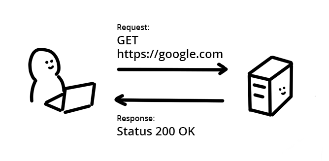

# 安全

import TOCInline from '@theme/TOCInline';

<TOCInline toc={toc} />

## 安全 Headers 快速参考

### 推荐用于所有网站的安全 Headers

#### Content Security Policy (CSP) - 内容安全策略

跨站点脚本 （XSS）是一种攻击，其中网站上的漏洞允许注入和执行恶意脚本。

`Content-Security-Policy` 提供了一个附加层，通过限制页面可以执行哪些脚本来缓解 XSS 攻击。

建议使用以下方法之一启用严格的 CSP：

- 如果在服务器上呈现 HTML 页面，请使用**基于 nonce 的严格 CSP**
- 如果 HTML 必须静态提供或缓存，例如，如果它是单页应用程序，请使用**基于哈希的严格 CSP**

基于 nonce 的严格 CSP：

```:no-line-numbers
Content-Security-Policy:
  script-src 'nonce-{RANDOM1}' 'strict-dynamic' https: 'unsafe-inline';
  object-src 'none';
  base-uri 'none';
```

基于哈希的严格 CSP：

```:no-line-numbers
Content-Security-Policy:
  script-src 'sha256-{HASH1}' 'sha256-{HASH2}' 'strict-dynamic' https: 'unsafe-inline';
  object-src 'none';
  base-uri 'none';
```

:::tip 参见
- [内容安全策略（CSP）](https://developer.mozilla.org/zh-CN/docs/Web/HTTP/CSP)
- [Content-Security-Policy](https://developer.mozilla.org/zh-CN/docs/Web/HTTP/Headers/Content-Security-Policy)
:::

### 为处理敏感用户数据的网站推荐的安全 Headers

#### X-Content-Type-Options

当从域名提供恶意 HTML 文档时（例如，如果上传到照片服务的图像包含有效的 HTML 标记），某些浏览器会将其视为活动文档并允许它在应用程序上下文中执行脚本，从而导致跨站点脚本错误。

`X-Content-Type-Options: nosniff` 通过指示浏览器在给定响应的标头中设置的 MIME 类型是正确的来防止它。 建议为**所有资源使用 `Content-Type`**

```:no-line-numbers
X-Content-Type-Options: nosniff
Content-Type: text/html; charset=utf-8
```

:::tip 参见
- [X-Content-Type-Options](https://developer.mozilla.org/zh-CN/docs/Web/HTTP/Headers/X-Content-Type-Options)
:::

#### X-Frame-Options

如果恶意网站可以将网站作为 iframe 嵌入，这可能允许攻击者通过点击劫持来调用用户的意外操作。

`X-Frame-Options` 指示是否应允许浏览器在 `<frame>`、`<iframe>`、`<embed>` 或 `<object>` 中呈现页面。 建议**所有 HTML** 都发这个 Headers 来表明是否允许被其他网站嵌入。

```:no-line-numbers
X-Frame-Options: DENY
```

:::tip 参见
- [X-Frame-Options](https://developer.mozilla.org/zh-CN/docs/Web/HTTP/Headers/X-Frame-Options)
:::

#### Cross-Origin Resource Policy (CORP) - 跨域资源策略

攻击者可以嵌入来自另一个来源的资源，例如来自站点，以通过利用基于 Web 的跨站点泄漏来了解有关它们的信息。

`Cross-Origin-Resource-Policy` 通过指示它可以加载的网站集来减轻这种风险。 标头采用以下三个值之一：`same-origin`, `same-site` 和 `cross-origin`。 建议**所有资源**都发送这个header，以表明它们是否允许被其他网站加载。


```:no-line-numbers
Cross-Origin-Resource-Policy: same-origin
```

:::tip 参见
- [Cross-Origin-Resource-Policy](https://developer.mozilla.org/en-US/docs/Web/HTTP/Headers/Cross-Origin-Resource-Policy)
:::

#### Cross-Origin Opener Policy (COOP)

攻击者的网站可以在弹出窗口中打开另一个站点，通过利用基于 Web 的跨站点泄漏来了解有关该站点的信息。

`Cross-Origin-Opener-Policy` 为文档提供了一种将自身与通过 `window.open()` 打开的跨源窗口或带有 `target="_blank"` 而没有 `rel="noopener"` 的链接隔离开的方法。因此，文档的任何跨域开启器都将无法引用它，也无法与之交互。

```:no-line-numbers
Cross-Origin-Opener-Policy: same-origin-allow-popups
```

:::tip 参见
- [Cross-Origin-Opener-Policy](https://developer.mozilla.org/en-US/docs/Web/HTTP/Headers/Cross-Origin-Opener-Policy)
:::

#### HTTP Strict Transport Security (HSTS)

通过普通 HTTP 连接的通信未加密，因此网络级窃听者可以访问传输的数据。

`Strict-Transport-Security` 通知浏览器它永远不应该使用 HTTP 加载站点，而是使用 HTTPS。设置后，浏览器将使用 HTTPS 而不是 HTTP 来访问，而无需在定义的持续时间内进行重定向。

```:no-line-numbers
Strict-Transport-Security: max-age=31536000
```

:::tip 参见
- [HTTP Strict Transport Security](https://developer.mozilla.org/zh-CN/docs/Web/HTTP/Headers/Strict-Transport-Security)
:::

### 具有高级功能的网站的安全 Headers

#### Cross-Origin Resource Sharing (CORS) - 跨域资源共享

与本节中的其他项目不同，跨域资源共享 (CORS) 不是 Headers，而是请求和允许访问跨域资源的浏览器机制。

默认情况下，浏览器强制执行同源策略以防止网页访问跨源资源。例如，当加载跨源图像时，即使它以视觉方式显示在网页上，页面上的 JavaScript 也无法访问图像的数据。资源提供者可以通过选择加入 CORS 来放宽限制并允许其他网站读取资源。

```:no-line-numbers
Access-Control-Allow-Origin: https://zydmall.com
Access-Control-Allow-Credentials: true
Access-Control-Allow-Methods: POST, GET, PUT, DELETE, OPTIONS
Access-Control-Allow-Headers: Authorization
Access-Control-Max-Age: 86400
```

:::tip 参见
- [Access-Control-Allow-Origin](https://developer.mozilla.org/zh-CN/docs/Web/HTTP/Headers/Access-Control-Allow-Origin)
- [Access-Control-Allow-Credentials](https://developer.mozilla.org/zh-CN/docs/Web/HTTP/Headers/Access-Control-Allow-Credentials)
- [Access-Control-Allow-Headers](https://developer.mozilla.org/zh-CN/docs/Web/HTTP/Headers/Access-Control-Allow-Headers)
- [Access-Control-Allow-Methods](https://developer.mozilla.org/zh-CN/docs/Web/HTTP/Headers/Access-Control-Allow-Methods)
- [Access-Control-Max-Age](https://developer.mozilla.org/zh-CN/docs/Web/HTTP/Headers/Access-Control-Max-Age)
:::

#### Cross-Origin Embedder Policy (COEP) - 跨源嵌入策略

默认情况下禁用 `SharedArrayBuffer` 或 `performance.measureUserAgentSpecificMemory()` 等功能。

`Cross-Origin-Embedder-Policy：require-corp` 阻止文档和 worker 加载跨源资源，例如图像、脚本、样式表、iframe 等，除非这些资源明确选择通过 CORS 或 CORP Headers 加载。 COEP 可以与 Cross-Origin-Opener-Policy 结合，将文档选择为跨域隔离。

当想要为文档启用跨域隔离时，请使用 `Cross-Origin-Embedder-Policy: require-corp`。

```:no-line-numbers
Cross-Origin-Embedder-Policy: require-corp
```

:::tip 参见
- [Cross-Origin-Embedder-Policy](https://developer.mozilla.org/en-US/docs/Web/HTTP/Headers/Cross-Origin-Embedder-Policy)
:::

## 使用 HTTPS 安全连接

### HTTPS 的重要性

请始终使用 HTTPS 保护所有网站，即使网站不处理敏感通信也应如此。除了为网站和用户的个人信息提供重要的安全保障和数据完整性支持外，许多新的浏览器功能（尤其是 PWA 所需的功能）也要求使用 HTTPS。

#### HTTPS 可保护网站的完整性

HTTPS 有助于防止入侵者篡改网站与用户浏览器之间的通信。入侵者包括故意进行恶意攻击的攻击者，以及合法但侵扰性的公司，例如向网页中注入广告的 ISP。

入侵者会利用未保护的通信来诱骗用户提供敏感信息或安装恶意软件，或者插入自己的资源。例如，某些第三方会注入广告，这可能会破坏用户体验并造成安全漏洞。

入侵者会利用在网站和用户之间传输的所有未保护资源。图片、Cookie、脚本和 HTML 都可能被利用。入侵可能发生在网络中的任何位置，包括用户的机器、Wi-Fi 热点或遭到入侵的 ISP，等等。HTTPS 会增加入侵者访问网站资源的难度。

#### HTTPS 可保护用户的隐私和安全

HTTPS 可防止入侵者被动地监听网站与用户之间的通信。

关于 HTTPS 的一个常见误解是，只有处理敏感通信的网站才需要使用 HTTPS。事实上，每个未保护的 HTTP 请求都可能会泄露有关用户行为和身份的信息。

一次访问未保护的网站可能看起来没什么坏意，但有些入侵者会查看用户的汇总浏览活动，以推断用户的行为和意图，并[取消匿名化](https://en.wikipedia.org/wiki/De-anonymization)用户的身份。例如，员工只需阅读未经保护的医学文章，就可能会无意中向其雇主披露敏感的健康问题。

#### HTTPS 是网络的未来

强大的新型 Web 平台功能（例如使用 `getUserMedia()` 拍照或录制音频、通过 [Service Worker](https://web.dev/articles/service-workers-cache-storage?hl=zh-cn) 实现离线应用体验，或 PWA ）需要通过 HTTPS 从用户那里获得明确的权限。许多旧版 API 也正在更新，以要求获得执行权限，例如 [Geolocation API](https://developer.mozilla.org/zh-CN/docs/Web/API/Geolocation_API)。对于新功能和更新后的功能，HTTPS 是权限工作流的关键组成部分。

## 防止信息泄露

### 跨源资源共享 (CORS)

浏览器的同源政策会阻止从其他来源读取资源。此机制可阻止恶意网站读取其他网站的数据，但也会阻止合法用途。

现代 Web 应用通常希望从其他来源获取资源，例如从其他网域检索 JSON 数据，或将其他网站中的图片加载到 `<canvas>` 元素中。这些资源可能是应该供所有人阅读的公共资源，但同源政策会阻止使用这些资源。过去，开发者一直使用 JSONP 等权宜解决方法。

跨源资源共享 (CORS) 以标准化的方式解决此问题。启用 CORS 后，服务器可以告知浏览器它可以使用其他来源。

#### 资源请求在网络上如何运作？



浏览器和服务器可以使用超文本传输协议 (HTTP) 通过网络交换数据。HTTP 定义了请求方和响应方之间的通信规则，包括获取资源所需的信息。

HTTP 标头用于协商客户端和服务器之间的消息交换，并用于确定访问权限。浏览器的请求和服务器的响应消息都分为标头和正文。

##### 标题

消息的相关信息，例如消息类型或消息编码。标头可以包含以键值对形式表示的各种信息。请求标头和响应标头包含不同的信息。

```
Accept: text/html
Cookie: Version=1
```

此标头相当于说“我希望收到 HTML 响应。这是我的 Cookie。”

```
Content-Encoding: gzip
Cache-Control: no-store
```

此标头相当于说“此响应中的数据是使用 gzip 编码的。不要缓存此值。”

:::warning
标头不能包含注释。
:::

##### 正文

邮件本身。这可以是纯文本、图片二进制文件、JSON、HTML 或许多其他格式。

#### CORS 如何运作？

同源政策会指示浏览器阻止跨源请求。当需要来自其他来源的公共资源时，提供资源的服务器会告知浏览器发送请求的来源可以访问其资源。浏览器会记住该设置，并允许对该资源进行跨源资源共享。

##### 第 1 步：客户端（浏览器）请求

当浏览器发出跨源请求时，浏览器会添加包含当前来源（架构、主机和端口）的 `Origin` 标头。

##### 第 2 步：服务器响应

当服务器看到此标头并希望允许访问时，它会向响应中添加 `Access-Control-Allow-Origin` 标头来指定请求来源（或 `*` 以允许任何来源）。

##### 第 3 步：浏览器收到响应

当浏览器看到包含适当 `Access-Control-Allow-Origin` 标头的此响应时，会与客户端网站共享响应数据。

#### 使用 CORS 共享凭据

出于隐私保护方面的原因，CORS 通常用于匿名请求，其中请求方未标识。如果想在使用 CORS 时发送 Cookie（可识别发件人），则需要向请求和响应添加其他标头。

##### 请求

将 `credentials: 'include'` 添加到提取选项中，如以下示例所示。这包括包含请求的 Cookie，如下所示：

```js
fetch('https://example.com', {
  mode: 'cors',
  credentials: 'include',
});
```

##### 响应

`Access-Control-Allow-Origin` 必须设置为特定来源（不使用 `*` 的通配符），并且 `Access-Control-Allow-Credentials` 必须设置为 `true`。

```
HTTP/1.1 200 OK
Access-Control-Allow-Origin: https://example.com
Access-Control-Allow-Credentials: true
```

#### 针对复杂 HTTP 调用的预检请求

当 Web 应用发出复杂的 HTTP 请求时，浏览器会在请求链的开头添加[预检请求](https://developer.mozilla.org/zh-CN/docs/Web/HTTP/Guides/CORS#%E9%A2%84%E6%A3%80%E8%AF%B7%E6%B1%82)。

CORS 规范定义了复杂请求，如下所示：

- 使用 GET、POST 或 HEAD 以外的方法的请求。
- 请求包含 `Accept`、`Accept-Language` 或 `Content-Language` 以外的标头。
- 请求具有 `application/x-www-form-urlencoded`、`multipart/form-data` 或 `text/plain` 以外的 `Content-Type` 标头。

浏览器会自动创建所有必要的预处理请求，并在实际请求消息之前发送这些请求。预检请求是 OPTIONS 请求，如以下示例所示：

```
OPTIONS /data HTTP/1.1
Origin: https://example.com
Access-Control-Request-Method: DELETE
```

在服务器端，接收请求的应用会响应预处理请求，并提供有关应用从此来源接受的方法的信息：

```
HTTP/1.1 200 OK
Access-Control-Allow-Origin: https://example.com
Access-Control-Allow-Methods: GET, DELETE, HEAD, OPTIONS
```

服务器响应还可以包含 `Access-Control-Max-Age` 标头，以指定缓存预检结果的时长（以秒为单位）。这样，客户端就可以发送多个复杂请求，而无需重复发送预检请求。

### 使用 COOP 和 COEP 将网站设置为“跨源隔离”

使用 COOP 和 COEP 设置跨源隔离环境，并启用 `SharedArrayBuffer`、`performance.measureUserAgentSpecificMemory()` 和高分辨率计时器等功能，从而提高精确度。

#### 部署 COOP 和 COEP 以实现网站跨源隔离

##### 集成 COOP 和 COEP

###### 1. 在顶级文档中设置 `Cross-Origin-Opener-Policy: same-origin` 标头

通过在顶级文档上启用 `Cross-Origin-Opener-Policy: same-origin`，具有相同源的窗口以及从该文档打开的窗口将具有单独的浏览上下文组，除非它们位于具有相同 COOP 设置的同一源中。因此，系统会强制隔离已打开的窗口，并停用这两个窗口之间的相互通信。

:::warning
这会破坏需要跨源窗口交互的集成，例如 OAuth 和付款。为缓解此问题，我们正在探索放宽条件，以便为 `Cross-Origin-Opener-Policy: same-origin-allow-popups` 启用跨源隔离。这样，就可以与自行打开的窗口进行通信。如果想启用跨源隔离，但受此问题阻碍，我们建议注册源代码试用计划，并等到新条件可用。在该问题得到妥善解决之前，我们不打算终止来源试用。
:::

浏览上下文组是一组可以相互引用的窗口。例如，通过 `<iframe>` 嵌入的顶级文档及其子文档。如果某个网站 (`https://a.example`) 打开一个弹出式窗口 (`https://b.example`)，则打开窗口和弹出式窗口共享相同的浏览上下文，因此它们可以通过 DOM API（例如 `window.opener`）相互访问。


###### 2. 确保资源已启用 CORP 或 CORS

确保页面中的所有资源均使用 CORP 或 CORS HTTP 标头加载。此步骤是[第 4 步（启用 COEP）](#4-启用-coep)的必需步骤。

需要根据资源的性质执行以下操作：

- 如果资源只能从同一来源加载，请设置 `Cross-Origin-Resource-Policy: same-origin` 标头。
- 如果资源预计仅从同一网站加载，但跨源，请设置 `Cross-Origin-Resource-Policy: same-site` 标头。
- 如果资源从控制的跨源加载，请尽可能设置 `Cross-Origin-Resource-Policy: cross-origin` 标头。
- 对于无法控制的跨源资源：
  - 如果资源是使用 CORS 提供的，请在加载 HTML 标记中使用 `crossorigin` 属性。（例如 ``。）
  - 请要求资源所有者支持 CORS 或 CORP。
- 对于 iframe，请遵循上述相同的原则，并设置 `Cross-Origin-Resource-Policy: cross-origin`（或 `same-site`、`same-origin`，具体取决于上下文）。
- 使用 WebWorker 加载的脚本必须从同源提供，因此无需 CORP 或 CORS 标头。
- 对于使用 `Cross-Origin-Embedder-Policy: require-corp` 提供的文档或 worker，未使用 CORS 加载的跨源子资源必须设置 `Cross-Origin-Resource-Policy: cross-origin` 标头，以选择嵌入。例如，这适用于 `<script>`、`importScripts`、`<link>`、`<video>`、`<iframe>` 等。

:::tip
可以通过将 `allow="cross-origin-isolated"` 权限政策应用于 `<iframe>` 标记并满足本文档中所述的相同条件，为嵌入在 iframe 中的文档启用跨源隔离。请注意，文档的整个链（包括父框架和子框架）也必须进行跨源隔离。
:::

:::tip
请务必了解“同网站”和“同源”之间的区别。
:::

###### 3. 使用 COEP 报告专用 HTTP 标头评估嵌入资源

在完全启用 COEP 之前，可以使用 `Cross-Origin-Embedder-Policy-Report-Only` 标头进行试运行，以检查该政策是否实际有效。将收到报告，但不会屏蔽嵌入内容。


###### 4. 启用 COEP

确认一切正常运行且所有资源都能成功加载后，将 `Cross-Origin-Embedder-Policy-Report-Only` 标头切换为 `Cross-Origin-Embedder-Policy` 标头，并为所有文档（包括通过 `iframe` 和 `worker` 脚本嵌入的文档）使用相同的值。

##### 使用 `self.crossOriginIsolated` 确定隔离是否成功

当网页处于跨源隔离状态且所有资源和窗口都隔离在同一浏览上下文组中时，`self.crossOriginIsolated` 属性会返回 `true`。可以使用此 API 确定是否已成功隔离浏览上下文组，并获得对 `performance.measureUserAgentSpecificMemory()` 等强大功能的访问权限。

## 保护网站免受 XSS

### 使用 Trusted Types 防止基于 DOM 的跨站点脚本漏洞

基于 DOM 的跨站脚本 (DOM XSS) 是最常见的 Web 安全漏洞之一，并且很容易在应用程序中引入它。 [Trusted Types](https://developer.mozilla.org/en-US/docs/Web/API/Trusted_Types_API) 默认对危险的 Web API 函数加以保护，提供编写、安全审查和维护应用程序的工具，使其免受 DOM XSS 漏洞的影响。

:::warning
Chrome 83 支持 Trusted Types，其他浏览器可以使用 [polyfill](https://github.com/w3c/webappsec-trusted-types#polyfill)。 有关最新的跨浏览器支持信息，请参阅浏览器[兼容性](https://caniuse.com/mdn-api_trustedtypes)。
:::

Trusted Types 的工作原理是锁定以下有风险的接收器函数；

- **脚本操作：**[`<script src>`](https://developer.mozilla.org/docs/Web/HTML/Element/script#attr-src) 和设置 [`<script>`](https://developer.mozilla.org/docs/Web/HTML/Element/script) 元素的文本内容
- **从字符串生成 HTML：**[`innerHTML`](https://developer.mozilla.org/docs/Web/API/Element/innerHTML)、[`outerHTML`](https://developer.mozilla.org/docs/Web/API/Element/outerHTML)、[`insertAdjacentHTML`](https://developer.mozilla.org/docs/Web/HTML/Element/iframe#attr-srcdoc)、[`<iframe> srcdoc`](https://developer.mozilla.org/docs/Web/HTML/Element/iframe#attr-srcdoc)、[`document.write`](https://developer.mozilla.org/docs/Web/API/Document/write)、[`document.writeln`](https://developer.mozilla.org/docs/Web/API/Document/writeln) 和 [`DOMParser.parseFromString`](https://developer.mozilla.org/docs/Web/API/DOMParser#DOMParser.parseFromString)
- **执行插件内容：**[`<embed src>`](https://developer.mozilla.org/docs/Web/HTML/Element/embed#attr-src)、[`<object data>`](https://developer.mozilla.org/docs/Web/HTML/Element/object#attr-data) 和 [`<object codebase>`](https://developer.mozilla.org/docs/Web/HTML/Element/object#attr-codebase)
- **运行时 JavaScript 代码编译：**`eval`、`setTimeout`、`setInterval`、`new Function()`

Trusted Types 要求在将数据传递给上述接收器函数之前对其进行处理。仅使用字符串将失败，因为浏览器不知道数据是否可信：

:::danger 错误做法 👎
```js
Element.innerHTML  = location.href;
```
启用 Trusted Types 后，浏览器会抛出 *TypeError*，并阻止将 DOM XSS 接收器与字符串一起使用。
:::

要表示数据已被安全处理，请创建一个特殊对象 - Trusted Type。

:::tip 正确做法 👍
```js
Element.innerHTML  = TrustedHTML;
```
启用 Trusted Types 后，浏览器会抛出 *TypeError*，并阻止将 DOM XSS 接收器与字符串一起使用。
:::

Trusted Types 大大减小了应用程序的 DOM XSS 攻击面。它简化了安全审核，并允许在浏览器中在运行时编译、lint 或捆绑代码时强制执行基于类型的安全检查。

#### 启用 Trusted Types

将以下 HTTP 响应标头添加到要迁移到 Trusted Types 的文档。

```
Content-Security-Policy: require-trusted-types-for 'script';
```

:::warning
Trusted Types 仅在 HTTPS 和 localhost 等安全上下文中可用。
:::

:::tip
大多数此类违规还可以通过对代码库运行代码 [eslint-plugin-no-unsanitized](https://github.com/mozilla/eslint-plugin-no-unsanitized) 来进行检测。这有助于快速识别大量违规。 也就是说，还应该分析 CSP 违规，因为这些违规会在执行不合规的代码时触发。
:::

#### 修复 Trusted Type 违规

有几个选项用于修复 Trusted Type 违规。可以[重写违规代码](#重写违规代码)，[使用库](#使用库)，创建 Trusted Type 策略。

##### 重写违规代码

也许不再需要不符合标准的功能，或者可以在不使用容易出错的功能的情况下以现代方式重写？

:::danger
```js
el.innerHTML = '';
```
:::

:::tip
```js
el.textContent = '';
const img = document.createElement('img');
img.src = 'xyz.jpg';
el.appendChild(img);
```
:::

##### 使用库

一些库已经生成了可以传递给接收器函数的 Trusted Types。 例如，可以使用 [DOMPurify](https://github.com/cure53/DOMPurify) 清理 HTML 片段，删除 XSS。

```js
import DOMPurify from 'dompurify';
el.innerHTML = DOMPurify.sanitize(html, { RETURN_TRUSTED_TYPE: true });
```

DOMPurify 支持 Trusted Types，并将返回包装在 TrustedHTML 对象中的清理过的 HTML，这样浏览器就不会生成违规代码。

:::tip
推荐在 Vue 中使用 `v-html` 时使用此方案。
:::

##### 创建 Trusted Type 策略

有时，无法删除功能，并且没有库来清理值和创建 Trusted Type。在这种情况下，请自行创建 Trusted Type 对象。

```js
if (window.trustedTypes && trustedTypes.createPolicy) { // Feature testing
  const escapeHTMLPolicy = trustedTypes.createPolicy('myEscapePolicy', {
    createHTML: string => string.replace(/\</g, '<')
  });
}

const escaped = escapeHTMLPolicy.createHTML('');
console.log(escaped instanceof TrustedHTML);  // true
el.innerHTML = escaped;  // ''
```

此代码创建了一个名为 `myEscapePolicy` 的策略，该策略可以通过其 `createHTML()` 函数生成 [TrustedHTML](https://developer.mozilla.org/en-US/docs/Web/API/TrustedHTML) 对象。所定义的规则将对 `<` 字符进行 HTML 转义，以防止创建新的 HTML 元素。

:::tip
虽然传递给 `trustedTypes.createPolicy()` 的 JavaScript 函数 `createHTML()` 返回一个字符串，但 `createPolicy()` 返回一个策略对象，该对象将返回值包装为正确的类型（在本例中为 `TrustedHTML`）。
:::

### 使用严格的内容安全策略 (CSP) 缓解跨站点脚本 (XSS)

跨站脚本 (XSS)——将恶意脚本注入 Web 应用程序的能力——十多年来一直是最大的 Web 安全漏洞之一。

[内容安全策略 (CSP)](https://developer.mozilla.org/docs/Web/HTTP/CSP) 是一个附加的安全层，有助于缓解 XSS。 配置 CSP 涉及将 Content-Security-Policy HTTP 标头添加到网页并设置值以控制允许用户代理为该页面加载哪些资源。使用基于随机数或哈希的 CSP 来缓解 XSS，而不是常用的基于主机白名单的 CSP，后者通常会使页面暴露于 XSS，因为它们可以在大多数配置中被绕过。

:::tip 关键术语

**nonce**

nonce 是仅使用一次的随机数，可用于将 `<script>` 标签标记为可信。

**散列函数**

散列函数是一种数学函数，可将输入值转换为压缩数值——散列。 哈希（例如 SHA-256）可用于将内联 `<script>` 标签标记为可信。
:::

基于随机数或散列的内容安全策略通常称为**严格 CSP**。 当应用程序使用严格的 CSP 时，发现 HTML 注入漏洞的攻击者通常无法使用它们来强制浏览器在易受攻击的文档的上下文中执行恶意脚本。 这是因为严格的 CSP 只允许在服务器上生成散列脚本或具有正确 nonce 值的脚本，因此攻击者无法在不知道给定响应的正确 nonce 的情况下执行脚本。

:::tip
为了保护站点免受 XSS 攻击，请确保清理用户输入并将 CSP 用作额外的安全层。 CSP 是一种深度防御技术，可以防止恶意脚本的执行，但它不能替代避免（并及时修复）XSS 错误。
:::

白名单 CSP 在阻止攻击者利用 XSS 方面通常无效。 这就是为什么建议使用基于加密随机数或散列的严格 CSP 的原因，这样可以避免上述陷阱。


:::danger 白名单 CSP 👎
- 不能有效地保护网站。 ❌
- 必须高度定制。 😓
- 在大多数配置中可以绕过。😓
:::

:::tip 严格 CSP 👍
- 有效保护网站。 ✅
- 始终具有相同的结构。 😌
:::

严格的内容安全策略具有以下结构，并通过设置以下 HTTP 响应标头之一启用：

- **基于 nonce 的严格 CSP**

```:no-line-numbers
Content-Security-Policy:
  script-src 'nonce-{RANDOM}' 'strict-dynamic';
  object-src 'none';
  base-uri 'none';
```


- **基于哈希的严格 CSP**

```:no-line-numbers
Content-Security-Policy:
  script-src 'sha256-{HASHED_INLINE_SCRIPT}' 'strict-dynamic';
  object-src 'none';
  base-uri 'none';
```

以下属性使 CSP 与上述“严格”类似，因此是安全的：

- 使用 nonce `nonce-{RANDOM}` 或散列 `sha256-{HASHED_INLINE_SCRIPT}` 来指示站点开发人员信任哪些 `<script>` 标签，并且应该允许在用户的浏览器中执行这些标签。
- 设置 [`'strict-dynamic'`](https://developer.mozilla.org/en-US/docs/Web/HTTP/Headers/Content-Security-Policy/script-src#strict-dynamic) 以通过自动允许执行由已受信任的脚本创建的脚本来减少部署基于 nonce 或基于散列的 CSP 的工作量。 这也解除了对大多数第三方 JavaScript 库和小部件的使用的阻碍。
- 不基于 URL 允许列表，因此不受常见 CSP 绕过的影响。
- 阻止不受信任的内联脚本，如内联事件处理程序或 `javascript: URI`。
- 限制 `object-src` 禁用危险的插件，例如 Flash。
- 限制 `base-uri` 以阻止 `<base>` 标记的注入。 这可以防止攻击者更改从相对 URL 加载的脚本的位置。

:::tip
严格 CSP 的另一个优点是 CSP 始终具有相同的结构，并且不需要为应用程序定制。
:::
