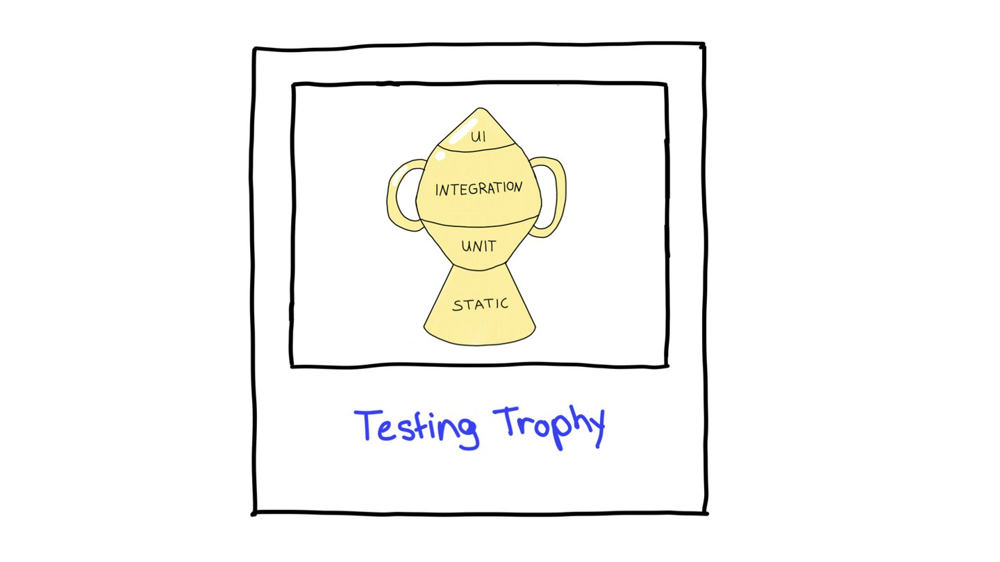

# 测试

## 基础知识

### 常规测试模式

#### 手动测试与自动化测试

- **手动测试（Manual testing）**：这是由真人执行的典型测试方法。QA 工程师会在应用中点击操作，检查其是否正常工作，同时尝试找出破坏它的方法。最常见的方式是探索性测试（exploratory testing），即工程师利用自己对应用的了解，沿着预定的路径或检查清单对应用进行排查。 
- **自动化测试（Automated testing）**：这是由计算机执行的测试。QA 工程师通过编写代码来实现自动化，以取代那些重复且枯燥的测试工作。

本系列指南将主要聚焦于自动化测试。但是，不应该只依赖单一的测试方式。即使自动化能节省大量时间和精力，人工和手动测试依然扮演着至关重要的角色。相反，测试自动化应该把人们从繁琐中解放出来，让他们专注于探索性测试和创造性的问题解决。例如，确保用户体验的质量，或保护高风险的业务逻辑。换句话说，自动化是坚实的后盾。

#### 黑盒 vs 白盒

- **黑盒测试（Opaque box testing）**：它基于分析组件或系统的功能性或非功能性需求（规格说明），而不考虑其内部结构。 
- **白盒测试（Clear box testing）**：这是一种考虑了“盒子”内部结构的流程。换句话说，就是基于应用程序底层的运作原理来进行测试。

### 测试自动化类型

#### 单元测试（Unit testing）

单元测试是一种测试类型，它将应用程序中较小的可测试部分或单元进行独立测试，以验证其操作是否正确。这些单元的范围可以从函数、类或接口，一直延伸到服务或完整的组件。主要特点是：执行速度快、相互隔离、易于维护。

:::info
单元测试的工具包括但不限于 [Vitest](https://cn.vitest.dev/) 和 [Jest](https://jestjs.io/zh-Hans/)。
:::

#### 集成测试（Integration testing）

集成测试侧重于组件或系统之间的交互。换句话说，就是测试它们协同工作的效果。集成测试的典型例子是 API 测试或组件测试。

:::info
集成测试使用的工具通常与单元测试相同，也可以包括提供组件测试的框架，例如 [WebdriverIO](https://webdriver.io/zh/) 和 [Cypress](https://www.cypress.io/)。
:::

#### 端到端测试（End-to-end testing, E2E testing）

通常被称为 UI 测试，这个名称甚至能更好地解释它们的功能。这些测试会与应用程序的 UI 进行交互，涵盖完整的应用技术栈，从头到尾对应用程序进行全面测试。

如果参考质量保证理论，它们类似于系统测试。这些测试模拟真实用户及其交互。由于涉及整个系统，端到端测试需要更多的运行时间，而更长的运行时间意味着需要更多的计算资源。因此，这种额外的投入会导致更高的维护成本。

:::info
用于端到端测试的工具包括但不限于 [WebdriverIO](https://webdriver.io/zh/)、[Cypress](https://www.cypress.io/)、[Playwright](https://playwright.dev/) 和 [Selenium](https://www.selenium.dev/zh-cn/)。
:::

##### 视觉 UI 测试（Visual UI testing）

视觉测试是 UI 测试中一个有趣的子类别。这些测试是端到端测试的延伸，提供了一种验证应用程序可见输出的手段。这种测试会在发生变化后截取一张屏幕截图，再截取一张包含“当前状态”（或基准文件/golden file）的截图，然后将这些结果提供给人工审查员进行检查。换句话说，它有助于发现页面外观上的“视觉 Bug”，而不仅仅是纯粹的功能性 Bug，且这些视觉问题通常不会被明确写进断言（assertions）中。

#### 静态分析（Static analysis）

这里还要介绍一个概念：静态分析。严格来说，它不是教科书意义上的测试类型。然而，在后续的质量保证策略中，它将是一个至关重要的方面。可以将其想象成拼写检查功能：它在不运行程序的情况下扫描代码，寻找更严重的缺陷和语法错误，从而检测出代码风格问题。这个简单的措施可以预防许多 Bug。

:::info
用于静态分析的工具包括但不限于 [ESLint](https://zh-hans.eslint.org/) 和 [StyleLint](https://stylelint.io/)
:::

## 测试策略

### 测试目标

在测试方面，实现高测试覆盖率通常被视为开发人员的终极目标。在决定测试策略时，可能还有另一个关键因素需要考虑——满足用户的需求。

作为一名开发人员，也会使用许多其他的应用程序和设备。从这个角度来说，开发人员就是那个依赖所有这些系统“正常工作”的用户。反过来，依赖无数开发人员尽其所能地让他们开发的应用程序和设备正常运行。将心比心，作为一名开发人员，努力不辜负这份信任。因此，首要目标应该始终是交付可运行的软件并服务于用户。这也同样适用于为确保应用程序质量而编写的测试。[Kent C. Dodds](https://kentcdodds.com/about) 在他的[《前端应用的静态测试、单元测试、集成测试与端到端测试》](https://kentcdodds.com/blog/static-vs-unit-vs-integration-vs-e2e-tests)一文中对此做了很好的总结：

> “测试越接近软件的实际使用方式，它们能带来的信心就越多。”
> —— Kent C. Dodds

Kent 将其描述为“在测试中获得信心”。选择的测试类型越贴近用户，就越能相信测试结果是有效的。

### 测试策略——测试奖杯（Testing Trophy）

测试奖杯是一种基于测试金字塔的改良。这种改良方案在保持对集成测试关注的同时，将静态分析纳入了考量。测试奖杯源于 Guillermo Rauch 的早期名言，并由 Kent C. Dodds 进一步发展：

测试奖杯是一个以略有不同的方式描绘测试粒度的类比。它有四个层级： 

- **静态分析（Static analysis）**：在这个类比中起着至关重要的作用，仅通过运行已经概述的调试步骤，就能捕获拼写错误、样式错误和其他 Bug。 
- **单元测试（Unit tests）**：它们确保最小单元得到了适当的测试，但测试奖杯不会像测试金字塔那样过度强调它们。 
- **集成测试（Integration）**：这是主要焦点，因为它与其他改良方案一样，以最佳方式平衡了成本与更高的信心。 
- **UI 测试（UI tests）**：包括端到端测试和视觉测试，它们位于测试奖杯的顶部，类似于它们在测试金字塔中的角色。

:::info
如需详细了解测试奖杯，请参阅 [Kent C. Dodds](https://kentcdodds.com/blog/static-vs-unit-vs-integration-vs-e2e-tests) 的文章。
:::

## 测试用例

在软件开发中，测试用例是一系列设计好的操作或条件，用于确认软件程序或应用程序的有效性。测试用例旨在确保软件按预期运行，且所有特性和功能均表现正确。软件测试人员或开发人员通常会创建这些测试用例，以保证软件满足指定的需求和规格。

当运行测试用例时，软件会执行一系列检查以确保产生预期的结果。在此过程中，测试会完成以下两项核心任务：
- **验证（Verification）**：彻底检查软件以确保其无错误运行的过程。确定所构建的产品是否满足所有必要的非功能性需求并成功实现其预期目的至关重要。它回答的问题是：“我们是否正确地构建了产品？” 
- **确认（Validation）**：确保软件产品满足必要标准或高层需求的过程。它涉及检查实际产品是否与预期产品一致。本质上，我们是在回答这个问题：“我们是否为用户需求构建了正确的产品？”

假设程序未能提供预期的结果，此时测试用例就会充当“信使”——报告一个不成功的结果，开发人员或测试人员则需要调查问题并寻找解决方案。

无论测试类型如何，都可以将这些检查和操作视为计算机遵循的路径。用于检查的一组输入数据或条件被称为“等价类（equivalence classes）”。它们应该使被测系统产生相似的行为或结果。测试内部执行的具体路径可能会有所不同，但应与测试中执行的操作和断言相匹配。

### 测试路径：测试用例的典型类型

#### 快乐路径（The happy path）

这是最广为人知的一种。它也被称为“快乐日场景（happy day scenario）”或“黄金路径（golden path）”。它定义了功能、应用程序或变更最常见的用例——即对客户而言最理想的运作方式。

#### 可怕路径（The scary path）

测试用例中需要覆盖的第二个最关键的路径往往会被遗漏，因为就像它的名字所暗示的那样，它让人不太舒服。它是“可怕路径”，换句话说，也就是**负面测试**。这条路径针对的是导致代码行为异常或进入错误状态的场景。如果用例非常脆弱，对利益相关者或用户构成高风险，那么测试这些场景就显得尤为重要。

此外，还需要了解并考虑使用其他一些路径，但它们通常不太常用。下表对其进行了总结：

| 测试路径 | 解释 |
|---|---|
| 愤怒路径（Angry path） | 导致错误，但是是预期内的错误；例如，想确保错误处理机制正常工作 |
| 犯罪路径（Delinquent path） | 处理应用程序需要满足的任何与安全相关的场景 |
| 荒凉路径（Desolate path） | 测试应用程序在数据不足以运行时的场景，例如测试空值（null values） |
| 健忘路径（Forgetful path） | 测试应用程序在资源不足时的行为，例如触发数据丢失 |
| 犹豫路径（Indecisive path） | 测试用户尝试执行操作或遵循应用程序中的用户故事，但尚未完成这些工作流时的行为。例如，用户中断了其工作流 |
| 贪婪路径（Greedy path） | 尝试使用海量输入或数据进行测试 |
| 高压路径（Stressful path） | 尝试用一切可能的方式给应用程序施加负载，直到它无法运行（类似于负载测试） |

可以通过多种方法对这些路径进行分类。两种常见方法如下：

- **等效分区。** 一种测试方法，用于将测试用例分类为组或分区，从而有助于创建等效类。这一方法基于以下假设：如果分区中的某个测试用例发现了缺陷，则同一分区中的其他测试用例也可能会发现类似的缺陷。由于特定等价类中的所有输入都应具有相同的行为，因此可以减少测试用例的数量。[详细了解等价分区](https://en.wikipedia.org/wiki/Equivalence_partitioning)。
- **限制分析。** 一种测试方法，也称为[边界值分析](https://en.wikipedia.org/wiki/Boundary-value_analysis)，用于检查输入值的极限或极端值，以发现系统功能或约束条件限制范围内可能出现的任何潜在问题或错误。

### 编写测试用例

由测试人员编写的经典测试用例会包含特定的数据，帮助掌握想要进行的测试内容，当然，也是为了执行测试。典型的测试人员会在表格中记录他们的测试工作。在这个阶段，我们可以使用两种模式来构建测试用例的结构，并在以后构建测试代码本身时继续使用： 

- **Arrange, Act, Assert（AAA）** 模式：这种“准备、执行、断言”（也称为“AAA”或“Triple A”）测试模式是一种将测试组织为三个不同步骤的方法：准备测试、执行测试，最后得出结论。
- **Given, When, Then** 模式：这种模式类似于 AAA 模式，但它源于[行为驱动开发（BDD）](https://en.wikipedia.org/wiki/Behavior-driven_development)。

一旦我们涵盖了测试本身的结构，未来的文章将详细介绍这些模式。如果想在此阶段深入了解，可以查阅这两篇文章：[《Arrange-Act-Assert: A pattern for writing good tests》](https://automationpanda.com/2020/07/07/arrange-act-assert-a-pattern-for-writing-good-tests/)和[《Given-When-Then》](https://martinfowler.com/bliki/GivenWhenThen.html)。

根据本文的所有知识点，下表总结了一个经典示例：

| 信息 | 解释 |
|---|---|
| 前置条件（Prerequisites） | 编写测试前需要完成的所有准备工作 |
| 被测对象（Object under test） | 需要验证什么？ |
| 输入数据（Input data） | 变量及其值 |
| 执行步骤（Steps to be executed） | 让测试运行起来的所有操作：在测试中执行的所有动作或交互 |
| 预期结果（Expected result） | 应该发生什么，以及需要满足哪些期望 |
| 实际结果（Actual result） | 实际发生了什么 |

在自动化测试中，无需像测试人员那样记录所有这些测试用例，尽管这样做无疑很有帮助。只要留意，就可以在测试中找到所有这些信息。现在，我们将这个传统的测试用例转换为自动化测试。

| 信息 | 在测试自动化中的转化 |
|---|---|
| 前置条件 | 需要的所有准备工作，安排测试，以及思考为了让测试场景发生需要给定什么条件（Arrange/Given） |
| 被测对象 | 这个“对象”可以是多种事物：被测的应用程序、流程、单元或组件 |
| 输入数据 | 参数值 |
| 执行步骤 | 在测试内部执行的所有动作和命令，执行的操作，以及当执行某些操作时观察发生的事情（Act/When） |
| 预期结果 | 用来验证应用程序的断言，在应用程序中进行断言的内容（Assert/Then） |
| 实际结果 | 自动化测试运行的结果 |

## 最佳实践

### 通用指南与模式
值得注意的是，无论是进行单元测试、集成测试还是端到端测试，特定的模式和要点都是至关重要的。这些原则可以且应该应用于这两种类型的测试，因此它们是一个很好的起点。

#### 保持简单

在编写测试时，最重要的事情之一就是保持简单。考虑大脑的处理能力很重要。主要的生产代码已经占据了大量空间，留给额外复杂性的空间很小。对于测试来说尤其如此。

如果大脑的可用空间变少，在测试工作中可能会变得更加放松。这就是为什么在测试中优先考虑简单性至关重要。事实上，Yoni Goldberg 的 JavaScript 测试最佳实践强调了黄金法则的重要性——测试应该感觉像一个助手，而不是一个复杂的数学公式。换句话说，应该能一眼看懂测试的意图。

无论测试的复杂程度如何，都应该力求简单。事实上，测试越复杂，简化它就越关键。实现这一点的一种方法是通过扁平化测试设计（flat test design），即尽可能保持测试简单，并且只测试必要的内容。这意味着每个测试应该只包含一个测试用例，并且该测试用例应该专注于测试单一、特定的功能或特性。

从这个角度思考：在阅读失败的测试时，应该很容易找出问题所在。这就是保持测试简单易懂的原因。这样做可以在出现问题时快速识别并修复。

#### 测试有价值的内容

扁平化测试设计也有助于保持专注，并确保测试是有意义的。请记住，不应该仅仅为了覆盖率而创建测试——它们始终应该有明确的目的。

#### 不要测试实现细节

测试中一个常见的问题是，测试通常被设计为测试实现细节，例如在组件或端到端测试中使用选择器（selectors）。实现细节是指代码用户通常不会使用、看到甚至不知道的东西。这可能导致测试中出现两个主要问题：假阴性（false negatives）和假阳性（false positives）。

当测试的代码是正确的，但测试却失败了，就会发生假阴性。这通常发生在应用程序代码重构导致实现细节发生变化时。另一方面，当被测试的代码是不正确的，但测试却通过了，就会发生假阳性。

解决这个问题的一个方法是考虑拥有的不同类型的用户。终端用户和开发人员的方法可能不同，他们与代码的交互方式也可能不同。在规划测试时，必须考虑用户会看到或与什么进行交互，并使测试依赖于这些内容，而不是实现细节。

例如，选择不易发生变化的选择器可以使测试更可靠：使用 data-attributes 而不是 CSS 选择器。更多详情请参阅 [Kent C. Dodds 关于此主题的文章](https://kentcdodds.com/blog/testing-implementation-details)

:::tip
注： 相反，如果把测试写得好，这也会对源代码结构产生积极影响，例如，考虑代码的可测试性时。
:::

#### Mocking（模拟）：不要失去控制

Mocking 是单元测试（有时是集成测试）中使用的一个广泛概念。它涉及创建假数据或组件，以模拟对应用程序具有完全控制权的依赖项。这允许进行隔离测试。

在测试中使用 mock 可以提高可预测性、关注点分离和性能。而且，如果需要进行涉及人工参与的测试（例如护照验证），将不得不使用 mock 来隐藏它。出于所有这些原因，mock 是一个值得考虑的强大工具。

同时，mock 可能会影响测试的准确性，因为它们是模拟的，而不是真实的用户体验。因此，在使用 mock 和 stub 时需要保持谨慎。

##### 是否应该在端到端测试中使用 Mock？

通常不建议。然而，mock 有时也能救命——所以我们不要完全排除它。 

想象一下这个场景：正在为涉及第三方支付提供商服务的功能编写测试。处于他们提供的沙盒环境中，这意味着不会发生真实的交易。不幸的是，沙盒出现了故障，导致测试失败。修复需要由支付提供商来完成。能做的只有等待提供商解决这个问题。 

在这种情况下，减少对无法控制的服务的依赖可能更有益。在集成或端到端测试中仍然建议谨慎使用 mock，因为它会降低测试的可信度。

### 测试细节：该做与不该做的事

#### 优秀的单元测试应该包含什么？

一个理想且有效的单元测试应该：

- 专注于特定方面。
- 独立运行。 
- 涵盖小规模场景。 
- 使用描述性的名称。 
- 如果适用，遵循 AAA（准备、执行、断言）模式。 
- 保证全面的测试覆盖。

| 该做 ✅ | 不该做 ❌ |
|---|---|
| 尽可能保持测试小巧，每个测试用例只测一件事 | 针对大型单元编写测试 |
| 始终保持测试隔离，并 mock 单元外部所需的内容 | 包含其他组件或服务 |
| 保持测试相互独立 | 依赖先前的测试或共享测试数据 |
| 覆盖不同的场景和路径 | 仅局限于快乐路径或负面测试 |
| 使用描述性的测试标题，以便能立即了解测试的内容 | 仅按函数名进行测试，描述性不够，例如：`testBuildFoo()` 或 `testGetId()` |
| 特别是在此阶段，力求良好的代码覆盖率或更广泛的测试用例范围 | 从每个类一直测试到数据库（I/O）级别 |

#### 优秀的集成测试应该包含什么？

理想的集成测试与单元测试有一些共同的标准。但是，还需要考虑一些额外的要点。一个出色的集成测试应该：

- 模拟组件之间的交互。 
- 覆盖现实世界的场景，并使用 mock 或 stub。 
- 考虑性能。

| 该做 ✅ | 不该做 ❌ |
|---|---|
| 测试集成点：验证每个单元在集成时能否优雅地协同工作 | 孤立地测试每个单元——那是单元测试的工作 |
| 测试现实世界的场景：使用源自真实世界数据的测试数据 | 使用重复的自动生成测试数据，或不反映现实世界用例的其他数据 |
| 为外部依赖项使用 mock 和 stub，以保持对整个测试的控制 | 创建对第三方服务的依赖，例如对外部服务的网络请求 |
| 在每个测试前后使用清理程序 | 忘记在测试内部使用清理措施，否则由于缺乏适当的测试隔离，这可能导致测试失败或假阳性 |

#### 优秀的端到端测试应该包含什么？

一个全面的端到端测试应该：

- 复制用户交互。
- 涵盖关键场景。
- 跨越多个层级。
- 管理异步操作。
- 验证结果。
- 考虑性能。

| 该做 ✅ | 不该做 ❌ |
|---|---|
| 使用 API 驱动的快捷方式 | 对每个步骤都使用 UI 交互，包括 `beforeEach` 钩子 |
| 在每个测试前使用清理程序，比单元和集成测试更加注重测试隔离，因为这里的副作用风险更高 | 忘记在每个测试后进行清理，如果不清理残留的状态、数据或副作用，它们将影响后续执行的其他测试 |
| 将端到端测试视为系统测试，这意味着需要测试整个应用程序技术栈 | 孤立地测试每个单元——那是单元测试的工作 |
| 在测试内部使用极少或不使用 mock，仔细考虑是否要 mock 外部依赖项 | 严重依赖 mock |
| 通过例如不在同一测试中过度测试大型场景来考虑性能和工作负载 | 在不使用快捷方式的情况下覆盖大型工作流 |
