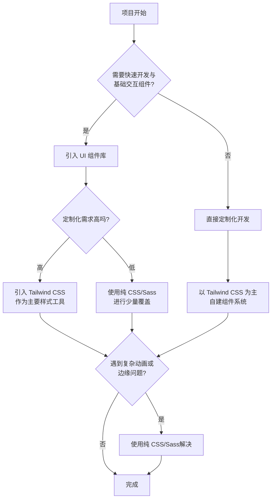

# CSS 规范

import TOCInline from '@theme/TOCInline';

本规范旨在统一团队的CSS代码风格，提高代码的可读性、可维护性，并减少潜在的错误。所有 CSS 和 SCSS 代码都应遵循此规范。

<TOCInline toc={toc} />



## 1. Tailwind CSS

### 1.1 Classname 顺序

为了保持代码的可读性和一致性，所有 classname 必须遵循一个固定的、合乎逻辑的顺序。推荐的顺序是先布局、再盒模型、然后是排版和视觉效果。


:::tip 建议 👍 classes有组织、有顺序
```html
<button class="flex items-center justify-center w-full p-4 font-bold text-white bg-blue-500 rounded-lg hover:bg-blue-600">
  Click me
</button>
```
:::

:::danger 不建议 👎 classes顺序混乱
```html
<button class="text-white justify-center w-full hover:bg-blue-600 items-center bg-blue-500 flex font-bold rounded-lg p-4">
  Click me
</button>
```
:::

### 1.2 使用简写形式

当 Tailwind 提供简写形式的 class 时，应当优先使用简写。这有助于减少 HTML 文件的大小和复杂性。

:::tip 建议 👍 使用 mx-4 代替 ml-4 和 mr-4
```html
<div class="mx-4">...</div>
```
:::

:::danger 不建议 👎 分别使用 margin-left 和 margin-right
```html
<div class="ml-4 mr-4">...</div>
```
:::

### 1.3 禁止使用自定义 Classname

为了贯彻 "Utility-First" 的原则，应避免在组件中添加自定义的、语义化的 classname。所有样式都应通过组合原子化的 utility class 来实现。如果需要复用，应通过组件化或 `@apply` 指令来解决。

:::tip 建议 👍 完全使用 utility classes
```html
<div class="flex items-center p-4 bg-gray-100 rounded-lg">...</div>
```
:::

:::danger 不建议 👎 混入自定义 class，这会破坏 utility-first 的原则
```html
<div class="flex items-center user-profile-card">...</div>
```
:::

:::tip 建议 👍 若确实需要，应在CSS中使用 `@apply`
```css
.user-profile-card {
  @apply p-4 bg-gray-100 rounded-lg;
}
```
:::

### 1.4 任意值的正确使用

- **负数任意值**：当需要使用一个负数的任意值时，负号 `-` 应该放在方括号 `[]` 的外面。
- **避免不必要的任意值**：如果 Tailwind 已经提供了对应的 utility class，则不应再使用任意值。

:::tip 建议 👍 正确使用负数任意值
```html
<div class="-top-[-10px]">...</div>
```
:::

:::tip 建议 👍 避免不必要的任意值
```html
<div class="w-10">...</div>
```
:::

:::danger 不建议 👎 错误的负数任意值语法
```html
<div class="top-[-10px]">...</div>
```
:::

:::danger 不建议 👎 当存在 w-10 时，这是不必要的
```html
<div class="w-[2.5rem]">...</div>
```
:::

## 2. 通用格式

### 2.1 缩进

使用 2 个空格进行缩进。

:::tip 建议 👍
```css
.card {
  color: #fff;
  background-color: #999;
}
```
:::

:::danger 不建议 👎
```css
.card {
    color: #fff;
      background-color: #999;
}
```
:::

### 2.2 大小写

所有代码均使用小写，包括选择器、属性、值（字符串除外）。

:::tip 建议 👍
```css
.btn {
  display: block;
  color: #fff;
}
```
:::

:::danger 不建议 👎
```css
.BTN {
  DISPLAY: BLOCK;
  COLOR: #FFF;
}
```
:::

### 2.3 引号

统一使用双引号（`""`）。

:::tip 建议 👍
```css
.element::before {
  content: "some text";
  font-family: "Helvetica Neue", sans-serif;
}
```
:::

:::danger 不建议 👎
```css
.element::before {
  content: 'some text';
  font-family: 'Helvetica Neue', sans-serif;
}
```
:::

### 2.4 空白与换行

- 文件末尾保留一个空行。
- 禁止行尾出现多余的空格。
- 两个规则集之间最多保留一个空行。
- 文件第一行不应为空行。

## 3. 命名规范

### 3.1 class、id、keyframe动画、自定义媒体查询

命名统一使用 kebab-case (短横线连接式)。

:::tip 建议 👍
```css
.user-profile {
  /* ... */
}
#main-navigation {
  /* ... */
}
@keyframes slide-in {
  /* ... */
}
@custom-media --viewport-medium (width >= 50rem);
:::

:::danger 不建议 👎
```css
.userProfile {
  /* ... */
}
#mainNavigation {
  /* ... */
}
@keyframes slideIn {
  /* ... */
}
@custom-media --viewportMedium (width >= 50rem);
```
:::

## 4. 选择器

### 4.1 属性选择器

属性选择器的值必须使用双引号包裹。

:::tip 建议 👍
```css
[type="submit"] {
  /* ... */
}
```
:::

:::danger 不建议 👎
```css
[type=submit] {
  /* ... */
}
[type='submit'] {
  /* ... */
}
```
:::

### 4.2 伪类与伪元素

- 伪类使用单冒号（`:`），伪元素使用双冒号（`::`）。
- 伪类和伪元素本身使用小写。

:::tip 建议 👍
```css
a:hover {
  color: #f00;
}
p::first-line {
  font-weight: bold;
}
```
:::

:::danger 不建议 👎
```css
a:HOVER {
  color: #f00;
}
p:first-line { /* 应使用双冒号 */
  font-weight: bold;
}
```
:::

### 4.3 组合器

在组合器（`>`、`+`、`~`）前后各保留一个空格。

:::tip 建议 👍
```css
.parent > .child {
  /* ... */
}
.item + .item {
  /* ... */
}
```
:::

:::danger 不建议 👎
```css
.parent>.child {
  /* ... */
}
.item+.item {
  /* ... */
}
```
:::

### 4.4 选择器列表

- 多个选择器在多行书写时，每个选择器占一行。
- 单行书写时，逗号后保留一个空格。

:::tip 建议 👍
```css
.class1,
.class2 {
  color: black;
}

.class3, .class4 {
  color: white;
}

```
:::

:::danger 不建议 👎
```css
.class1, .class2 { /* 多行时应换行 */
  color: black;
}

.class3,
.class4 { /* 单行时不应换行 */
  color: white;
}
```
:::

### 4.5 复杂度限制

为了保持较低的特异性和较高的性能，对选择器的复杂度进行以下限制：

- 禁止使用 ID 选择器。
- 一个选择器中最多使用 4 个 class 选择器。
- 一个选择器中最多使用 2 个属性选择器。
- 一个选择器中最多使用 4 个组合器。
- 一个选择器中最多使用 1 个通用选择器 (`*`)。
- 一个选择器中最多使用 2 个类型选择器 (如 `div`, `p`)。
- 禁止在 class 或 id 选择器前添加类型选择器进行限定（如 `div.my-class`）。

:::tip 建议 👍
```css
.card .header .title {
  font-size: 1.5rem;
}

.btn[disabled] {
  opacity: .5;
}
```
:::

:::danger 不建议 👎
```css
#main-content { /* 禁止使用 ID */
  padding: 1rem;
}

div.container.main.content.wrapper { /* class 过多 */
  border: 1px solid #ccc;
}

input[type="text"][required][disabled] { /* 属性选择器过多 */
  background: #eee;
}

html body .container > .content * { /* 组合器和通用选择器过多 */
  color: #333;
}

div.my-class { /* 禁止限定类型 */
  color: red;
}
```
:::

## 5. 属性与值

### 5.1 颜色

- 颜色值如果可以，优先使用 3 位十六进制的缩写形式。
- 颜色值必须使用小写。
- 禁止使用颜色名称。
- 色相（Hue）值使用角度单位（`deg`）。

:::tip 建议 👍
```css
.element {
  color: #fff;
  background-color: #f0c;
  border-color: hsl(270deg 60% 70%);
}
```
:::

:::danger 不建议 👎
```css
.element {
  color: #FFFFFF;
  background-color: #ff00cc;
  border-color: red; /* 禁止使用颜色名称 */
  border-color: hsl(270 60% 70%); /* 色相缺少单位 */
}
```
:::

### 5.2 数值

- 对于值为 `0` 的长度单位，省略单位。
- 小数值如果小于1，省略小数点前的 `0`。
- 禁止数值末尾出现多余的 `0`。

:::tip 建议 👍
```css
.element {
  padding: 0;
  opacity: .5;
  width: 1.5rem;
}
```
:::

:::danger 不建议 👎
```css
.element {
  padding: 0px;
  opacity: 0.5;
  width: 1.500rem;
}
```
:::

### 5.3 字体权重

字体权重应使用数值（如 `400`, `700`），而不是关键字（`normal`, `bold`）。

:::tip 建议 👍
```css
.element {
  font-weight: 700;
}
```
:::

:::danger 不建议 👎
```css
.element {
  font-weight: bold;
}
```
:::

### 5.4 简写属性

- 避免使用冗余的值。
- 禁止使用简写属性覆盖已声明的完整属性。

:::tip 建议 👍
```css
.element {
  margin: 10px 20px;
}
```
:::

:::danger 不建议 👎
```css
.element {
  margin: 10px 20px 10px 20px; /* 冗余 */
}

.element {
  padding-left: 10px;
  padding: 20px; /* 覆盖了 padding-left */
}
```
:::

### 5.5 厂商前缀

禁止为属性、值、`@`规则和媒体查询特性名称添加厂商前缀，除非有特殊需要（如 `-webkit-line-clamp`）。

:::tip 建议 👍
```css
.element {
  display: flex;
  transition: all 4s ease;
}
```
:::

:::danger 不建议 👎
```css
.element {
  display: -webkit-flex;
  -webkit-transition: all 4s ease;
}
```
:::

### 5.6 `!important`

禁止使用 `!important`。

:::danger 不建议 👎
```css
.element {
  color: red !important;
}
```
:::

## 6. 注释

- 注释内容前后各保留一个空格。
- 注释前通常需要一个空行（除非位于代码块的起始位置）。
- SCSS中推荐使用 `//` 进行单行注释。

:::tip 建议 👍
```scss
.element {
// 这是个好注释
  color: #333;
}
```
:::

:::danger 不建议 👎
```scss
.element {
//这是个坏注释
color: #333;
}
```
:::

## 7. 代码块

- 左花括号（`{`）与选择器在同一行，并与选择器之间保留一个空格。
- 右花括号（`}`）单独占一行，且前面应有一个空行（多行模式下）。
- 声明的冒号（`:`）后保留一个空格，前面没有空格。
- 每条声明以分号（`;`）结尾，且分号后在多行模式下必须换行。
- 单行规则集最多只包含一条声明。

:::tip 建议 👍 多行
```css
.card {
  display: block;
  padding: 1rem;
}
```
:::

:::tip 建议 👍 单行
```css
.hidden { display: none; }
```
:::

:::danger 不建议 👎
```css
.card{ /* `{` 前缺少空格 */
  display:block; /* 冒号后缺少空格 */
  padding: 1rem
} /* 分号丢失 */

.hidden { display: none; padding: 0; } /* 单行模式声明过多 */
```
:::

## 8. 函数

- 函数名与括号之间不能有空格。
- 括号内的参数，逗号后保留一个空格，逗号前没有空格。
- 多行函数中，括号内和参数后需要换行。
- 禁止出现空的函数。

:::tip 建议 👍
```css
.element {
  transform: translate(10px, 20px);
  background-image: linear-gradient(
    to bottom,
    #fff,
    #000
  );
}
```
:::

:::danger 不建议 👎
```css
.element {
  transform: translate (10px, 20px); /* 函数名后有空格 */
  width: calc(100% - 20px); /* 操作符两边缺少空格 */
}
```
:::

## 9. 媒体查询

- 特性名称与冒号之间没有空格，冒号后有一个空格。
- 括号内与内容之间没有空格。
- 范围操作符（`=`、`<`、`>`）前后各有一个空格。

:::tip 建议 👍
```css
@media (max-width: 600px) {
  /* ... */
}
@media (width >= 50rem) {
  /* ... */
}
```
:::

:::danger 不建议 👎
```css
@media ( max-width: 600px ) {
  /* ... */
}
@media (width >=50rem) {
  /* ... */
}
```
:::

## 10. 禁止项

- 禁止空的样式文件、代码块和注释。
- 禁止重复的选择器和 `@import` 规则。
- 禁止在声明块中出现重复的属性或重复的混合。
- 禁止无效的十六进制颜色值。
- 禁止在字符串中出现换行。
- 禁止使用未知的单位、属性、函数、伪类、伪元素等。

## 11. 属性声明顺序

为了提升代码的可读性和一致性，属性应按照以下分组和顺序进行声明：

1. 组合规则 (CSS Modules的composes)
2. all属性
3. 定位 (position, top, right, bottom, left, z-index等)
4. 显示模式 (box-sizing, display)
5. 弹性盒子 (flex相关属性)
6. 网格布局 (grid相关属性)
7. 间距 (gap, row-gap, column-gap)
8. 对齐 (align-, justify-)
9. 顺序 (order)
10. 盒模型 (width, height, padding, margin, overflow等)
11. 排版 (font-, color, text-, line-height等)
12. 交互 (appearance, cursor, pointer-events等)
13. 背景和边框 (background-, border-, outline等)
14. 遮罩 (mask相关属性)
15. SVG属性
16. 过渡和动画 (transition, animation, transform等)
17. 分页媒体 (break-*, orphans, widows)

:::tip 建议 👍
```css
.element {
  /* 定位 */
  position: absolute;
  top: 0;
  left: 0;
  z-index: 10;

  /* 显示与盒模型 */
  display: block;
  width: 100px;
  height: 100px;
  padding: 10px;
  border: 1px solid #ccc;

  /* 排版 */
  font-size: 1rem;
  color: #333;

  /* 视觉效果 */
  background-color: #f0f0f0;
  opacity: .9;

  /* 动画 */
  transition: opacity .2s;
}
```
:::

:::danger 不建议 👎
```css
.element {
  color: #333;
  width: 100px;
  position: absolute;
  left: 0;
  display: block;
  top: 0;
  height: 100px;
  opacity: .9;
  transition: opacity .2s;
  z-index: 10;
  font-size: 1rem;
  padding: 10px;
  border: 1px solid #ccc;
  background-color: #f0f0f0;
}
```
:::

## 12. SCSS/Sass

### 12.1 命名规范

SCSS 中的变量 (`$variable`)、函数 (`@function`)、混合 (`@mixin`) 和占位符 (`%placeholder`) 命名统一使用 kebab-case (短横线连接式)。

:::tip 建议 👍
```scss
$variable-name: #000;
%placeholder-name { /* ... */ }

@function function-name($arg) {
  @return $arg;
}

@mixin mixin-name() {
  /* ... */
}

```
:::

:::danger 不建议 👎
```scss
$variableName: #000;
%placeholderName { /* ... */ }

@function functionName($arg) {
  @return $arg;
}

@mixin mixinName() {
  /* ... */
}
```
:::

### 12.2 变量

- 变量声明时，冒号 (`:`) 前面不能有空格，冒号后必须有至少一个空格。
- 在选择器或属性名中使用变量时，必须使用插值 `#{}`。

:::tip 建议 👍
```scss
$my-color: #f00;
$my-property: margin;
$my-selector: ".foo";

#{$my-selector} {
  #{$my-property}-left: 10px;
}
```
:::

:::danger 不建议 👎
```scss
$my-color : #f00; // 冒号前有空格
$my-font-size:#f00; // 冒号后无空格

.bar {
  $my-property: 20px; // 变量未被插值
}
```
:::

### 12.3 操作符

- 在数学操作符 (`+`, `-`, `*`, `/`) 两侧必须保留一个空格。
- 操作符前后禁止换行。

:::tip 建议 👍
```scss
.element {
  width: 100% - 20px;
  font-size: $font-base * 1.2;
}
```
:::

:::danger 不建议 👎
```scss
.element {
  width: 100%-20px;
  font-size: $font-base*1.2;
}
.element {
  width: 100% -
  20px;
}
```
:::

### 12.4 混合与函数

- 定义混合和函数时，名称与括号之间不能有空格。
- 调用无参数的混合时，必须在混合名称后加上括号 `()`。
- 调用函数时，禁止使用命名参数。

:::tip 建议 👍
```scss
@mixin my-mixin() { /* ... */ }
@function my-function($a, $b) { /* ... */ }

.element {
  @include my-mixin();
  width: my-function(10px, 20px);
}
```
:::

:::danger 不建议 👎
```scss
@mixin my-mixin () { /* ... */ }
@function my-function ($a, $b) { /* ... */ }

.element {
  @include my-mixin; // 缺少括号
  width: my-function($a: 10px, $b: 20px); // 使用了命名参数
}
```
:::

### 12.5 嵌套

- 禁止使用不必要的父选择器引用 `&`。
- 对于嵌套属性（如 `font`），其子属性之间不能有空行。

:::tip 建议 👍
```scss
.element {
.child {
  color: #000;
}

font: {
  family: sans-serif;
  weight: bold;
}
}
```
:::

:::danger 不建议 👎
```scss
.element {
  & .child { // & 是多余的
    color: #000;
  }

  font: {
    family: sans-serif;

    weight: bold; // 中间有空行
  }
}
```
:::

### 12.6 导入与继承

- 导入 SCSS 分部文件时，必须省略文件名前的下划线 (`_`) 和文件扩展名 (`.scss`)。
- 必须使用字符串形式导入。
- 禁止 @extend 一个普通的 class、id 或元素选择器，只允许继承占位符选择器 (`%`)。

:::tip 建议 👍
```scss
@import "variables";
@import "mixins/buttons";

%message-shared {
  border: 1px solid #ccc;
}
.message {
  @extend %message-shared;
}
```
:::

:::danger 不建议 👎
```scss
@import "_variables";
@import "mixins/buttons.scss";
@import url("variables");

.error {
  // ...
}
.serious-error {
  @extend .error; // 继承了普通 class
}
```
:::

### 12.7 控制流

- `@else` 语句前不能有空行。
- `@else if` 语句的括号前必须有一个空格。
- `@else` 语句的花括号换行和空格规则与普通规则块一致。

:::tip 建议 👍
```scss
@if $condition {
  // ...
} @else if $other-condition {
  // ...
} @else {
  // ...
}
```
:::

:::danger 不建议 👎
```scss
@if $condition {
  // ...
}

@else { // @else 前有空行
  // ...
}

@if $condition {
  // ...
} @else if($other-condition) { // 括号前无空格
  // ...
}
```
:::
